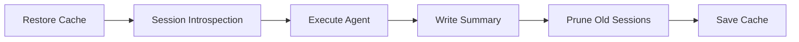

<div align="center">


# Fro Bot Agent

**AI agent with persistent memory for GitHub automation**

[](https://github.com/fro-bot/agent/actions) [](https://www.typescriptlang.org)  [](LICENSE)

[Overview](#overview) · [Quick Start](#quick-start) · [Usage](#usage) · [Configuration](#configuration) · [Development](#development)

</div>

---

## Overview

Fro Bot Agent is a GitHub Action harness for [OpenCode](https://opencode.ai/) with [Oh My OpenCode (oMo)](https://github.com/code-yeongyu/oh-my-opencode) agent workflows. It enables AI-powered automation on issues, pull requests, and discussions while **preserving memory across runs**.

### Key differentiator: Persistent Sessions

Most CI agents run statelessly—they boot, do a task, and lose everything learned. Fro Bot is designed to **persist OpenCode session state between runs**, enabling the agent to:

- Recall prior investigations and fixes
- Avoid repeating expensive explorations
- Build up repo-specific operational knowledge

### Features

- **GitHub Integration** — Respond to issues, PRs, and discussions via comment triggers
- **Persistent Memory** — Session state cached and restored across workflow runs
- **Auto-Setup** — OpenCode and oMo automatically installed on first run
- **Acknowledgment UX** — Eyes reaction and working label provide visual feedback
- **S3 Backup** — Optional write-through backup for cache eviction protection
- **Session Management** — Search and reuse prior work via oMo session tools

## Quick Start

Add Fro Bot to your repository with a comment-triggered workflow:

```yaml
name: Fro Bot Agent
on:
  issue_comment:
    types: [created]

jobs:
  agent:
    if: contains(github.event.comment.body, '@fro-bot')
    runs-on: ubuntu-latest
    permissions:
      contents: write
      issues: write
      pull-requests: write
    steps:
      - uses: actions/checkout@v4

      - uses: fro-bot/agent@v0
        with:
          github-token: ${{ secrets.GITHUB_TOKEN }}
          auth-json: ${{ secrets.OPENCODE_AUTH_JSON }}
```

## Usage

### Single Action Architecture

Fro Bot provides a single action that handles both environment setup and agent execution:

| Action             | Purpose                                        |
| ------------------ | ---------------------------------------------- |
| `fro-bot/agent@v0` | Bootstrap environment and execute the AI agent |

The action automatically installs OpenCode and oMo on first run, then executes the agent with the configured prompt.

### Supported Triggers

| Trigger             | Use Case                                         |
| ------------------- | ------------------------------------------------ |
| `issue_comment`     | Respond when mentioned in issue or PR comments   |
| `workflow_dispatch` | Manual invocation with custom inputs             |
| `discussion`        | Participate in GitHub Discussions (with caveats) |

### Fork PR Security

For security, the agent only responds to comments from users with `OWNER`, `MEMBER`, or `COLLABORATOR` association. This prevents untrusted actors from triggering the agent on fork PRs.

## Configuration

### Action Inputs (`fro-bot/agent@v0`)

| Input               | Required | Default    | Description                               |
| ------------------- | -------- | ---------- | ----------------------------------------- |
| `github-token`      | Yes      | —          | GitHub token with write permissions       |
| `auth-json`         | Yes      | —          | JSON object with LLM provider credentials |
| `prompt`            | No       | —          | Custom prompt for the agent               |
| `agent`             | No       | `Sisyphus` | Agent to use (must be primary agent)      |
| `model`             | No       | —          | Model override (`provider/model` format)  |
| `timeout`           | No       | `1800000`  | Execution timeout in ms (0 = no timeout)  |
| `opencode-version`  | No       | `latest`   | OpenCode CLI version to install           |
| `session-retention` | No       | `50`       | Number of sessions to retain              |
| `s3-backup`         | No       | `false`    | Enable S3 write-through backup            |
| `s3-bucket`         | No       | —          | S3 bucket for backup                      |
| `aws-region`        | No       | —          | AWS region for S3 bucket                  |

### Action Outputs

| Output         | Description                                       |
| -------------- | ------------------------------------------------- |
| `session-id`   | OpenCode session ID used for this run             |
| `cache-status` | Cache restore status (`hit`, `miss`, `corrupted`) |
| `duration`     | Run duration in seconds                           |

### Setup Action Outputs

## Secrets Setup

Create these secrets in your repository settings:

### Required

- **`OPENCODE_AUTH_JSON`** — LLM provider credentials in JSON format:
  ```json
  {
    "anthropic": {"apiKey": "sk-ant-..."},
    "openai": {"apiKey": "sk-..."}
  }
  ```

### Optional (for S3 backup)

- `AWS_ACCESS_KEY_ID`
- `AWS_SECRET_ACCESS_KEY`

## Advanced Examples

### With GitHub App Authentication

For elevated permissions (push commits, create PRs), use a GitHub App:

```yaml
- uses: fro-bot/agent@v0
  with:
    github-token: ${{ secrets.GITHUB_TOKEN }}
    auth-json: ${{ secrets.OPENCODE_AUTH_JSON }}
    app-id: ${{ secrets.APP_ID }}
    private-key: ${{ secrets.APP_PRIVATE_KEY }}
```

### With S3 Backup

Enable S3 backup for cross-runner memory persistence:

```yaml
- uses: fro-bot/agent@v0
  with:
    github-token: ${{ secrets.GITHUB_TOKEN }}
    auth-json: ${{ secrets.OPENCODE_AUTH_JSON }}
    s3-backup: true
    s3-bucket: ${{ vars.S3_BUCKET }}
    aws-region: ${{ vars.AWS_REGION }}
  env:
    AWS_ACCESS_KEY_ID: ${{ secrets.AWS_ACCESS_KEY_ID }}
    AWS_SECRET_ACCESS_KEY: ${{ secrets.AWS_SECRET_ACCESS_KEY }}
```

### Manual Dispatch

Trigger the agent manually with a custom prompt:

```yaml
on:
  workflow_dispatch:
    inputs:
      prompt:
        description: Custom prompt for the agent
        required: true

jobs:
  agent:
    runs-on: ubuntu-latest
    steps:
      - uses: actions/checkout@v4
      - uses: fro-bot/agent@v0
        with:
          github-token: ${{ secrets.GITHUB_TOKEN }}
          auth-json: ${{ secrets.OPENCODE_AUTH_JSON }}
          prompt: ${{ inputs.prompt }}
```

## How Persistence Works



1. **Restore** — OpenCode storage restored from GitHub Actions cache
2. **Introspect** — Search prior sessions for relevant context
3. **Execute** — Run the agent with full session history access
4. **Summarize** — Write searchable summary for future runs
5. **Prune** — Remove old sessions per retention policy
6. **Save** — Persist updated state to cache

> [!WARNING]
>
> Never cache `auth.json`. Credentials are populated fresh each run from secrets.

### Cache Key Strategy

```txt
opencode-storage-github-{repo}-{branch}-{runner_os}
```

Branch-scoped caching reduces the risk of cache poisoning while allowing memory continuity within feature branches.

## Development

### Prerequisites

- Node.js 24 (see `.node-version`)
- pnpm 10+

### Commands

| Command            | Description           |
| ------------------ | --------------------- |
| `pnpm bootstrap`   | Install dependencies  |
| `pnpm build`       | Bundle to `dist/`     |
| `pnpm check-types` | TypeScript validation |
| `pnpm lint`        | ESLint                |
| `pnpm test`        | Run tests             |

### Project Structure

```txt
├── src/
│   ├── main.ts          # Agent execution entry point
│   └── lib/
│       ├── agent/       # Agent execution, prompts, reactions
│       ├── github/      # Octokit client, context parsing
│       ├── setup/       # Installation, auth configuration (library)
│       ├── cache.ts     # Cache restore/save
│       └── logger.ts    # JSON logging with redaction
├── action.yaml          # Action definition
└── dist/                # Bundled output (committed)
```

## References

- [OpenCode Documentation](https://opencode.ai/docs/)
- [Oh My OpenCode (oMo)](https://github.com/code-yeongyu/oh-my-opencode)
- [GitHub Actions Cache](https://github.com/actions/cache)
