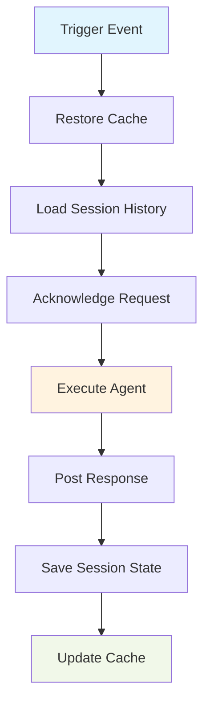

<div align="center">


# Fro Bot Agent

> AI-powered GitHub automation with persistent memory

[](https://github.com/fro-bot/agent/actions) [](https://securityscorecards.dev/viewer/?uri=github.com/fro-bot/agent) [](LICENSE)

[Overview](#overview) · [Quick Start](#quick-start) · [Usage](#usage) · [Configuration](#configuration) · [Development](#development)

</div>

---

## Overview

Fro Bot Agent is a GitHub Action that brings AI automation to your repository using [OpenCode](https://opencode.ai/) with [Oh My OpenCode (oMo)](https://github.com/code-yeongyu/oh-my-opencode) agent workflows. It can respond to issues, review pull requests, participate in discussions, and execute scheduled tasks—all while **remembering previous interactions**.

### Why Fro Bot?

Traditional CI-based AI agents are stateless: they process each request independently, with no memory of past work. This leads to repeated investigations, redundant API calls, and wasted compute time.

**Fro Bot solves this with persistent sessions.** The agent's memory is preserved across workflow runs using GitHub Actions cache (with optional S3 backup), enabling it to:

- **Build institutional knowledge** of your codebase over time
- **Reference prior investigations** to avoid duplicate work
- **Learn from past decisions** and maintain consistency
- **Resume interrupted work** without starting over

### Key Features

- **🔄 Persistent Memory** — Session state survives workflow runs via cache
- **🤖 Multiple Triggers** — Responds to comments, PRs, issues, reviews, and scheduled events
- **⚡ Auto-Setup** — Zero-config installation of OpenCode and oMo on first run
- **👀 User Feedback** — Visual acknowledgment with reactions and labels
- **🔐 Security-First** — Enforces permission gating and credential hygiene
- **📊 Observability** — Detailed run summaries with metrics and error tracking
- **☁️ S3 Backup** — Optional write-through backup prevents cache eviction data loss

## Quick Start

### What You Need

- A GitHub repository where you have admin access
- An [OpenCode](https://opencode.ai/) account with API credentials
- Basic familiarity with GitHub Actions

### Step 1: Configure Secrets

Add the following secret to your repository (Settings → Secrets and variables → Actions):

**`OPENCODE_AUTH_JSON`** — Your LLM provider credentials in JSON format:

```json
{
  "anthropic": {"apiKey": "sk-ant-api-..."},
  "openai": {"apiKey": "sk-..."}
}
```

### Step 2: Create Workflow File

Create `.github/workflows/fro-bot.yaml` in your repository:

```yaml
name: Fro Bot Agent
on:
  issue_comment:
    types: [created]

jobs:
  agent:
    # Only run when @fro-bot is mentioned
    if: contains(github.event.comment.body, '@fro-bot')
    runs-on: ubuntu-latest
    permissions:
      contents: write
      issues: write
      pull-requests: write
    steps:
      - uses: actions/checkout@v4

      - uses: fro-bot/agent@v0
        with:
          github-token: ${{ secrets.GITHUB_TOKEN }}
          auth-json: ${{ secrets.OPENCODE_AUTH_JSON }}
```

### Step 3: Mention the Agent

Comment `@fro-bot` on any issue or pull request. The agent will:

1. Add a 👀 reaction to acknowledge your request
2. Restore its memory from previous runs
3. Execute the requested task using OpenCode
4. Post a response with a run summary

> [!NOTE] On first run, the action automatically installs OpenCode and oMo—no manual setup required!

> [!TIP] **Full workflow reference** — The Quick Start above covers a single trigger. For the complete workflow with all supported triggers, conditional token selection, scheduled tasks, and PR reviews, see [`docs/examples/fro-bot.yaml`](docs/examples/fro-bot.yaml).
>
> **AI-assisted setup** — To have an AI agent set up the workflow for your repository, point it at the example file and tell it to follow the instructions in the header:
>
> > Fetch `https://raw.githubusercontent.com/fro-bot/agent/refs/heads/main/docs/examples/fro-bot.yaml` and follow the instructions at the top of the file to set up the Fro Bot agent workflow for this repository.

## How It Works

Fro Bot uses a multi-phase execution model to provide stateful AI assistance:



### Execution Phases

1. **Cache Restore** — Previous session state loaded from GitHub Actions cache (or S3 if configured)
2. **Session Discovery** — Agent searches prior sessions for relevant context
3. **Request Acknowledgment** — Visual feedback via reactions and labels
4. **Agent Execution** — OpenCode runs with full access to conversation history
5. **Response Publishing** — Results posted as comments or PR reviews
6. **State Persistence** — Updated session data saved back to cache
7. **Session Pruning** — Old sessions removed per retention policy

### Cache Strategy

Sessions are cached using a branch-scoped key:

```text
opencode-storage-{repo}-{branch}-{os}
```

This approach:

- **Isolates branches** to prevent cache poisoning
- **Preserves context** within feature branches
- **Enables continuity** when working on long-running tasks

> [!WARNING] GitHub Actions cache has a 10GB limit per repository and entries expire after 7 days of inactivity. For mission-critical persistence, enable S3 backup.

## Usage

### Comment Triggers

The agent responds when mentioned in comments on issues, pull requests, or PR review threads:

```markdown
@fro-bot Can you investigate why the CI tests are failing?
```

```markdown
@fro-bot Please review this PR and suggest improvements
```

```markdown
@fro-bot What did we decide about error handling in the last discussion?
```

### Supported Events

| Event                         | Trigger                     | Default Behavior                               |
| ----------------------------- | --------------------------- | ---------------------------------------------- |
| `issue_comment`               | `@fro-bot` mention          | Respond to comment                             |
| `issues` (opened/edited)      | `@fro-bot` in issue body    | Triage issue and propose next steps            |
| `pull_request`                | PR opened/synced/reopened   | Review code for quality and potential bugs     |
| `pull_request_review_comment` | `@fro-bot` in review thread | Respond to specific code review comment        |
| `workflow_dispatch`           | Manual workflow trigger     | Execute custom prompt (required input)         |
| `schedule`                    | Cron schedule               | Execute periodic task (requires prompt config) |

### Access Control

For security, the agent only responds to trusted users:

- **Repository owners**
- **Organization members**
- **External collaborators**

Bot accounts and first-time contributors from forks are automatically skipped to prevent abuse.

## Event Trigger Reference

The action supports seven event types. Use this section to wire triggers correctly and understand prompt, permissions, and concurrency expectations.

| Event | Actions | @mention required | Prompt source | Minimum permissions | Concurrency key |
| --- | --- | --- | --- | --- | --- |
| `issue_comment` | `created` | Yes | Comment body | `contents: read`, `issues: write`, `pull-requests: write` | `issue.number` or `run_id` |
| `pull_request_review_comment` | `created` | Yes | Comment body | `contents: read`, `pull-requests: write` | `pull_request.number` or `run_id` |
| `discussion_comment` | `created` | Yes | Comment body | `contents: read`, `discussions: write` | `discussion.number` or `run_id` |
| `issues` | `opened`, `edited` | No (opened), Yes (edited) | Built-in directives | `contents: read`, `issues: write` | `issue.number` or `run_id` |
| `pull_request` | `opened`, `synchronize`, `reopened` | No | `prompt` input (review prompt) | `contents: read`, `pull-requests: write` | `pull_request.number` or `run_id` |
| `schedule` | Cron | No | `prompt` input (schedule prompt) | `contents: read`, `issues: write` | `run_id` |
| `workflow_dispatch` | Manual | No | `prompt` input (required) | Varies by task | `run_id` |

### Trigger Details

<details>
<summary><strong>issue_comment</strong> — comment mentions in issues and PRs</summary>

- **Behavior:** Responds to comments with `@fro-bot`.
- **Skip conditions:** Bot comments, missing mention, or author association not in `OWNER`, `MEMBER`, `COLLABORATOR`.
- **Guard example:**
  ```yaml
  if: >-
    (github.event.pull_request == null || !github.event.pull_request.head.repo.fork) && github.event_name == 'issue_comment' && contains(github.event.comment.body || '', '@fro-bot') && (github.event.comment.user.login || '') != 'fro-bot' && contains(fromJSON('["OWNER", "MEMBER", "COLLABORATOR"]'), github.event.comment.author_association || '')
  ```

</details>

<details>
<summary><strong>pull_request_review_comment</strong> — review thread mentions</summary>

- **Behavior:** Responds to `@fro-bot` mentions inside PR review threads.
- **Skip conditions:** Same gating as `issue_comment` (mention + association + bot check).
- **Guard example:**
  ```yaml
  if: >-
    (github.event.pull_request == null || !github.event.pull_request.head.repo.fork) && github.event_name == 'pull_request_review_comment' && contains(github.event.comment.body || '', '@fro-bot') && (github.event.comment.user.login || '') != 'fro-bot' && contains(fromJSON('["OWNER", "MEMBER", "COLLABORATOR"]'), github.event.comment.author_association || '')
  ```

</details>

<details>
<summary><strong>discussion_comment</strong> — discussion mentions</summary>

- **Behavior:** Responds to `@fro-bot` mentions in discussion threads (if Discussions are enabled).
- **Skip conditions:** Missing mention, bot comments, or untrusted author association.
- **Guard example:**
  ```yaml
  if: >-
    github.event_name == 'discussion_comment' && contains(github.event.comment.body || '', '@fro-bot') && (github.event.comment.user.login || '') != 'fro-bot' && contains(fromJSON('["OWNER", "MEMBER", "COLLABORATOR"]'), github.event.comment.author_association || '')
  ```

</details>

<details>
<summary><strong>issues</strong> — issue opened/edited</summary>

- **Behavior:** Auto-triage on `opened`. `edited` requires a mention.
- **Skip conditions:** Locked issues, bot authors, or untrusted author association.
- **Guard example:**
  ```yaml
  if: github.event_name == 'issues'
  ```

</details>

<details>
<summary><strong>pull_request</strong> — AI code review (not CI)</summary>

- **Behavior:** Runs an AI review on `opened`, `synchronize`, `reopened`.
- **Skip conditions:** Draft PRs, fork PRs, or untrusted author association.
- **Guard example:**
  ```yaml
  if: >-
    github.event_name == 'pull_request' && !github.event.pull_request.head.repo.fork
  ```

</details>

<details>
<summary><strong>schedule</strong> — periodic maintenance</summary>

- **Behavior:** Executes a scheduled prompt (must be provided via `prompt` input).
- **Skip conditions:** Missing prompt (the action exits cleanly).
- **Guard example:**
  ```yaml
  if: github.event_name == 'schedule'
  ```

</details>

<details>
<summary><strong>workflow_dispatch</strong> — manual prompt execution</summary>

- **Behavior:** Runs the user-supplied prompt.
- **Skip conditions:** Missing prompt input when marked `required: true`.
- **Guard example:**
  ```yaml
  if: github.event_name == 'workflow_dispatch'
  ```

</details>

### Permissions Guide

Use the minimum permissions needed for the triggers you enable.

```yaml
permissions:
  contents: read
  issues: write
  pull-requests: write
  discussions: write
```

- `discussion_comment` requires `discussions: write`.
- `issues` and `schedule` need `issues: write` to create or comment on issues.
- `pull_request` reviews require `pull-requests: write`.

### Concurrency Strategy

Use a single concurrency group that scopes to the relevant issue/PR/discussion and falls back to the run ID for schedule/dispatch.

```yaml
concurrency:
  group: >-
    fro-bot-${{
      github.event.issue.number ||
      github.event.pull_request.number ||
      github.event.discussion.number ||
      github.run_id
    }}

  cancel-in-progress: false
```

### Security Model

- **Association gating:** The router only processes events from `OWNER`, `MEMBER`, and `COLLABORATOR` users.
- **Bot protection:** Bot comments are ignored to avoid loops.
- **Fork protection:** `pull_request` runs are skipped for forks; comment triggers are still gated by association.
- **Mention identity:** Mention-based triggers require a token whose login matches the `@` mention users type. Using `GITHUB_TOKEN` means the mention would be `@github-actions`, so `@fro-bot` requires a PAT or GitHub App token.

## Configuration

### Action Inputs

| Input               | Required | Default    | Description                                        |
| ------------------- | -------- | ---------- | -------------------------------------------------- |
| `github-token`      | Yes      | —          | GitHub token with write permissions                |
| `auth-json`         | Yes      | —          | JSON object mapping LLM providers to credentials   |
| `prompt`            | No       | —          | Custom prompt for the agent                        |
| `agent`             | No       | `Sisyphus` | Agent to use (must be primary agent, not subagent) |
| `model`             | No       | —          | Model override in `provider/model` format          |
| `timeout`           | No       | `1800000`  | Execution timeout in milliseconds (0 = no limit)   |
| `opencode-version`  | No       | `latest`   | OpenCode CLI version for installation              |
| `session-retention` | No       | `50`       | Number of sessions to retain before pruning        |
| `s3-backup`         | No       | `false`    | Enable S3 write-through backup                     |
| `s3-bucket`         | No       | —          | S3 bucket name (required if `s3-backup` is true)   |
| `aws-region`        | No       | —          | AWS region for S3 bucket                           |
| `skip-cache`        | No       | `false`    | Skip cache restore (useful for debugging)          |

### Action Outputs

| Output         | Description                                       |
| -------------- | ------------------------------------------------- |
| `session-id`   | OpenCode session ID used for this run             |
| `cache-status` | Cache restore status (`hit`, `miss`, `corrupted`) |
| `duration`     | Run duration in seconds                           |

### Secrets Configuration

#### Required

**`OPENCODE_AUTH_JSON`** — LLM provider credentials in JSON format:

```json
{
  "anthropic": {"apiKey": "sk-ant-..."},
  "openai": {"apiKey": "sk-..."}
}
```

Supports any provider supported by OpenCode. See [OpenCode documentation](https://opencode.ai/docs/) for the complete list.

#### Optional (for S3 backup)

- `AWS_ACCESS_KEY_ID` — IAM user access key
- `AWS_SECRET_ACCESS_KEY` — IAM user secret key

The IAM user needs `s3:PutObject` and `s3:GetObject` permissions for the configured bucket.

## Advanced Examples

### Scheduled Maintenance Tasks

Run the agent on a schedule for periodic repository maintenance:

```yaml
name: Weekly Repository Audit
on:
  schedule:
    - cron: "0 9 * * 1" # Every Monday at 9 AM UTC

jobs:
  audit:
    runs-on: ubuntu-latest
    permissions:
      contents: write
      issues: write
    steps:
      - uses: actions/checkout@v4

      - uses: fro-bot/agent@v0
        with:
          github-token: ${{ secrets.GITHUB_TOKEN }}
          auth-json: ${{ secrets.OPENCODE_AUTH_JSON }}
          prompt: |
            Review open issues and PRs. Identify:
            - Stale issues that need follow-up
            - PRs ready for review
            - Items needing triage
            Post a summary as a new issue.
```

### Manual Workflow with Custom Prompt

Allow team members to manually trigger the agent with custom instructions:

```yaml
name: Manual Agent Task
on:
  workflow_dispatch:
    inputs:
      prompt:
        description: What should the agent do?
        required: true
        type: string

jobs:
  custom-task:
    runs-on: ubuntu-latest
    permissions:
      contents: write
      issues: write
      pull-requests: write
    steps:
      - uses: actions/checkout@v4

      - uses: fro-bot/agent@v0
        with:
          github-token: ${{ secrets.GITHUB_TOKEN }}
          auth-json: ${{ secrets.OPENCODE_AUTH_JSON }}
          prompt: ${{ inputs.prompt }}
```

### S3 Backup for Long-Term Persistence

Enable S3 backup to protect against GitHub Actions cache eviction:

```yaml
- uses: fro-bot/agent@v0
  with:
    github-token: ${{ secrets.GITHUB_TOKEN }}
    auth-json: ${{ secrets.OPENCODE_AUTH_JSON }}
    s3-backup: true
    s3-bucket: my-agent-sessions
    aws-region: us-east-1
  env:
    AWS_ACCESS_KEY_ID: ${{ secrets.AWS_ACCESS_KEY_ID }}
    AWS_SECRET_ACCESS_KEY: ${{ secrets.AWS_SECRET_ACCESS_KEY }}
```

When enabled, sessions are:

1. Written to both cache and S3 simultaneously
2. Restored from cache first (faster)
3. Fallen back to S3 if cache misses or is corrupted

> [!TIP] S3 backup is recommended for production deployments where losing agent memory would significantly impact operations.

## Troubleshooting

### Agent Not Responding

- **Check permissions**: Verify your workflow has `contents`, `issues`, and `pull-requests` write permissions
- **Verify secrets**: Ensure `OPENCODE_AUTH_JSON` is properly formatted JSON
- **Check trigger condition**: For comment triggers, ensure `@fro-bot` appears in the comment
- **Review access control**: Only repo owners, org members, and collaborators can trigger the agent

### Cache Issues

If sessions aren't persisting between runs:

1. Check GitHub Actions cache size (Settings → Actions → Cache)
2. Enable S3 backup for more reliable persistence
3. Verify `skip-cache` isn't set to `true`
4. Review run logs for cache corruption warnings

### Timeout Errors

If the agent times out before completing:

- Increase `timeout` value (default is 30 minutes)
- Check for infinite loops or stuck operations in logs
- Consider breaking large tasks into smaller steps

## Development

### Prerequisites

- Node.js 24 (see `.node-version`)
- pnpm 10+

### Setup

```bash
# Install dependencies
pnpm bootstrap

# Run tests
pnpm test

# Build action
pnpm build

# Lint code
pnpm lint
```

### Project Structure

```text
├── src/
│   ├── main.ts              # Main action entry point
│   ├── post.ts              # Post-action cache save hook
│   └── lib/
│       ├── agent/           # OpenCode execution & prompts
│       ├── attachments/     # File attachment processing
│       ├── cache.ts         # GitHub Actions cache operations
│       ├── comments/        # GitHub comment API interactions
│       ├── github/          # GitHub API client & context
│       ├── observability/   # Metrics & run summaries
│       ├── reviews/         # PR review logic
│       ├── session/         # Session management & search
│       ├── setup/           # OpenCode/oMo installation
│       └── triggers/        # Event routing & filtering
├── dist/                    # Bundled output (committed)
├── RFCs/                    # Architecture decision records
└── action.yaml              # Action definition
```

### Testing

The project uses Vitest with comprehensive test coverage:

```bash
# Run all tests
pnpm test

# Run specific test file
pnpm test src/lib/agent/prompt.test.ts

# Watch mode (for development)
pnpm test --watch
```

### Contributing

This project follows test-driven development (TDD):

1. Write failing test first
2. Implement minimal code to pass
3. Refactor while keeping tests green
4. Never commit without running `pnpm build` (dist/ must stay in sync)

See `AGENTS.md` for detailed development guidelines and architecture overview.

## References

- [OpenCode Documentation](https://opencode.ai/docs/) — Official OpenCode platform docs
- [Oh My OpenCode (oMo)](https://github.com/code-yeongyu/oh-my-opencode) — Agent workflow framework
- [GitHub Actions Documentation](https://docs.github.com/en/actions) — GitHub Actions reference
- [Action Source Code](https://github.com/fro-bot/agent) — View the implementation

## License

[MIT](LICENSE) © Fro Bot
