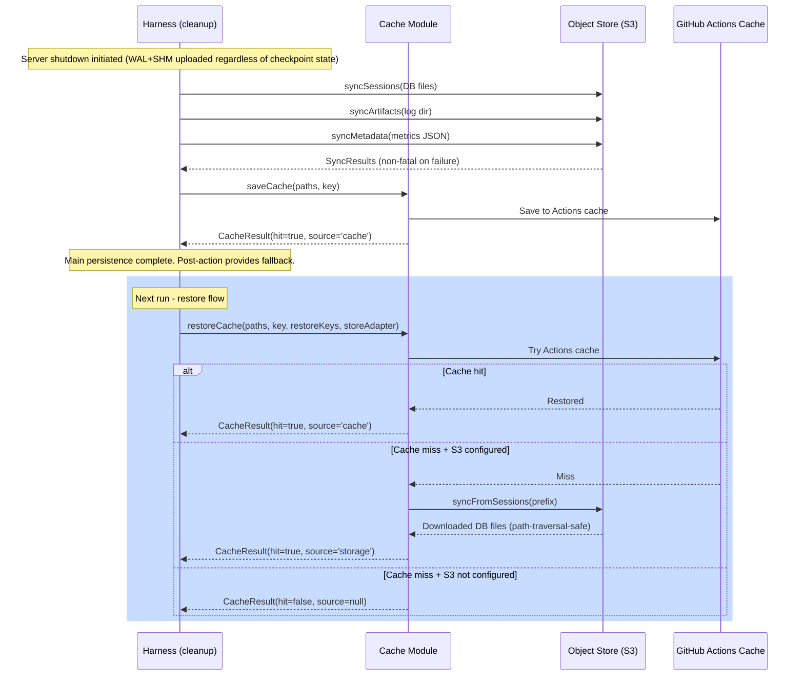

# feat: Durable S3-compatible Object Storage

## Overview

Replace GitHub Actions cache as the primary persistence backend with S3-compatible object storage. Cache becomes an optional read-through accelerator. Sessions, prompt artifacts, attachments, and run metadata persist to any S3-compatible provider (AWS S3, Cloudflare R2, Backblaze B2, MinIO, etc.) via `@aws-sdk/client-s3` with custom endpoint support.

## Problem Frame

Fro Bot's persistence is built on GitHub Actions cache — a 7-day TTL, 10GB-capped, branch-scoped store. This blocks every planned evolution: gateway/daemon mode, Discord interface, and cross-runner portability all require storage that works outside GitHub Actions. (see origin: docs/brainstorms/2026-04-15-durable-object-storage-requirements.md)

## Requirements Trace

- R1. S3-compatible object storage is the canonical source of truth; GitHub cache is an optional accelerator
- R2. Works with any S3-compatible API via custom endpoint (`@aws-sdk/client-s3`)
- R3. Four content types: sessions + messages, prompt artifacts, attachments, run metadata
- R4. GitHub Action mode: cache-first restore, S3 fallback on miss, write-through to both on save
- R5. Non-Action modes: S3 only, no GitHub cache dependency
- R6. S3 key structure uses prefix isolation by agent identity and repository
- R7. S3 failures are logged but never fail the run
- R8. Credentials from env vars or IAM roles; never logged; action inputs for bucket/region/prefix/endpoint
- R9. Clean adapter interface usable across action mode, gateway mode, and future backends

## Scope Boundaries

- NOT persisting wiki pages to S3 (they live in git)
- NOT implementing gateway or Discord runtime (this is the storage foundation)
- NOT removing GitHub Actions cache (stays as accelerator)
- NOT implementing multi-tenant isolation (single-repo-per-config for v1; prefix isolation is defense-in-depth, not a trust boundary)
- NOT modifying tools cache (`ToolsCacheAdapter` for bun/opencode/oMo binaries is separate)
- NOT enabling S3 writes on fork PRs (security boundary — see Threat Model)
- NOT implementing S3 garbage collection or lifecycle management (deferred to future work)

## Context & Research

### Relevant Code and Patterns

- `src/services/cache/types.ts` — `CacheAdapter` interface; also houses `RestoreCacheOptions`, `SaveCacheOptions`, `CacheResult`
- `src/services/cache/restore.ts` — `restoreCache()` builds cache keys, calls adapter, checks corruption/version
- `src/services/cache/save.ts` — `saveCache()` deletes auth files, writes version, calls adapter
- `src/services/cache/cache-key.ts` — `buildCacheKeyComponents()` — agentIdentity hard-coded to `'github'` (dynamic when Discord lands)
- `src/services/session/storage.ts` — SDK client wrapper for session CRUD (**naming note: the new module is `src/services/object-store/` to avoid collision**)
- `src/services/session/version.ts` — `getOpenCodeDbPath()` returns `opencode.db` path (corrected citation)
- `src/shared/env.ts` — `getOpenCodeStoragePath()`, `getOpenCodeLogPath()`
- `src/shared/types.ts` — `CacheResult`, `ActionInputs`, `RunContext` (`RunContext` is defined but NOT currently threaded through phases — this plan does NOT introduce RunContext plumbing)
- `src/shared/constants.ts` — `CACHE_PREFIX = 'opencode-storage'` (used in GitHub cache keys — new S3 prefix must differ)
- `src/harness/phases/cleanup.ts` — Server shutdown → `saveCache()` ordering. `CleanupPhaseOptions` has no `metrics` field currently.
- `src/harness/post.ts` — Durable fallback `saveCache()`. Reads state via `core.getState()` only (no cross-process object passing).
- `src/harness/config/state-keys.ts` — State keys for main→post handoff (needs S3 config additions)
- `src/harness/phases/bootstrap.ts` — Logs `inputs.s3Backup` (must update if field shape changes)
- `src/harness/config/inputs.ts` — Already parses `s3Backup`, `s3Bucket`, `awsRegion`
- `src/features/agent/execution.ts` — Writes prompt artifact to log path
- `src/features/agent/reference-files.ts` — `materializeReferenceFiles()` writes to log dir
- `src/features/observability/metrics.ts` — `createMetricsCollector()` — currently threaded via `run.ts:23` into `session-prep`, `execute`, `finalize` only (NOT cleanup)
- `src/services/artifact/upload.ts` — `uploadLogArtifact()` uploads entire log directory as Actions artifact (continues unchanged; new S3 sync runs in parallel)
- `src/features/agent/server.ts` — `shutdown: () => server.close()` is **synchronous and not awaited** (SDK async cleanup not observable)
- `src/shared/logger.ts` — Redacts fields named `key`/`secret`/`token`/`credential`. Does NOT redact by content pattern (e.g., embedded signatures in error messages).
- RFC-019 — **Superseded** by this plan. Original framing (S3 write-through backup) was inverted to S3-canonical. IAM policy and key structure guidance superseded per security tightening below.

### Institutional Learnings

- Session continuity requires WAL files in cache (PR #432). WAL+SHM are always synced alongside `.db`.
- Cache paths include `opencodeCachePath` (`~/.cache/opencode`) for npm package cache (PR #492). This is tools cache, not session storage.
- Main→post handoff uses `core.saveState()` / `core.getState()`. Secrets MUST NOT be persisted to state; credentials must come from env at post-action time.

## Key Technical Decisions

- **Raw SQLite files, not JSON export**: Sessions managed by OpenCode's Drizzle ORM. Sync raw `.db` + `.db-wal` + `.db-shm`. WAL contents replay on next open — upload safety does NOT require a completed WAL checkpoint. (Resolves deferred Q1; corrects feasibility F6)
- **Cleanup-phase write-through with post-action fallback**: S3 sync runs after server shutdown and before cache save in cleanup. Metrics threaded into cleanup options. Post-action hook (`post.ts`) performs the same S3 sync as fallback when main cleanup was skipped — ensures R3 is met even on cleanup failure. (Resolves Q2; addresses C2, F1, F2)
- **Content-type key prefixes**: `{prefix}/{identity}/{repo}/sessions/`, `.../artifacts/{runId}/`, `.../metadata/{runId}.json`. (Resolves Q3)
- **Custom endpoint input with SSRF protection**: `s3-endpoint` validated on parse: HTTPS-only by default, link-local/loopback/private IP ranges rejected, insecure opt-in flag for local MinIO dev only. (Resolves Q4; addresses S1)
- **Thin adapter interface with centralized key builder**: `ObjectStoreAdapter` with `upload(key, localPath)`, `download(key, localPath)`, `list(prefix)`. `buildObjectStoreKey(config, identity, repo, contentType, suffix)` helper is the ONE place where key structure is defined — used by Units 3 and 4. (Resolves Q5; addresses C7)
- **Module named `object-store/`, not `storage/`**: Prevents collision with existing `src/services/session/storage.ts`. Types use `ObjectStore*` prefix consistently. (Addresses F10)
- **S3 prefix default is `fro-bot-state`, not `opencode-storage`**: Avoids collision with `CACHE_PREFIX` constant. Distinct string makes log reading unambiguous. (Addresses F3)
- **Path traversal prevention on download**: All S3 keys validated before writing to disk. Resolved `localPath` must start with `storagePath + path.sep`. Keys containing `..`, absolute paths, or null bytes are rejected. (Addresses S2)
- **Prefix and key component sanitization**: User-provided `s3-prefix` validated against strict regex `/^[a-zA-Z0-9][a-zA-Z0-9._-]{0,63}$/`. All user-derived key components sanitized. (Addresses S4)
- **Credentials from SDK provider chain only**: `ObjectStoreConfig` does NOT accept `accessKeyId`/`secretAccessKey` fields. Credentials resolved via AWS SDK default provider chain (env → shared credentials → IAM role). Env-sourced credentials registered with `core.setSecret()` at parse time. (Addresses S8, aligns with R8)
- **SSE-KMS at rest, HTTPS in transit**: All `PutObjectCommand` calls set `ServerSideEncryption: 'aws:kms'` (fallback `'AES256'` for providers without KMS). HTTP endpoints rejected unless explicit opt-in. Required bucket policy template documented. (Addresses S7)
- **IAM policy scoped to upload/download only**: No `s3:DeleteObject` — delete removed from adapter interface (YAGNI). `s3:ListBucket` scoped with `Condition: {StringLike: {s3:prefix: [PREFIX/*]}}`. (Addresses S5)
- **S3 error sanitization**: Errors logged with only `error.name`, `error.Code`, `error.$metadata.httpStatusCode`, and truncated message with `X-Amz-*` query params stripped. (Addresses S9)
- **Optional bucket ownership pinning**: `s3-expected-bucket-owner` input (AWS account ID) sets `ExpectedBucketOwner` on every request. (Addresses S10)
- **No RunContext plumbing**: Storage config carried on `ActionInputs` (parsed in `inputs.ts`) and read by `BootstrapPhaseResult.inputs` consumers. No new `RunContext` threading introduced. (Addresses C3, F9)
- **Fork-PR gating**: S3 writes disabled when `github.event.pull_request.head.repo.fork === true`. Prevents attacker-controlled prompts from writing to canonical store. (Addresses S6 threat model)

## Open Questions

### Resolved During Planning

- **Session format**: Raw SQLite files (same as cache).
- **Write-through timing**: After server shutdown, before cache save. Cleanup phase + post-action fallback.
- **Key structure**: Content-type prefixes with centralized builder.
- **Custom endpoint**: Added with SSRF protection.
- **Adapter shape**: Thin key-based operations. Delete removed.
- **Module location**: `src/services/object-store/`.
- **Credentials**: SDK provider chain only, no in-config credentials.
- **Encryption**: SSE-KMS required, HTTPS-only by default.
- **Fork-PR**: S3 writes disabled for forks.

### Deferred to Implementation

- **Concurrent upload optimization**: Initial impl uploads sequentially. `Promise.all` with concurrency limit if sync time becomes a bottleneck.
- **Incremental sync vs full sync**: Initial impl uploads all files. Delta sync via timestamps/ETags is a future optimization.
- **Run metadata JSON shape**: Exact schema defined when implementing metrics serialization.
- **`shutdown()` awaitability**: Current sync fire-and-forget works because all DB files upload together. Async/awaitable shutdown is a separate refactor.
- **S3 lifecycle/retention**: Unbounded growth acceptable for v1. Lifecycle policies and pruning deferred.
- **Cache warm-back from S3 restore**: When S3 fallback succeeds, should we also write back to GitHub cache? Optimization deferred.

## High-Level Technical Design

> *This illustrates the intended approach and is directional guidance for review, not implementation specification.*



## Implementation Units

- [ ] **Unit 1: Object store adapter types and S3 implementation**

**Goal:** Create the object storage abstraction layer with an S3-compatible implementation and security hardening.

**Requirements:** R2, R6, R7, R8, R9

**Dependencies:** None

**Files:**
- Create: `src/services/object-store/types.ts`
- Create: `src/services/object-store/s3-adapter.ts`
- Create: `src/services/object-store/key-builder.ts`
- Create: `src/services/object-store/validation.ts`
- Create: `src/services/object-store/index.ts`
- Test: `src/services/object-store/s3-adapter.test.ts`
- Test: `src/services/object-store/key-builder.test.ts`
- Test: `src/services/object-store/validation.test.ts`

**Approach:**
- `ObjectStoreConfig` type: `enabled`, `bucket`, `region`, `prefix`, `endpoint?`, `expectedBucketOwner?`, `allowInsecureEndpoint?`. **No credential fields.**
- `ObjectStoreAdapter` interface: `upload(key, localPath)`, `download(key, localPath)`, `list(prefix)`. No delete.
- `createS3Adapter(config, logger)` factory:
  - `S3Client` created with optional custom endpoint
  - `PutObjectCommand` always sets `ServerSideEncryption: 'aws:kms'` (configurable fallback to `'AES256'`)
  - All commands include `ExpectedBucketOwner` when configured
  - On error: sanitize message (strip `X-Amz-*` params, Authorization headers), log only `name`, `Code`, `httpStatusCode`, truncated message
- `validateEndpoint(endpoint, allowInsecure)`: Requires `https://`, rejects link-local (169.254.x.x, fe80::/10), loopback (127.0.0.0/8, ::1), private ranges unless `allowInsecure` flag set. Returns `Result<URL, ValidationError>`.
- `validatePrefix(prefix)`: Regex `/^[a-zA-Z0-9][a-zA-Z0-9._-]{0,63}$/`. Rejects `..`, leading `/`, control chars.
- `sanitizeKeyComponent(value)`: Strips slashes → dashes, rejects `..`, null bytes.
- `validateDownloadPath(storagePath, relativePath)`: Resolves to absolute paths, asserts `localPath` starts with `path.resolve(storagePath) + path.sep`. Returns `Result<string, PathTraversalError>`.
- `buildObjectStoreKey(config, identity, repo, contentType, suffix?)`: Assembles `{prefix}/{identity}/{sanitizedRepo}/{contentType}/{sanitizedSuffix}`. Used by Units 3 and 4.

**Patterns to follow:**
- `src/services/cache/types.ts` for adapter interface
- `src/services/setup/tools-cache.ts` for adapter factory
- `src/shared/validation.ts` for Result-returning validators
- RFC-019 `s3.ts` for S3 client operations (with security tightening)

**Test scenarios:**
- S3 client with custom HTTPS endpoint for R2/B2
- S3 client with default AWS endpoint when no custom endpoint
- Endpoint `http://internal` rejected by default
- Endpoint `http://localhost:9000` accepted with `allowInsecureEndpoint: true`
- Endpoint `https://169.254.169.254` rejected (link-local)
- Prefix `../other-repo` rejected
- Key component with `..` rejected during build
- Key component with slash sanitized to dash
- Download path `/etc/passwd` (derived from malicious key) rejected
- Upload sets `ServerSideEncryption: 'aws:kms'` by default
- Upload sets `ExpectedBucketOwner` when configured
- S3 error message containing `X-Amz-Signature=abc123` is redacted before logging
- List returns all keys under prefix with pagination
- All operations log but don't throw on S3 errors (R7)

**Verification:**
- All interfaces importable and type-correct
- S3 adapter handles CRUD with mock client
- Validation rejects all enumerated attack inputs
- Path traversal tests pass for zip-slip attempts

---

- [ ] **Unit 2: Action inputs, config types, and main→post state handoff**

**Goal:** Add new S3 action inputs, refactor `ActionInputs` cleanly, wire config through bootstrap, and add main→post state handoff for S3 config.

**Requirements:** R2, R8

**Dependencies:** Unit 1 (types)

**Files:**
- Modify: `action.yaml`
- Modify: `src/shared/types.ts` (`ActionInputs` only — NOT `RunContext`)
- Modify: `src/shared/constants.ts` (add `DEFAULT_S3_PREFIX`)
- Modify: `src/harness/config/inputs.ts`
- Modify: `src/harness/config/state-keys.ts`
- Modify: `src/harness/phases/bootstrap.ts` (update log field)
- Test: `src/harness/config/inputs.test.ts`

**Approach:**
- Add to `action.yaml`: `s3-endpoint` (optional), `s3-prefix` (optional, default `fro-bot-state`), `s3-expected-bucket-owner` (optional)
- Reuse existing `aws-region` input; parser populates `storeConfig.region`
- `DEFAULT_S3_PREFIX = 'fro-bot-state'` in `constants.ts`
- **`ActionInputs` refactor**: Replace flat `s3Backup`, `s3Bucket`, `awsRegion` with single `storeConfig: ObjectStoreConfig`. Update `src/harness/phases/bootstrap.ts` logger call (`inputs.s3Backup` → `inputs.storeConfig.enabled`). Update all 7 assertion call sites in `inputs.test.ts` to use `result.data.storeConfig.*`.
- Validation: if `storeConfig.enabled` is true, `storeConfig.bucket` must be non-empty (error message does NOT echo input values)
- Fork-PR gate: if `github.event.pull_request.head.repo.fork === true`, force `storeConfig.enabled = false` at parse time with warning log
- Parse flow calls `validateEndpoint` and `validatePrefix` from Unit 1
- Credentials from env: if `AWS_ACCESS_KEY_ID` and `AWS_SECRET_ACCESS_KEY` set, call `core.setSecret()` on each
- **State handoff**: Add state keys `S3_ENABLED`, `S3_BUCKET`, `S3_REGION`, `S3_PREFIX`, `S3_ENDPOINT`, `S3_EXPECTED_BUCKET_OWNER` (all non-secret) to `state-keys.ts`. Main action `core.saveState()` these during bootstrap. Post-action reconstructs `ObjectStoreConfig` from state + env credentials.

**Patterns to follow:**
- Existing input parsing in `inputs.ts` with `core.getInput()` + validation
- `src/harness/config/state-keys.ts` for state keys

**Test scenarios:**
- All S3 inputs parsed correctly with valid values
- Validation error when `s3-backup=true` but `s3-bucket` is empty (no value echoed)
- Default prefix applied when `s3-prefix` not provided
- Custom endpoint passed through when valid
- Invalid endpoint (HTTP, link-local) rejected
- Invalid prefix (containing `..`) rejected
- Config disabled when `s3-backup=false`
- Fork-PR context forces `storeConfig.enabled = false` with warning
- `AWS_ACCESS_KEY_ID`/`AWS_SECRET_ACCESS_KEY` registered as secrets when present
- `storeConfig` includes `expectedBucketOwner` when provided
- Bootstrap logger uses new field shape
- State keys roundtrip: main saves → post reads and reconstructs

**Verification:**
- `parseActionInputs()` returns `ActionInputs` with `storeConfig`
- `inputs.test.ts` all passing with new shape
- `bootstrap.ts` compiles without references to old fields
- Fork-PR test confirms S3 disabled
- Types clean

---

- [ ] **Unit 3: Session persistence — S3 canonical with cache accelerator**

**Goal:** Integrate S3 into the cache restore/save flow.

**Requirements:** R1, R3 (sessions), R4, R5, R7

**Dependencies:** Unit 1, Unit 2

**Files:**
- Modify: `src/shared/types.ts` (add `source` field to `CacheResult`)
- Modify: `src/services/cache/types.ts` (extend `RestoreCacheOptions`, `SaveCacheOptions`)
- Modify: `src/services/cache/restore.ts`
- Modify: `src/services/cache/save.ts`
- Modify: `src/harness/phases/cache-restore.ts` (update cacheStatus derivation)
- Modify: `src/harness/phases/cleanup.ts` (wire in storeConfig)
- Modify: `src/harness/post.ts` (reconstruct storeConfig, call saveCache)
- Modify: `src/features/observability/metrics.ts` (handle source field)
- Test: `src/services/cache/restore.test.ts`
- Test: `src/services/cache/save.test.ts`
- Test: `src/harness/post.test.ts` (S3 handoff)

**Approach:**
- **`CacheResult` extension**: Add `readonly source: 'cache' | 'storage' | null`. `null` on miss, `'cache'` on Actions cache hit, `'storage'` on S3 fallback hit. Update `setCacheStatus` in metrics to track source alongside existing status.
- **`RestoreCacheOptions` / `SaveCacheOptions`**: Add optional `storeConfig?: ObjectStoreConfig` and `storeAdapter?: ObjectStoreAdapter`. Optional keeps backward compatibility for test callers.
- **Restore flow**: Try GitHub cache first. On miss/corruption + `storeConfig.enabled`: create adapter, call `syncSessionsFromStore()` which downloads `{prefix}/{identity}/{repo}/sessions/*` to local storage path with path-traversal validation from Unit 1. Return `CacheResult` with appropriate `source`.
- **Save flow**: After server shutdown (not awaited — WAL+SHM carries any uncheckpointed data). If `storeConfig.enabled`: call `syncSessionsToStore()` which uploads `opencode.db`, `opencode.db-wal`, `opencode.db-shm` under `sessions/` prefix. Non-fatal on failure. Save to GitHub cache as before.
- **Cleanup phase**: Receives `storeConfig` from `bootstrap.inputs.storeConfig`. Passes to `saveCache()`.
- **Post-action**: Reconstructs `ObjectStoreConfig` from state keys (Unit 2). Passes to `saveCache()`. S3 write-through happens in fallback path.
- Note: Messages are stored in the same SQLite DB as sessions; no separate handling required.

**Patterns to follow:**
- Current `restoreCache()` / `saveCache()` flow
- `buildCachePaths()` for file path assembly
- State-keys pattern from `src/harness/config/state-keys.ts`

**Test scenarios:**
- Cache hit → S3 not called
- Cache miss + S3 configured → S3 download, `source: 'storage'`
- Cache miss + S3 not configured → `source: null`
- Cache miss + S3 download fails → miss returned, error logged (R7), non-fatal
- Save writes to both S3 and cache when configured
- Save writes to cache only when S3 not configured (backward compatible)
- S3 save failure doesn't prevent cache save
- WAL and SHM always uploaded alongside .db
- Malicious S3 key attempting path traversal is rejected during download
- Post-action save reconstructs storeConfig from state and uploads to S3
- Post-action skips S3 if state keys missing (main crashed early)

**Verification:**
- All existing cache tests still pass
- `source` field populated correctly
- Post-action test confirms S3 write-through on cleanup-skip

**Technical design sketch** (directional, not prescriptive):

Three composing code paths share a common store-sync helper to avoid drift:

```
# Shared helper (object-store/content-sync.ts)
syncSessionsToStore(adapter, storeConfig, localStoragePath):
    paths = [opencode.db, opencode.db-wal, opencode.db-shm]
    prefix = buildObjectStoreKey(config, identity, repo, "sessions")
    for path in paths where file exists:
        key = prefix + basename(path)
        adapter.upload(key, path)  # non-fatal on failure

syncSessionsFromStore(adapter, storeConfig, localStoragePath):
    prefix = buildObjectStoreKey(config, identity, repo, "sessions")
    keys = adapter.list(prefix)
    for key in keys:
        relativePath = key[len(prefix):]
        localPath = validateDownloadPath(localStoragePath, relativePath)  # zip-slip check
        adapter.download(key, localPath)

# Restore flow (cache/restore.ts)
restoreCache(opts):
    ghResult = ghAdapter.restoreCache(opts.paths, opts.key, opts.restoreKeys)
    if ghResult.hit and not corrupted:
        return {hit: true, source: "cache", ...}
    if opts.storeConfig?.enabled:
        adapter = createS3Adapter(opts.storeConfig)
        syncSessionsFromStore(adapter, opts.storeConfig, localStoragePath)
        return {hit: true, source: "storage", ...}
    return {hit: false, source: null}

# Save flow (cache/save.ts)
saveCache(opts):
    if opts.storeConfig?.enabled:
        adapter = createS3Adapter(opts.storeConfig)
        syncSessionsToStore(adapter, opts.storeConfig, localStoragePath)  # non-fatal
    return ghAdapter.saveCache(opts.paths, opts.key)  # continues regardless

# Post-action fallback (harness/post.ts)
runPost():
    if not getState("CACHE_SAVED") and getState("SHOULD_SAVE_CACHE"):
        storeConfig = reconstructStoreConfigFromState()  # non-secret state
        saveCache({..., storeConfig})  # same flow as above
```

**Ordering invariants that must hold:**
- Server shutdown initiated before any store sync (not awaited — WAL+SHM carries uncheckpointed data)
- Store sync completes (or fails non-fatally) before GitHub cache save
- Post-action only invokes if main cleanup was skipped — prevents double-write

---

- [ ] **Unit 4: Artifact and metadata persistence**

**Goal:** Upload prompt artifacts, reference file attachments, and run metadata to S3. Thread metrics into cleanup phase.

**Requirements:** R3 (artifacts, attachments, metadata)

**Dependencies:** Unit 1, Unit 2, Unit 3

**Files:**
- Create: `src/services/object-store/content-sync.ts`
- Modify: `src/harness/phases/cleanup.ts` (add `metrics` to `CleanupPhaseOptions`)
- Modify: `src/harness/run.ts` (pass `metrics` to `runCleanup`)
- Modify: `src/harness/post.ts` (artifact+metadata fallback)
- Test: `src/services/object-store/content-sync.test.ts`
- Test: `src/harness/phases/cleanup.test.ts`

**Approach:**
- **Metrics threading**: Add `readonly metrics: MetricsCollector` to `CleanupPhaseOptions`. Update `runCleanup` call in `src/harness/run.ts:94` to pass metrics.
- `syncArtifactsToStore(adapter, logPath, config, identity, repo, runId)`: walks log directory, uploads all files under `{prefix}/{identity}/{repo}/artifacts/{runId}/` via `buildObjectStoreKey`. Includes prompt-*.txt files and materialized reference files. Runs in parallel with existing `uploadLogArtifact()` — independent persistence layers.
- `syncMetadataToStore(adapter, metrics, config, identity, repo, runId)`: serializes `MetricsCollector` snapshot to JSON (token usage, timing, cache status + source, session IDs, artifact URLs). Uploads under `{prefix}/{identity}/{repo}/metadata/{runId}.json`.
- Both called in cleanup phase after server shutdown, before cache save. Non-fatal on failure (R7).
- **Post-action fallback**: If cleanup was skipped (`SHOULD_SAVE_CACHE=true` && not yet saved), `post.ts` invokes content-sync. Metrics not available in post-action; post writes minimal metadata file (runId, timestamp, cleanup-skipped marker) rather than full metrics.

**Patterns to follow:**
- `src/services/artifact/upload.ts` for log directory walking
- `src/features/observability/metrics.ts` for metrics shape
- `src/harness/post.ts` for state-based fallback pattern

**Test scenarios:**
- Log directory with prompt artifacts → all uploaded under `artifacts/{runId}/`
- Empty log directory → no uploads, no errors
- Metrics serialized to JSON with expected fields
- S3 upload failure logged but doesn't fail the run
- Run ID in key path for chronological organization
- Metrics threaded through cleanup options correctly
- Post-action fallback writes minimal metadata when cleanup skipped

**Verification:**
- Prompt artifacts and reference files appear in S3 under `artifacts/{runId}/`
- Run metadata JSON valid with expected fields
- Cleanup completes even if S3 upload fails
- Metrics threaded from `run.ts` through `cleanup.ts`
- Post-action handles cleanup-skip case

---

- [ ] **Unit 5: Integration test — end-to-end restore/save flow**

**Goal:** Prove the critical path (cache miss → S3 restore → execute → S3 save + cache save) works end-to-end with mocked S3.

**Requirements:** R1, R3, R4

**Dependencies:** Units 1-4

**Files:**
- Create: `src/services/cache/restore-save-flow.test.ts`

**Approach:**
- Test cache + object-store integration as a unit without GitHub Actions runtime
- Mock `ObjectStoreAdapter` (in-memory map keyed by S3 key)
- Mock `CacheAdapter` with always-miss mode
- Exercise 3-run sequence:
  1. First run (cache miss, S3 empty): restore miss, execute simulated, save to both
  2. Second run (cache miss, S3 has state): restore from S3, `source='storage'`
  3. Third run (cache hit): restore from cache, `source='cache'`, S3 not called
- Verify expected keys present in mock adapters
- Verify sanitization: malicious keys rejected during restore

**Patterns to follow:**
- Existing `restore.test.ts`, `save.test.ts` for cache module test patterns

**Test scenarios:**
- 3-run sequence validates source transitions
- Path traversal attempt in mock S3 bucket rejected during restore
- S3 write failure in save path doesn't prevent cache save
- All 4 content types appear in expected keys

**Verification:**
- End-to-end test passes without GitHub Actions runtime
- Observability signals (source='cache' vs 'storage') behave correctly
- Security validations exercised in integration context

---

- [ ] **Unit 6: Build, bundle, and documentation**

**Goal:** Add `@aws-sdk/client-s3` dependency, update bundler, rebuild dist/, and document configuration.

**Requirements:** R2

**Dependencies:** Units 1-5

**Files:**
- Modify: `package.json`
- Modify: `pnpm-lock.yaml` (lockfile update — automatic, must be committed)
- Modify: `tsdown.config.ts`
- Modify: `action.yaml` (description updates)
- Modify: `AGENTS.md` (document S3 configuration + new code map entries)
- Modify: `README.md` (configuration examples for R2/B2/MinIO)
- Modify: `RFCs/RFC-019-S3-Storage-Backend.md` (mark **Superseded**)
- Rebuild: `dist/`

**Approach:**
- Add `@aws-sdk/client-s3` as a dependency
- Add to `noExternal` in `tsdown.config.ts`
- Measure bundle size delta (realistic estimate: 1.5-2.5MB after minification with @smithy transitive deps)
- Rebuild dist/ and verify `git diff dist/` passes CI check
- Update AGENTS.md with `object-store` module code map entries
- Add README configuration examples for AWS/R2/B2/MinIO
- Mark RFC-019 status as **Superseded** with pointer to this plan

**Patterns to follow:**
- Existing bundled deps in `tsdown.config.ts` `noExternal`

**Test scenarios:**
- Build succeeds with new dependency
- dist/ committed, CI diff check passes
- Import of `@aws-sdk/client-s3` resolves in bundled output
- pnpm-lock.yaml updated and committed

**Verification:**
- `pnpm build` exits 0
- `git diff dist/` shows only expected changes
- Bundle size delta documented (1.5-2.5MB expected)
- Documentation updated with configuration examples
- RFC-019 marked Superseded

## System-Wide Impact

- **Interaction graph:** Cache restore/save gains S3 codepath. Cleanup gains metrics access + artifact/metadata upload. Post-action hook inherits S3 write-through and adds artifact/metadata fallback. Main→post state handoff gains 6 new keys. No other phases affected.
- **Error propagation:** All S3 failures caught and logged (R7). Never propagated as exceptions. Cache operations continue regardless. Error messages sanitized before logging.
- **State lifecycle risks:** Server shutdown not awaited but WAL+SHM upload eliminates data loss. Partial S3 upload is safe — next sync overwrites. Concurrent run writes to `sessions/` are last-write-wins; acceptable for v1.
- **API surface parity:** `action.yaml` gains `s3-endpoint`, `s3-prefix`, `s3-expected-bucket-owner` inputs. `ActionInputs.storeConfig` replaces flat fields — internal breaking change, but `action.yaml` input surface preserved.
- **Integration coverage:** End-to-end test (Unit 5) covers cache miss → S3 restore → save-to-both. Unit tests cover adapter, validation, content-sync, state handoff.

## Risks & Dependencies

### Threat Model

**Adversaries in scope:**
- Fork-PR contributor with prompt-injection capability
- Compromised AWS credentials (stolen, phished, leaked)
- Bucket-name squatter
- SSRF-capable attacker controlling `s3-endpoint` input
- Malicious actor writing crafted S3 objects in shared-bucket scenarios

**Protected assets:**
- Session memory integrity and confidentiality
- Runner filesystem integrity (path traversal → arbitrary file write)
- AWS credentials and OIDC tokens in runner env
- Bucket contents (other repos' sessions in shared-bucket scenarios)

**In-scope mitigations:**
- SSRF protection on `s3-endpoint` (Unit 1, S1)
- Path traversal protection on download (Unit 1, S2)
- Prefix and key component sanitization (Unit 1, S4)
- SSE-KMS at rest, HTTPS in transit (S7)
- Credentials from SDK provider chain only (S8)
- IAM policy scoped without delete (S5)
- Fork-PR S3 writes disabled (S6)
- Error message sanitization (S9)
- Optional bucket ownership pinning (S10)

**Accepted risks / deferred mitigations:**

Each accepted risk carries a detection signal so we know if the assumption breaks, and a planned upgrade path if it does.

- **Agent-induced secret exfiltration**: A sufficiently capable prompt injection may cause the agent to read secrets that persist to S3. Requires runtime egress controls or runner-level secret hygiene — beyond this plan's scope.
  - *Detection signal*: S3 object inspection during incident response, or static grep of session DBs for patterns matching known secret formats (AWS keys, JWTs, `-----BEGIN ... PRIVATE KEY`).
  - *Upgrade path*: (1) Runtime tool-call filtering in harness to block reads of known secret paths (`~/.aws/`, `/proc/self/environ`, `.env*`); (2) Periodic SQLite DB scrubbing with a redaction pass before upload; (3) Runner-level egress controls via `actions/restrict-checks` or similar.
- **Data retention**: Session DBs accumulate indefinitely. Lifecycle policies deferred.
  - *Detection signal*: S3 bucket cost monitoring, object count growth rate.
  - *Upgrade path*: S3 lifecycle rules with age-based expiration (e.g., `sessions/` expires after 180 days, `artifacts/` and `metadata/` after 30 days). Safe to add at any time; no code change needed.
- **Client-side encryption**: SSE-KMS protects data at rest on S3 but application-layer encryption with ephemeral keys would defend against S3 admin access. Deferred.
  - *Detection signal*: Threat model change — if bucket admin access becomes a realistic adversary (e.g., bucket shared across organizational boundaries).
  - *Upgrade path*: Introduce a `StoreEncryption` layer in `object-store/` that wraps `upload`/`download` with AES-GCM using a key derived from a GitHub OIDC-issued workload identity. Keys never land on disk.
- **Concurrent-run last-write-wins**: Two CI runs writing `sessions/` under the same prefix result in overwrite. Acceptable for v1.
  - *Detection signal*: Session state inconsistency reports from users, or DB corruption on next restore.
  - *Upgrade path*: Add runId suffix to the sessions/ prefix (trivial change in `buildObjectStoreKey`), or use S3 ETag-based conditional writes via `IfMatch` header.

### Other Risks

- **Bundle size**: `@aws-sdk/client-s3` v3 with `@smithy/*` deps ~1.5-2.5MB after minification. Monitor after bundling; consider lazy-loading if problematic.
- **First-run latency**: Initial S3 download on cache miss adds network latency. Mitigated by cache accelerator on subsequent runs.
- **S3-compatible provider compatibility**: R2, B2, MinIO have minor API differences (ListObjectsV2 pagination, multipart upload, SSE-KMS support). Test with at least R2 or MinIO before Unit 6 done.
- **Concurrent run semantics**: Two CI runs racing to write `sessions/` under same prefix result in last-write-wins. Acceptable for v1; consider runId suffixing or ETag conditional writes in future.

## Documentation / Operational Notes

- Update `AGENTS.md` to document the `object-store` module and S3 configuration
- Update `action.yaml` description for new inputs
- Mark RFC-019 as **Superseded** (update status + pointer to this plan)
- Add configuration examples to README:
  - AWS S3 with IAM role
  - Cloudflare R2 with custom endpoint
  - Backblaze B2 with custom endpoint
  - MinIO for local development (with `allowInsecureEndpoint` opt-in)
- Add bucket policy template requiring:
  - `aws:SecureTransport=false` → Deny
  - `s3:PutObject` without encryption header → Deny
  - `s3:GetObject` restricted to expected principal
  - Block Public Access enabled
- Document IAM policy scoped to `s3:GetObject`, `s3:PutObject`, `s3:ListBucket` with prefix condition, NO `s3:DeleteObject`

## Sources & References

- **Origin document:** [docs/brainstorms/2026-04-15-durable-object-storage-requirements.md](/docs/brainstorms/2026-04-15-durable-object-storage-requirements.md)
- **RFC-019 (Superseded):** [RFCs/RFC-019-S3-Storage-Backend.md](/RFCs/RFC-019-S3-Storage-Backend.md) — S3 client operations, key structure. IAM policy and storage hierarchy superseded by this plan.
- Related PRs: #432 (WAL files in cache), #492 (opencodeCachePath for npm packages)
- Related code: `src/services/cache/`, `src/harness/phases/cleanup.ts`, `src/features/observability/metrics.ts`, `src/harness/post.ts`
- Security references: [OWASP SSRF](https://owasp.org/www-community/attacks/Server_Side_Request_Forgery), [zip-slip vulnerability](https://github.com/snyk/zip-slip-vulnerability)
