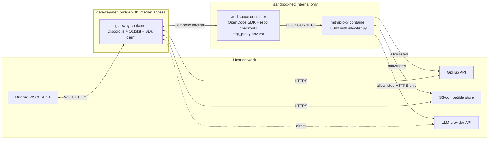

# feat: Fro Bot Gateway — Discord-first action-taking agent (v1)

## Overview

Build a persistent Discord-first gateway daemon that lets the user interact with Fro Bot from any device, take action on local repo checkouts in a sandboxed workspace, and dispatch heavier work to the existing GitHub Action. The gateway reuses the existing agent execution, session storage, prompt assembly, and object-store layers from `fro-bot/agent` via a conservative extraction into a shared runtime package. Both surfaces (Discord gateway + GitHub Action) coordinate via an S3-backed per-repo lock and write sessions to the same shared bucket with per-surface namespacing. v1 ships as a 3-service Docker Compose stack (`gateway` + `workspace` + `mitmproxy`) with middle-path sandbox containment.

## Problem Frame

Fro Bot today is a stateless GitHub Action — one webhook in, one comment out, runtime dies. That forecloses several classes of interaction:

1. **Multi-device presence** — the user can't talk to the agent from a phone, can't resume a conversation across devices, can't approve actions away from the desk
2. **Persistent conversation** — every interaction starts fresh from a webhook event; there's no continuity across the invocation boundary
3. **Ad-hoc action-taking** — asking the agent to do something requires a GitHub event (push, comment, etc.) or a `workflow_dispatch` ceremony

The brainstorm (`docs/brainstorms/2026-04-17-fro-bot-gateway-discord-requirements.md`, `status: ready-for-planning`) narrows this to one concrete v1: a Discord-first action-taking gateway. The "Why Discord" rationale (multi-device presence specifically) rules out CLI (terminal-bound), IDE plugin (editor-bound), and custom web UI (greenfield everything). Discord is already installed across every device the user owns.

This plan defines **how** to build that v1, building on 10 anchored decisions from the brainstorm. It does not re-litigate product questions; it resolves technical ones.

## Requirements Trace

Aligned with the brainstorm's R1-R11:

- **R1-R2:** Action-taking agent reachable from Discord, with channel↔repo binding
- **R3:** Session context shared across surfaces (read-only), resume is within-surface only, session content treated as untrusted input
- **R4:** Local execution by default; cloud dispatch via `workflow_dispatch` when user requests
- **R5:** Middle-path sandbox containment (mitmproxy HTTP allowlist only; bind-mounted credentials as accepted-risk; no CoreDNS, no git-broker in v1)
- **R6:** Role-based access via the `fro-bot` Discord role; `no-fro-bot` block role
- **R7:** Self-hostable via `docker compose up`
- **R8:** Conservative reuse — shared runtime package covers agent execution, session storage, prompt assembly, and object-store only; harness phases, routing, and `@actions/*` code stay in the Action
- **R9:** Discord-native ergonomics (thread-per-session, rich responses, reactions, approval embeds, progress-in-working-message, mention safety, slash commands)
- **R10:** Observable execution with structured logs, run summaries, session-id traceability
- **R11:** Run lifecycle, serial per-thread queue, per-repo single-writer lock across all surfaces

Success criteria (inherited from brainstorm):

1. The user can `@fro-bot` in Discord and get a meaningful response within 15 seconds for simple queries
2. The user can `/fro-bot review <pr-url>` and the agent posts a review to both Discord and the PR
3. The user can approve or deny sensitive actions via inline buttons
4. Session context is shared across surfaces (read-only); Action summaries are accessible from Discord
5. The stack can be torn down and brought back up (`docker compose down && up`) without losing bound repos or prior sessions
6. A role change (grant or revoke `fro-bot` role) takes effect without restart
7. The conservative shared runtime is extracted: both frontends import agent execution, session storage, prompt assembly, and object-store logic from the same package

## Scope Boundaries

v1 explicitly does NOT ship:

- Voice, video, or screen-share integration
- Discord forum channels
- Multi-tenancy (single operator / single role per deployment)
- Per-user GitHub identity mapping (all actions attribute to `fro-bot[bot]`)
- Autonomous loops beyond what the Action already does (DMR, wiki)
- Hosted SaaS version
- Non-Discord surfaces (Slack, email, Telegram, web UI)
- Per-channel prompt override (one prompt per bot instance)
- Replay or eval harness (separate ideation thread)
- Memory router or distillation features (separate ideation threads)
- Full sachitv sandbox (CoreDNS + git-broker) — deferred to v1.1
- Cross-surface session **resume** (only cross-surface **context access** via summaries bridge)

### Deferred to Separate Tasks

- **oMo / Systematic plugin installation path for the workspace container** — the workspace needs OpenCode + oMo + `@fro.bot/systematic` pre-installed or runtime-installed. v1 plan uses runtime install via the existing setup code; if that proves too slow, a subsequent PR can bake them into the image.
- **Node.js version alignment between Action and gateway workspace** — Action already requires Node 24; workspace image uses Node 24. No divergence work needed in v1, but if the Action upgrades the gateway follows.
- **RFC-018 agent-invokable delegated work tools** (in-process MCP tools for the OpenCode agent) — orthogonal; if shipped, integrates via the shared runtime package naturally.

### Plan-specific deferrals to v1.1 (lighter UX scope from review)

These were considered for v1 but trimmed during plan review to keep scope proportionate to "prove Discord interaction works":

- **File attachments on incoming Discord messages** — v1 ignores attachments; agent works only with message text. v1.1 ingests attachments as session file parts.
- **Smart long-response splitting** at code-block boundaries — v1 attaches as `.md` file when >1900 chars (always-correct fallback). v1.1 splits inline at logical boundaries.
- **`/fro-bot abort` slash command** — deferred until OpenCode SDK abort support is confirmed. v1 has `/fro-bot clear-queue` for pending; current task runs to completion.
- **`/fro-bot resume` autocomplete** — v1 uses `/fro-bot sessions` list + paste-id; v1.1 adds Discord-native autocomplete.
- **Persisted queue across gateway restart** — v1 queue is in-memory; if real-world use exposes this gap, v1.1 persists per-thread to S3.
- **HTTP `/health/ready` endpoint** — v1 has SIGTERM graceful drain only; observability via `docker compose logs`. v1.1 adds the endpoint when load-balancer integration is needed.
- **Add-project rollback automation** — v1 logs partial-failure state with explicit recovery instructions; single-tenant operator can manually clean up. v1.1 automates rollback if needed.

## Context & Research

### Relevant Code and Patterns

**Refined extraction partition** (after import-graph audit on April 18, 2026 — see Unit 1 for details):

**Group X — extractable into `packages/runtime/`** (GitHub-agnostic agent runtime):
- `src/features/agent/execution.ts`, `prompt.ts`, `prompt-thread.ts`, `prompt-sender.ts`, `reference-files.ts`, `retry.ts`, `output-mode.ts`, `types.ts`, `index.ts` — couple only to `shared/*`, to lifted types (context/triggers types are TYPE-only imports), and to session/comments-error-format which lift WITH them
- `src/features/agent/server.ts` — couples to `services/setup/*`; resolved via injected `SetupAdapter` interface (Action provides default)
- `src/services/session/` — fully self-contained (22 files, only `shared/*` deps)
- `src/services/object-store/` — fully self-contained (10 files, only `shared/*` deps)
- `src/features/comments/types.ts` and `error-format.ts` — small, self-contained, lifted into `packages/runtime/src/agent/error-format/` because `execution.ts` and `prompt-sender.ts` need them
- `src/shared/{logger,types,async,constants,env,errors,format,console}.ts` — lifted into `packages/runtime/src/shared/` (the agent runtime depends on these utilities; lifting them solves the backwards-dependency problem coherence flagged)
- Type-only definitions from `features/context/types.ts` and `features/triggers/types.ts` (e.g., `HydratedContext`, `TriggerContext`) — lifted into `packages/runtime/src/agent/types.ts` as runtime-owned types
- The `EventType` enum used by `output-mode.ts` — lifted from `services/github/types.ts` into runtime as a runtime-owned discriminator

**Group Y — STAYS in `apps/action/`** (genuinely GitHub-specific glue around the runtime, NOT shared with gateway):
- `src/features/agent/reactions.ts` — GitHub labels + reactions API calls
- `src/features/agent/context.ts` — GraphQL hydration of issue/PR context
- `src/features/agent/diff-context.ts` — GitHub PR diff fetching via `features/reviews/index.ts`
- `src/features/agent/streaming.ts` — extracts GitHub commit SHAs and URLs from agent output
- All of `src/harness/` — Action-specific phases
- All of `src/services/github/` — Octokit, NormalizedEvent, GitHub URLs
- All of `src/services/cache/` — uses `@actions/cache`
- All of `src/services/setup/` — Action-specific tool installation (provides `SetupAdapter` to runtime)
- All of `src/features/{triggers,context,reviews,attachments,delegated,observability}/` — Action-specific
- `src/features/comments/writer.ts`, `reader.ts` — GitHub comment posting (gateway has its own Discord-message poster)

**Group Z — gateway-side equivalents to write fresh** (the gateway's analog of Group Y):
- `packages/gateway/src/discord/reactions.ts` — Discord emoji reactions
- `packages/gateway/src/discord/context.ts` — Discord channel/thread context (no GraphQL)
- `packages/gateway/src/discord/diff-context.ts` — workspace-local git diff (no GitHub API)
- `packages/gateway/src/discord/streaming.ts` — Discord message streaming (no GitHub URL extraction)

This partition is **cleaner than the original plan stated**: the runtime is genuinely GitHub-agnostic, and the per-surface glue lives in each surface's own package. No adapters needed for `reactions.ts` / `context.ts` / `diff-context.ts` / `streaming.ts` — each surface writes its own analog.

**Sole adapter injection needed:** `server.ts` gets a `SetupAdapter` interface — Action provides `@actions/*`-backed default; gateway provides `child_process`-backed default.

**Test helper migration:** `src/services/github/test-helpers.ts` and `src/features/triggers/__fixtures__/` stay in `apps/action/` (they mock GitHub-specific events, not relevant to runtime tests). Runtime tests use only mocks for `SessionClient`, `ObjectStoreAdapter`, `SetupAdapter`, and `Logger` — all of which are runtime-owned interfaces.

**Adapter pattern to follow:**
- `CacheAdapter` at `src/services/cache/types.ts` — interface + default + injection via options
- `ObjectStoreAdapter` at `src/services/object-store/types.ts` — same pattern
- `ExecAdapter` at `src/services/setup/adapters.ts` — same pattern

**Tests:**
- 83 colocated `.test.ts` files, Vitest defaults (no `vitest.config.ts`)
- Factory-style fixtures at `src/features/triggers/__fixtures__/`
- `src/features/agent/opencode.test.ts` mocks `@actions/exec` — will need refactor to inject `ExecAdapter` after extraction

**Existing retry logic:**
- `src/features/agent/retry.ts` — `RETRY_DELAYS_MS = [5_000, 15_000, 30_000, 60_000]`, `MAX_LLM_RETRIES = 4`

### Institutional Learnings

- `docs/solutions/workflow-issues/delivery-mode-contract-for-manual-triggers-2026-04-17.md` — **highly relevant**. The six-layer delivery contract (harness_rules authority, Delivery Mode enum, soft-control framing) is the template for the Discord surface's delivery mode. Discord-initiated runs must emit a Delivery Mode preamble following the same pattern.
- `docs/solutions/code-quality/architectural-issues-type-safety-and-resource-cleanup.md` — **critical for runtime extraction**. Session backend must be backend-agnostic. v1 treats the S3 object-store as the first-class canonical backend (matching the shipped PR #514 state), not the JSON vs SQLite framing the doc was written under. This doc will need refreshing after extraction lands.
- `docs/solutions/build-errors/tool-binary-caching-ephemeral-runners.md` — informs the container image strategy. OpenCode/oMo binaries should be baked into the workspace image; session state goes to S3.
- `docs/solutions/best-practices/versioned-tool-config-plugin-pattern-2026-03-29.md` — preserve the config-declared plugin pattern when the workspace container runs OpenCode. Systematic plugin injection uses the same config-declaration approach, not a separate install step.

### External References

- **Discord.js v14.26.2** — current stable. No sharding needed for single-server use. `allowedMentions: { parse: ['users'] }` client-wide default is critical. Shard lifecycle events (`shardError`, `shardDisconnect`, `shardReconnecting`, `shardResume`) should be logged. https://discord.js.org/docs/packages/discord.js/14.25.1
- **@octokit/auth-app** (v8.2.0) — Installation Access Token refresh is **automatic** when used via `Octokit({ authStrategy: createAppAuth, auth: {...} })`. No manual refresh loop needed. JWT generated on-demand (10-min lifetime), IAT cached and renewed ~5 minutes before 1-hour expiry. https://github.com/octokit/auth-app.js
- **workflow_dispatch with `return_run_details: true`** (Feb 2026) — returns `workflow_run_id` and `run_url` synchronously. Eliminates the "poll GitHub for the run that just got created" pattern. Max 25 input properties per workflow. https://docs.github.com/en/rest/actions/workflows
- **AWS SDK v3 conditional writes** — `PutObjectCommand` with `IfNoneMatch: '*'` for atomic lock acquisition, `IfMatch: <etag>` for lease renewal. `PreconditionFailed` (412) signals lock contention. S3 lifecycle rules minimum granularity is 1 day; shorter TTLs (15-min locks) must be enforced in application logic by comparing `acquired_at` timestamps. https://docs.aws.amazon.com/AmazonS3/latest/userguide/conditional-requests.html
- **mitmproxy regular proxy mode** — the straightforward path. Workspace container sets `http_proxy=http://mitmproxy:8080` and `https_proxy=http://mitmproxy:8080` env vars. mitmproxy generates a CA at startup; CA cert is mounted into workspace at `/usr/local/share/ca-certificates/mitmproxy.crt` and `update-ca-certificates` runs in entrypoint. No iptables, no shared netns, no privileged containers required. Transparent mode is NOT used in v1 — it would force network namespace sharing. https://docs.mitmproxy.org/stable/
- **Docker Compose v2 secrets** — `_FILE` suffix convention (`DISCORD_TOKEN_FILE=/run/secrets/discord_token`) used by Postgres/MySQL/etc. Bind-mounted files, not encrypted. `chmod 600` on the host secret files; mount permissions set via the long-form `secrets:` syntax.
- **Graceful Node.js shutdown (2026 best practice)** — SIGTERM handler, `server.closeIdleConnections()` (Node 18.2+), track in-flight work, 25-second hard timeout (must be less than K8s `terminationGracePeriodSeconds`), health check returns 503 during shutdown.

### Related Issues / Prior Work

- **PR #514** (merged) — RFC-019 superseded; object-store (`src/services/object-store/`) is canonical. Prerequisite for this plan.
- **PR #517** (merged) — Delivery-mode contract. Discord surface adopts the same contract by default; `/fro-bot review <pr>` is `branch-pr` mode, ad-hoc edits default to `working-dir`.
- **PR #518** (merged) — Delivery-mode learning in `docs/solutions/`. Referenced above.
- **RFC-019** (superseded) — original S3 backup proposal; superseded by PR #514.

## Key Technical Decisions

| Decision | Rationale |
|----------|-----------|
| **Conservative extraction scope:** shared runtime covers agent execution, session storage, prompt assembly, object-store ONLY. Harness, routing, `@actions/*`-coupled code stay in the Action (see origin brainstorm D1). | The Action's harness phases were designed for ephemeral runners with per-invocation pipelines; that shape does not match a long-running Discord gateway. Narrower extraction lowers blast radius on the Action during the refactor and keeps each frontend's harness appropriate to its runtime. |
| **`pnpm` workspace package layout** (`packages/runtime/` + `packages/gateway/` inside the same repo, `apps/action/` for the Action code) | Same repo keeps TypeScript project references, release tooling, CI, and changelogs unified. Published npm package is deferred until a third consumer emerges. Workspace resolution is cheap and reversible. |
| **mitmproxy regular proxy mode (`http_proxy`/`https_proxy` env vars), not transparent mode** | Transparent mode requires iptables + shared network namespaces + privileged containers. Regular proxy mode achieves the same HTTPS-allowlist containment with stock Docker Compose networking and no special privileges. Confirmed viable by research. |
| **Two Docker networks: `gateway-net` (bridge, direct internet) + `sandbox-net` (internal, proxy-only)** | Gateway needs direct access to Discord, GitHub, S3, LLM providers. Workspace must go through mitmproxy. Gateway is attached to both networks so it can communicate with workspace; workspace is on sandbox-net only. |
| **GitHub App auth via `Octokit({ authStrategy: createAppAuth, auth: {...} })`, not manual token refresh** | `@octokit/auth-app` handles Installation Access Token refresh automatically in Octokit's request pipeline. No manual refresh loop, no cache-miss error handling. Zero refresh code for us to maintain. |
| **`workflow_dispatch` with `return_run_details: true`** | Introduced Feb 2026. Returns `workflow_run_id` synchronously. Eliminates the "create then poll to find run ID" pattern. |
| **Typed workflow_dispatch schema validated on both sides** | Gateway validates inputs (types, lengths, allowed chars) before dispatch; Action re-validates on receipt as defense-in-depth. User-authored content only reaches the Action via the `prompt` field, which the XML prompt architecture already treats as untrusted. |
| **S3 `IfNoneMatch: '*'` lock acquisition with app-level TTL via `acquired_at` timestamp** | S3 lifecycle TTL minimum is 1 day. 15-minute lock TTL (heartbeat extends the lease for long-running runs) enforced by waiters: read lock, compare `acquired_at + ttl_seconds < now`, if stale attempt takeover. No DynamoDB/Redis dependency. Supported providers for the lock backend: AWS S3, Cloudflare R2 ≥ 2024-10, MinIO ≥ RELEASE.2024-08, Localstack ≥ 3.5. B2 lacks full `IfNoneMatch` support and is NOT supported for the lock backend (sessions, artifacts, and summaries still work on B2). |
| **Action's harness adds a lock-acquisition phase after the existing dedup phase** | Closes the Discord-vs-Action cross-surface collision hole (Q1 from flow analysis). Placing acquisition after dedup means already-deduplicated runs don't block Discord unnecessarily. The lock is the cross-surface coordination authority; dedup remains the within-surface fast-path. **Fork-PR runs do NOT participate in the lock protocol** — the existing `storeConfig.enabled = false` security boundary at `apps/action/src/harness/config/inputs.ts` prevents forks from writing to S3. Fork-PR collisions with Discord runs are an accepted risk, documented in THREAT-MODEL.md. |
| **30-second heartbeat interval, 60-second stale threshold** | Fast enough to detect gateway crashes within the duration of a typical Discord attention span. Slow enough not to hammer S3. 2× interval threshold is the standard heartbeat-staleness pattern. |
| **Approval buttons keyed by short opaque token; full payload in S3** | Discord `custom_id` is limited to 100 characters and MCP tool names (e.g., `mcp__github__create_pull_request`) plus session IDs plus target hash would exceed that budget. v1 uses `custom_id = approve:<token>` or `deny:<token>` with the full payload (`{tool_name, session_id, target_hash, issued_at, channel_id}`) at `approvals/pending/{token}.json` in S3. Durable across gateway restart by design; Discord's 15-minute interaction-token expiry caps the staleness window. Channel-scoped approvals (any authorized user can approve); audit log captures who clicked. |
| **Queue state: in-memory for v1, S3-persisted in v1.1** | v1 uses an in-memory queue inside the gateway. Tasks pending at gateway-restart time are lost (accepted scope trim for v1). v1.1 adds `threads/{thread_id}/queue.json` S3 persistence for durability across restarts. |
| **Docker secrets via `_FILE` suffix convention** | Follows the established Postgres/MySQL/Redis convention. Application code has a `readSecret(name)` helper that reads from `${NAME}_FILE` path if set, falls back to `process.env[NAME]` for local development. |
| **Discord.js client-wide `allowedMentions: { parse: ['users'] }`** | Hard default. Agent output cannot `@everyone`, `@here`, or role-mention regardless of what the model emits. Individual user mentions by ID remain possible but rare. |
| **Working-message heartbeat UX: edit one message every 60-90 seconds with elapsed time + current phase** | Single in-place edit, no channel noise. The run-state lifecycle record's `current_phase` field feeds directly into this. |

## Open Questions

### Resolved During Planning

- **Runtime package location** — `packages/runtime/` in a pnpm workspace, same repo. Published npm package deferred to v1.1 or later.
- **mitmproxy deployment mode** — regular proxy mode (not transparent). Workspace opts in via `http_proxy`/`https_proxy` env vars.
- **GitHub App token refresh mechanism** — handled by `@octokit/auth-app` + Octokit `authStrategy`. No manual code.
- **workflow_dispatch response** — use `return_run_details: true` for synchronous run_id.
- **S3 lock implementation** — `IfNoneMatch: '*'` with `acquired_at` timestamp; TTL check in app code.
- **Lock participation by Action** — YES. Action's routing phase acquires the per-repo lock before proceeding.
- **Heartbeat cadence** — 30s interval, 60s stale threshold.
- **Approval durability** — `custom_id` carries enough state to reconstruct pending approvals on restart.
- **Queue persistence** — S3-persisted per thread.
- **Docker secrets convention** — `_FILE` suffix.
- **Mention safety** — `allowedMentions: { parse: ['users'] }` client-wide, no opt-out in v1.
- **Runtime package build tooling** — same `tsdown` stack the Action uses, project references for typing.
- **Compose stack composition** — 3 services (`gateway`, `workspace`, `mitmproxy`) + a one-time init service for CA generation and workspace image bootstrap.

### Deferred to Implementation

- **Exact heartbeat posting mechanism** — polling vs event-driven — pick during Unit 2 implementation based on OpenCode SDK's event stream behavior.
- **OpenCode server spawning model inside the workspace** — one persistent server per workspace container, or one ephemeral server per session. Depends on SDK's concurrent-session support (research flagged this as "test empirically").
- **Exact cloud-dispatch input schema evolution path** — v1 ships a minimal schema (task_type / repo / pr_number / issue_number / branch / prompt). Future fields land as additive changes with Action-side defaults.
- **How the Action acquires + releases the per-repo lock in practice** — which harness phase, exact timeout, behavior when held by another surface (queue vs skip). Implementation picks the right phase after seeing the lock machinery concrete.
- **Autocomplete data source for `/fro-bot resume`** — session-list query pattern and response size. Implementation decides during Unit 6.
- **Exact format of the summaries bridge record** — tied to how the Action writes them and how the gateway renders them. Implementation crystallizes during Unit 7.
- **Log format** — structured JSON vs pretty-print. Picked during Unit 4 based on what tails cleanly in Docker Compose logs.

## Output Structure

This v1 creates a new multi-package workspace layout. Current `src/` becomes an app inside the workspace.

```
fro-bot/agent/
├── apps/
│   └── action/                   # Existing GitHub Action (src/ moves here)
│       ├── src/
│       │   ├── main.ts
│       │   ├── post.ts
│       │   ├── harness/          # unchanged
│       │   ├── services/
│       │   │   ├── cache/        # unchanged (Action-specific)
│       │   │   ├── github/       # unchanged (Action-specific)
│       │   │   └── setup/        # unchanged (Action-specific)
│       │   ├── features/
│       │   │   ├── triggers/     # unchanged
│       │   │   ├── comments/     # unchanged
│       │   │   ├── context/      # unchanged
│       │   │   ├── reviews/      # unchanged
│       │   │   ├── attachments/  # unchanged
│       │   │   ├── delegated/    # unchanged
│       │   │   └── observability/# unchanged
│       │   └── shared/           # unchanged
│       ├── dist/                 # committed bundle (builds from apps/action)
│       ├── action.yaml           # unchanged
│       └── tsdown.config.ts
├── packages/
│   ├── runtime/                  # NEW: shared runtime package
│   │   ├── src/
│   │   │   ├── agent/            # moved from src/features/agent/ (minus @actions/ coupling)
│   │   │   │   ├── execution.ts
│   │   │   │   ├── prompt.ts
│   │   │   │   ├── prompt-thread.ts
│   │   │   │   ├── prompt-sender.ts
│   │   │   │   ├── server.ts     # uses injected PathAdapter/ExecAdapter
│   │   │   │   ├── reference-files.ts
│   │   │   │   ├── retry.ts
│   │   │   │   ├── output-mode.ts
│   │   │   │   ├── types.ts
│   │   │   │   └── index.ts
│   │   │   ├── session/          # moved from src/services/session/
│   │   │   ├── object-store/     # moved from src/services/object-store/
│   │   │   ├── summaries/        # NEW: shared summary record schema (type-only in runtime)
│   │   │   ├── coordination/     # NEW: lock + run-state + queue primitives
│   │   │   │   ├── lock.ts
│   │   │   │   ├── run-state.ts
│   │   │   │   ├── heartbeat.ts
│   │   │   │   └── types.ts
│   │   │   ├── adapters/         # NEW: PathAdapter, ExecAdapter interfaces
│   │   │   └── index.ts
│   │   ├── package.json
│   │   └── tsconfig.json
│   └── gateway/                  # NEW: Discord gateway daemon
│       ├── src/
│       │   ├── main.ts           # entry point
│       │   ├── config.ts         # env + secrets loading (readSecret helper)
│       │   ├── discord/
│       │   │   ├── client.ts     # Discord.js client setup
│       │   │   ├── commands/     # slash command registrations + handlers
│       │   │   │   ├── add-project.ts
│       │   │   │   ├── review.ts
│       │   │   │   ├── cloud.ts
│       │   │   │   ├── resume.ts
│       │   │   │   ├── abort.ts             # deferred to v1.1
│       │   │   │   ├── clear-queue.ts
│       │   │   │   └── approvals.ts
│       │   │   ├── mentions.ts   # @mention -> thread handling
│       │   │   ├── approvals.ts  # button component handlers
│       │   │   └── progress.ts   # working-message editor
│       │   ├── github/
│       │   │   ├── app-client.ts # Octokit with authStrategy
│       │   │   └── dispatch.ts   # workflow_dispatch with return_run_details
│       │   ├── bindings/         # channel ↔ repo mapping persisted to S3
│       │   ├── execute/
│       │   │   ├── local.ts      # runs against workspace container's checkout
│       │   │   └── cloud.ts      # dispatches to Action
│       │   ├── summaries/        # writes + reads summaries bridge records
│       │   ├── shutdown.ts       # SIGTERM + graceful drain
│       │   # No HTTP health endpoint in v1 — SIGTERM graceful drain only
│       ├── package.json
│       └── tsconfig.json
├── deploy/                       # NEW: Docker deliverable
│   ├── compose.yaml              # gateway + workspace + mitmproxy + init-certs
│   ├── compose.override.example.yaml   # local dev example
│   ├── gateway.Dockerfile        # Node 24 + gateway package
│   ├── workspace.Dockerfile      # Node 24 + OpenCode + oMo + mitmproxy CA
│   ├── mitmproxy/
│   │   ├── allowlist.py          # mitmproxy addon (host allowlist)
│   │   └── allowlist.default.yaml # editable list consumed by addon
│   └── scripts/
│       ├── init-certs.sh         # CA generation + one-time workspace trust setup
│       └── validate-stack.sh     # post-`up` health check
├── docs/
│   ├── gateway/
│   │   ├── SETUP.md              # self-host setup guide
│   │   ├── THREAT-MODEL.md       # v1 threat model + accepted risks
│   │   ├── OPERATIONS.md         # logs, metrics, upgrade path
│   │   └── KNOWN-LIMITS.md       # explicit non-goals in user language
│   └── [existing docs unchanged]
├── package.json                  # workspace root with `pnpm-workspace.yaml` now exposing packages
├── pnpm-workspace.yaml           # updated to declare apps/* and packages/*
└── tsconfig.base.json            # shared TS config for project references
```

## High-Level Technical Design

> *This illustrates the intended approach and is directional guidance for review, not implementation specification. The implementing agent should treat it as context, not code to reproduce.*

### Network topology



Gateway has two network memberships (gateway-net for internet-facing services, sandbox-net to reach workspace). Workspace has only sandbox-net membership. mitmproxy is the workspace's only egress path to the internet. Workspace container's `http_proxy`/`https_proxy` env vars route all outbound HTTP through mitmproxy, where the allowlist addon rejects non-allowlisted hosts. CA cert mounted into workspace's trust store at image build time.

### Runtime extraction shape

```
BEFORE:
fro-bot/agent/
└── src/
    ├── features/agent/     ← agent execution + prompt + server (with @actions/ coupling)
    ├── services/session/   ← clean, ready to extract
    ├── services/object-store/  ← clean, ready to extract
    └── [Action-specific layers]

AFTER:
fro-bot/agent/
├── apps/action/
│   └── src/                ← harness, triggers, comments, context, github/, cache/, setup/
└── packages/
    ├── runtime/
    │   └── src/
    │       ├── agent/         ← prompt, execution, server (adapter-injected)
    │       ├── session/
    │       ├── object-store/
    │       ├── coordination/  ← NEW: lock, run-state, queue primitives
    │       └── adapters/      ← NEW: PathAdapter, ExecAdapter interfaces
    └── gateway/               ← NEW: Discord daemon, depends on @fro-bot/runtime
```

The Action and gateway both import from `@fro-bot/runtime` (the name is internal to the pnpm workspace). Runtime package exports the same symbols the Action currently imports directly from `src/features/agent/`, `src/services/session/`, and `src/services/object-store/` — no behavior change, just relocation. `server.ts` now accepts optional `pathAdapter` and `execAdapter` parameters; the Action provides `@actions/*`-backed defaults, the gateway provides `child_process`-backed ones.

### Run-state + lock coordination

```
[Discord @mention] -> gateway creates thread -> queue message -> acquire lock (IfNoneMatch)
   lock acquired? -> write run-state: ACKNOWLEDGED
                  -> spawn OpenCode session in workspace
                  -> write run-state: EXECUTING + heartbeat every 30s
                  -> model emits output -> stream to Discord (edit working msg)
                  -> completion -> write run-state: COMPLETED -> release lock
   lock held?     -> queue in thread with "Waiting for <holder> to release"
                  -> poll every 15s until released
                  -> ...continue as above

[Gateway crash while EXECUTING] -> next gateway start -> scan run-state records
                                -> records with last_heartbeat < now - 60s
                                -> mark FAILED, edit Discord msg with failure reason
                                -> release any locks held by crashed instance
```

### Decision matrix — local vs cloud execution

| Trigger                           | Default execution    | Rationale                                                              |
| --------------------------------- | -------------------- | ---------------------------------------------------------------------- |
| `@fro-bot <ad-hoc prompt>`          | Local                | Fast feedback loop, no CI cost                                         |
| `/fro-bot review <pr-url>`          | Local (in workspace) | Local checkout + small diffs; matches Kimaki UX                        |
| `/fro-bot cloud <task>`             | Cloud (`workflow_dispatch`) | Explicit opt-in                                                        |
| `/fro-bot resume <session-id>`      | Same surface as origin | Within-surface resume per R3                                           |
| Agent asks about prior Action work | Local + summary fetch | Pull summary bridge record, include in prompt context                  |

## Implementation Units

- [ ] **Unit 1: Extract shared runtime package**

**Goal:** Move agent execution, session storage, prompt assembly, and object-store into `packages/runtime/`. Action keeps working end-to-end on the extracted runtime with zero behavior change.

**Requirements:** R8 (conservative reuse), Success Criterion 7

**Dependencies:** None

**Files** (per the partition in Context & Research):

*Workspace scaffolding:*
- Create: `packages/runtime/package.json`, `packages/runtime/tsconfig.json`, `packages/runtime/src/index.ts`
- Create: `apps/action/package.json` (Action's own package, depends on `@fro-bot/runtime` via `workspace:*`)
- Create: `tsconfig.base.json` (shared TS config with project references)
- Modify: top-level `package.json` (workspace root metadata only — no source code)
- Modify: `pnpm-workspace.yaml` to declare `apps/*` and `packages/*`

*Group X — moves into runtime:*
- Move: `src/services/session/*.ts` → `packages/runtime/src/session/` (including all colocated tests)
- Move: `src/services/object-store/*.ts` → `packages/runtime/src/object-store/` (including all colocated tests)
- Move: `src/features/agent/{execution,prompt,prompt-thread,prompt-sender,reference-files,retry,output-mode,types,index}.ts` → `packages/runtime/src/agent/` (with their colocated tests)
- Move: `src/features/agent/server.ts` → `packages/runtime/src/agent/server.ts` (refactor: replace direct `services/setup/*` imports with injected `SetupAdapter` interface)
- Move: `src/shared/{logger,types,async,constants,env,errors,format,console}.ts` → `packages/runtime/src/shared/` (with their colocated tests)
- Move: `src/features/comments/{types,error-format}.ts` → `packages/runtime/src/agent/error-format/{types,format}.ts` (small self-contained pair; lifted because `execution.ts` and `prompt-sender.ts` import them)

*Type lifts (TYPE-only imports, no runtime code):*
- Lift: `HydratedContext` from `src/features/context/types.ts` → `packages/runtime/src/agent/types.ts`
- Lift: `TriggerContext` from `src/features/triggers/types.ts` → `packages/runtime/src/agent/types.ts`
- Lift: `EventType` enum from `src/services/github/types.ts` → `packages/runtime/src/agent/types.ts`
- Modify: `apps/action/src/features/context/types.ts` and `src/features/triggers/types.ts` to re-export the lifted types from `@fro-bot/runtime` so existing Action imports continue working unchanged

*New runtime interfaces:*
- Create: `packages/runtime/src/agent/setup-adapter.ts` (`SetupAdapter` interface — `verifyOpencodeAvailable`, `addToPath`, `runSetup`)

*Action-side updates:*
- Move: `src/` → `apps/action/src/` (everything not moved above)
- Create: `apps/action/src/services/setup/runtime-setup-adapter.ts` (provides `SetupAdapter` impl wrapping the existing `services/setup/setup.ts` orchestration; passed into `server.ts` calls)
- Modify: `apps/action/src/features/agent/{reactions,context,diff-context,streaming}.ts` — remain in apps/action/ as Action-specific glue (Group Y); update their imports to pull agent runtime from `@fro-bot/runtime`
- Modify: `apps/action/tsdown.config.ts` (entry paths updated to `apps/action/src/main.ts` + `post.ts`; bundle `@fro-bot/runtime` workspace dep externally inlined)
- Modify: `action.yaml` (update `main:` + `post:` paths if needed for new dist locations)

*Tests:*
- Test files move with their source modules
- Lift: `src/services/github/test-helpers.ts` STAYS in `apps/action/` — only mocks GitHub events; runtime tests do not need it
- Update: any Action test files now importing from runtime use `@fro-bot/runtime` paths

**Approach:**
- Set up pnpm workspace + project references first (no code moves yet); verify `pnpm install` and `pnpm build --filter @fro-bot/action` still produces a working dist with the existing `src/` layout. Establishes the workspace machinery in isolation.
- Move object-store next (zero coupling, smallest unit, easy to validate). Then session (also zero coupling). Confirm Action still passes after each.
- Move shared utilities next (lifted as a unit with their tests).
- Move agent runtime files (Group X) one logical group at a time: types/utilities → prompt assembly → execution + retry → server (with SetupAdapter injection). Confirm Action still passes after each group.
- Lift comments error-format last (smallest coupling but most invisible — `execution.ts` and `prompt-sender.ts` are sensitive to it).
- Lift type-only definitions (`HydratedContext`, `TriggerContext`, `EventType`) — Action-side files re-export from runtime so call sites don't need to change.
- Update `apps/action/src/features/agent/{reactions,context,diff-context,streaming}.ts` imports to pull from `@fro-bot/runtime` for runtime types.
- Rebuild `dist/`; expect a meaningful diff (workspace-package boundary changes module IDs); validate behavior via existing test suite, not via byte-equivalence.

**Execution note:** Characterization-first. The existing 1230-test suite is the regression fence. Move in small batches and run tests between batches. If a batch breaks behavior, isolate which file caused it before continuing. The `dist/` byte-diff is expected; reviewers should validate behavioral equivalence (test pass + manual smoke), not byte equality.

**Patterns to follow:**
- `apps/action/src/services/cache/types.ts` — `CacheAdapter` interface + `defaultCacheAdapter`
- `apps/action/src/services/object-store/s3-adapter.ts` — `createS3Adapter()` factory
- `apps/action/src/services/setup/adapters.ts` — `createExecAdapter()`, `createToolCacheAdapter()`

**Test scenarios:**
- Happy path — Action's existing test suite (1230 tests) all pass against the extracted runtime
- Integration — `executeOpenCode` from runtime package completes a session with `SetupAdapter` injected from `apps/action/`
- Regression — Action behavior is functionally equivalent post-extraction (validated by test suite + manual smoke; `dist/` bytes will differ due to workspace boundary)
- Import boundary — `packages/runtime/src/` contains zero `@actions/*` imports (grep-enforced or ESLint rule)
- Import boundary — `packages/runtime/src/` contains zero imports from `apps/action/src/` (no backwards dependency)
- Workspace resolution — `pnpm install` correctly wires `@fro-bot/runtime` to `apps/action/` via `workspace:*`
- Adapter contract — `SetupAdapter` interface honored by Action's `runtime-setup-adapter.ts`; runtime tests use a mock adapter

**Verification:**
- `pnpm --filter @fro-bot/action build` produces a working `apps/action/dist/` that passes CI
- `pnpm --filter @fro-bot/runtime build` produces a working runtime package
- `pnpm test` runs all tests across both packages and passes
- `pnpm lint` clean across workspace
- `git diff dist/` will produce a meaningful diff due to workspace boundary changes; reviewers validate behavioral equivalence (test pass + manual smoke), not byte equality. Document in PR description.
- No `@actions/*` imports anywhere under `packages/runtime/src/` (grep-enforced)
- No imports from `apps/action/src/` anywhere under `packages/runtime/src/` (grep-enforced — guards backwards dependency)

---

- [ ] **Unit 2: Coordination primitives — run-state lifecycle, per-repo lock, per-thread queue**

**Goal:** Build the S3-backed coordination primitives that both surfaces depend on: run-state records with heartbeat, per-repo single-writer locks, and per-thread queue persistence.

**Requirements:** R11 (run lifecycle + queueing + lock)

**Dependencies:** Unit 1

**Files:**
- Create: `packages/runtime/src/coordination/types.ts` (`RunState`, `LockRecord`, `CoordinationConfig`)
- Create: `packages/runtime/src/coordination/lock.ts` (`acquireLock`, `releaseLock`, `renewLease`, `checkLockTTL`, `forceReleaseLock`)
- Create: `packages/runtime/src/coordination/run-state.ts` (`createRun`, `transitionRun`, `findStaleRuns`)
- Create: `packages/runtime/src/coordination/heartbeat.ts` (`HeartbeatController` — starts a timer, writes heartbeat, stops on shutdown)
- Test: `packages/runtime/src/coordination/lock.test.ts`, `run-state.test.ts`, `heartbeat.test.ts`

*(Per-thread queue persistence is deferred to v1.1 — v1 uses an in-memory queue inside the gateway, and tasks pending at gateway-restart time are lost. Documented in Scope Boundaries.)*

**Approach:**
- Lock acquisition: `PutObjectCommand` with `IfNoneMatch: '*'`. On 412 Precondition Failed, read the existing lock, check `acquired_at + ttl_seconds < now` — if stale, attempt forcible takeover with `IfMatch: <stale-etag>`; if still held, return `{ acquired: false, holder: <holder_info> }`.
- Lock release: `DeleteObjectCommand` with `IfMatch` on our own etag so we don't accidentally delete another holder's lock.
- Run-state records: JSON at `runs/{run_id}.json` containing `{ run_id, surface, thread_id, entity_ref, phase, started_at, last_heartbeat, holder_id, details }`. Transitions are writes with `IfMatch` for optimistic concurrency.
- Heartbeat: 30-second interval. On shutdown signal from the caller, stop the timer and write the terminal state.
- Stale detection: on gateway startup, `ListObjectsV2` under `runs/` prefix, filter for `phase === 'EXECUTING' && last_heartbeat < now - 60s`, mark them FAILED with `reason: 'gateway-crash-detected'`.
- Queue: JSON at `threads/{thread_id}/queue.json`. `enqueue` reads-modifies-writes with `IfMatch` for optimistic concurrency.
- All primitives accept an `ObjectStoreAdapter` — decouples from AWS SDK directly.

**Execution note:** Test-first. Write the concurrency tests first (two callers race to acquire, one wins; lock TTL is respected; heartbeat stops on shutdown) before the implementation. These are correctness contracts — inversion pressure from the tests forces the API shape to be narrow.

**Patterns to follow:**
- `packages/runtime/src/object-store/s3-adapter.ts` — adapter creation
- `packages/runtime/src/session/storage.ts` — S3-backed persistence model

**Test scenarios:**
- Happy path — single caller acquires lock, holds for 30s, releases; run-state transitions PENDING → ACKNOWLEDGED → EXECUTING → COMPLETED; queue enqueues and dequeues in order
- Edge case — concurrent acquisition: two callers attempt simultaneously, exactly one wins, the loser gets `{ acquired: false, holder: <holder_info> }`
- Edge case — stale lock takeover: existing lock has `acquired_at + ttl_seconds < now`, new caller forcibly acquires with `IfMatch` on stale etag
- Edge case — heartbeat stop race: shutdown signal arrives during heartbeat timer tick; no stale heartbeat is written after shutdown
- Edge case — stale run detection: run marked EXECUTING with `last_heartbeat` 120s ago, `findStaleRuns` returns it
- Edge case — `forceReleaseLock` with operator credentials: succeeds with `IfMatch` on stale etag; fails cleanly if etag doesn't match (lock was released between operator's check and force-delete)
- Edge case — startup self-test for `IfNoneMatch` semantics: writes a probe key, attempts conditional re-write, verifies provider rejects (validates lock semantics work on the configured S3-compatible provider; refuses to start gateway if semantics are wrong)
- Error path — S3 unavailable during lock acquisition: function throws with a clear error; caller can decide to retry
- Error path — ETag mismatch on run-state transition: optimistic concurrency failure is surfaced, caller retries read-modify-write
- Error path — lock release with wrong ETag: refuses to delete, surfaces ownership mismatch
- Integration — full lifecycle: acquire → heartbeat 3x → release; run-state record reflects each phase

**Verification:**
- All tests pass under real localstack S3 (or equivalent) simulator to catch AWS SDK behavior quirks
- Lock acquisition latency under contention is measurable (for future tuning)
- Heartbeat timer cleanup confirmed via leak detector (no dangling intervals after shutdown)
- Run-state records are round-trippable: written record equals read record (schema stability)

---

- [ ] **Unit 3: Action participates in lock protocol**

**Goal:** Add per-repo lock acquisition to the Action's harness so Action runs and Discord runs on the same repo don't collide. Close the cross-surface correctness hole flagged by flow analysis (Q1).

**Requirements:** R11 (cross-instance coordination)

**Dependencies:** Unit 2

**Files:**
- Create: `apps/action/src/harness/phases/acquire-lock.ts` (new phase inserted **after `dedup`** — already-deduplicated runs don't waste lock-hold windows blocking Discord)
- Modify: `apps/action/src/harness/phases/cleanup.ts` (release the lock if held)
- Modify: `apps/action/src/harness/run.ts` (wire the new phase)
- Test: `apps/action/src/harness/phases/acquire-lock.test.ts`

**Approach:**
- New phase acquires the per-repo lock before doing work. Lock key: `default/locks/{owner}/{repo}.json`.
- If lock held by Discord gateway: Action logs `lock-held-by-other-surface` and skips (exits cleanly — do not queue from the Action side; Action runs are webhook/cron-triggered and the triggering event will re-fire).
- If lock held by another Action run (dedup case): Action skips. Existing dedup phase behavior preserved.
- If lock acquired: Action proceeds through existing phases. Cleanup phase releases the lock on success or failure.
- `holder_id` for Action runs: `action:{github.run_id}:{github.run_attempt}`. For Discord runs: `gateway:{instance_id}:{run_id}`.
- Lock TTL: 15 minutes. Action runs rarely exceed this (current median is ~2 minutes); if a run does, the lock extends via heartbeat.

**Patterns to follow:**
- `apps/action/src/harness/phases/dedup.ts` — existing skip-phase pattern
- `apps/action/src/harness/run.ts` — phase wiring

**Test scenarios:**
- Happy path — Action acquires lock, executes, releases in cleanup
- Cross-surface — lock held by Discord gateway: Action skips cleanly, no work done, no error
- Dedup interaction — lock held by another Action run (rare): same behavior as cross-surface (skip with clear log)
- Failure path — S3 unavailable during lock acquisition: Action fails fast with clear error
- Failure path — Action crashes mid-execution: lock TTL expires (15 min); next Action or gateway run can take over
- Integration — full cycle: acquire → execute → release; observability metric for "lock contention" incremented when skipped

**Verification:**
- Existing 1230-test suite still passes
- New phase tests cover the three outcomes: acquired, held-by-other, error
- Manual end-to-end test (simulated): trigger Action from `workflow_dispatch` while gateway holds lock; verify Action skips with clear log message

---

- [ ] **Unit 4: Gateway daemon skeleton + Docker Compose stack**

**Goal:** Stand up the gateway container, the workspace container, and the mitmproxy container as a 3-service Compose stack. Gateway connects to Discord, registers slash commands, responds to `@mention` with a minimal "pong". Workspace container boots with mitmproxy CA installed and `http_proxy` env vars set. No agent execution yet — this unit verifies plumbing.

**Requirements:** R1 (reachability), R7 (self-hostable Docker delivery), R9 (Discord-native ergonomics baseline), partial R5 (sandbox infrastructure)

**Dependencies:** None (parallel with Unit 1-3)

**Files:**
- Create: `packages/gateway/package.json`, `packages/gateway/tsconfig.json`
- Create: `packages/gateway/src/main.ts` (entry point; connects Discord.js client, registers slash commands, graceful shutdown)
- Create: `packages/gateway/src/config.ts` (`readSecret` helper, env var parsing, `ObjectStoreConfig` assembly)
- Create: `packages/gateway/src/discord/client.ts` (Discord.js client with `allowedMentions: { parse: ['users'] }` + shard event logging)
- Create: `packages/gateway/src/discord/commands/index.ts` (slash command registry and handler dispatch; start with a single `/fro-bot ping` command)
- Create: `packages/gateway/src/discord/mentions.ts` (handle `@fro-bot` → create thread, reply "pong")
- Create: `packages/gateway/src/shutdown.ts` (SIGTERM handler with 25s timeout; close Discord client cleanly; track in-flight commands; observability via structured logs to stdout — no HTTP health endpoint in v1 per scope trim)
- Create: `deploy/compose.yaml` (gateway + workspace + mitmproxy + init-certs)
- Create: `deploy/compose.override.example.yaml`
- Create: `deploy/gateway.Dockerfile` (Node 24, multi-stage build, final stage runs `packages/gateway/dist/main.js`)
- Create: `deploy/workspace.Dockerfile` (Node 24, OpenCode CLI, oMo CLI, `@fro.bot/systematic` plugin, mitmproxy CA mounted at `/usr/local/share/ca-certificates/mitmproxy.crt` + `update-ca-certificates`)
- Create: `deploy/mitmproxy/allowlist.py` (mitmproxy addon with hardcoded allowlist for v1 as a Python constant at the top of the file — LLM provider, GitHub API, S3, npm registry, oMo registry. Comment block notes that changes require rebuilding the workspace image; no runtime YAML override in v1.)
- Create: `deploy/scripts/init-certs.sh` (generate mitmproxy CA once, place in shared volume)
- Create: `deploy/scripts/validate-stack.sh` (post-`up` check — `docker compose exec workspace curl https://api.github.com >/dev/null`)
- Create: `packages/gateway/tsdown.config.ts` (or equivalent build config)
- Test: `packages/gateway/src/config.test.ts` (secret loading, env parsing), `packages/gateway/src/discord/client.test.ts` (mention-safety defaults applied)

**Approach:**
- Gateway container builds from the monorepo; final image contains only `packages/gateway/dist/` + `packages/runtime/dist/` + production `node_modules`.
- Workspace container is a different image: Node 24 base, installs OpenCode (pinned version), oMo (pinned version), plugin pre-installed, mitmproxy CA injected, entrypoint sets `HTTP_PROXY` + `HTTPS_PROXY` + `NO_PROXY=localhost,127.0.0.1,workspace`.
- `deploy/compose.yaml` defines two networks:
  - `gateway-net` (default bridge) — gateway container attached
  - `sandbox-net` (`driver: bridge, internal: true`) — workspace + mitmproxy attached; gateway also attached so it can reach workspace
- mitmproxy runs as `mitmdump -s /etc/mitmproxy/allowlist.py`. CA generated at startup or via init-certs service; persisted to a named volume shared with the workspace.
- `allowlist.py` implementation: for each request, check host against allowlist set; on match, pass through; otherwise respond with a synthetic 403.
- Discord client uses `authStrategy`-style pattern for credentials: `config.ts` reads secrets via `readSecret(name)` which checks `${NAME}_FILE` first, falls back to `process.env[NAME]`.
- Gateway's graceful shutdown: on SIGTERM, health endpoint flips to 503, Discord client destroys, 25s hard timeout exits the process.
- One-time CA bootstrap: `init-certs` runs `docker compose run --rm init-certs`; it generates the CA and places the cert into a shared volume. First-time setup docs walk the user through this.

**Execution note:** Test-first for `config.ts` (critical security surface — secret loading must be correct) and mention-safety defaults. For the Compose stack, verification is runtime (the validate-stack.sh script).

**Patterns to follow:**
- `apps/action/src/shared/env.ts` — env reading conventions
- `apps/action/src/shared/logger.ts` — structured logger with redaction

**Test scenarios:**
- Happy path — `readSecret('DISCORD_TOKEN')` reads from `${DISCORD_TOKEN_FILE}` when that file exists
- Happy path — `readSecret` falls back to `process.env[name]` when `_FILE` variant is unset (local dev support)
- Happy path — Discord client has `allowedMentions: { parse: ['users'] }` and `repliedUser: false`
- Happy path — `/fro-bot ping` command responds with "pong" in <1s
- Happy path — `@fro-bot` mention creates a thread and replies
- Edge case — both `DISCORD_TOKEN_FILE` and `DISCORD_TOKEN` set: file path takes precedence
- Edge case — missing required secret: gateway refuses to start with clear error
- Edge case — shard disconnect event: logged as warning, reconnect attempted automatically (Discord.js handles)
- Integration — `docker compose up -d && docker compose run --rm validate-stack` succeeds: gateway reachable, workspace can curl https://api.github.com (allowlisted), workspace cannot curl https://example.com (not allowlisted — returns 403 from mitmproxy)
- Integration — `validate-stack.sh` asserts that the mitmproxy CA fingerprint matches the workspace's trust store entry (smoke check for CA injection)
- Error path — SIGTERM during active command: in-flight command completes or times out at 25s, process exits cleanly with structured-log shutdown markers

**Verification:**
- `docker compose up` produces three running containers
- Discord client connects within 10s of container start
- `/fro-bot ping` round-trips in <1s
- `@fro-bot` creates a thread (visible in Discord)
- Workspace container can `curl https://api.github.com` but not `curl https://example.com`
- `docker compose down` completes within 30s without SIGKILL (graceful drain worked)

---

- [ ] **Unit 5: Channel-repo binding + `/fro-bot add-project`**

**Goal:** Implement S8 end-to-end. User runs `/fro-bot add-project url:<git-url> [channel:<name>]`, gateway authenticates to GitHub, clones into the workspace, creates (or reuses) a Discord channel, writes the binding record to S3. Handles partial failures cleanly (edge cases 2.1-2.4 from flow analysis).

**Requirements:** R2 (channel↔repo mapping), S8

**Dependencies:** Unit 4 (Discord skeleton), Unit 1 (runtime package for object-store)

**Files:**
- Create: `packages/gateway/src/discord/commands/add-project.ts` (slash command handler + validation)
- Create: `packages/gateway/src/bindings/types.ts` (`ChannelRepoBinding` shape)
- Create: `packages/gateway/src/bindings/store.ts` (read/write/list bindings in S3 under `bindings/` prefix)
- Create: `packages/gateway/src/github/app-client.ts` (Octokit with `authStrategy: createAppAuth`)
- Create: `packages/gateway/src/workspace-api/types.ts` (request/response shapes for the workspace HTTP API — shared between gateway and workspace agent)
- Create: `packages/gateway/src/workspace-api/client.ts` (HTTP client calling the workspace's `/clone`, `/fetch`, `/checkout` endpoints over sandbox-net)
- Create: `packages/gateway/src/discord/channels.ts` (create-or-find channel, check existing bindings)
- Create: `apps/workspace-agent/package.json`, `apps/workspace-agent/tsconfig.json` (a tiny in-workspace HTTP service)
- Create: `apps/workspace-agent/src/main.ts` (Hono or minimal HTTP server bound to `0.0.0.0:9100` on sandbox-net only)
- Create: `apps/workspace-agent/src/handlers/clone.ts`, `fetch.ts`, `checkout.ts` (each shells out to git inside the workspace container; uses short-lived IAT tokens passed in request body)
- Modify: `deploy/workspace.Dockerfile` (also installs `apps/workspace-agent/dist/` and runs it as a co-process alongside OpenCode SDK)
- Test: `packages/gateway/src/discord/commands/add-project.test.ts`, `packages/gateway/src/bindings/store.test.ts`, `packages/gateway/src/workspace-api/client.test.ts`, `packages/gateway/src/discord/channels.test.ts`, `apps/workspace-agent/src/handlers/clone.test.ts`

**Approach:**
- Slash command registers with options: `url` (required, URL regex validation), `channel` (optional, channel-name validation).
- Pre-flight checks:
  1. Does binding for this repo already exist? If yes, error with instruction to unbind first or specify a different channel.
  2. Is the GitHub App installed on this repo? If not, error with install link.
- Setup thread creation in the channel where `/add-project` was invoked (not the new channel yet). Progress messages edited in this thread: `authenticating... → cloning... → creating channel... → binding → ready`.
- Clone: gateway POSTs `http://workspace:9100/clone { url, token }` over sandbox-net. The workspace agent shells out to `git clone <url> <path>` with the IAT as credential and returns success/failure. **Gateway does NOT mount `/var/run/docker.sock`** — the privilege escalation that would imply is rejected. Workspace cache folder is a shared named volume between workspace container and the workspace agent (same container).
- Discord channel creation: if `channel:<name>` specified, try to find it; else create `{repo-name}` (collision-resolved with `-2`, `-3` suffix). Send the welcome message to the new channel.
- Binding record: write `bindings/{channel_id}.json` with `{ repo_owner, repo_name, workspace_path, created_at, created_by_discord_id }`. Idempotent on retry via `IfMatch`.
- Partial-failure recovery (single-tenant, simplified per scope review):
  - On any failure after a side-effect, log the partial state in the setup thread with explicit recovery instructions (e.g., "channel #X created but binding write failed; re-run `/fro-bot add-project url:<same-url>` to retry; manually delete channel if you want to start fresh").
  - The pre-flight binding check at step 1 already handles re-runs cleanly (existing channels are reused).
  - No automatic rollback of channel creation in v1 — single-tenant operator can manually clean up. Defer rollback automation to v1.1 if it ever proves painful in practice.

**Execution note:** Test-first for the partial-failure scenarios — they're the hard part. Happy path falls out naturally.

**Patterns to follow:**
- `apps/action/src/services/github/client.ts` — Octokit setup via `@octokit/auth-app`
- `apps/action/src/services/object-store/key-builder.ts` — S3 key sanitization

**Test scenarios:**
- Happy path — `/fro-bot add-project url:https://github.com/owner/repo` creates channel `#repo`, clones repo, writes binding
- Happy path — `/fro-bot add-project url:... channel:custom-name` uses the specified channel name
- Edge case — channel name collision: `owner/repo` already has `#repo` channel → new channel is `#repo-2`
- Edge case — repo already bound: errors with "already bound to #foo-repo" and unbind instructions
- Edge case — invalid URL format: rejected at slash-command validation layer
- Error path — GitHub App lacks access to repo: error embed with installation link `https://github.com/apps/fro-bot/installations/new`
- Error path — Discord API returns 403 (missing `Manage Channels` permission): clone rolled back, error in source channel with permission-grant link
- Error path — Discord API returns 429 (rate limit): exponential backoff, retry up to 3 times, then surface error
- Error path — S3 binding write fails after channel created: retry 3× with backoff, then delete channel (if we created it) OR surface "channel exists, not bound" error
- Integration — full cycle against a live Discord server + real GitHub App installation: binding persists across gateway restarts


**Verification:**
- All tests pass
- Live smoke test: run `/fro-bot add-project` against a known-good repo; verify clone, channel, binding
- Live failure test: run against a repo the App doesn't have access to; verify actionable error
- Binding records survive gateway restart; welcome message is not re-posted

---

- [ ] **Unit 6: Local execution path + Discord UX (reactions, working message, queue, approval buttons)**

**Goal:** Connect the Discord surface to the runtime. `@fro-bot <message>` in a bound channel runs OpenCode against the local checkout, with full Discord UX: reactions, working-message heartbeat, tool-approval embeds, per-thread queue, within-surface session resume.

**Requirements:** R1 (action-taking), R4 (local default), R9 (Discord-native UX), R11 (queue + lifecycle), S1-S6

**Dependencies:** Unit 1 (runtime), Unit 2 (coordination), Unit 4 (gateway skeleton), Unit 5 (binding)

**Files:**
- Create: `packages/gateway/src/execute/local.ts` (orchestrates: acquire lock, create run-state, spawn OpenCode session in workspace, stream events → Discord)
- Create: `packages/gateway/src/discord/progress.ts` (`WorkingMessageEditor` — edits one message every 60-90s with elapsed time + current phase)
- Create: `packages/gateway/src/discord/reactions.ts` (adds 👀 / 🎉 / 😕 emoji reactions per run state transition; gateway's analog of Action's `features/agent/reactions.ts`)
- Create: `packages/gateway/src/discord/approvals.ts` (approval embed + button component handlers; opaque-token `custom_id` with payload at `approvals/pending/{token}.json` in S3)
- Create: `packages/gateway/src/discord/commands/review.ts` (`/fro-bot review <pr-url>` — routes to local execution against a checkout of the PR branch via workspace HTTP API)
- Create: `packages/gateway/src/discord/commands/sessions.ts` (lists recent Discord sessions in this channel as a regular message reply: session ID + first-message excerpt + relative timestamp)
- Create: `packages/gateway/src/discord/commands/resume.ts` (`/fro-bot resume session-id:<id>` — paste the ID from `/sessions` output; no autocomplete in v1)
- Create: `packages/gateway/src/discord/commands/clear-queue.ts` (clears pending tasks; current task continues)
- Create: `packages/gateway/src/discord/commands/approvals.ts` (`/fro-bot approvals` list + revoke)
- Create: `packages/gateway/src/discord/commands/force-release-lock.ts` (`/fro-bot force-release-lock` — operator-facing recovery for stuck per-repo locks; gated by `fro-bot` role)
- Create: `packages/gateway/src/discord/streaming.ts` (Discord message streaming; gateway's analog of Action's `features/agent/streaming.ts`)
- Create: `packages/gateway/src/execute/session-manager.ts` (OpenCode SDK server lifecycle inside workspace container — spawn, hold connection, route events)
- Modify: `packages/gateway/src/discord/mentions.ts` (route `@fro-bot` to `local.ts::runLocal`)
- Test: `packages/gateway/src/execute/local.test.ts`, `packages/gateway/src/discord/progress.test.ts`, `packages/gateway/src/discord/approvals.test.ts`, `packages/gateway/src/discord/commands/review.test.ts`, `packages/gateway/src/discord/commands/resume.test.ts`, `packages/gateway/src/discord/commands/force-release-lock.test.ts`

**Approach:**
- `runLocal(message, binding)` flow:
  1. Enqueue in per-thread queue; if nothing ahead, proceed; else post "queued (position N)".
  2. Acquire per-repo lock via `packages/runtime/src/coordination/lock.ts`.
  3. Create run-state record (PENDING → ACKNOWLEDGED).
  4. Post working message in thread; add 👀 reaction to triggering message; start heartbeat + `WorkingMessageEditor`.
  5. Transition to EXECUTING. Spawn OpenCode session in workspace via SDK (workspace runs the SDK server; gateway connects).
  6. Stream SDK events: `message.part.updated` → buffered text, flushed to Discord on completion or boundary; `permission.updated` → approval embed; `file.edited` → summary message; `session.idle` → run complete.
  7. On completion: transition run-state to COMPLETED, 🎉 reaction, final summary posted, lock released, queue advances.
  8. On failure: run-state FAILED, 😕 reaction, error message posted, lock released.
- Working-message editor: reads `current_phase` from run-state every 60-90s, edits the working message: `[2m 15s] reading files...`. Uses rate-limit-aware editing.
- Approval buttons: `custom_id = approve:<token>` or `deny:<token>` with full payload at `approvals/pending/{token}.json` in S3 (token is 12-hex-chars). On click, gateway decodes the token, fetches the payload, executes or denies. Survives gateway restart by design — no in-memory state to lose. `Accept Always` persists to `approvals/{channel_id}/{tool_name}.json`. Discord's 15-minute interaction-token expiry caps the staleness window naturally.
- `/fro-bot review <pr-url>`: gateway parses the PR URL, calls workspace HTTP API to fetch+checkout the PR branch into a branch-scoped working directory inside the workspace, then runs the local execution path with `branch-pr` delivery mode. Output posts review to Discord thread + (if delivery mode warrants) a PR review on GitHub via the Action.
- File attachments on incoming Discord messages: **deferred to v1.1** (per scope review). Documented in KNOWN-LIMITS.md. v1 ignores attachments on incoming messages; agent works only with the text content of the message.
- Queue: R11 serial-per-thread, **in-memory in v1** (per scope review — not persisted across gateway restart; on restart, queue is empty and pending tasks are lost. User can re-send.). `/fro-bot clear-queue` removes pending entries; current task continues. **No `/fro-bot abort` in v1** (deferred until OpenCode SDK abort support is verified).
- Session resume: `/fro-bot sessions` lists recent Discord sessions in the channel as a regular message reply; `/fro-bot resume session-id:<id>` resumes a paste-id'd session in a new thread. **Autocomplete deferred to v1.1** — the simpler list+paste flow ships in v1.
- Long response handling: if response >1900 chars, attach as `.md` file with a short summary message in the channel. **No smart boundary splitting in v1** (per scope review) — the file fallback is always correct and never renders garbage. Documented in KNOWN-LIMITS.md.
- `/fro-bot force-release-lock` (operator recovery): inspects holder metadata of the per-repo lock, surfaces `{ holder_id, acquired_at }`, and (if confirmed) DELETEs the lock with `IfMatch` on the stale etag. Gated by `fro-bot` role. Audit log captures who released.

**Execution note:** Test-first for the approval durability edge case (Gateway restart between post and click must not break approvals). The `custom_id` schema is the key contract — get it right once, stick to it.

**Patterns to follow:**
- `packages/runtime/src/agent/execution.ts` — existing event-streaming loop
- `packages/runtime/src/agent/retry.ts` — retry + backoff for LLM errors
- `apps/action/src/features/comments/writer.ts` — Discord posting analog (for structure)

**Test scenarios:**
- Happy path — `@fro-bot explain src/foo.ts` → 👀 → working-message with phase updates → final response → 🎉 → COMPLETED
- Happy path — long response with file content: split at code-block boundaries, or attached as `.md` with short summary message
- Happy path — `Accept Always` click persists approval; subsequent same-tool request doesn't re-prompt
- Happy path — `/fro-bot resume <session>` restarts conversation in a new thread
- Edge case — queue: user sends task B while task A running → B posts "queued (position 1)", starts when A completes
- Edge case — `/fro-bot clear-queue` while A running: pending (B, C) removed, A completes
- Edge case — approval click after gateway restart: token-keyed payload looked up from S3, approval executes or denies cleanly (no in-memory state lost)
- Edge case — gateway restart with queued tasks: queue is in-memory and lost on restart; users re-send. Documented behavior, not a bug.
- Edge case — `Accept Always` revoke via `/fro-bot approvals`: future requests re-prompt
- Edge case — thread archived with pending approval: approval expires, DM to user with "thread archived before approval"
- Error path — OpenCode SDK returns 429: existing retry logic (5/15/30/60s) retries; after exhausted, failure posted to Discord
- Error path — workspace container unreachable: run-state FAILED, clear "workspace not reachable" message in Discord
- Error path — LLM response contains `@everyone`: client-wide `allowedMentions` strips it; nothing pings
- Integration — run-state lifecycle: PENDING → ACKNOWLEDGED → EXECUTING (with heartbeat) → COMPLETED; lock held throughout, released on terminal state
- Integration — gateway crash during EXECUTING: next start scans stale runs, marks them FAILED, working message edited in Discord, lock released
- Integration — per-repo lock contention: simultaneous `@fro-bot` in two channels mapped to same repo → one proceeds, other posts "waiting for <holder>"; lock releases; second proceeds

**Verification:**
- All tests pass
- Live smoke test: `@fro-bot` a simple prompt in a bound channel; observe full lifecycle in Discord (reactions, working message, final response); check S3 for run-state + lock records
- Live smoke test: gateway restart mid-task; confirm working message transitions to failure cleanly on next startup
- Approval flow: trigger a tool that requires approval; click `Accept`; verify action executes. Click `Accept Always`; run again; verify no re-prompt. `/fro-bot approvals`; click revoke; run again; verify re-prompt

---

- [ ] **Unit 7: Cloud dispatch + summaries bridge**

**Goal:** Implement `/fro-bot cloud <task>` to dispatch the Action via `workflow_dispatch` with a typed schema. Write the summaries bridge: Action writes a condensed summary to `summaries/` prefix; gateway reads it when users ask about prior Action work.

**Requirements:** R3 (summaries bridge), R4 (cloud dispatch), S4 + S7 (cross-surface context)

**Dependencies:** Unit 1, Unit 2, Unit 4, Unit 6

**Files:**
- Create: `packages/gateway/src/execute/cloud.ts` (validates input, calls `workflow_dispatch` with `return_run_details: true`, subscribes to run completion via polling or webhook)
- Create: `packages/gateway/src/github/dispatch.ts` (typed schema + `createWorkflowDispatch` wrapper)
- Create: `packages/gateway/src/discord/commands/cloud.ts` (slash command handler)
- Create: `packages/gateway/src/summaries/types.ts` (`SummaryRecord` shape)
- Create: `packages/gateway/src/summaries/reader.ts` (gateway reads summaries for `/fro-bot review <pr>` context)
- Create: `packages/runtime/src/summaries/writer.ts` (both surfaces use this to write summary records)
- Modify: `apps/action/src/harness/phases/finalize.ts` (write summary record to S3 after run completes)
- Test: `packages/gateway/src/execute/cloud.test.ts`, `packages/gateway/src/github/dispatch.test.ts`, `packages/gateway/src/summaries/reader.test.ts`, `packages/runtime/src/summaries/writer.test.ts`

**Approach:**
- **Cloud dispatch input schema** (lives in `packages/gateway/src/github/dispatch.ts`, mirrors the schema from the Key Technical Decisions table):
  ```
  { task_type: 'pr-review' | 'issue-triage' | 'custom',
    repo: string,
    pr_number?: number,
    issue_number?: number,
    branch?: string,
    prompt: string }
  ```
- Gateway validates on send: types, lengths (prompt ≤ 64KB), `repo` and `branch` match allowed char regex.
- Action re-validates on receipt (workflow reads inputs in its own input parser).
- As of April 2026, `@octokit/rest` does not have typed support for `return_run_details: true` (upstream issue octokit/rest.js#498 still open). Use `octokit.request('POST /repos/{owner}/{repo}/actions/workflows/{workflow_id}/dispatches', { ..., return_run_details: true })` with a locally-defined response type `{ workflow_run_id: number; url: string; html_url: string }`. Document the TODO pointing at octokit/rest.js#498 so the workaround can be removed once upstream types land.

**Summary record schema** (lives in `packages/runtime/src/summaries/types.ts` as type-only exports, imported by both surfaces):
  ```
  { repo_owner: string,
    repo_name: string,
    entity_ref: string,        // e.g., 'pr-42', 'issue-17', 'cron-dmr', 'dispatch-abc123'
    outcome_summary: string,   // 2-3 sentence condensed outcome
    triggering_surface: 'action' | 'gateway',
    run_id: string,
    session_ref: string,       // full session pointer
    files_touched: readonly string[],
    finished_at: string }      // ISO8601
  ```
- Gateway posts "Cloud run started: [link to run]" in Discord; creates a local run-state record linking the Discord thread to the Action run for cross-referencing.
- Monitoring: polling `getWorkflowRun` every 15s or subscribing to `workflow_run` webhook. v1 uses polling (simpler; webhook requires an HTTP endpoint exposure the gateway doesn't otherwise need).
- On Action completion, gateway posts final status + link to artifacts.
- Summaries bridge: Action's `finalize` phase calls `writeSummary({ repo, entity_ref, outcome_summary, triggering_surface, run_id, session_ref, files_touched })` after writing the session. Summary records at `summaries/{repo_owner}/{repo_name}/{entity_ref}/{run_id}.json`.
- Gateway's summary reader: on `/fro-bot review <pr-url>`, look up `summaries/{owner}/{repo}/pr-{N}/` prefix; surface the latest with a short message ("Fro Bot reviewed this PR 2h ago: [link]; summary: [...]").

**Execution note:** Schema validation is defense-in-depth; both sides must validate. Test the mismatch case (gateway sends bad input, Action rejects) explicitly.

**Patterns to follow:**
- `apps/action/src/harness/config/inputs.ts` — input parsing + validation in the Action
- `apps/action/src/services/github/client.ts` — Octokit setup

**Test scenarios:**
- Happy path — `/fro-bot cloud review <pr>` → gateway validates → dispatches → gets run_id → polls → posts completion
- Happy path — summaries bridge: Action completes PR review; summary written; gateway reads it on `/fro-bot review <pr>` and surfaces prior summary
- Edge case — schema validation failure at gateway: user sees "invalid input: [reason]"; no dispatch occurs
- Edge case — schema validation failure at Action (defense-in-depth): Action refuses, logs malformed-input, exits with clear error
- Edge case — Action run failed: gateway detects via polling, surfaces failure reason with link
- Edge case — summary record missing: gateway message "I haven't reviewed this PR yet; want me to now?" with Review button
- Edge case — summary record corrupted (JSON parse fails): gateway falls back to session search
- Error path — `workflow_dispatch` rejected by GitHub (workflow disabled, ref missing): gateway surfaces error
- Error path — polling loop: Action run stuck in `queued` for >10 minutes: gateway surfaces warning "Action run is taking longer than expected"
- Integration — full cross-surface: `/fro-bot cloud <pr>` → Action runs → Action writes summary → `@fro-bot` in Discord asks "what did you find in the last review of PR #N?" → gateway surfaces summary

**Verification:**
- All tests pass
- Live smoke: `/fro-bot cloud review <pr>` triggers real workflow_dispatch; run visible in GitHub Actions; summary written on completion; subsequently queryable from Discord

---

- [ ] **Unit 8: Documentation + operational notes**

**Goal:** Deliver the v1 setup guide, threat model doc, operations doc, and known-limits doc so a first-time self-hoster can stand up the gateway without needing this brainstorm or plan.

**Requirements:** R7 (self-hostable), R10 (observable execution), part of R5 (threat model documentation)

**Dependencies:** Units 1-7 complete

**Files:**
- Create: `docs/gateway/SETUP.md` (single comprehensive doc with sections: Prerequisites, First-Run, Threat Model, Operations, Known Limits. Per scope review, consolidated from the originally-planned 4 separate files — one comprehensive doc is easier to maintain than 4 cross-linked ones for v1's single-tenant audience.)
- Create: `docs/solutions/best-practices/gateway-runtime-extraction-2026-04-18.md` (institutional learning from the extraction work)
- Modify: top-level `AGENTS.md` (add `packages/runtime/` and `packages/gateway/` to STRUCTURE section; mention `deploy/` directory)
- Modify: top-level `README.md` (add Gateway section with link to SETUP.md)

**Approach:**
- SETUP.md follows a "10-minute self-host" structure with sections:
  - **Prerequisites** — Docker Desktop, GitHub App installation, Discord app registration
  - **First-Run** — clone + init, secrets population via `_FILE` convention, first `docker compose up`, validation, first `@fro-bot` ping
  - **Threat Model** — explicit about scope: v1 assumes "single trusted operator" and "well-meaning model"; lists the three bypass classes (CA override, covert channels, prompt injection) and why they're accepted; explicitly notes fork-PR collisions as accepted risk; explicitly notes bind-mounted credentials as accepted risk
  - **Operations** — reading logs (`docker compose logs -f gateway`), restarting without losing state (state is S3-backed; restart is clean), rotating the Discord token (stop, swap secret file, start), upgrading gateway vs workspace image, monitoring (what to grep for in logs), `/fro-bot force-release-lock` recovery, S3-console manual lock recovery as second line of defense, `IfNoneMatch` self-test semantics, known race conditions (v1.1 candidates)
  - **Known Limits** — user-facing: "Here's what this doesn't do, and why, and when it might." Plan-specific deferrals to v1.1 from Scope Boundaries (file attachments, smart splitting, abort, autocomplete, persisted queue, health endpoint). No hedging, no promises v1 doesn't keep.
- Institutional learning doc follows the pattern from PR #518 compound doc — the runtime extraction lessons.
- AGENTS.md: add `packages/runtime/` and `packages/gateway/` to STRUCTURE tree; cross-reference `docs/gateway/SETUP.md` in NOTES.
- README: minimal Gateway section pointing to SETUP.md; do not duplicate content.

**Patterns to follow:**
- `docs/solutions/workflow-issues/delivery-mode-contract-for-manual-triggers-2026-04-17.md` — institutional learning doc format
- Existing `AGENTS.md` style and section conventions

**Test scenarios:**

*Test expectation: none — documentation unit, no code to test. Verification is manual readthrough and dogfooding.*

**Verification:**
- A teammate (or the author coming back cold a week later) can stand up the gateway from SETUP.md alone in 10 minutes
- Threat model doc passes a security review smell test: bypasses are listed, not hidden
- Operations doc has enough detail that a production incident is diagnosable from logs alone
- AGENTS.md updates pass the existing STRUCTURE format conventions
- `pnpm lint` + `pnpm build` (docs affect wiki tooling; verify no link breakage)

---

## System-Wide Impact

- **Interaction graph:** The gateway becomes a second consumer of the S3 object-store. Both surfaces write run-state records, hold per-repo locks, share sessions. The Action gains a new `acquire-lock` phase in its routing pipeline. `finalize` phase gains a summary-write step.
- **Error propagation:** Gateway errors surface in Discord (red-sidebar embeds). Action errors continue to surface as PR comments + GitHub job summaries. Cross-surface errors (e.g., gateway can't read Action's summary) degrade gracefully per Unit 7's summary-missing path.
- **State lifecycle risks:** Stale run-state records from crashed gateway instances are cleaned up on next gateway startup via the 60s stale threshold. Stale locks are reclaimed via the 15-minute TTL. Queue state persists per-thread. Approval state persists per-channel. No state leaks between runs.
- **API surface parity:** `workflow_dispatch` inputs are validated on both sides. Session content is treated as user-authored input on both sides (matches existing posture for PR bodies, comments). `allowedMentions` safety default applies to all Discord-originated messages regardless of surface.
- **Integration coverage:** Cross-layer scenarios that unit tests cannot prove: gateway↔workspace OpenCode SDK event stream; gateway↔Discord WS reconnection behavior under network partition; Action↔gateway lock coordination end-to-end; summaries bridge round-trip. Unit 4's `validate-stack.sh` script and Unit 6's integration tests cover these.
- **Unchanged invariants:** Existing GitHub Action behavior is preserved — all 1230 tests pass after Unit 1. The `NormalizedEvent` discriminated union, `routeEvent()` logic, existing triggers, and delivery-mode contract (PR #517) remain exactly as shipped. The Action's cron-triggered DMR + wiki workflows run unchanged.

## Risks & Dependencies

| Risk | Mitigation |
|------|------------|
| Unit 1 extraction breaks the Action's CI and the release pipeline | Characterization-first execution (existing 1230 tests are the fence). Strict scope boundary: no behavior changes, only relocation + adapter injection. Each refactor step builds + tests before moving on. Rollback plan: revert the workspace-layout commit; Action keeps working on the prior `src/` layout. |
| OpenCode SDK doesn't support concurrent sessions within one server (documentation is silent) | Unit 6 starts with a one-session-per-workspace-container assumption. If concurrency works, we get a free optimization. If it doesn't, we shard by spinning up ephemeral OpenCode servers per session. Either way, the gateway's API surface doesn't change. |
| mitmproxy regular-proxy-mode with env vars doesn't catch a process that hardcodes its own HTTP client config | Accepted risk — documented in THREAT-MODEL.md. The workspace image installs only known tools (OpenCode, oMo), all of which respect `http_proxy`. Future-added tools must be vetted. |
| Action's new lock-acquisition phase silently skips runs when the gateway dies without releasing | Lock TTL (15 min, extended by heartbeat) is the safety net. Action also logs lock-contention skips at WARN level so stuck locks are visible in GitHub run logs. Operations doc describes how to force-release a stuck lock via S3 console if needed. |
| GitHub App Installation Access Token refresh is library-managed and opaque | Fall-forward via exception handling: if any Octokit call throws an auth error, gateway logs it, attempts a fresh `octokit.auth({ type: 'installation' })` call, retries the original request once. @octokit/auth-app's automatic refresh should prevent this from ever firing in practice. |
| pnpm workspace refactor disrupts CI that assumes `src/` at repo root | Unit 1 explicitly includes the CI updates (`tsdown.config.ts`, `action.yaml` paths). Dry-run via a draft PR before merging; verify `dist/` still passes `git diff` check. |
| Discord rate limits on message edits (working-message heartbeat) interact with Discord.js REST queue | 60-90s heartbeat cadence is well below Discord's 5-edit-per-5-seconds rate limit per message. Discord.js handles the REST queue automatically. If rate-limited, heartbeat skips that tick and retries; the UX degradation is graceful (slightly stale elapsed time, not broken). |
| S3 conditional-write lock machinery has subtle bugs at low contention (hard to test) | Use localstack or a real S3-compatible provider for integration tests. Write a property-based test (quickcheck-style) for lock acquisition + release under randomized concurrent access patterns. |
| `IfNoneMatch` semantics vary across S3-compatible providers | Supported matrix for v1 lock: {AWS S3, Cloudflare R2 ≥ 2024-10, MinIO ≥ RELEASE.2024-08, Localstack ≥ 3.5}. Backblaze B2 lacks full `IfNoneMatch` support and is NOT supported for the lock backend in v1 (sessions, artifacts, and summaries still work on B2). On startup, gateway performs a self-test `IfNoneMatch` round-trip against the configured endpoint and refuses to start if semantics are wrong. Documented in OPERATIONS.md. |
| Action crash leaves stuck lock until TTL — Discord users blocked with no recovery path | Lock TTL set to 15 minutes (with in-lock heartbeat extending the lease for long-running Action runs) so the worst-case block window is bounded. Operator-facing `/fro-bot force-release-lock` slash command (gated by `fro-bot` role) inspects holder metadata and issues a DELETE with `IfMatch` on the stale etag. S3-console manual recovery documented in OPERATIONS.md as a second line of defense. |
| mitmproxy CA re-trust ambiguity on regeneration | Compose `init-certs` service runs once at first `docker compose up`; workspace + mitmproxy declare `depends_on: { init-certs: { condition: service_completed_successfully } }`. Workspace entrypoint re-runs `update-ca-certificates` on every container start (idempotent). CA has 10-year TTL. Regeneration is a documented manual step in OPERATIONS.md that requires restarting workspace. `validate-stack.sh` asserts the CA fingerprint matches between mitmproxy and workspace as a smoke check. |
| `@octokit/rest` types do not yet cover `return_run_details: true` response body | Use `octokit.request()` with manually-declared response type. Add a tracking TODO pointing at octokit/rest.js#498 and a `docs/solutions/` entry once v1 ships so the workaround is easy to find and remove when upstream types land. |
| Container image bloat (workspace + mitmproxy + gateway = 3 images, ~1-2GB each) | Accepted risk — this is self-hosted, not SaaS. Document image sizes in SETUP.md. Use multi-stage builds to minimize layers. v1.1 can explore alpine variants if image size becomes painful. |

## Documentation / Operational Notes

- **SETUP.md** is the primary deliverable of Unit 8 — self-hosters' path of least resistance.
- **THREAT-MODEL.md** must be linked from README and SETUP.md. Accepted risks listed explicitly.
- **OPERATIONS.md** answers the 3am-incident questions: where do I look, what do I do, how do I restart safely.
- **KNOWN-LIMITS.md** is user-facing, not operator-facing. Honest about what v1 doesn't do and why.
- **Institutional learning doc** (`docs/solutions/best-practices/gateway-runtime-extraction-2026-04-18.md`) compounds the team's knowledge: "here's how we extracted a shared runtime without breaking a working CI pipeline."
- **Log format:** structured JSON via the existing `packages/runtime/src/shared/logger.ts` (moved from `src/shared/logger.ts` in Unit 1). Docker Compose logs aggregate. Redaction baked in for credentials.
- **Metrics:** v1 uses structured logs only — no HTTP metrics or health endpoints. `/health/ready` and Prometheus metrics are v1.1+.
- **Rollback plan:** the workspace-layout commit from Unit 1 is a single revert away from restoring the prior `src/` layout. All subsequent units build on top of that commit; a full rollback is a branch revert + redeploy.
- **Release pipeline:** the Action's release pipeline is unchanged (Unit 1 preserves `action.yaml` semantics). The gateway's release pipeline is new — docker image push on merge to main, version tagged from `packages/gateway/package.json`. Unit 8 adds the GitHub Actions workflow for this.

## Sources & References

- **Origin document:** [docs/brainstorms/2026-04-17-fro-bot-gateway-discord-requirements.md](../brainstorms/2026-04-17-fro-bot-gateway-discord-requirements.md)
- Related ideation: [docs/ideation/2026-04-15-autonomous-agent-platform-ideation.md](../ideation/2026-04-15-autonomous-agent-platform-ideation.md)
- Related plan (predecessor infrastructure): [docs/plans/2026-04-15-001-feat-durable-object-storage-plan.md](./2026-04-15-001-feat-durable-object-storage-plan.md)
- Institutional learning referenced: [docs/solutions/workflow-issues/delivery-mode-contract-for-manual-triggers-2026-04-17.md](../solutions/workflow-issues/delivery-mode-contract-for-manual-triggers-2026-04-17.md)
- Related PRs: #514 (durable object storage), #517 (delivery-mode contract), #518 (delivery-mode learning), #461 (session continuity cache seeding), #442 (Renovate pre-push hook fix)
- External refs:
  - Discord.js: https://discord.js.org/docs/packages/discord.js/14.25.1
  - @octokit/auth-app: https://github.com/octokit/auth-app.js
  - workflow_dispatch: https://docs.github.com/en/rest/actions/workflows
  - S3 conditional writes: https://docs.aws.amazon.com/AmazonS3/latest/userguide/conditional-requests.html
  - mitmproxy: https://docs.mitmproxy.org/stable/
  - Docker Compose secrets: https://docs.docker.com/reference/compose-file/secrets/
  - Kimaki (reference architecture): https://github.com/remorses/kimaki
  - sachitv sandbox (reference architecture): https://github.com/sachitv/opencode-omo-sandbox-docker
