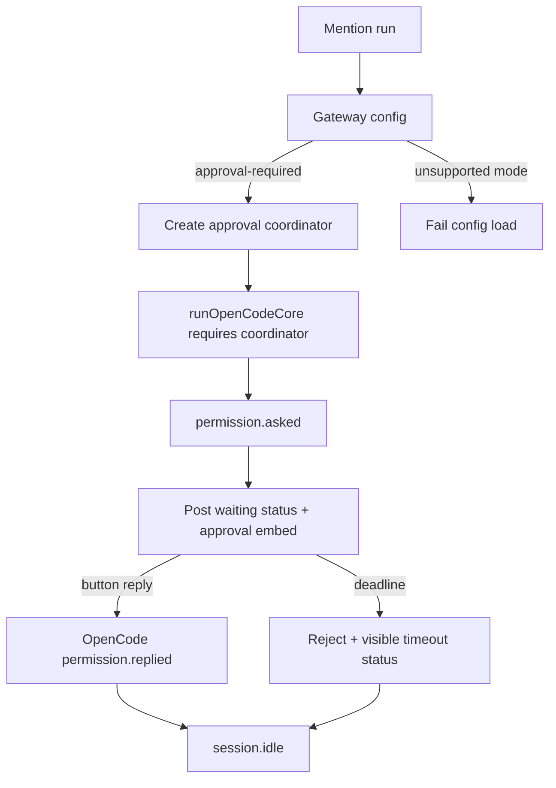

# fix: Gateway approval waits for unattended tool permissions

## Overview

Fix issue #787 by making the existing Gateway approval-required path fail closed and user-visible. The root cause is not a
missing coordinator: mention runs already wire the approval coordinator. The failure is that an unattended tool-using run
can wait on Discord approval until timeout and then flush `_(no output)_`, hiding that it was blocked on approval.

The safe scope is approval-required only. The earlier `autonomous-low-risk` direction is explicitly deferred because
OpenCode persisted `always` approvals can override session-scoped denies before the Gateway ever sees `permission.asked`.

## Problem Frame

Gateway mention runs can require tools. When OpenCode emits `permission.asked`, Gateway routes that event to Discord
approval UI and OpenCode blocks until the permission is answered. If nobody responds, the run waits until the approval
deadline or run timeout. Because no tool output has been produced yet, the final thread flush may render `_(no output)_`,
which hides the actual state: the run was waiting on tool approval.

The rejected unsafe approaches are global OpenCode permission pre-grants and session-scoped autonomous denies. Global
pre-grants bypass the S5 approval boundary across channels and can expose workspace secrets to auto-approved commands.
Session-scoped denies are also insufficient today because OpenCode evaluates persisted project approvals after session
rules with last-match-wins semantics, so an old `always` allow can still bypass the Gateway.

## Requirements Trace

- R1. Preserve approval-required behavior as the only supported Gateway approval mode.
- R2. Reject unsupported `GATEWAY_APPROVAL_MODE` values, including `autonomous-low-risk`, with a clear fail-closed error.
- R3. Require a permission coordinator before `runOpenCodeCore()` can create a session or prompt OpenCode.
- R4. Never globally or session-locally auto-approve `bash`, `edit`, `task`, or `external_directory`.
- R5. Show visible Discord status when a run is waiting for tool approval and when approval times out or is denied.
- R6. Base approval deadlines and the hard abort signal on the same remaining run budget.
- R7. Preserve the final `_(no output)_` fallback only for genuinely completed runs with no visible output/status.
- R8. Add regression guards that workspace OpenCode config merging does not synthesize high-risk permission grants.

## Scope Boundaries

- Do not enable autonomous mode in this PR.
- Do not mutate global/generated OpenCode config for approval policy.
- Do not change Discord approval button authorization semantics.
- Do not remove the existing S5 approval coordinator or registry lifecycle.
- Do not change action/runtime harness behavior; this is Gateway-scoped.

### Deferred to Separate Tasks

- Autonomous low-risk mode: requires upstream or architectural support to ignore/clear persisted project approvals for a
  Gateway-owned session before it can be safe.
- Broader workspace policy hardening: continue under existing workspace and egress-hardening issues.

## Context & Research

### Relevant Code and Patterns

- `packages/gateway/src/execute/run.ts` creates a per-run permission coordinator and passes it into `runOpenCodeCore()`.
- `packages/gateway/src/execute/run-core.ts` creates the OpenCode session, subscribes before prompting, and forwards
  `permission.asked` / `permission.replied` events.
- `packages/gateway/src/approvals/coordinator.ts` and `packages/gateway/src/approvals/registry.ts` own the approval
  lifecycle, deadline settlement, and authoritative `permission.replied` confirmation.
- `packages/gateway/src/config.ts` is the Gateway environment parsing surface for approval mode validation.
- `packages/gateway/src/discord/streaming.ts` owns Discord run-thread buffering and final empty-output flushing.
- `deploy/scripts/merge-config.mjs` merges OpenCode config overlays, model, plugin, and autoupdate; it must not grow
  approval pre-grants.

### Institutional Learnings

- S5 tool approval is single-owner and fail-closed: registry state is keyed by request ID, `permission.replied` is the
  authoritative settlement signal, and pending approval state is intentionally in-memory.
- OpenCode permission replies require the workspace `directory` query to affect the blocked session.
- Global config changes can leak privilege across repos, channels, and runs.

### External References

- OpenCode cloned source confirms `session.create` accepts `body.permission`, but permission evaluation also applies
  persisted project approvals after session rules.
- OpenCode permission rules use `{ permission, pattern, action }`; evaluation is last-match-wins and defaults to `ask` when
  no rule matches.

## Key Technical Decisions

- **Approval-required only:** Keep the existing S5 approval coordinator as the sole supported Gateway tool-permission path.
  Reject `autonomous-low-risk` until OpenCode can isolate Gateway sessions from persisted project approvals.
- **Coordinator required:** `runOpenCodeCore()` must fail before session creation if no coordinator is supplied. A missing
  coordinator is a safety-boundary violation, not a back-compat mode.
- **Visible approval state:** Waiting for approval is user-visible run state. The run thread should show waiting and timeout
  statuses so a blocked approval cannot collapse into a mysterious empty-output fallback.
- **Same budget origin:** Compute both the hard abort signal and approval deadline from the same remaining run budget.
- **No approval policy in config merge:** `deploy/scripts/merge-config.mjs` must preserve operator-supplied config but never
  synthesize hidden high-risk permission grants.

## Open Questions

### Resolved During Planning

- Is the coordinator missing? No. The current mention path creates the coordinator and passes it to `runOpenCodeCore()`.
- Is session-scoped autonomous mode safe? No. Persisted OpenCode project approvals can override session denies.
- Should autonomous mode be inferred from `coordinator === undefined`? No. Missing coordinator fails closed.

### Deferred to Implementation

- Exact Discord copy for waiting/timed-out status: keep terse, user-facing, and mention-safe while preserving the invariant
  that blocked approval is visible.

## High-Level Technical Design

> *This illustrates the intended approach and is directional guidance for review, not implementation specification. The implementing agent should treat it as context, not code to reproduce.*

## Implementation Units

- [x] **Unit 1: Approval-mode config guard**

**Goal:** Keep approval-required as the only supported mode and reject unsafe modes at startup.

**Requirements:** R1, R2, R4

**Dependencies:** None

**Files:**
- Modify: `packages/gateway/src/config.ts`
- Test: `packages/gateway/src/config.test.ts`

**Approach:**
- Parse `GATEWAY_APPROVAL_MODE` with default `approval-required`.
- Accept only `approval-required`.
- Reject `autonomous-low-risk` with a clear message explaining it is deferred because persisted OpenCode approvals can
  override session-scoped denies.
- Extend the config test environment cleanup/setup scaffold so the env var cannot leak between tests.

**Execution note:** Implement test-first because this is security-sensitive config behavior.

**Patterns to follow:**
- Strict parsing for `LOG_LEVEL`, `DISCORD_PRIVILEGED_INTENTS`, and numeric Gateway settings in
  `packages/gateway/src/config.ts`.

**Test scenarios:**
- Happy path: unset `GATEWAY_APPROVAL_MODE` loads `approval-required`.
- Happy path: `GATEWAY_APPROVAL_MODE=approval-required` loads `approval-required`.
- Error path: `GATEWAY_APPROVAL_MODE=autonomous-low-risk` rejects with a deferral/safety message.
- Error path: unknown approval mode rejects config loading with a clear error.
- Edge case: empty/whitespace value follows existing optional-secret semantics and uses the default.

**Verification:**
- Gateway config exposes only the supported mode, with unsafe/invalid values rejected before runtime.

- [x] **Unit 2: Coordinator-required core boundary**

**Goal:** Ensure OpenCode is never prompted from the Gateway without approval coordination.

**Requirements:** R1, R3, R4

**Dependencies:** Unit 1

**Files:**
- Modify: `packages/gateway/src/program.ts`
- Test: `packages/gateway/src/program.test.ts`
- Modify: `packages/gateway/src/execute/run.ts`
- Modify: `packages/gateway/src/execute/run-core.ts`
- Test: `packages/gateway/src/execute/run-core.test.ts`
- Test: `packages/gateway/src/execute/run.test.ts`

**Approach:**
- Thread `approval-required` explicitly from config through program/run wiring.
- Require `coordinator` in `runOpenCodeCore()` before session creation and prompt dispatch.
- Keep session creation free of `body.permission` approval overrides.

**Execution note:** Start with boundary tests that fail before `session.create`.

**Patterns to follow:**
- Existing session creation and permission routing tests in `packages/gateway/src/execute/run-core.test.ts`.
- Existing run wrapper tests in `packages/gateway/src/execute/run.test.ts`.

**Test scenarios:**
- Error path: missing coordinator fails before `session.create`.
- Error path: missing coordinator fails before `promptAsync`.
- Happy path: approval-required with coordinator forwards valid permission asks/replies.
- Integration: parsed Gateway mode propagates through program wiring into mention execution.
- Regression: no `body.permission` is injected into `session.create`.

**Verification:**
- No Gateway path can silently run OpenCode without approval coordination.

- [x] **Unit 3: Approval wait and timeout UX**

**Goal:** Make approval waits and deadline denials visible in the Discord run thread.

**Requirements:** R5, R6, R7

**Dependencies:** Unit 2

**Files:**
- Modify: `packages/gateway/src/execute/run.ts`
- Modify: `packages/gateway/src/discord/streaming.ts`
- Modify: `packages/gateway/src/approvals/registry.ts`
- Test: `packages/gateway/src/execute/run.test.ts`
- Test: `packages/gateway/src/discord/streaming.test.ts`
- Test: `packages/gateway/src/approvals/approval-flow.integration.test.ts`
- Test: `packages/gateway/src/approvals/registry.test.ts`

**Approach:**
- Compute hard abort and approval deadline from the same remaining budget.
- Post a waiting-for-approval status when a permission ask enters the approval flow.
- Mark the stream sink as having visible output when waiting status or the approval embed is visible.
- Render a timed-out/denied status when deadline settlement rejects the permission.
- Preserve final `_(no output)_` only when no visible status or assistant/tool output was produced.

**Execution note:** Add regression coverage for the issue symptom before changing status rendering.

**Patterns to follow:**
- Discord sink tests for empty output, long output, and `allowedMentions` in `packages/gateway/src/discord/streaming.test.ts`.
- Approval registry deadline tests in `packages/gateway/src/approvals/registry.test.ts`.

**Test scenarios:**
- Happy path: permission ask posts visible waiting status and approval UI without mentions.
- Error path: failed waiting-status send is caught/logged and does not create an unhandled rejection.
- Error path: deadline settlement renders timed-out/denied status.
- Edge case: successful approval embed suppresses misleading final no-output fallback even if waiting-status send failed.
- Edge case: genuinely completed empty run still flushes the existing no-output fallback.
- Integration: deadline uses remaining budget and is omitted when not enough run budget remains.

**Verification:**
- A user reading the Discord thread can distinguish “waiting on approval” from “completed with no output.”

- [x] **Unit 4: Unsafe-fix regression guards**

**Goal:** Prevent the rejected global-pregrant approach from returning.

**Requirements:** R4, R8

**Dependencies:** Units 1-3

**Files:**
- Test: `deploy/scripts/merge-config.test.mjs`

**Approach:**
- Extend existing plain Node ESM `node:test` coverage to prove overlay/model/plugin handling does not inject global
  permission grants.
- Cover high-risk keys such as `bash`, `edit`, and `external_directory` explicitly.

**Patterns to follow:**
- Existing `node:test` + `node:assert/strict` style in `deploy/scripts/merge-config.test.mjs`.

**Test scenarios:**
- Happy path: merge preserves existing permission fields only when explicitly supplied by the operator.
- Error path: merge does not synthesize global `bash`, `edit`, or `external_directory` allows.
- Edge case: model/plugin overlay behavior remains unchanged.

**Verification:**
- Workspace config merging cannot introduce approval policy behind the Gateway’s approval-required path.

## Test Map / Sequencing

- Start with `packages/gateway/src/config.test.ts` to pin env parsing and cleanup behavior.
- Then cover config propagation through `packages/gateway/src/program.test.ts` and `packages/gateway/src/execute/run.test.ts`.
- Then tighten `packages/gateway/src/execute/run-core.test.ts` around coordinator-required behavior.
- Then cover approval lifecycle UX with `packages/gateway/src/approvals/approval-flow.integration.test.ts` and focused
  registry tests where deadline settlement behavior changes.
- Keep `packages/gateway/src/discord/streaming.test.ts` focused on stream-sink invariants: empty-output fallback,
  mention-safety, and “visible approval status prevents misleading no-output fallback.”
- Finish with `deploy/scripts/merge-config.test.mjs` to guard against the rejected global-pregrant regression.

## System-Wide Impact

- **Interaction graph:** Gateway config flows into mention execution, OpenCode session creation, permission event handling,
  Discord approval UI, and final stream flush.
- **Error propagation:** Invalid configuration fails at startup; missing coordinator fails before OpenCode session creation;
  stream/runtime failures remain surfaced through existing run error handling.
- **State lifecycle risks:** Approval registry entries remain per run and request ID. Deadline timers must be disposed when a
  run ends so stale approvals do not outlive their session.
- **API surface parity:** `GATEWAY_APPROVAL_MODE` remains an operator environment variable, but only `approval-required` is
  supported in this PR.
- **Integration coverage:** Tests must cover both execution wrapper and core session creation because the safety property
  depends on mode/coordinator propagation across that boundary.
- **Unchanged invariants:** `permission.replied` remains authoritative for approval-required settlements; approval buttons
  still require existing Discord authorization; OpenCode config merge remains unrelated to approval policy; no path writes
  persistent OpenCode approval rules.

## Risks & Dependencies

| Risk | Mitigation |
|------|------------|
| Accidental global tool approval | Keep policy out of `deploy/scripts/merge-config.mjs`; add regression coverage. |
| Existing OpenCode `always` approvals bypass Gateway approval | Do not enable autonomous mode; document that global high-risk pre-grants are unsafe for Gateway approval semantics. |
| Approval timeout races hard run timeout | Compute deadline from remaining run budget and preserve minimum clearance. |
| Misleading no-output fallback | Mark visible approval statuses/embeds so final flush skips `_(no output)_`. |
| Mode plumbing drift | Pass mode explicitly through typed config/execution params and test the wrapper-to-core boundary. |

## Documentation / Operational Notes

- Document that Gateway defaults to approval-required behavior.
- Warn operators not to use global high-risk OpenCode permission pre-grants to work around approval waits.
- Document that `autonomous-low-risk` is deferred until OpenCode can isolate Gateway sessions from persisted approvals.

## Sources & References

- Issue: https://github.com/fro-bot/agent/issues/787
- Related execution code: `packages/gateway/src/execute/run.ts`
- Related core code: `packages/gateway/src/execute/run-core.ts`
- Approval coordinator: `packages/gateway/src/approvals/coordinator.ts`
- Approval registry: `packages/gateway/src/approvals/registry.ts`
- Discord stream sink: `packages/gateway/src/discord/streaming.ts`
- Gateway config: `packages/gateway/src/config.ts`
- Workspace config merger: `deploy/scripts/merge-config.mjs`
- OpenCode permission service: `.slim/clonedeps/repos/anomalyco__opencode/packages/opencode/src/permission/index.ts`
- OpenCode permission evaluation: `.slim/clonedeps/repos/anomalyco__opencode/packages/opencode/src/permission/evaluate.ts`
