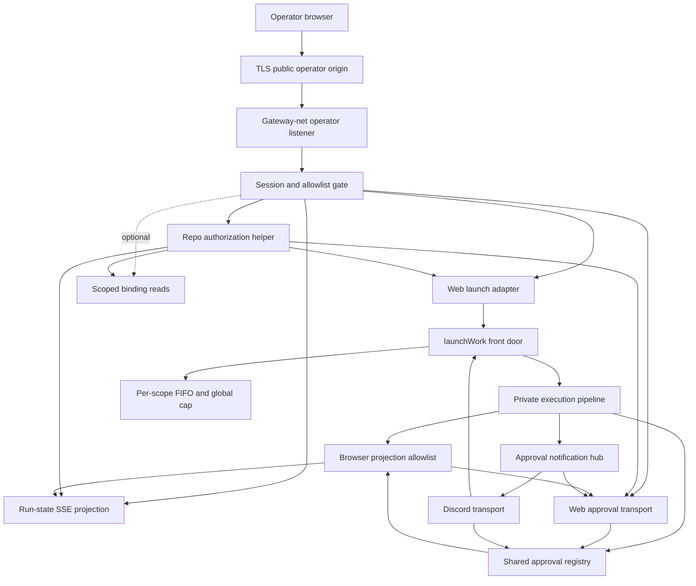

# Gateway web operator API surface

## Overview

Add the Gateway-side API surface that Phase A made possible: GitHub-authenticated allowlisted operators can launch work, observe run state, and approve or reject tool requests through the same execution and approval spine Discord already uses. The surface is browser-only in v1, uses server-side opaque sessions, preserves the gateway ingress/egress boundary, and leaves scoped read-only binding data as an optional Phase B.1 follow-up.

> **Operator-surface types are now owned by `packages/gateway/src/operator-contract/` (the frozen contract at `OPERATOR_CONTRACT_VERSION = '1.0.0'`).** Consuming units in this plan (launch, run-state, approvals) MUST import operator-surface types from that module, not re-declare them. The dashboard's `operator-client.ts` is a non-canonical downstream fixture; the contract barrel is the import authority.

> **S2 authority decision (ratified 2026-06-19, [#951](https://github.com/fro-bot/agent/issues/951); ADR: `docs/decisions/2026-06-19-s2-operator-auth-authority.md`).** This Gateway operator-auth surface is the **single S2 operator-auth authority**. The dashboard delegates interactive operator auth to it and maintains no parallel operator identity. The dashboard's read-only Arctic + signed-cookie session is **retired** (no transitional dual-session period), and the gateway's numeric-GitHub-user-ID allowlist is the **single allowlist source of truth**. Dashboard-side consuming work is tracked at `fro-bot/dashboard#53`.

## Problem Frame

The Gateway currently has two proven control paths: Discord commands/mentions for launching work and Discord buttons for OpenCode approvals. Phase A extracted `launchWork`, transport-neutral sinks, and the generalized approval registry so another transport can use the same queue, concurrency cap, shutdown handoff, and fail-closed approval gate.

The missing piece is the authenticated browser-facing API. The existing HTTP announce listener is HMAC-authenticated machine ingress and is reachable from the workspace network, so it is the wrong trust boundary for human operator control. Phase B adds a separate operator API surface with real human auth, browser-origin protection, redacted run observation, and shared approval settlement. The dashboard UI remains a separate repo; this plan is complete when the Gateway API is ready and a minimal smoke client proves the operator flow end-to-end.

## Requirements Trace

- R1. Only GitHub-authenticated humans present in a configured operator allowlist can use the web surface.
- R2. Operator sessions have explicit lifetime, logout, and revocation semantics.
- R3. State-changing browser requests are protected against CSRF and invalid origins.
- R4. Auth failures are coarse to users and structured internally.
- R5. v1 excludes standalone machine/API callers, long-lived API tokens, and agent-to-agent orchestration.
- R6. Web-launched work enters the same public execution front door used by Discord-launched work.
- R7. Web approvals settle through the same fail-closed approval registry used by Discord approvals.
- R8. Approval settlement remains single-winner across transports, stale tabs, retries, and replayed submissions.
- R9. Approval states distinguish pending, already-settled, expired, failed-to-settle, and unavailable cases.
- R10. Web launch prevents accidental duplicate submissions and surfaces empty, unbound, or disabled repo states before work starts.
- R11. Run observation exposes a bounded status taxonomy.
- R12. Run progress uses a safe-field allowlist and never exposes raw workspace paths, tool arguments, prompts, internal URLs, tokens, or secret-bearing payloads.
- R13. The control surface preserves the Gateway ingress and egress boundary.
- R14. Operator actions are attributable to stable operator identity.
- R15. User-facing errors stay coarse while internal logs retain structured diagnostic context.
- R16. Audit records for auth, launch, approval, rejection, and authorization failures have a defined retention and protection story.
- R17. Logs avoid raw prompts, request bodies, bearer tokens, session secrets, raw tool payloads, and internal URLs.
- R18. Optional Phase B.1 may expose read-only Gateway binding data needed for operator repo selection or dashboard state.
- R19. If binding reads ship, they are scoped so an allowed operator cannot enumerate unrelated repositories by default.
- R20. Binding writes, binding deletes, repo onboarding, and binding repair stay out of Phase B v1 and Phase B.1.

## Scope Boundaries

- No machine/API callers in v1.
- No agent-to-agent orchestration.
- No dashboard UI implementation in this repo.
- No binding reads in core Phase B unless explicitly pulled in; no binding writes, deletes, onboarding, or repair from the web surface.
- No raw Gateway, workspace, or OpenCode API proxy.
- No Discord behavior changes.
- No weakening of the ingress-pin boundary without a documented security rationale and matching tests.
- No persistent approval recovery beyond the existing registry lifetime unless implementation discovers it is required for correctness.

### Deferred to Separate Tasks

- Dashboard UI integration in `fro-bot/dashboard` consumes the Gateway surface after the Gateway API exists. Per the S2 authority decision (`docs/decisions/2026-06-19-s2-operator-auth-authority.md`), the dashboard rides the gateway operator session for all auth (read and interactive), retires its Arctic + signed-cookie session, and keeps no independent allowlist. Tracked at `fro-bot/dashboard#53`.
- Operator-complete UX ships in the dashboard repo after this API is available; this plan proves the flow through API/smoke coverage, not production UI screens.
- Machine/API caller support gets a separate token, replay, rate-limit, and audit design.
- Hot-reloadable or remote operator allowlist management can follow the file-backed v1 allowlist.
- WebSocket support is deferred unless SSE proves insufficient.
- Web run cancellation is deferred. The web API can observe `cancelled` when existing timeout/shutdown paths produce it, but `POST /operator/runs/:runId/cancel` is not in v1.
- Compound/refresh docs should reframe Discord as one transport after the web transport ships.

## Terminology

- **Public operator origin:** Browser-visible HTTPS origin exposed by infra reverse proxy and used for OAuth callback, cookies, CORS, and CSRF.
- **Reverse proxy:** Infra-owned TLS terminator that forwards same-origin operator traffic to the Gateway over `gateway-net`; it must not buffer SSE responses.
- **Operator listener:** Internal Gateway HTTP listener bound only to the gateway-net address/port.
- **Dashboard UI:** Separate repo/client that may later consume this API through the public operator origin; not implemented here.

## Context & Research

### Relevant Code and Patterns

- `packages/gateway/src/execute/run.ts` exports `launchWork` as the queue/cap-preserving front door; the inner execution primitive stays private.
- `packages/gateway/src/execute/launch-types.ts` defines `LaunchWorkRequest`, `StatusSink`, `ReplySink`, and `WebOperatorIdentity`.
- `packages/gateway/src/approvals/registry.ts` already defines `WebOperatorActor` and `handleDecision`; web approvals should call this same registry.
- `packages/gateway/src/approvals/discord-transport.ts` is the transport reference for render/register/settle behavior.
- `packages/gateway/src/http/server.ts` and `packages/gateway/src/http/hmac.ts` are the announce-ingress pattern, but browser auth must be a sibling surface, not HMAC reuse.
- `packages/gateway/src/http/ingress-pin.test.ts` pins the current ingress surface and must be updated deliberately with topology rationale.
- `deploy/compose.yaml`, `deploy/validate-stack.sh`, and `deploy/README.md` encode the workspace egress boundary.
- `packages/gateway/src/bindings/store.ts` provides the read operations needed for scoped binding reads.
- `packages/runtime/src/coordination/types.ts` and `packages/runtime/src/coordination/run-state.ts` define the shared `Surface` and run-state validator that must learn the web surface.

### Institutional Learnings

- `docs/solutions/best-practices/gateway-control-surface-spine-2026-06-15.md`: new transports must use the public front door and shared approval gate; do not export the private execution primitive.
- `docs/solutions/best-practices/signed-webhook-ingress-hardening-2026-05-29.md`: use no-oracle auth failures, bounded body handling, socket-keyed limits, and captured-logger redaction tests.
- `docs/solutions/best-practices/compose-topology-egress-guard-hardening-2026-06-14.md`: topology guards must match normalized Compose output and fail closed with positive controls.
- `docs/solutions/best-practices/atomic-serial-channel-queue-handoff-2026-06-09.md`: route every launch through the existing FIFO and shutdown handoff.
- `docs/solutions/best-practices/gateway-opencode-mention-loop-best-practices-2026-05-30.md`: stream EOF before terminal signal is failure, flush partial output before coarse failure, and clean up every long-lived resource in `finally`.
- `docs/solutions/best-practices/effect-failure-channel-discipline-2026-06-10.md`: user-visible boundaries must catch defects and interruptions without hanging.
- `docs/solutions/best-practices/centralize-s3-key-identity-construction-2026-06-09.md`: new audit/session key families need centralized builders and exact-key tests.

### External References

- OWASP Session Management Cheat Sheet: server-side session state, secure cookies, explicit logout/revocation.
- OWASP CSRF Prevention Cheat Sheet: SameSite cookies, origin checks, Fetch Metadata, signed double-submit tokens for defense in depth.
- OWASP Logging Cheat Sheet: structured security events with sensitive-field exclusion.
- GitHub App user-to-server auth docs: use state and PKCE, validate the GitHub user server-side, prefer stable numeric user IDs over mutable logins.
- Hono 4.12 docs: `hono/cookie`, `hono/secure-headers`, `hono/csrf`, `hono/streaming`, and typed middleware composition.

## Key Technical Decisions

- **GitHub App OAuth with PKCE and state:** Use GitHub user-to-server auth for human login and identify operators by stable numeric GitHub user ID plus display login for logs. OAuth App/device-flow/token-only approaches are not the v1 path.
- **Server-side opaque sessions:** Store an opaque session ID server-side and put only the lookup key in a secure `__Host-` cookie. This preserves logout and revocation semantics; stateless JWT or encrypted-cookie-only sessions are rejected for v1.
- **Session lifetime and revocation:** v1 sessions have an 8-hour absolute lifetime and 30-minute idle timeout. Revocation is immediate for future requests and active SSE streams; in-flight approval decisions already accepted by `handleDecision` continue to settlement and are not rolled back.
- **File-backed configured allowlist for v1:** Load an explicit operator allowlist from hardened config/file plumbing and check it on every authenticated request. Hot reload can be added later; restart-based changes are acceptable for v1 if documented.
- **SSE for run observation:** Use SSE for one-way run state/output/progress with keepalive, disconnect cleanup, and replay from a bounded in-memory ring buffer. WebSocket is deferred until bidirectional browser control is needed.
- **Dedicated operator trust boundary:** Add a separate operator listener bound to the gateway-net interface, not `0.0.0.0`. The v1 browser ingress path is TLS termination at infra reverse proxy on the public operator origin → plain HTTP over gateway-net to the Gateway operator listener. The operator listener is not published directly to the host and is not reachable from sandbox-net.
- **Reject announce-listener reuse:** Do not add operator routes to the existing HMAC announce listener. That listener is workspace-reachable by design, so extending it would collapse defense in depth to app-layer auth only.
- **Same-origin operator cookie posture:** `GATEWAY_OPERATOR_PUBLIC_ORIGIN` defines the browser origin for OAuth callbacks, cookies, CORS, and CSRF. v1 requires same-origin deployment for credentialed browser calls; a separate dashboard origin must proxy through the same public origin rather than relying on cross-site cookies.
- **Central repo authorization helper:** Every launch, run-state, approval, and binding-read path uses one operator-to-repository authorization helper. The v1 rule is allowlisted GitHub numeric user plus verified GitHub read access to the target repo, cached briefly and denied on lookup failure.
- **Canonical server-side run/approval ownership:** Browser routes keyed by `runId` or `requestId` must resolve server-side to canonical run, repo, channel/scope, and approval state before disclosure or settlement. Never trust browser-supplied owner/repo context for run or approval access decisions.
- **Approval notification hub:** Add a transport-neutral approval notification/fanout seam so pending approvals are registered once, then exposed to Discord and web subscribers through the same registry state. The registry remains canonical for lifecycle, expiry, and snapshot truth; the hub is projection/fanout only.
- **Single-process settlement assumption:** v1 approval settlement relies on one Gateway process. The in-memory registry claim transition is single-winner inside one process; multi-replica Gateway requires a persistent compare-and-swap or equivalent distributed claim before this API can scale horizontally.
- **Shared execution and approval spine:** Web launch calls `launchWork`; web approvals call the same `ApprovalRegistry.handleDecision`. No web-specific execution loop, queue, or approval registry exists.
- **Safe projections for browser data:** Browser run state and binding data are projected through allowlists. Raw prompts, raw tool args, workspace paths, internal URLs, and bearer/session values are never included.
- **Scoped read-only binding support:** Treat binding reads as Phase B.1 unless the core API remains reviewable. Binding mutation remains Discord/operator-command territory.

## Open Questions

### Resolved During Planning

- **State transport:** SSE is the v1 plan because the flow is server-to-browser and needs simple reconnect semantics, not bidirectional low-latency control.
- **Session class:** Server-side opaque sessions are required because revocation is a requirement.
- **Bindings delivery:** Binding reads ride the same authenticated surface as a scoped read-only capability.
- **Machine callers:** Out of v1; any bearer-token/API mode gets a separate design.

### Deferred to Implementation

- **Exact session store backend:** Implement the server-side session store behind a small interface; v1 uses a bounded in-memory store with scavenging if the single-process assumption remains true. Gateway restart means global logout and clears sessions/idempotency state.
- **OAuth registration details:** Callback URLs, App registration location, and environment-specific secrets are deployment setup details.
- **Run-state projection fields:** Implementers choose the minimal safe event payloads while preserving the safe-field constraints.

## Browser-Facing API Contract

This table pins the minimum Gateway contract the dashboard can build against. Route names are allowed to move during implementation only if the same capability, auth requirement, and state union remain documented.

| Capability | Method / path | Input | Success shape | Coarse failures | Auth / CSRF |
|---|---|---|---|---|---|
| Start login | `GET /operator/auth/github/start` | optional return path | redirect to GitHub | generic auth failure | no session, state cookie |
| OAuth callback | `GET /operator/auth/github/callback` | GitHub `code`, `state` | session cookie + redirect | generic auth failure | state + PKCE |
| Current session | `GET /operator/session` | none | operator id/login + expiry | unauthorized | session |
| CSRF token refresh | `GET /operator/session/csrf` | none | signed double-submit token metadata | unauthorized | session |
| Logout | `POST /operator/session/logout` | none | logged out | unauthorized | session + CSRF/origin |
| Launch work | `POST /operator/runs` | owner, repo, prompt, idempotency key | run id + initial status | unauthorized, blocked, invalid, queue rejected | session + repo authz + CSRF/origin |
| Run snapshot | `GET /operator/runs/:runId` | run id | safe run projection | unauthorized, not found | session + repo authz |
| Run stream | `GET /operator/runs/:runId/stream` | optional last event id | SSE events from safe projection | unauthorized, not found | session + repo authz |
| Pending approvals | `GET /operator/approvals` | optional run id | pending approval summaries from canonical registry/hub state | unauthorized | session + server-side run→repo authz |
| Approval decision | `POST /operator/approvals/:requestId/decision` | decision, approval scope, idempotency key | `claimed`, `already_settled`, `expired`, or `failed_to_settle` state | unauthorized, expired, stale, scope mismatch | session + server-side approval→run→repo authz + CSRF/origin |

Browser state unions are intentionally small: run status is `queued`, `running`, `waiting_for_approval`, `blocked`, `failed`, `cancelled`, or `succeeded`; approval status is `pending`, `claimed`, `already_settled`, `expired`, `failed_to_settle`, or `unavailable`. Decision POST claims a pending approval and returns the claim/settlement state; final permission-reply confirmation and any later `failed_to_settle` state are observed through SSE or the pending-approval read path. Same idempotency key retries return the original decision outcome, different-key retries by the same operator return the current canonical state, and different operators after a claim receive `already_settled`/claimed-by metadata without changing the outcome.

The OAuth start return path is same-origin only and path-allowlisted. Absolute URLs, cross-origin targets, and unregistered paths are rejected before OAuth state is minted; the accepted return path is bound into server-side OAuth state.

### Approval State Mapping

| Registry truth | Decision response | SSE/read event | Operator-facing meaning |
|---|---|---|---|
| open pending entry | `claimed` when current operator wins | `approval.pending`, then `approval.claimed` | approval accepted; waiting for OpenCode confirmation |
| already claimed/settled | `already_settled` | latest settled event | someone already decided this request |
| deadline passed | `expired` | `approval.expired` | the request timed out and failed closed |
| claim accepted but reply cannot settle safely | `failed_to_settle` | `approval.failed_to_settle` | Gateway could not complete the approval safely |
| no canonical entry | `unavailable` | none | request no longer exists or is not visible to this operator |

### SSE Event Contract

| Event | Emitted when | Required safe fields |
|---|---|---|
| `run.state` | run status changes | run id, web status, canonical phase when present, timestamp |
| `run.output` | redacted/truncated text delta passes the output-safety pipeline | run id, text, truncated flag |
| `run.error` | non-terminal coarse error occurs | run id, bounded code, coarse description |
| `approval.pending` | registry accepts a pending permission request | request id, run id, safe summary, approval scope |
| `approval.claimed` | a decision claim is accepted | request id, run id, actor display metadata, timestamp |
| `approval.confirmed` | OpenCode confirms `permission.replied` | request id, run id, outcome, settled-by metadata |
| `approval.expired` | deadline fail-closes an approval | request id, run id, deadline metadata |
| `approval.failed_to_settle` | claim/reply path fails and cannot reopen safely | request id, run id, coarse reason |
| `heartbeat` | keepalive interval elapses | timestamp |

### Run Status Projection

| Web status | Source | Canonical phase |
|---|---|---|
| `queued` | in-memory queue before execution starts | none yet |
| `blocked` | pre-execution rejection such as lock held, queue rejected, workspace unavailable, binding disabled | none yet |
| `running` | acknowledged or executing run without pending approval | `ACKNOWLEDGED` or `EXECUTING` |
| `waiting_for_approval` | executing run with pending approval in the registry | `EXECUTING` plus registry pending state |
| `succeeded` | completed run | `COMPLETED` |
| `failed` | failed run | `FAILED` |
| `cancelled` | timeout/shutdown cancellation | `CANCELLED` |

`waiting_for_approval` is a transient sub-state derived from the in-memory approval registry. The snapshot endpoint reads both canonical run state and registry pending state for live runs.

Raw tool stdout/stderr is not browser-safe by default. Core Phase B may ship coarse status-only observation first; `run.output` is allowed only after explicit redaction/truncation tests prove the projection excludes secrets, internal URLs, prompts, raw tool args, and workspace paths.

### Browser Flow and Consumer Contract

1. Browser opens the public operator origin and checks `GET /operator/session`.
2. If unauthenticated, browser starts GitHub OAuth and returns to a same-origin allowlisted path.
3. Authenticated browser refreshes CSRF token, selects a repo/task, and submits launch with an idempotency key.
4. Browser snapshots the run and opens SSE; snapshot is authoritative on reconnect reset.
5. When approval is pending, browser shows an approval card, posts a decision with idempotency key, then waits for SSE/read confirmation.
6. Browser handles session expiry/revocation by closing streams, clearing local state, and returning to login.

Dashboard consumers should treat the snapshot as authoritative and SSE as incremental. If `Last-Event-ID` falls outside the replay window, the stream emits reset and the client re-reads the snapshot. Browser-visible labels must translate backend states into operator language; implementation terms such as `failed_to_settle` should map to short, coarse copy in the dashboard handoff.

### Abuse Controls

| Tier | Keyed by | Default limit | Applies to |
|---|---|---|---|
| Unauthenticated burst | socket IP | 20/minute | OAuth start/callback, unauthenticated session checks |
| Authenticated read | session or operator id | 120/minute | session, CSRF refresh, approval list, run snapshot, binding reads |
| Launch | operator id | 3/minute and 10/hour | launch work |
| Approval decision | operator id | 20/minute | approval decision POST |
| SSE connections | operator id | 5 concurrent | run stream |
| SSE reconnect | operator id + run id | 3/minute | reconnect with last event id |

All 429 responses include `Retry-After`. Launch and approval tiers should use sliding windows; lower-risk read tiers may reuse the existing fixed-window limiter if tests pin the boundary behavior.

## High-Level Technical Design

> *This illustrates the intended approach and is directional guidance for review, not implementation specification. The implementing agent should treat it as context, not code to reproduce.*

The web listener is an adapter layer. It authenticates the operator, projects safe data to the browser, and translates browser actions into existing Gateway primitives. All data crossing into browser-visible routes or SSE passes through the projection allowlist before serialization. The execution and approval trust anchors remain shared with Discord.

## Implementation Units

- [x] **Unit 0: Characterization and current-state guardrails**

  **Goal:** Prove Phase A seams and existing Gateway behavior are stable before adding the web surface.

  **Requirements:** R6, R7, R13

  **Dependencies:** None

  **Files:**
  - Test: `packages/gateway/src/execute/run.test.ts`
  - Test: `packages/gateway/src/approvals/registry.test.ts`
  - Test: `packages/gateway/src/http/ingress-pin.test.ts`

  **Approach:**
  - Add or verify static tests that the private execution primitive is not exported and every non-Discord caller goes through `launchWork`.
  - Confirm existing Discord launch, approval, queue, and ingress-pin tests still express the invariants Phase B depends on.

  **Execution note:** Characterization-first; do not modify behavior until these tests describe the current contract.

  **Patterns to follow:**
  - Phase A characterization tests in `packages/gateway/src/execute/run.test.ts`.
  - Spine pattern doc rule: public front door, private inner primitive.

  **Test scenarios:**
  - Integration: Discord mention path still calls the shared front door and preserves queue/cap behavior.
  - Static guard: the private execution primitive is not exported from `packages/gateway/src/execute/run.ts`.
  - Static guard: existing ingress route inventory is unchanged before the operator listener unit.

  **Verification:**
  - Existing gateway launch, approval, and ingress tests pass on the unmodified behavioral path.

- [x] **Unit 1: Shared surface and run-state widening**

  **Goal:** Teach shared coordination types that web is a first-class Gateway surface without changing behavior.

  **Requirements:** R6, R11, R14

  **Dependencies:** Unit 0

  **Files:**
  - Modify: `packages/runtime/src/coordination/types.ts`
  - Modify: `packages/runtime/src/coordination/run-state.ts`
  - Modify: `packages/runtime/src/coordination/run-state.test.ts`
  - Modify: `packages/runtime/src/coordination/lock.ts`
  - Modify: `packages/gateway/src/execute/launch-types.ts`
  - Modify: `packages/gateway/src/execute/run.ts`
  - Test: `packages/runtime/src/coordination/run-state.test.ts`
  - Test: `packages/gateway/src/execute/run.test.ts`

  **Approach:**
  - Widen the runtime `Surface` union and validator to include `web`.
  - Remove any casts that only existed because the runtime type did not yet recognize the web surface.
  - Extend `WebOperatorIdentity` and `WebOperatorActor` to carry stable GitHub numeric ID and display login in addition to the opaque operator/session correlation value.
  - Add approval transport selection to the execution spine so Discord remains the default transport and web can inject the notification hub/web transport without hardwiring Discord inside `launchWork`.

  **Patterns to follow:**
  - Existing `Surface` validation in `packages/runtime/src/coordination/run-state.ts`.
  - Existing discriminated unions in `packages/gateway/src/execute/launch-types.ts` and `packages/gateway/src/approvals/registry.ts`.

  **Test scenarios:**
  - Happy path: a run state with `surface: 'web'` validates.
  - Regression: existing `github` and `discord` surfaces still validate.
  - Error path: an unknown surface is still rejected by the validator.
  - Integration: gateway launch tests compile without unsafe casts for the web surface.
  - Integration: Discord approval behavior remains unchanged when no web approval transport is configured.

  **Verification:**
  - Runtime and gateway typechecks pass.
  - No `as any`, `@ts-ignore`, or broad `unknown as` casts are introduced.

- [x] **Unit 2: Operator listener topology and security pin**

  **Goal:** Add the operator web listener skeleton and deployment guardrails without exposing privileged behavior yet.

  **Requirements:** R3, R4, R13, R15, R17

  **Dependencies:** Unit 1

  **Files:**
  - Create: `packages/gateway/src/web/server.ts`
  - Create: `packages/gateway/src/web/safe-response.ts`
  - Modify: `packages/gateway/src/http/ingress-pin.test.ts`
  - Modify: `packages/gateway/src/config.ts`
  - Modify: `packages/gateway/src/program.ts`
  - Modify: `packages/gateway/src/shutdown.ts`
  - Modify: `deploy/compose.yaml`
  - Modify: `deploy/validate-stack.sh`
  - Modify: `deploy/validate-stack.test.sh`
  - Modify: `deploy/README.md`
  - Test: `packages/gateway/src/web/server.test.ts`
  - Test: `packages/gateway/src/http/ingress-pin.test.ts`

  **Approach:**
  - Add a Hono app factory and server lifecycle for the operator surface with a health route and no privileged routes yet.
  - Bind the listener to a configured operator bind host on the gateway-net interface. Do not bind the operator surface to `0.0.0.0` or the sandbox-net address.
  - Document and validate the public ingress path: TLS-terminating infra reverse proxy at `GATEWAY_OPERATOR_PUBLIC_ORIGIN` forwards to the gateway-net operator bind host/port. Gateway does not terminate TLS in v1.
  - Trust proxy headers only from the configured reverse proxy path; document why this differs from announce ingress and reject untrusted forwarded-host/proto combinations.
  - Validate the bind host against the gateway-net CIDR or explicit configured address; reject `0.0.0.0`, `127.0.0.1`, and sandbox-net addresses for production operator listener config.
  - Require same-origin credentialed browser calls; if the dashboard UI is hosted elsewhere, it must proxy through the operator public origin.
  - Wire config as opt-in: if required operator-web config is absent, the listener stays disabled.
  - Update ingress-pin tests from “exactly one route” to an explicit per-surface inventory: announce remains workspace-safe; operator routes are pinned to `buildOperatorApp`; no route appears in both or in neither inventory.
  - Use the existing `gateway-net`; do not add a new network unless implementation proves the reverse proxy topology requires one.
  - Update deploy topology validation so the operator bind host is not on sandbox-net and Compose hardening still sweeps all services.
  - Route all responses through a safe response helper to keep auth failures no-oracle and logs redacted.
  - Add body-size limits, unauthenticated socket-keyed limits, and route timeouts before adding privileged behavior.
  - Establish shared abuse-control primitives and listener-level body/timeout guards. Route-specific throttles land with the units that introduce those routes.

  **Patterns to follow:**
  - Announce server lifecycle in `packages/gateway/src/http/server.ts`.
  - Hardened config readers in `packages/gateway/src/config.ts`.
  - Topology validation patterns in `deploy/validate-stack.sh`.

  **Test scenarios:**
  - Happy path: operator listener starts only when all required config is present.
  - Error path: partial operator listener config fails closed during startup.
  - Security: ingress-pin test documents both announce and operator surfaces and fails on unregistered privileged routes.
  - Security: deploy validation rejects `0.0.0.0`, sandbox-net, or missing bind-host topology for the operator listener.
  - Security: deploy validation verifies the configured operator public origin and reverse-proxy/bind-host relationship is present when the listener is enabled.
  - Security: a sandbox-net-originated request cannot reach or is rejected by the operator listener positive ingress control.
  - Security: unauthenticated floods hit socket-keyed rate limits and bounded body handling before expensive work.
  - Shutdown: closing the Gateway closes the operator server without hanging active handles.

  **Verification:**
  - Gateway tests cover listener opt-in/out and ingress inventory.
  - Deploy validation tests cover the new topology with positive and negative controls.

- [x] **Unit 3a: Config + operator route guardrail seam**

  **Goal:** Establish the config plumbing and a mechanical route-wrapper that makes it structurally impossible for new privileged operator routes to skip rate-limiting, auth, origin, or CSRF checks.

  **Requirements:** R1, R3, R4, R13

  **Dependencies:** Unit 2

  **Files:**
  - Modify: `packages/gateway/src/config.ts`
  - Create: `packages/gateway/src/web/operator-route.ts`
  - Create: `packages/gateway/src/web/operator-route.test.ts`
  - Modify: `packages/gateway/src/web/server.ts`

  **Approach:**
  - Add config keys for `GATEWAY_OPERATOR_PUBLIC_ORIGIN`, GitHub App OAuth client id/secret, allowlist path, session secret, and CSRF signing key. Validate `GATEWAY_OPERATOR_PUBLIC_ORIGIN` as a canonical origin only: scheme + host + optional port, no path, query, hash, or userinfo component. Reject any value that does not parse as a valid `URL` with an empty pathname, no search, no hash, and no username/password.
  - Add a `registerOperatorRoute` wrapper (or equivalent Hono middleware chain factory) that every privileged operator route must use. The wrapper enforces, in order: body-size limit, socket-keyed unauthenticated rate limit, session validation, Host/Origin/public-origin check, Fetch Metadata rejection, and CSRF verification for mutating methods. New routes that skip the wrapper fail a static test.
  - Add a static test that enumerates all registered operator routes and asserts each one is wrapped; this is the mechanical guard that prevents future omissions.
  - Use `readSecret` and hardened file/env helpers already in `packages/gateway/src/config.ts`.

  **Patterns to follow:**
  - Hardened config readers in `packages/gateway/src/config.ts`.
  - Announce server lifecycle in `packages/gateway/src/http/server.ts`.

  **Test scenarios:**
  - Config: `GATEWAY_OPERATOR_PUBLIC_ORIGIN` with a path, query, hash, or userinfo component is rejected at startup.
  - Config: a valid canonical origin (`https://ops.example.com`) is accepted.
  - Static guard: a route registered without the wrapper causes the static test to fail.
  - Static guard: all routes registered through the wrapper pass the static test.

  **Verification:**
  - Config validation and route-wrapper tests pass; no operator route can be added without the guardrail.

- [x] **Unit 3b: Audit seam and redaction guarantees**

  **Goal:** Add a single typed audit seam for security-critical events so all subsequent units can emit structured, redacted audit records without duplicating sink logic.

  **Requirements:** R4, R14, R16, R17

  **Dependencies:** Unit 3a

  **Files:**
  - Create: `packages/gateway/src/web/audit.ts`
  - Create: `packages/gateway/src/web/audit.test.ts`

  **Approach:**
  - Define a typed `AuditEvent` discriminated union covering: `auth.start`, `auth.callback.success`, `auth.callback.failure`, `auth.logout`, `auth.revocation`, `authz.denied`, `launch.accepted`, `launch.rejected`, `approval.decision`, `approval.rejected`, `binding.read`, `bearer.rejected`.
  - Implement a single `emitAudit(event, logger)` function. Route success is reported only after the local audit sink accepts the event; downstream export may be asynchronous.
  - Redaction: audit records must never include cookies, session secrets, GitHub tokens, raw request bodies, prompts, bearer values, or internal URLs. Add captured-log tests that assert these fields are absent from emitted records.
  - Treat Gateway restart as clearing all in-flight audit state; durable export is a deployment concern.
  - Audit retention: structured gateway logs are acceptable for v1 if deployment guarantees 30-day retention, access control, and redaction posture.

  **Patterns to follow:**
  - Logger redaction conventions in gateway tests.
  - `docs/solutions/best-practices/signed-webhook-ingress-hardening-2026-05-29.md` redaction test patterns.

  **Test scenarios:**
  - Happy path: each event variant emits a structured record with the expected typed fields.
  - Security: captured log output for every event variant contains no cookie, secret, token, prompt, or bearer value.
  - Security: `bearer.rejected` event records the rejection without logging the credential value.

  **Verification:**
  - Audit seam is typed, redacted, and covered by captured-log tests.

- [x] **Unit 3c: GitHub OAuth state + PKCE identity verification**

  **Goal:** Implement the GitHub App user OAuth web flow with PKCE S256 and state so the callback can verify human identity before any session is minted.

  **Requirements:** R1, R4, R5, R14

  **Dependencies:** Unit 3b

  **Files:**
  - Create: `packages/gateway/src/web/auth/github.ts`
  - Create: `packages/gateway/src/web/auth/github.test.ts`
  - Modify: `packages/gateway/src/web/server.ts`

  **Approach:**
  - Implement `GET /operator/auth/github/start`: generate a PKCE S256 code verifier (server-side only, never in a cookie), derive the code challenge, generate a cryptographic state value, store `{ codeVerifier, redirectTarget, issuedAt, consumed: false }` server-side with a short TTL and a cap on outstanding attempts per socket. Redirect to GitHub with `state`, `code_challenge`, and `code_challenge_method=S256`.
  - Implement `GET /operator/auth/github/callback`: validate `state` (constant-time comparison, one-time consumption, TTL check), exchange `code` for a GitHub access token using the stored `codeVerifier` in the PKCE exchange. PKCE is not optional and is not a deploy-time detail.
  - After token exchange, fetch the authenticated GitHub user and extract the stable numeric `id`. The numeric `id` is the authority for all subsequent identity checks; `login` is display metadata only.
  - Bind and validate the OAuth return path as same-origin/path-allowlisted; reject absolute URLs and cross-origin redirects before OAuth state is minted.
  - The OAuth callback route must be narrowly exempted from strict Fetch Metadata cross-site rejection (GitHub redirects cross-site); all other operator routes remain subject to full Fetch Metadata enforcement.
  - Emit `auth.callback.success` or `auth.callback.failure` audit events via the Unit 3b seam.
  - Repo authorization must verify human user access using the user OAuth token, not only app installation auth.

  **Patterns to follow:**
  - GitHub App user-to-server auth docs: PKCE S256/state flow.
  - No-oracle auth failure behavior from signed webhook ingress.

  **Test scenarios:**
  - Happy path: valid state + PKCE exchange returns the numeric GitHub user id and display login.
  - Error path: invalid state, replayed state, expired state, PKCE verifier mismatch, and oversized verifier records all fail closed and emit audit without leaking specifics.
  - Error path: absolute URL or cross-origin redirect target in state is rejected before OAuth state is minted.
  - Security: code verifier is never written to a cookie or included in any browser-visible response.
  - Security: every auth failure branch returns the same coarse response shape.
  - Security: OAuth callback is narrowly exempted from Fetch Metadata cross-site rejection; other routes are not.

  **Verification:**
  - OAuth flow is PKCE-enforced, state-validated, and identity-anchored to stable numeric GitHub id.

- [x] **Unit 3d: Session store, cookies, logout, and revocation hook**

  **Goal:** Mint server-side opaque sessions after successful identity verification, enforce session lifetime and revocation, and provide the logout route.

  **Requirements:** R2, R4, R14

  **Dependencies:** Unit 3c

  **Files:**
  - Create: `packages/gateway/src/web/auth/session.ts`
  - Create: `packages/gateway/src/web/auth/session.test.ts`
  - Modify: `packages/gateway/src/web/server.ts`

  **Approach:**
  - v1 session store owns `create`, `get`, `touch`, `delete`, enforces 8-hour absolute and 30-minute idle expiry, scavenges expired entries, and caps stored sessions.
  - Session IDs have at least 128 bits of CSPRNG entropy (preferably 256 bits); comparisons are constant-time.
  - Store the session ID in a `__Host-` cookie: `HttpOnly`, `Secure`, `SameSite=Lax`, `Path=/`, no `Domain` attribute.
  - Always mint a fresh session ID after successful OAuth callback and clear any stale pre-auth cookie to prevent session fixation.
  - Revocation is immediate for future requests; in-flight approval decisions already accepted by `handleDecision` continue to settlement and are not rolled back.
  - Treat Gateway restart as global logout for v1: all sessions, CSRF tokens, idempotency records, and SSE subscriptions are gone. Browser clients must re-authenticate and snapshot-read after reconnect.
  - Expose a revocation hook so SSE streams can be notified within one heartbeat/auth-check interval when a session is revoked.

  **Patterns to follow:**
  - `readSecret` and related file/env helpers in `packages/gateway/src/config.ts`.
  - `userIsAuthorized` fail-closed posture in `packages/gateway/src/discord/mentions.ts`.

  **Test scenarios:**
  - Happy path: successful OAuth callback mints a fresh session and sets a `__Host-` cookie with correct attributes.
  - Security: session cookie tests assert `__Host-` invariants: `Secure`, `HttpOnly`, `Path=/`, no `Domain` attribute.
  - Security: stale pre-auth cookie is cleared before the new session cookie is set.
  - Revocation: logout invalidates the session server-side and clears the cookie.
  - Revocation: revoking a session triggers the revocation hook; concurrent sessions are independently revocable.
  - Expiry: expired sessions are scavenged and return unauthorized on next request.
  - Restart: after a simulated restart, previously valid session IDs are not found.

  **Verification:**
  - Session store is bounded, revocable, and covered by deterministic typed tests.

- [x] **Unit 3e: Allowlist authorization + Origin / Fetch Metadata / CSRF middleware** *(corrected scope — 2026-06-18)*

  **Goal:** Implement the complete authorization boundary: operator allowlist check AND the layered browser-origin protection stack. This is the corrected gate per fro-bot/.github#3512 issuecomment 4738952239.

  **Requirements:** R1, R3, R4, R14

  **Dependencies:** Unit 3d

  **Files:**
  - Created: `packages/gateway/src/web/auth/allowlist.ts`
  - Created: `packages/gateway/src/web/auth/allowlist.test.ts`
  - Created: `packages/gateway/src/web/auth/csrf.ts`
  - Created: `packages/gateway/src/web/auth/csrf.test.ts`
  - Created: `packages/gateway/src/web/auth/csrf-route.ts`
  - Modified: `packages/gateway/src/web/operator-route.ts` (added `registerPublicCrossSiteRoute`, `isPublicCrossSiteRoute`)
  - Modified: `packages/gateway/src/web/auth/github.ts` (callback uses `registerPublicCrossSiteRoute`)
  - Modified: `packages/gateway/src/web/server.ts` (wired CSRF endpoint, added `allowlist`/`csrfSecret`/`auditLogger` deps)
  - Modified: `packages/gateway/src/web/audit.ts` (added `BrowserGuardRejectedEvent`)
  - Modified: `packages/gateway/src/web/audit.test.ts` (tests for new audit events)
  - Modified: `packages/gateway/src/web/server.test.ts` (integration tests for CSRF endpoint and browser guard)
  - Modified: `packages/gateway/src/web/operator-route.test.ts` (cross-site route classification tests)

  **Approach:**
  - Allowlist: file-backed (text, one numeric GitHub user ID per line, comments with #). Fail-closed: missing/empty/malformed startup config rejects; browser guard denies non-allowlisted session-bound identities and audits the numeric GitHub user ID.
  - CSRF tokens: HMAC-SHA256, bound to session ID + operator ID + 15-minute interval. 30-second grace window for previous interval. Timing-safe comparison. CSRF signing key must be strict base64url with at least 256 bits of decoded entropy. Token format: `base64url(payload).base64url(hmac)`.
  - Browser guard (`applyBrowserGuard`): (a) reject non-cookie credential schemes; (b) validate session cookie; (c) enforce allowlist; (d) validate Origin exactly against `publicOrigin`; reject `Origin: null`; (e) validate Fetch Metadata; (f) verify CSRF token for mutating routes.
  - OAuth callback registered via `registerPublicCrossSiteRoute` — exempt from cross-site Fetch Metadata rejection only. All other security checks remain.
  - `GET /operator/session/csrf`: privileged route, requires session + allowlist + origin/fetch-metadata pass. Returns token in response body only.
  - New audit event: `browser.guard.rejected` — safe enums only, no header values.
  - `Vary: Origin, Sec-Fetch-Site, Sec-Fetch-Mode, Sec-Fetch-Dest` on guard responses and CSRF endpoint responses.

  **Verification:**
  - 52/52 test files pass. Type check clean. Lint clean. Build succeeds.

- [x] **Unit 3f: Repo authorization helper**

  **Goal:** Implement the single repo authorization helper used by all privileged routes.

  **Requirements:** R1, R14, R19

  **Dependencies:** Unit 3e

  **Files:**
  - Create: `packages/gateway/src/web/auth/repo-authz.ts`
  - Create: `packages/gateway/src/web/auth/repo-authz.test.ts`

  **Approach:**
  - Add one `checkRepoAuthz(operatorId, owner, repo, userOAuthToken, logger)` helper used by launch, run-state, approvals, and binding reads. v1 rule: allowlist membership plus verified GitHub read access to the target repo using the user OAuth token (not only app installation auth). Failures deny.
  - Cache repo authorization by operator/repo: 5-minute positive TTL, 30-second negative TTL, TTL jitter, request coalescing for concurrent misses, fail-closed on lookup errors. GitHub rate-limit responses are cached through their retry window.
  - Normalize and validate owner/repo names before any authz or queueing work.
  - Emit `authz.denied` audit events via the Unit 3b seam on every denial.

  **Patterns to follow:**
  - `userIsAuthorized` fail-closed posture in `packages/gateway/src/discord/mentions.ts`.
  - `docs/solutions/best-practices/centralize-s3-key-identity-construction-2026-06-09.md` for centralized helper patterns.

  **Test scenarios:**
  - Happy path: an allowlisted operator with GitHub read access to a repo is authorized.
  - Error path: an allowlisted operator without GitHub read access is denied and audited.
  - Error path: a non-allowlisted numeric user id is denied regardless of GitHub access.
  - Caching: a positive authz result is cached; a negative result is cached with a shorter TTL.
  - Caching: concurrent misses for the same operator/repo coalesce into one GitHub API call.
  - Caching: a GitHub rate-limit response is cached through its retry window.
  - Error path: GitHub API lookup failure fails closed and emits an audit event.
  - Validation: malformed owner/repo names are rejected before authz work begins.

  **Verification:**
  - Repo authz is deterministic, fail-closed, and covered by typed tests.

- [x] **Unit 3g: Operator session-info route** *(shipped via #948, v0.70.0)*

  **Goal:** Add the one remaining session-management route the browser flow needs — current session info — and document the operator OAuth deployment surface.

  **Requirements:** R2, R4, R14

  **Dependencies:** Units 3d and 3e

  > **Reconciliation (2026-06-18, against `main` `85dd30ee`):** the CSRF and logout routes this unit originally enumerated already shipped and are wired:
  > - `GET /operator/session/csrf` → `buildCsrfRoute` in `packages/gateway/src/web/auth/csrf-route.ts`, wired in `server.ts` (`buildCsrfRoute(app, browserGuardDeps)`).
  > - logout → `buildLogoutRoutes` in `packages/gateway/src/web/auth/session.ts` at `POST /operator/auth/logout` (the shipped path; this unit's earlier `/operator/session/logout` text was never built), wired in `server.ts`, emits `auth.logout`, protected by session + allowlist + origin + CSRF.
  >
  > The shipped logout/CSRF routes are NOT moved or renamed — shipped reality is canonical and re-pathing tested, wired routes is churn with regression risk and no functional gain. Unit 3g's real delta is the new `GET /operator/session` route plus the deploy doc.

  **Files:**
  - Create: `packages/gateway/src/web/auth/session-info-route.ts`
  - Create: `packages/gateway/src/web/auth/session-info-route.test.ts`
  - Modify: `packages/gateway/src/web/server.ts`
  - Modify: `deploy/README.md`

  **Approach:**
  - `GET /operator/session`: returns the operator numeric id (`githubUserId`), display login, and session absolute expiry for a valid session; returns `401` with a coarse body for invalid/expired/missing sessions. Safe method — no CSRF token required (the guard uses `requireCsrf=false` for GET).
  - Registered via `registerOperatorRoute` so the privileged-route guard seam (`setOperatorRouteGuard` in `server.ts`) applies session + allowlist + origin checks automatically; the handler reads the authenticated context (`githubUserId`, `sessionId`) via `getOperatorAuthContext(c)` — no double session lookup, matching `buildCsrfRoute`/`buildLogoutRoutes`.
  - Source the display login + expiry from the session store entry: `store.get(sessionId, now)` returns a `Readonly<SessionEntry>` carrying `githubUserId`, `login` (always present), `issuedAt`, and `lastAccessedAt`. Report effective expiry as `min(issuedAt + SESSION_ABSOLUTE_TTL_MS, lastAccessedAt + SESSION_IDLE_TTL_MS)` (whichever bounds the session sooner). If `store.get` returns `undefined` (raced revocation/expiry between guard and handler), return the coarse `401`. No GitHub lookup is needed. Set `Cache-Control: no-store, private` and `Vary: Origin, Sec-Fetch-Site, Sec-Fetch-Mode, Sec-Fetch-Dest` like the CSRF route.
  - Wire in `server.ts` alongside the CSRF endpoint, gated on the same `browserGuardDeps` presence (and `sessionStore`) so it is only registered when the auth boundary is in place.
  - Update `deploy/README.md` to document the OAuth callback URL (`{GATEWAY_OPERATOR_PUBLIC_ORIGIN}/operator/auth/github/callback`), required secrets, and the distinction between OAuth client id/secret and GitHub App id/private key.

  **Patterns to follow:**
  - `buildCsrfRoute` in `packages/gateway/src/web/auth/csrf-route.ts` (privileged GET, reads auth context, no-store headers) — the closest sibling.
  - Coarse auth-failure behavior from signed webhook ingress.

  **Test scenarios:**
  - Happy path: `GET /operator/session` returns operator id, login, and expiry for a valid session.
  - Error path: `GET /operator/session` returns `401` for an expired or missing session.
  - Headers: response sets `Cache-Control: no-store, private` and the `Vary` header.
  - Security: the route is covered by the static route-wrapper guard (`assertAllPrivilegedRoutesWrapped`) and only registered when the browser guard is installed.

  **Verification:**
  - The session-info route is wired, tested, coarse on failure, and covered by the route guardrail; the deploy doc reflects the operator OAuth surface.

- [ ] **Unit 3h: Operator session OAuth token retention** *(prerequisite for repo authorization; added 2026-06-19 from Unit 4 design review)*

  **Goal:** Retain the operator's GitHub OAuth token server-side, bound to the session, so privileged routes can call `checkRepoAuthz` (which requires the user OAuth token).

  **Requirements:** R1, R14, R19

  **Dependencies:** Units 3c, 3d

  **Files:**
  - Modify: `packages/gateway/src/web/auth/session.ts` (token field on the server-side entry)
  - Modify: `packages/gateway/src/web/auth/github.ts` (persist the fetched access token into the session at callback)
  - Modify: `packages/gateway/src/web/auth/session.test.ts`
  - Modify: `packages/gateway/src/web/auth/github.test.ts`

  **Approach:**
  - The OAuth callback already fetches `accessToken` (`github.ts`) but stores only `{githubUserId, login}` in the session entry (`session.ts` `SessionEntry`/`SessionIdentity`). `checkRepoAuthz(operatorId, owner, repo, userOAuthToken, logger)` (`web/auth/repo-authz.ts`) requires that token; today there is no source, so any authz-gated route is unbuildable. Add server-side token retention.
  - Store the access token on the **server-side `SessionEntry` only** — never in the cookie, never in any operator-facing response, never logged. The cookie remains the opaque session id; the token lives in the in-memory session store keyed by session id.
  - The token is revocation-bound: clearing/revoking the session (logout, revocation hook from Unit 3d) drops the token with the entry. Idle/absolute TTL expiry drops it too.
  - Expose token access through a narrow accessor (e.g. `store.getOperatorToken(sessionId)`), not by widening the public `SessionIdentity` returned to routes. The session-info route (Unit 3g) and any operator-facing projection must NOT gain the token field — keep `OperatorSessionInfo` unchanged.
  - **Token/session lifetime coupling (P1 from design review):** the GitHub token can expire or be revoked while the gateway session is still valid (session is up to 8h; the token may not be), stranding an apparently-valid session whose authz calls fail. Define the coupling: when `checkRepoAuthz` (or any token-using path) fails in a way consistent with an expired/revoked token, drop the retained token and surface a re-auth signal to the operator (a distinct response the browser maps to "re-authenticate"), rather than a generic denial that looks like a permissions failure. Do not silently leave a stale credential server-side — drop it on first detected expiry/revocation.
  - **Minimum scope + at-rest posture (P2 from design review):** request/retain only the OAuth scope `checkRepoAuthz` needs (repo read); document the scope explicitly. The token is an in-memory, session-bound, short-lived secret; v1 keeps it in the existing in-memory session store (no new persistence), and the plan states that the in-memory-only hold is the deliberate at-rest boundary (no disk, no logs, no cookie). Negative tests assert the token never appears in error/diagnostic output.
  - **Gateway is the ratified S2 auth authority (#951 closed via #956):** the gateway operator-auth surface (`packages/gateway/src/web/auth/`) is the single operator-auth authority — the dashboard delegates to it and keeps no independent allowlist (see `docs/decisions/2026-06-19-s2-operator-auth-authority.md`). So this gateway-owned server-side token retention is the **permanent design**, not a temporary shim: the gateway holds the operator's token for its own `checkRepoAuthz`, and there is no removal/migration criterion to track. Keep the retention a thin session-scoped hold (no token-refresh or long-lived-credential machinery in v1) for simplicity, not because it is provisional.

  **Patterns to follow:**
  - Existing `SessionEntry`/`SessionStore` shape and revocation hook in `packages/gateway/src/web/auth/session.ts`.
  - Secret-handling discipline: never log or echo the token (mirror the no-oracle / no-secret-in-logs posture elsewhere in the gateway).

  **Test scenarios:**
  - Happy path: after a successful OAuth callback, the session store holds the access token for that session id and `getOperatorToken` returns it.
  - Security: the token is not present in `SessionIdentity` returned to routes, not in any cookie value, and not in the `OperatorSessionInfo` response.
  - Lifecycle: logout / revocation / TTL expiry drops the token along with the entry (a subsequent `getOperatorToken` returns undefined).
  - Token expiry coupling: when an authz call fails consistent with an expired/revoked token, the retained token is dropped and a re-auth signal is surfaced (distinct from a generic permissions denial).
  - Security: the token never appears in a log line or error/diagnostic output (assert via captured logger over the callback + accessor + failure paths).

  **Verification:**
  - The operator OAuth token is retained server-side, accessible only through the narrow accessor, dropped on session end or on first detected expiry/revocation, scoped to repo-read, and never exposed to clients or logs.

- [ ] **Unit 3i: Server-owned run index for `runId → repo` resolution** *(prerequisite for SSE observation and web launch; added 2026-06-19 from Unit 4 design review)*

  **Goal:** Provide an authoritative, server-side way to resolve a `runId` to its repo (`entity_ref`) so privileged routes can authorize a run by id without trusting client-supplied owner/repo.

  **Requirements:** R7, R10, R14

  **Dependencies:** Unit 1 (shared surface / run-state)

  **Files:**
  - Create: `packages/gateway/src/execute/run-index.ts`
  - Create: `packages/gateway/src/execute/run-index.test.ts`
  - Modify: `packages/gateway/src/execute/run.ts` (register a run in the index when `runId` + run-state exist)
  - Modify: `packages/gateway/src/execute/program.ts` (wire the index instance, if needed for shared access)

  **Approach:**
  - Run-state storage is repo-scoped: `getRunKey(config, identity, repo, runId)` (`runtime/src/coordination/run-state.ts`) requires the repo, and there is no exported `readRunState(runId)`. The gateway's existing read path scans bound repos (`execute/recovery.ts` via `bindingsStore.listBindings()` + `findStaleRuns()`). For SSE/launch, a route receives a `runId` and must resolve its repo server-side before authz — scanning all bindings per subscribe is wrong.
  - **Authority vs accelerator (P0 from design review):** because 4b authorizes a run *from* this resolution, an in-memory cache alone is unsafe — evicting a still-live run would return a false not-found for a run the operator legitimately owns (a correctness bug masquerading as a security pass). So 3i provides a **two-tier `lookup(runId)`**: (1) a bounded in-memory accelerator map `runId → { repo (entity_ref), surface, startedAt }`, populated by `run.ts` at run creation; (2) on a miss, a **canonical fallback** that resolves the run from durable run-state. The fallback uses the existing bound-repo scan path (`bindingsStore.listBindings()` + a run-state read per repo) — the same mechanism `recovery.ts` already uses — so a live run is never lost to eviction. Cache the fallback result back into the accelerator. The accelerator is an optimization; the canonical fallback is the correctness guarantee.
  - Resolution contract: `lookup(runId)` returns `{repo, surface}` for any run with durable run-state AND a live channel binding, or `undefined` otherwise. A route that gets `undefined` returns the same generic not-authorized/not-found shape as an unauthorized run — it must not become a run-existence oracle. Eviction from the accelerator must NEVER cause `undefined` for a run whose run-state still exists AND whose channel binding still exists. **Binding-removal staleness is acceptable by design:** once a channel is unbound, its runs are intentionally not operator-observable — the binding is the authorization anchor, so an unbound run has no authz path anyway. The P0 invariant is therefore: evicted-but-live AND still-bound always resolves.
  - Because `launchWork` queues before `runId` exists (`run.ts`), the index only carries runs that have reached run-state creation; queued-but-not-started work is not yet resolvable by runId (acceptable for v1 — observation targets created runs).

  **Patterns to follow:**
  - Bounded in-memory map with cap + TTL (mirror the approval registry / coordination bounded-map style in the gateway).
  - Run lifecycle write points in `packages/gateway/src/execute/run.ts` (`createRun` and the phase transitions).

  **Test scenarios:**
  - Happy path: a run registered at creation resolves `runId → {repo, surface}` from the accelerator.
  - Edge case: a `runId` with no run-state anywhere returns `undefined` (caller maps to a generic not-found, no oracle).
  - Security/correctness (P0): a run evicted from the accelerator but still present in durable run-state resolves via the canonical fallback (NOT `undefined`) — a live run is never lost to eviction. The fallback result is re-cached.
  - Edge case: the accelerator evicts by cap and by TTL (bounding memory), but eviction alone never changes a `lookup` result for a run with durable run-state.
  - Integration: creating a run through `run.ts` populates the accelerator with the correct repo and surface.

  **Verification:**
  - `runId → repo` resolves correctly for any run with durable run-state (accelerator hit or canonical fallback), the accelerator is bounded, eviction never false-negatives a live run, and unknown runs never leak existence to unauthorized callers.

- [ ] **Unit 4: SSE run observation and safe browser projections** *(reshaped 2026-06-19 from design review — consumes the operator contract; split into 4a inert core + 4b authz/wiring)*

  **Goal:** Let authenticated operators observe active and recent runs through a bounded, redacted, status-only stream that consumes the operator contract.

  **Requirements:** R7, R10, R11, R12, R15, R17

  **Dependencies:** Units 1, 2, 3 (3a–3i); the operator API contract (`packages/gateway/src/operator-contract/`); Unit 3h (token) and Unit 3i (run index) are hard prerequisites for the 4b authz wiring.

  **Design-review corrections (2026-06-19, GO-WITH-CHANGES):** the original unit predated the operator contract and assumed an authz token + `runId→repo` path that do not exist. It is reshaped to consume the contract, fix the seams, and split into an inert core (4a) and the authz/route wiring (4b).

  **Split:**

  - [ ] **Unit 4a: Inert SSE core (no public route)**

    **Files:**
    - Create: `packages/gateway/src/web/sse/manager.ts`
    - Create: `packages/gateway/src/web/sse/projection.ts`
    - Create: `packages/gateway/src/web/sse/manager.test.ts`
    - Create: `packages/gateway/src/web/sse/projection.test.ts`
    - Modify: `packages/gateway/src/execute/run.ts` (lifecycle observer hook)
    - Modify: `packages/gateway/src/approvals/registry.ts` (add `hasPendingForScope`)
    - Test: `packages/gateway/src/execute/run.test.ts`, `packages/gateway/src/approvals/registry.test.ts`

    **Approach:**
    - `projection.ts` **consumes** the contract via the gateway bridge: call `projectRunStatus(runState, {nowMs, staleThresholdMs, bindingsLookup, isRepoDenied})` from `packages/gateway/src/redaction/surface-gate.ts`, which resolves the run → its binding → deny keys and calls `toOperatorRunStatus(runState, {nowMs, staleThresholdMs, repoKey, isRepoDenylisted})` internally. The result is an `OperatorRunStatus` (or `null` for a denied/keyless repo). Do NOT call `toOperatorRunStatus` directly from `projection.ts` — the gateway bridge owns the binding resolution. The contract's `OperatorRunStatus.status` is an `OperatorWebStatus` whose base mapping covers five of the seven values (`queued`, `running`, `succeeded`, `failed`, `cancelled`). Layer the two endpoint-only `OperatorWebStatus` values on top of the projected base: `waiting_for_approval` when the run's approval scope has a pending entry, and `blocked` from pre-execution rejection state. The overlaid result is always a valid `OperatorWebStatus` (the contract's canonical 7-value set). Note: `toOperatorRunStatus`'s `isRepoDenylisted` parameter now takes `(repoKey: {readonly databaseId: number | null; readonly nodeId: string | null}) => boolean` (not an entityRef string); the gateway bridge supplies the resolved deny keys from the binding.
    - **Approval overlay correlation:** add `hasPendingForScope(approvalScopeId): boolean` to the approval registry. `pending()` returns requestIDs (not runIds) and `RegistryEntry` has no runId, so per-run `waiting_for_approval` must derive from the run's approval scope: Discord runs map `runState.thread_id → approvalScopeId`; web runs (Unit 6) register `approvalScopeId = runId`. Do NOT infer via requestID guessing (leaks cross-run state).
    - **Event source:** add a run-lifecycle observer hook in `run.ts` that the SSE manager subscribes to. `run.ts` already owns the PENDING → ACKNOWLEDGED → EXECUTING → COMPLETED/FAILED transitions; the manager observes the post-transition safe `RunState`, NOT raw OpenCode SDK events. There is no run-state event bus today; this hook is the push source.
    - **Liveness / staleness detector (P1 from design review):** the observer hook is not a guaranteed terminal signal — if `run.ts` throws between transitions, no terminal event is emitted and the stream would otherwise heartbeat "running" until the 30-minute cap (a misleading lie). The manager derives staleness from the run's `last_heartbeat` (already in `RunState`): if a live run's heartbeat goes stale beyond a grace window with no observed terminal transition, the manager reconciles via a snapshot read of canonical run-state and, if the run is genuinely gone/terminal, emits the terminal/`stale` status instead of waiting for the max-duration guillotine. Polling is used only for this snapshot/reset reconciliation, not as the live source.
    - **SSE manager (bounded, backpressure-safe):** per-run subscriptions, capped in-memory replay buffer, keepalive, disconnect cleanup. Bounds: 5 concurrent streams per operator, 1,000 replay events OR 256 KB per run (evict by both count and serialized-byte size), 5-minute replay TTL, 15-second heartbeat, 30-minute max stream duration, 64 KB buffered-write cap per subscription. **Backpressure:** one bounded queue + one writer task per subscription; the publisher serializes once and enqueues per subscriber and NEVER awaits a subscriber's write — a slow browser must not stall the publish loop, other subscribers, or the run. A subscriber exceeding its 64 KB queue cap is dropped locally (its stream closed) without affecting others.
    - **Replay / Last-Event-ID (bounds justified against status-only chatter):** monotonic per-run sequence ids (`${runId}:${seq}`). Reconnect with a matching-run last-event-id inside the window replays `seq > lastSeq`; missing/evicted/restarted → emit `event: reset` (`{runId, reason}`) forcing a snapshot-read. A last-event-id whose runId doesn't match the subscription is rejected. **Bounds rationale:** because v1 is status-only (status transitions + heartbeats, NOT per-token progress), the per-run event rate is low — a handful of phase transitions plus 15 s heartbeats. The 1,000-event / 256 KB / 5-minute window therefore comfortably covers a realistic run's status timeline, so replay is the normal path and `reset` is the exception (brief tab-suspend/network-blip reconnects replay cleanly; only a long disconnect past the TTL resets). **Snapshot-on-gap is first-class:** the `reset` → snapshot-read path is a fully specified, tested API contract (not a degraded afterthought), so correctness never depends on replay succeeding. If future progress streaming raises the event rate, the bounds are re-sized against measured chatter or replay is downgraded to best-effort then.
    - **Lifecycle separation:** the manager is observer-only. Stream disconnect / `onAbort` removes only the subscription + its timers/queue; it must NEVER touch the run timeout signal, coordinator, lock, or heartbeat. EOF before terminal run state is an observation failure, not run success.
    - **Safe fields (v1 = status-only):** stream only `OperatorRunStatus`, `reset`, and heartbeat/connection events. Do NOT stream raw output, prompts, tool args, tool titles, workspace paths, approval request details, or internal URLs (the Discord tool-progress path derives from tool input/title and is NOT browser-safe). Coarse progress, if ever needed, is a future contract type with its own allowlist — not in v1.
    - 4a ships with NO public SSE route — it is inert and safe to land. The route is added in 4b.

    **Patterns to follow:**
    - Stream/flush + terminal-signal discipline in `packages/gateway/src/discord/streaming.ts` and `status-message.ts` (StatusController), and the mention-loop best-practice doc on terminal correctness + cleanup.
    - Bounded-map cap/TTL style from the approval registry / coordination layer.
    - Run lifecycle write points in `packages/gateway/src/execute/run.ts`.

    **Execution note:** implement the manager's replay/eviction/drop and the lifecycle-observer push test-first; the concurrency/backpressure correctness is the load-bearing risk.

    **Test scenarios:**
    - Happy path: subscribing to a run receives queued → running → terminal status events from the lifecycle hook.
    - Projection: each `RunPhase` maps to the expected base status; a pending approval scope overlays `waiting_for_approval`; a denylisted repo yields no record (contract omission).
    - Reconnect: last-event-id inside the window replays missed events in order; outside the window yields a `reset` event; mismatched runId is rejected.
    - Cleanup: aborted connection removes subscription, timers, and queued bytes; the run is untouched (no cancel/complete/fail).
    - Abuse: rapid reconnects do not leak listeners and cannot exceed the per-operator stream cap.
    - Abuse: a slow consumer exceeding its 64 KB write cap is dropped locally without blocking publish or other subscribers.
    - Error path: a stream writer failure is contained and does not crash the gateway; EOF before terminal status is treated as observation failure, not success.
    - Registry: `hasPendingForScope` returns true only when an open/claimed entry exists for that scope; false otherwise.

    **Verification:**
    - The SSE core is bounded, replayable, redacted, backpressure-safe, observer-only, and fully tested — with no public route exposed yet.

  - [ ] **Unit 4b: Authenticated SSE route, authz, and redaction wiring**

    **Files:**
    - Create: `packages/gateway/src/web/routes/run-stream.ts`
    - Create: `packages/gateway/src/web/routes/run-stream.test.ts`
    - Modify: `packages/gateway/src/web/server.ts` (register the route; fix socket timeout)

    **Dependencies:** Unit 4a, Unit 3h (operator token), Unit 3i (run index), `checkRepoAuthz` (Unit 3f), and **the real redaction gate as a HARD prerequisite** — the contract's `assertRedactionApplied` stub throws by default, so 4b cannot ship securely against it. The `metadata/repos.yaml` denylist-before-query gate (tracked under #950) must be live and enforced before 4b exposes the route: either #950 lands first, or 4b implements and tests the real gate as part of its own authz wiring. This is not optional — a route that streams repo-scoped run status without an enforced denylist check is the exact leak the contract's obligation prevents.

    **Approach:**
    - Add `GET /operator/runs/:runId/stream` via `registerOperatorRoute` (session + allowlist + Origin/Fetch-Metadata guard applies first). Use Hono `streamSSE` (`onAbort`, manual `Last-Event-ID` read — Hono does not implement replay; the route owns it).
    - **Visibility model (Fork 2 decision):** observation is **repo-scoped**, not owner-scoped — any operator with repo access to a run's repo may observe that run regardless of who launched it. This matches the gateway's repo-centric coordination model (Discord runs are channel/repo-scoped, not user-private). Authorization is therefore purely `checkRepoAuthz` on the run's resolved repo; there is no run-owner comparison.
    - **Gate ordering before any byte is written:** (1) browser/session guard; (2) resolve `runId → repo` server-side via the Unit 3i two-tier lookup (accelerator + canonical fallback; NEVER from client-supplied owner/repo); (3) apply the redaction predicate (denylist-before-query, fail-closed) — a denylisted repo yields the generic not-found; (4) `checkRepoAuthz(operatorId, owner, repo, operatorToken, logger)` using the token from Unit 3h; (5) only then subscribe + replay/stream. Both authz and redaction must pass. Unauthorized / redacted / unknown runId all return the SAME generic shape — no run-existence oracle.
    - **Continuous authorization (P1 from design review):** authz at subscribe time alone leaves a TOCTOU hole — a stream started while access was allowed would keep leaking status after the operator's repo access is revoked or the repo is denylisted mid-stream. Enforce a short **authz lease**: re-run the redaction predicate + `checkRepoAuthz` on a bounded interval (e.g. aligned to the heartbeat or a small multiple) for the life of the stream; on a failed re-check, terminate the SSE subscription immediately (the run itself is untouched). A repo added to the denylist mid-stream must drop active subscribers on the next re-check.
    - **Socket-timeout fix:** the operator server sets a 10 s socket timeout (`web/server.ts`) but the SSE heartbeat is 15 s — idle SSE sockets would be killed. Raise the per-connection socket timeout for the stream route (or lower the heartbeat below the timeout) while the manager enforces the 30-minute max duration itself.

    **Patterns to follow:**
    - `registerOperatorRoute` wrapper + the coarse-auth-failure shape from signed-webhook ingress.
    - `checkRepoAuthz` usage and fail-closed posture in `packages/gateway/src/web/auth/repo-authz.ts`.

    **Test scenarios:**
    - Security: an operator cannot subscribe to a run in a repo they lack access to — `runId` resolves server-side and `checkRepoAuthz` denies before any event is written.
    - Security: supplying owner/repo context cannot override the server-resolved repo for a `runId`.
    - Security: a denylisted repo's run returns the generic not-found and writes nothing; unauthorized / unknown / redacted are indistinguishable to the client.
    - Security: the projection excludes raw prompt, tool args, workspace path, internal URLs, tokens, and secret payloads (status-only).
    - Happy path: an authorized operator streams a run's status with heartbeats and a clean terminal event; an operator with repo access observes a run launched by a DIFFERENT operator in that repo (repo-scoped visibility).
    - Security (continuous authz): a stream is terminated on the next re-check after the operator's repo access is revoked mid-stream, or after the run's repo is added to the denylist mid-stream — status stops flowing.
    - Reliability: the 15 s heartbeat keeps the connection alive past the prior 10 s socket timeout; the 30-minute max duration closes the stream.

    **Verification:**
    - No SSE byte is written before session auth, redaction, and repo authz all pass; client-supplied repo is never authoritative; access loss or denylisting mid-stream terminates the subscription on the next lease re-check; the stream is bounded and heartbeat-stable.

- [ ] **Unit 5: Web launch adapter**

  **Goal:** Let an authenticated operator launch work through `launchWork` with web sinks and idempotent pre-launch validation.

  **Requirements:** R5, R6, R10, R11, R12, R13, R14

  **Dependencies:** Units 1, 3 (incl. 3h operator token + 3i run index), and 4; the route stays feature-disabled until Unit 6 approval handling is available.

  **Files:**
  - Create: `packages/gateway/src/web/routes/launch.ts`
  - Create: `packages/gateway/src/web/sinks/status-sink.ts`
  - Create: `packages/gateway/src/web/sinks/reply-sink.ts`
  - Create: `packages/gateway/src/web/routes/launch.test.ts`
  - Create: `packages/gateway/src/web/sinks/status-sink.test.ts`
  - Create: `packages/gateway/src/web/sinks/reply-sink.test.ts`
  - Modify: `packages/gateway/src/web/server.ts`
  - Modify: `packages/gateway/src/execute/run.test.ts`

  **Approach:**
  - Validate prompt, selected repository, binding existence, operator authorization, and idempotency before calling `launchWork`.
  - Normalize and validate owner/repo names, prompt length, and idempotency key format before any queueing or GitHub authz work.
  - Construct a `LaunchWorkRequest` with `surface: 'web'`, `WebOperatorIdentity`, and SSE-backed `StatusSink`/`ReplySink` implementations.
  - Ensure sink send failures fail soft and release pending claims; the execution spine must not see unhandled transport rejections.
  - Use idempotency keys or equivalent request de-duplication so double-clicks and browser retries do not create duplicate runs.
  - Scope launch idempotency by operator and idempotency key with a 5-minute TTL. Same-key retry returns the original run result; different operators do not share key space.
  - Apply per-operator launch throttles so authenticated abuse cannot starve Discord or other operators.

  **Execution note:** Implement launch behavior test-first around validation, idempotency, and queue preservation.

  **Patterns to follow:**
  - Discord adapter in `packages/gateway/src/execute/run.ts`.
  - Safe Discord send boundary in `packages/gateway/src/discord/io.ts`.
  - Queue and concurrency behavior from `packages/gateway/src/execute/queue.ts` and `packages/gateway/src/execute/concurrency.ts`.

  **Test scenarios:**
  - Happy path: an allowlisted operator launches a bound repo and `launchWork` receives a web request.
  - Error path: empty prompt, unbound repo, disabled binding, unauthorized operator, and expired session fail before a run is created.
  - Idempotency: duplicate submit or browser retry returns the existing launch state instead of creating a second run.
  - Idempotency: same key after TTL expiry can create a new run, while a different operator using the same key does not collide.
  - Integration: web launch respects per-scope FIFO and global concurrency cap.
  - Security: browser response and SSE stream do not expose raw prompt or internal workspace details.

  **Verification:**
  - Web-launched work follows the same coordination behavior as Discord work.

- [ ] **Unit 6: Approval notification hub and web approval transport**

  **Goal:** Let authorized web operators discover, receive, and settle OpenCode permission requests through the existing approval registry.

  **Requirements:** R7, R8, R9, R14, R15, R17

  **Dependencies:** Units 3 and 4

  **Files:**
  - Create: `packages/gateway/src/web/approvals/web-transport.ts`
  - Create: `packages/gateway/src/approvals/notification-hub.ts`
  - Create: `packages/gateway/src/web/routes/approval.ts`
  - Create: `packages/gateway/src/web/approvals/web-transport.test.ts`
  - Create: `packages/gateway/src/web/routes/approval.test.ts`
  - Modify: `packages/gateway/src/approvals/registry.test.ts`
  - Modify: `packages/gateway/src/approvals/coordinator.test.ts`
  - Modify: `packages/gateway/src/approvals/approval-flow.integration.test.ts`
  - Modify: `packages/gateway/src/program.ts`

  **Approach:**
  - Split internally into 6a notification hub and 6b web approval transport. The hub is transport-neutral and tested without web sessions before route wiring starts.
  - Add a transport-neutral approval notification hub before web-specific route wiring. The hub has no web or Discord imports and stores projection data only.
  - Keep the registry canonical for pending/claimed/confirmed/expired lifecycle; the hub stores only projection data needed to notify/replay browser state.
  - Hub events are emitted only after `ApprovalRegistry.register` succeeds and carry registry identity/state version so consumers can re-check canonical state.
  - Hub events are hints, not authority; browser decisions and pending reads resolve through registry state.
  - Mirror the Discord approval transport: render on pending, settle via `handleDecision`, confirm through permission reply, and dispose fail-closed.
  - Add a pending approvals read path backed by registry/hub state so reconnecting browsers can discover pending requests.
  - Include approval scope in web notifications and require it on decision submissions to preserve scope checks.
  - Resolve `requestId` server-side to run/repo/scope before authorizing disclosure or settlement; never trust owner/repo from the browser for approval routes.
  - Decision POST returns claim/current-state semantics, not a guarantee that OpenCode has already emitted `permission.replied`; final state is surfaced via SSE/read path.
  - Scope approval idempotency by operator GitHub ID, request id, approval scope, and idempotency key. Records live until the approval leaves pending plus a bounded retry window, not beyond run/registry retention.
  - SSE exposes `approval.pending`, `approval.claimed`, `approval.confirmed`, `approval.expired`, and `approval.failed_to_settle` from registry-derived events.
  - Represent stale, already-settled, expired, failed-to-settle, and unavailable states distinctly for the browser.
  - Preserve reject cascade semantics and avoid optimistic UI being treated as authoritative.

  **Execution note:** Start with registry and approval-flow regressions before wiring routes.

  **Patterns to follow:**
  - `packages/gateway/src/approvals/discord-transport.ts`.
  - `ApprovalRegistry.handleDecision` behavior in `packages/gateway/src/approvals/registry.ts`.
  - Existing approval integration tests.

  **Test scenarios:**
  - Happy path: web approval claims an open request and later confirms after permission reply.
  - Discovery: a reconnecting browser can list pending approvals for an authorized run.
  - No-tab path: if no browser is connected when a permission is asked, the pending approval remains discoverable until timeout.
  - Race: Discord and web submit decisions concurrently; exactly one wins and the loser sees already-settled state.
  - Replay: same idempotency key retry returns the original result; new-key same-operator retry and different-operator retry return canonical current state without changing the outcome.
  - Timeout: expired approval fails closed and web sees expired state.
  - Failure: post-reply failure does not orphan a claimed sibling after cascade rejection.
  - Security: wrong approval scope is rejected and audited.
  - Security: approval route authorizes from server-side approval→run→repo lookup, not browser-supplied context.
  - Abuse: approval decision throttles and idempotency TTLs are enforced and tested.

  **Verification:**
  - Web and Discord approvals settle through one registry with the same fail-closed behavior.

- [ ] **Unit 7: Scoped read-only bindings (cuttable follow-up)**

  **Goal:** Expose binding reads needed by the operator web client without adding mutation or broad enumeration.

  **Requirements:** R18, R19, R20

  **Dependencies:** Unit 3; optional after core API readiness

  **Files:**
  - Create: `packages/gateway/src/web/routes/bindings.ts`
  - Create: `packages/gateway/src/web/routes/bindings.test.ts`
  - Modify: `packages/gateway/src/bindings/store.ts`
  - Modify: `packages/gateway/src/bindings/store.test.ts`
  - Modify: `packages/gateway/src/web/server.ts`

  **Approach:**
  - Add read-only binding routes on the authenticated operator surface if the branch remains reviewable after core launch/status/approval lands.
  - Scope responses by operator authorization and requested repository context.
  - Keep `createBinding` and any future mutation methods unavailable from the web surface.
  - Centralize binding visibility checks so route handlers cannot drift.

  **Patterns to follow:**
  - Existing `createBindingsStore` read methods.
  - Operator allowlist and GitHub identity checks from Unit 3.

  **Test scenarios:**
  - Happy path: an allowed operator can read a binding for a repository they are allowed to see.
  - Error path: an allowed operator cannot enumerate unrelated repositories by default.
  - Error path: unauthenticated and expired-session callers cannot read bindings.
  - Security: no web route exposes create/update/delete binding behavior.
  - Abuse: binding reads are throttled per operator/session and cache failures fail closed.
  - Regression: existing Discord add-project binding creation still works unchanged.

  **Verification:**
  - Binding reads are scoped, read-only, and covered by route and store tests.

  **Cut line:**
  - If auth/listener/launch/approval scope grows too large, defer Unit 7 to a follow-up PR on the same authenticated surface without blocking core Phase B API readiness.

- [ ] **Unit 8: Documentation, smoke coverage, and operational readiness**

  **Goal:** Make the new control surface operable, reviewable, and safe to deploy.

  **Requirements:** R13, R14, R15, R16, R17

  **Dependencies:** Units 2 through 6 for core API readiness; Unit 7 when scoped binding reads are included

  **Files:**
  - Modify: `packages/gateway/AGENTS.md`
  - Modify: `deploy/README.md`
  - Modify: `deploy/validate-stack.sh`
  - Modify: `deploy/validate-stack.test.sh`
  - Modify: `.github/workflows/ci.yaml`
  - Create: `docs/solutions/best-practices/gateway-web-operator-auth-2026-06-15.md`
  - Test: `deploy/validate-stack.test.sh`
  - Test: gateway image smoke workflow paths in `.github/workflows/ci.yaml`

  **Approach:**
  - Document enablement, secrets, listener topology, OAuth callback setup, cookie/security posture, audit behavior, and rollback.
  - Pin v1 TLS model: infra reverse proxy terminates HTTPS, disables SSE buffering, forwards to the gateway-net operator bind host, and preserves trusted forwarded host/proto headers.
  - Document the exact OAuth callback URL: `{GATEWAY_OPERATOR_PUBLIC_ORIGIN}/operator/auth/github/callback`, and distinguish OAuth client id/secret from GitHub App id/private key.
  - Document local development with HTTPS/self-signed certificates rather than adding an insecure dev-mode flag.
  - Add new optional operator secret files to deploy README's optional-secret table and upgrade touch list.
  - Define rollback: soft-disable by removing/operator-disable config and restarting Gateway; hard rollback by reverting the operator-web commits. No schema/data rollback is required.
  - Define operator-listener smoke as API-only vertical-slice coverage that can start the operator listener without requiring full production Discord/S3 success, while still exercising image packaging and auth behavior.
  - Extend Gateway image smoke tests to prove the web listener boots, health checks respond, unauthenticated/operator-auth failures return coarse responses, and the bundle has no unsafe bare workspace imports.
  - Update gateway contributor guidance to name `launchWork`, the web adapter, and the approved approval-transport seam.
  - Capture the security pattern in `docs/solutions/` so future surfaces do not re-learn the auth/topology constraints.

  **Patterns to follow:**
  - Existing Gateway image smoke and deploy validation patterns.
  - `docs/solutions/best-practices/signed-webhook-ingress-hardening-2026-05-29.md` structure.
  - `docs/solutions/best-practices/gateway-control-surface-spine-2026-06-15.md` guidance style.

  **Test scenarios:**
  - Smoke: API-only vertical slice can authenticate, launch a synthetic run, observe safe state over SSE/read path, expose a pending approval, settle it, and observe terminal approval/run state without a dashboard UI.
  - Smoke: built Gateway image starts with operator listener enabled and reports expected health/auth behavior.
  - Smoke: unauthenticated, invalid-origin, and CSRF-failed requests produce the same coarse auth failure body.
  - Build: gateway bundle has no bare `@fro-bot/runtime` import.
  - Deploy validation: topology guard rejects a workspace-reachable operator port and accepts the documented topology.

  **Verification:**
  - Gateway package test, lint, typecheck, and build pass.
  - Deploy validation and Gateway image smoke cover the new surface.
  - Documentation explains how to enable, revoke, audit, and roll back the surface.

## System-Wide Impact

- **Interaction graph:** Browser operator requests enter the operator listener, pass auth/session/origin gates, then call existing Gateway primitives: `launchWork`, `ApprovalRegistry.handleDecision`, run-state reads, and binding-store reads.
- **Milestone definition:** This plan delivers Gateway API readiness plus smoke-proven operator flows. Production operator UX requires dashboard integration in a separate repo.
- **Error propagation:** Browser-facing errors are coarse; structured logs and audit events carry machine-readable reasons without raw payloads or secrets.
- **State lifecycle risks:** Operator sessions, SSE subscriptions, idempotency records, audit records, approval registry entries, and run-state records all need bounded lifetimes and cleanup paths.
  - Session store owns 8-hour absolute expiry, 30-minute idle expiry, revocation, and scavenging.
  - Registry owns approval pending/claimed/confirmed/expired lifecycle within the single-process assumption.
  - Idempotency stores own 5-minute launch records and approval retry-window records.
  - Notification hub owns ephemeral projection buffers only and is not canonical.
  - SSE ring buffers own replay count/byte/TTL bounds.
  - Audit records are retained for at least 30 days in a protected sink. Structured gateway logs are acceptable only if deployment guarantees that retention, access control, and redaction posture.
- **API surface parity:** Discord remains the existing transport; web is additive. Both share execution and approval semantics.
- **Integration coverage:** Route-handler tests are not enough; tests must exercise real server wiring, auth middleware, approval registry settlement, deploy topology validation, and Gateway image smoke.
- **Unchanged invariants:** Workspace cannot gain a caller-directed outbound proxy, Discord behavior stays unchanged, and binding mutation stays off the web surface.

## Risks & Dependencies

| Risk | Mitigation |
|------|------------|
| Operator listener becomes workspace-reachable and bypasses egress controls | Treat Unit 2 as a security gate; update ingress-pin and deploy validation with positive and negative controls before privileged routes land |
| Auth implementation is a fake wall with weak sessions | Use server-side opaque sessions, state + PKCE, secure cookies, CSRF/origin checks, and captured-log redaction tests |
| Web approvals diverge from Discord approval semantics | Route every web decision through `ApprovalRegistry.handleDecision` and add cross-transport race/replay tests |
| Browser route trusts attacker-supplied repo context | Resolve run and approval IDs server-side to canonical repo/scope before authz, disclosure, or settlement |
| SSE leaks sensitive run data | Use projection allowlists and tests that prove forbidden fields never appear |
| SSE disconnects leak handles | Require `onAbort` cleanup, keepalive, bounded buffers, and tests for rapid reconnect/drop |
| Binding reads leak repo mappings | Scope binding responses by operator authorization and default against cross-repo enumeration |
| New dependencies break the Gateway image | Extend image smoke and bundle-shape checks for the operator listener |
| OAuth/App registration blocks deployment | Document callback registration and required secrets before merge; keep the listener opt-in until configured |
| Plan becomes unreviewable as one branch | Land Unit 1 separately when useful; treat Unit 7 as cuttable; do not combine dashboard UI work into this repo |
| Gateway scales beyond one process before registry persistence exists | Do not deploy multiple Gateway replicas with web approvals enabled until `handleDecision` uses persistent compare-and-swap or equivalent distributed claim |

## Documentation / Operational Notes

- Operator web auth secrets and allowlist configuration must use the hardened secret/file loading pattern already used by Gateway config.
- The listener should be opt-in until all required secrets and topology are configured.
- Local development needs a secure-cookie story; document loopback/TLS requirements rather than weakening cookie attributes in production code.
- Audit retention/protection can start with structured gateway logs plus a documented retention posture; append-only object storage is the preferred hardening if the first implementation can keep scope contained.
- If this plan grows beyond one reviewable branch, land Unit 1 separately before the listener/auth work.

## Sources & References

- **Origin document:** `docs/brainstorms/2026-06-15-gateway-control-surface-phase-b-requirements.md`
- Tracking issue: https://github.com/fro-bot/agent/issues/907
- Phase A plan: `docs/plans/2026-06-15-001-feat-gateway-control-surface-spine-phase-a-plan.md`
- Spine pattern: `docs/solutions/best-practices/gateway-control-surface-spine-2026-06-15.md`
- Signed ingress hardening: `docs/solutions/best-practices/signed-webhook-ingress-hardening-2026-05-29.md`
- Egress topology hardening: `docs/solutions/best-practices/compose-topology-egress-guard-hardening-2026-06-14.md`
- Queue handoff: `docs/solutions/best-practices/atomic-serial-channel-queue-handoff-2026-06-09.md`
- Mention loop: `docs/solutions/best-practices/gateway-opencode-mention-loop-best-practices-2026-05-30.md`
- Failure channels: `docs/solutions/best-practices/effect-failure-channel-discipline-2026-06-10.md`
- Identity/key construction: `docs/solutions/best-practices/centralize-s3-key-identity-construction-2026-06-09.md`
- Hono docs: https://hono.dev/docs/getting-started/nodejs
- Hono streaming docs: https://hono.dev/docs/helpers/streaming
- GitHub App user authorization docs: https://docs.github.com/en/apps/creating-github-apps/identifying-and-authorizing-users-for-github-apps
- OWASP Session Management Cheat Sheet: https://cheatsheetseries.owasp.org/cheatsheets/Session_Management_Cheat_Sheet.html
- OWASP CSRF Prevention Cheat Sheet: https://cheatsheetseries.owasp.org/cheatsheets/Cross-Site_Request_Forgery_Prevention_Cheat_Sheet.html
- OWASP Logging Cheat Sheet: https://cheatsheetseries.owasp.org/cheatsheets/Logging_Cheat_Sheet.html
