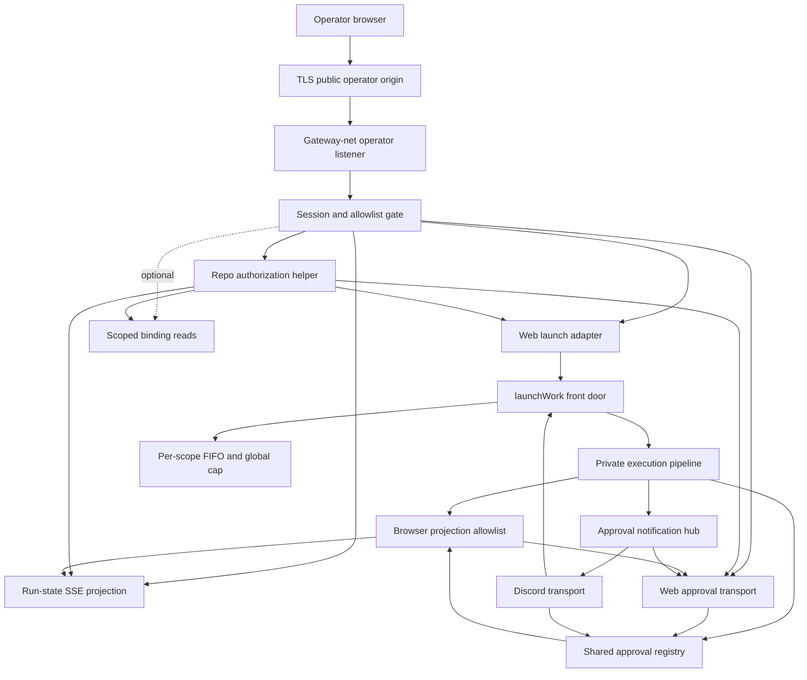

# Gateway web operator API surface

## Overview

Add the Gateway-side API surface that Phase A made possible: GitHub-authenticated allowlisted operators can launch work, observe run state, and approve or reject tool requests through the same execution and approval spine Discord already uses. The surface is browser-only in v1, uses server-side opaque sessions, preserves the gateway ingress/egress boundary, and leaves scoped read-only binding data as an optional Phase B.1 follow-up.

## Problem Frame

The Gateway currently has two proven control paths: Discord commands/mentions for launching work and Discord buttons for OpenCode approvals. Phase A extracted `launchWork`, transport-neutral sinks, and the generalized approval registry so another transport can use the same queue, concurrency cap, shutdown handoff, and fail-closed approval gate.

The missing piece is the authenticated browser-facing API. The existing HTTP announce listener is HMAC-authenticated machine ingress and is reachable from the workspace network, so it is the wrong trust boundary for human operator control. Phase B adds a separate operator API surface with real human auth, browser-origin protection, redacted run observation, and shared approval settlement. The dashboard UI remains a separate repo; this plan is complete when the Gateway API is ready and a minimal smoke client proves the operator flow end-to-end.

## Requirements Trace

- R1. Only GitHub-authenticated humans present in a configured operator allowlist can use the web surface.
- R2. Operator sessions have explicit lifetime, logout, and revocation semantics.
- R3. State-changing browser requests are protected against CSRF and invalid origins.
- R4. Auth failures are coarse to users and structured internally.
- R5. v1 excludes standalone machine/API callers, long-lived API tokens, and agent-to-agent orchestration.
- R6. Web-launched work enters the same public execution front door used by Discord-launched work.
- R7. Web approvals settle through the same fail-closed approval registry used by Discord approvals.
- R8. Approval settlement remains single-winner across transports, stale tabs, retries, and replayed submissions.
- R9. Approval states distinguish pending, already-settled, expired, failed-to-settle, and unavailable cases.
- R10. Web launch prevents accidental duplicate submissions and surfaces empty, unbound, or disabled repo states before work starts.
- R11. Run observation exposes a bounded status taxonomy.
- R12. Run progress uses a safe-field allowlist and never exposes raw workspace paths, tool arguments, prompts, internal URLs, tokens, or secret-bearing payloads.
- R13. The control surface preserves the Gateway ingress and egress boundary.
- R14. Operator actions are attributable to stable operator identity.
- R15. User-facing errors stay coarse while internal logs retain structured diagnostic context.
- R16. Audit records for auth, launch, approval, rejection, and authorization failures have a defined retention and protection story.
- R17. Logs avoid raw prompts, request bodies, bearer tokens, session secrets, raw tool payloads, and internal URLs.
- R18. Optional Phase B.1 may expose read-only Gateway binding data needed for operator repo selection or dashboard state.
- R19. If binding reads ship, they are scoped so an allowed operator cannot enumerate unrelated repositories by default.
- R20. Binding writes, binding deletes, repo onboarding, and binding repair stay out of Phase B v1 and Phase B.1.

## Scope Boundaries

- No machine/API callers in v1.
- No agent-to-agent orchestration.
- No dashboard UI implementation in this repo.
- No binding reads in core Phase B unless explicitly pulled in; no binding writes, deletes, onboarding, or repair from the web surface.
- No raw Gateway, workspace, or OpenCode API proxy.
- No Discord behavior changes.
- No weakening of the ingress-pin boundary without a documented security rationale and matching tests.
- No persistent approval recovery beyond the existing registry lifetime unless implementation discovers it is required for correctness.

### Deferred to Separate Tasks

- Dashboard UI integration in `fro-bot/dashboard` consumes the Gateway surface after the Gateway API exists.
- Operator-complete UX ships in the dashboard repo after this API is available; this plan proves the flow through API/smoke coverage, not production UI screens.
- Machine/API caller support gets a separate token, replay, rate-limit, and audit design.
- Hot-reloadable or remote operator allowlist management can follow the file-backed v1 allowlist.
- WebSocket support is deferred unless SSE proves insufficient.
- Web run cancellation is deferred. The web API can observe `cancelled` when existing timeout/shutdown paths produce it, but `POST /operator/runs/:runId/cancel` is not in v1.
- Compound/refresh docs should reframe Discord as one transport after the web transport ships.

## Terminology

- **Public operator origin:** Browser-visible HTTPS origin exposed by infra reverse proxy and used for OAuth callback, cookies, CORS, and CSRF.
- **Reverse proxy:** Infra-owned TLS terminator that forwards same-origin operator traffic to the Gateway over `gateway-net`; it must not buffer SSE responses.
- **Operator listener:** Internal Gateway HTTP listener bound only to the gateway-net address/port.
- **Dashboard UI:** Separate repo/client that may later consume this API through the public operator origin; not implemented here.

## Context & Research

### Relevant Code and Patterns

- `packages/gateway/src/execute/run.ts` exports `launchWork` as the queue/cap-preserving front door; the inner execution primitive stays private.
- `packages/gateway/src/execute/launch-types.ts` defines `LaunchWorkRequest`, `StatusSink`, `ReplySink`, and `WebOperatorIdentity`.
- `packages/gateway/src/approvals/registry.ts` already defines `WebOperatorActor` and `handleDecision`; web approvals should call this same registry.
- `packages/gateway/src/approvals/discord-transport.ts` is the transport reference for render/register/settle behavior.
- `packages/gateway/src/http/server.ts` and `packages/gateway/src/http/hmac.ts` are the announce-ingress pattern, but browser auth must be a sibling surface, not HMAC reuse.
- `packages/gateway/src/http/ingress-pin.test.ts` pins the current ingress surface and must be updated deliberately with topology rationale.
- `deploy/compose.yaml`, `deploy/validate-stack.sh`, and `deploy/README.md` encode the workspace egress boundary.
- `packages/gateway/src/bindings/store.ts` provides the read operations needed for scoped binding reads.
- `packages/runtime/src/coordination/types.ts` and `packages/runtime/src/coordination/run-state.ts` define the shared `Surface` and run-state validator that must learn the web surface.

### Institutional Learnings

- `docs/solutions/best-practices/gateway-control-surface-spine-2026-06-15.md`: new transports must use the public front door and shared approval gate; do not export the private execution primitive.
- `docs/solutions/best-practices/signed-webhook-ingress-hardening-2026-05-29.md`: use no-oracle auth failures, bounded body handling, socket-keyed limits, and captured-logger redaction tests.
- `docs/solutions/best-practices/compose-topology-egress-guard-hardening-2026-06-14.md`: topology guards must match normalized Compose output and fail closed with positive controls.
- `docs/solutions/best-practices/atomic-serial-channel-queue-handoff-2026-06-09.md`: route every launch through the existing FIFO and shutdown handoff.
- `docs/solutions/best-practices/gateway-opencode-mention-loop-best-practices-2026-05-30.md`: stream EOF before terminal signal is failure, flush partial output before coarse failure, and clean up every long-lived resource in `finally`.
- `docs/solutions/best-practices/effect-failure-channel-discipline-2026-06-10.md`: user-visible boundaries must catch defects and interruptions without hanging.
- `docs/solutions/best-practices/centralize-s3-key-identity-construction-2026-06-09.md`: new audit/session key families need centralized builders and exact-key tests.

### External References

- OWASP Session Management Cheat Sheet: server-side session state, secure cookies, explicit logout/revocation.
- OWASP CSRF Prevention Cheat Sheet: SameSite cookies, origin checks, Fetch Metadata, signed double-submit tokens for defense in depth.
- OWASP Logging Cheat Sheet: structured security events with sensitive-field exclusion.
- GitHub App user-to-server auth docs: use state and PKCE, validate the GitHub user server-side, prefer stable numeric user IDs over mutable logins.
- Hono 4.12 docs: `hono/cookie`, `hono/secure-headers`, `hono/csrf`, `hono/streaming`, and typed middleware composition.

## Key Technical Decisions

- **GitHub App OAuth with PKCE and state:** Use GitHub user-to-server auth for human login and identify operators by stable numeric GitHub user ID plus display login for logs. OAuth App/device-flow/token-only approaches are not the v1 path.
- **Server-side opaque sessions:** Store an opaque session ID server-side and put only the lookup key in a secure `__Host-` cookie. This preserves logout and revocation semantics; stateless JWT or encrypted-cookie-only sessions are rejected for v1.
- **Session lifetime and revocation:** v1 sessions have an 8-hour absolute lifetime and 30-minute idle timeout. Revocation is immediate for future requests and active SSE streams; in-flight approval decisions already accepted by `handleDecision` continue to settlement and are not rolled back.
- **File-backed configured allowlist for v1:** Load an explicit operator allowlist from hardened config/file plumbing and check it on every authenticated request. Hot reload can be added later; restart-based changes are acceptable for v1 if documented.
- **SSE for run observation:** Use SSE for one-way run state/output/progress with keepalive, disconnect cleanup, and replay from a bounded in-memory ring buffer. WebSocket is deferred until bidirectional browser control is needed.
- **Dedicated operator trust boundary:** Add a separate operator listener bound to the gateway-net interface, not `0.0.0.0`. The v1 browser ingress path is TLS termination at infra reverse proxy on the public operator origin → plain HTTP over gateway-net to the Gateway operator listener. The operator listener is not published directly to the host and is not reachable from sandbox-net.
- **Reject announce-listener reuse:** Do not add operator routes to the existing HMAC announce listener. That listener is workspace-reachable by design, so extending it would collapse defense in depth to app-layer auth only.
- **Same-origin operator cookie posture:** `GATEWAY_OPERATOR_PUBLIC_ORIGIN` defines the browser origin for OAuth callbacks, cookies, CORS, and CSRF. v1 requires same-origin deployment for credentialed browser calls; a separate dashboard origin must proxy through the same public origin rather than relying on cross-site cookies.
- **Central repo authorization helper:** Every launch, run-state, approval, and binding-read path uses one operator-to-repository authorization helper. The v1 rule is allowlisted GitHub numeric user plus verified GitHub read access to the target repo, cached briefly and denied on lookup failure.
- **Canonical server-side run/approval ownership:** Browser routes keyed by `runId` or `requestId` must resolve server-side to canonical run, repo, channel/scope, and approval state before disclosure or settlement. Never trust browser-supplied owner/repo context for run or approval access decisions.
- **Approval notification hub:** Add a transport-neutral approval notification/fanout seam so pending approvals are registered once, then exposed to Discord and web subscribers through the same registry state. The registry remains canonical for lifecycle, expiry, and snapshot truth; the hub is projection/fanout only.
- **Single-process settlement assumption:** v1 approval settlement relies on one Gateway process. The in-memory registry claim transition is single-winner inside one process; multi-replica Gateway requires a persistent compare-and-swap or equivalent distributed claim before this API can scale horizontally.
- **Shared execution and approval spine:** Web launch calls `launchWork`; web approvals call the same `ApprovalRegistry.handleDecision`. No web-specific execution loop, queue, or approval registry exists.
- **Safe projections for browser data:** Browser run state and binding data are projected through allowlists. Raw prompts, raw tool args, workspace paths, internal URLs, and bearer/session values are never included.
- **Scoped read-only binding support:** Treat binding reads as Phase B.1 unless the core API remains reviewable. Binding mutation remains Discord/operator-command territory.

## Open Questions

### Resolved During Planning

- **State transport:** SSE is the v1 plan because the flow is server-to-browser and needs simple reconnect semantics, not bidirectional low-latency control.
- **Session class:** Server-side opaque sessions are required because revocation is a requirement.
- **Bindings delivery:** Binding reads ride the same authenticated surface as a scoped read-only capability.
- **Machine callers:** Out of v1; any bearer-token/API mode gets a separate design.

### Deferred to Implementation

- **Exact session store backend:** Implement the server-side session store behind a small interface; v1 uses a bounded in-memory store with scavenging if the single-process assumption remains true. Gateway restart means global logout and clears sessions/idempotency state.
- **OAuth registration details:** Callback URLs, App registration location, and environment-specific secrets are deployment setup details.
- **Run-state projection fields:** Implementers choose the minimal safe event payloads while preserving the safe-field constraints.

## Browser-Facing API Contract

This table pins the minimum Gateway contract the dashboard can build against. Route names are allowed to move during implementation only if the same capability, auth requirement, and state union remain documented.

| Capability | Method / path | Input | Success shape | Coarse failures | Auth / CSRF |
|---|---|---|---|---|---|
| Start login | `GET /operator/auth/github/start` | optional return path | redirect to GitHub | generic auth failure | no session, state cookie |
| OAuth callback | `GET /operator/auth/github/callback` | GitHub `code`, `state` | session cookie + redirect | generic auth failure | state + PKCE |
| Current session | `GET /operator/session` | none | operator id/login + expiry | unauthorized | session |
| CSRF token refresh | `GET /operator/session/csrf` | none | signed double-submit token metadata | unauthorized | session |
| Logout | `POST /operator/session/logout` | none | logged out | unauthorized | session + CSRF/origin |
| Launch work | `POST /operator/runs` | owner, repo, prompt, idempotency key | run id + initial status | unauthorized, blocked, invalid, queue rejected | session + repo authz + CSRF/origin |
| Run snapshot | `GET /operator/runs/:runId` | run id | safe run projection | unauthorized, not found | session + repo authz |
| Run stream | `GET /operator/runs/:runId/stream` | optional last event id | SSE events from safe projection | unauthorized, not found | session + repo authz |
| Pending approvals | `GET /operator/approvals` | optional run id | pending approval summaries from canonical registry/hub state | unauthorized | session + server-side run→repo authz |
| Approval decision | `POST /operator/approvals/:requestId/decision` | decision, approval scope, idempotency key | `claimed`, `already_settled`, `expired`, or `failed_to_settle` state | unauthorized, expired, stale, scope mismatch | session + server-side approval→run→repo authz + CSRF/origin |

Browser state unions are intentionally small: run status is `queued`, `running`, `waiting_for_approval`, `blocked`, `failed`, `cancelled`, or `succeeded`; approval status is `pending`, `claimed`, `already_settled`, `expired`, `failed_to_settle`, or `unavailable`. Decision POST claims a pending approval and returns the claim/settlement state; final permission-reply confirmation and any later `failed_to_settle` state are observed through SSE or the pending-approval read path. Same idempotency key retries return the original decision outcome, different-key retries by the same operator return the current canonical state, and different operators after a claim receive `already_settled`/claimed-by metadata without changing the outcome.

The OAuth start return path is same-origin only and path-allowlisted. Absolute URLs, cross-origin targets, and unregistered paths are rejected before OAuth state is minted; the accepted return path is bound into server-side OAuth state.

### Approval State Mapping

| Registry truth | Decision response | SSE/read event | Operator-facing meaning |
|---|---|---|---|
| open pending entry | `claimed` when current operator wins | `approval.pending`, then `approval.claimed` | approval accepted; waiting for OpenCode confirmation |
| already claimed/settled | `already_settled` | latest settled event | someone already decided this request |
| deadline passed | `expired` | `approval.expired` | the request timed out and failed closed |
| claim accepted but reply cannot settle safely | `failed_to_settle` | `approval.failed_to_settle` | Gateway could not complete the approval safely |
| no canonical entry | `unavailable` | none | request no longer exists or is not visible to this operator |

### SSE Event Contract

| Event | Emitted when | Required safe fields |
|---|---|---|
| `run.state` | run status changes | run id, web status, canonical phase when present, timestamp |
| `run.output` | redacted/truncated text delta passes the output-safety pipeline | run id, text, truncated flag |
| `run.error` | non-terminal coarse error occurs | run id, bounded code, coarse description |
| `approval.pending` | registry accepts a pending permission request | request id, run id, safe summary, approval scope |
| `approval.claimed` | a decision claim is accepted | request id, run id, actor display metadata, timestamp |
| `approval.confirmed` | OpenCode confirms `permission.replied` | request id, run id, outcome, settled-by metadata |
| `approval.expired` | deadline fail-closes an approval | request id, run id, deadline metadata |
| `approval.failed_to_settle` | claim/reply path fails and cannot reopen safely | request id, run id, coarse reason |
| `heartbeat` | keepalive interval elapses | timestamp |

### Run Status Projection

| Web status | Source | Canonical phase |
|---|---|---|
| `queued` | in-memory queue before execution starts | none yet |
| `blocked` | pre-execution rejection such as lock held, queue rejected, workspace unavailable, binding disabled | none yet |
| `running` | acknowledged or executing run without pending approval | `ACKNOWLEDGED` or `EXECUTING` |
| `waiting_for_approval` | executing run with pending approval in the registry | `EXECUTING` plus registry pending state |
| `succeeded` | completed run | `COMPLETED` |
| `failed` | failed run | `FAILED` |
| `cancelled` | timeout/shutdown cancellation | `CANCELLED` |

`waiting_for_approval` is a transient sub-state derived from the in-memory approval registry. The snapshot endpoint reads both canonical run state and registry pending state for live runs.

Raw tool stdout/stderr is not browser-safe by default. Core Phase B may ship coarse status-only observation first; `run.output` is allowed only after explicit redaction/truncation tests prove the projection excludes secrets, internal URLs, prompts, raw tool args, and workspace paths.

### Browser Flow and Consumer Contract

1. Browser opens the public operator origin and checks `GET /operator/session`.
2. If unauthenticated, browser starts GitHub OAuth and returns to a same-origin allowlisted path.
3. Authenticated browser refreshes CSRF token, selects a repo/task, and submits launch with an idempotency key.
4. Browser snapshots the run and opens SSE; snapshot is authoritative on reconnect reset.
5. When approval is pending, browser shows an approval card, posts a decision with idempotency key, then waits for SSE/read confirmation.
6. Browser handles session expiry/revocation by closing streams, clearing local state, and returning to login.

Dashboard consumers should treat the snapshot as authoritative and SSE as incremental. If `Last-Event-ID` falls outside the replay window, the stream emits reset and the client re-reads the snapshot. Browser-visible labels must translate backend states into operator language; implementation terms such as `failed_to_settle` should map to short, coarse copy in the dashboard handoff.

### Abuse Controls

| Tier | Keyed by | Default limit | Applies to |
|---|---|---|---|
| Unauthenticated burst | socket IP | 20/minute | OAuth start/callback, unauthenticated session checks |
| Authenticated read | session or operator id | 120/minute | session, CSRF refresh, approval list, run snapshot, binding reads |
| Launch | operator id | 3/minute and 10/hour | launch work |
| Approval decision | operator id | 20/minute | approval decision POST |
| SSE connections | operator id | 5 concurrent | run stream |
| SSE reconnect | operator id + run id | 3/minute | reconnect with last event id |

All 429 responses include `Retry-After`. Launch and approval tiers should use sliding windows; lower-risk read tiers may reuse the existing fixed-window limiter if tests pin the boundary behavior.

## High-Level Technical Design

> *This illustrates the intended approach and is directional guidance for review, not implementation specification. The implementing agent should treat it as context, not code to reproduce.*

The web listener is an adapter layer. It authenticates the operator, projects safe data to the browser, and translates browser actions into existing Gateway primitives. All data crossing into browser-visible routes or SSE passes through the projection allowlist before serialization. The execution and approval trust anchors remain shared with Discord.

## Implementation Units

- [x] **Unit 0: Characterization and current-state guardrails**

  **Goal:** Prove Phase A seams and existing Gateway behavior are stable before adding the web surface.

  **Requirements:** R6, R7, R13

  **Dependencies:** None

  **Files:**
  - Test: `packages/gateway/src/execute/run.test.ts`
  - Test: `packages/gateway/src/approvals/registry.test.ts`
  - Test: `packages/gateway/src/http/ingress-pin.test.ts`

  **Approach:**
  - Add or verify static tests that the private execution primitive is not exported and every non-Discord caller goes through `launchWork`.
  - Confirm existing Discord launch, approval, queue, and ingress-pin tests still express the invariants Phase B depends on.

  **Execution note:** Characterization-first; do not modify behavior until these tests describe the current contract.

  **Patterns to follow:**
  - Phase A characterization tests in `packages/gateway/src/execute/run.test.ts`.
  - Spine pattern doc rule: public front door, private inner primitive.

  **Test scenarios:**
  - Integration: Discord mention path still calls the shared front door and preserves queue/cap behavior.
  - Static guard: the private execution primitive is not exported from `packages/gateway/src/execute/run.ts`.
  - Static guard: existing ingress route inventory is unchanged before the operator listener unit.

  **Verification:**
  - Existing gateway launch, approval, and ingress tests pass on the unmodified behavioral path.

- [x] **Unit 1: Shared surface and run-state widening**

  **Goal:** Teach shared coordination types that web is a first-class Gateway surface without changing behavior.

  **Requirements:** R6, R11, R14

  **Dependencies:** Unit 0

  **Files:**
  - Modify: `packages/runtime/src/coordination/types.ts`
  - Modify: `packages/runtime/src/coordination/run-state.ts`
  - Modify: `packages/runtime/src/coordination/run-state.test.ts`
  - Modify: `packages/runtime/src/coordination/lock.ts`
  - Modify: `packages/gateway/src/execute/launch-types.ts`
  - Modify: `packages/gateway/src/execute/run.ts`
  - Test: `packages/runtime/src/coordination/run-state.test.ts`
  - Test: `packages/gateway/src/execute/run.test.ts`

  **Approach:**
  - Widen the runtime `Surface` union and validator to include `web`.
  - Remove any casts that only existed because the runtime type did not yet recognize the web surface.
  - Extend `WebOperatorIdentity` and `WebOperatorActor` to carry stable GitHub numeric ID and display login in addition to the opaque operator/session correlation value.
  - Add approval transport selection to the execution spine so Discord remains the default transport and web can inject the notification hub/web transport without hardwiring Discord inside `launchWork`.

  **Patterns to follow:**
  - Existing `Surface` validation in `packages/runtime/src/coordination/run-state.ts`.
  - Existing discriminated unions in `packages/gateway/src/execute/launch-types.ts` and `packages/gateway/src/approvals/registry.ts`.

  **Test scenarios:**
  - Happy path: a run state with `surface: 'web'` validates.
  - Regression: existing `github` and `discord` surfaces still validate.
  - Error path: an unknown surface is still rejected by the validator.
  - Integration: gateway launch tests compile without unsafe casts for the web surface.
  - Integration: Discord approval behavior remains unchanged when no web approval transport is configured.

  **Verification:**
  - Runtime and gateway typechecks pass.
  - No `as any`, `@ts-ignore`, or broad `unknown as` casts are introduced.

- [x] **Unit 2: Operator listener topology and security pin**

  **Goal:** Add the operator web listener skeleton and deployment guardrails without exposing privileged behavior yet.

  **Requirements:** R3, R4, R13, R15, R17

  **Dependencies:** Unit 1

  **Files:**
  - Create: `packages/gateway/src/web/server.ts`
  - Create: `packages/gateway/src/web/safe-response.ts`
  - Modify: `packages/gateway/src/http/ingress-pin.test.ts`
  - Modify: `packages/gateway/src/config.ts`
  - Modify: `packages/gateway/src/program.ts`
  - Modify: `packages/gateway/src/shutdown.ts`
  - Modify: `deploy/compose.yaml`
  - Modify: `deploy/validate-stack.sh`
  - Modify: `deploy/validate-stack.test.sh`
  - Modify: `deploy/README.md`
  - Test: `packages/gateway/src/web/server.test.ts`
  - Test: `packages/gateway/src/http/ingress-pin.test.ts`

  **Approach:**
  - Add a Hono app factory and server lifecycle for the operator surface with a health route and no privileged routes yet.
  - Bind the listener to a configured operator bind host on the gateway-net interface. Do not bind the operator surface to `0.0.0.0` or the sandbox-net address.
  - Document and validate the public ingress path: TLS-terminating infra reverse proxy at `GATEWAY_OPERATOR_PUBLIC_ORIGIN` forwards to the gateway-net operator bind host/port. Gateway does not terminate TLS in v1.
  - Trust proxy headers only from the configured reverse proxy path; document why this differs from announce ingress and reject untrusted forwarded-host/proto combinations.
  - Validate the bind host against the gateway-net CIDR or explicit configured address; reject `0.0.0.0`, `127.0.0.1`, and sandbox-net addresses for production operator listener config.
  - Require same-origin credentialed browser calls; if the dashboard UI is hosted elsewhere, it must proxy through the operator public origin.
  - Wire config as opt-in: if required operator-web config is absent, the listener stays disabled.
  - Update ingress-pin tests from “exactly one route” to an explicit per-surface inventory: announce remains workspace-safe; operator routes are pinned to `buildOperatorApp`; no route appears in both or in neither inventory.
  - Use the existing `gateway-net`; do not add a new network unless implementation proves the reverse proxy topology requires one.
  - Update deploy topology validation so the operator bind host is not on sandbox-net and Compose hardening still sweeps all services.
  - Route all responses through a safe response helper to keep auth failures no-oracle and logs redacted.
  - Add body-size limits, unauthenticated socket-keyed limits, and route timeouts before adding privileged behavior.
  - Establish shared abuse-control primitives and listener-level body/timeout guards. Route-specific throttles land with the units that introduce those routes.

  **Patterns to follow:**
  - Announce server lifecycle in `packages/gateway/src/http/server.ts`.
  - Hardened config readers in `packages/gateway/src/config.ts`.
  - Topology validation patterns in `deploy/validate-stack.sh`.

  **Test scenarios:**
  - Happy path: operator listener starts only when all required config is present.
  - Error path: partial operator listener config fails closed during startup.
  - Security: ingress-pin test documents both announce and operator surfaces and fails on unregistered privileged routes.
  - Security: deploy validation rejects `0.0.0.0`, sandbox-net, or missing bind-host topology for the operator listener.
  - Security: deploy validation verifies the configured operator public origin and reverse-proxy/bind-host relationship is present when the listener is enabled.
  - Security: a sandbox-net-originated request cannot reach or is rejected by the operator listener positive ingress control.
  - Security: unauthenticated floods hit socket-keyed rate limits and bounded body handling before expensive work.
  - Shutdown: closing the Gateway closes the operator server without hanging active handles.

  **Verification:**
  - Gateway tests cover listener opt-in/out and ingress inventory.
  - Deploy validation tests cover the new topology with positive and negative controls.

- [x] **Unit 3a: Config + operator route guardrail seam**

  **Goal:** Establish the config plumbing and a mechanical route-wrapper that makes it structurally impossible for new privileged operator routes to skip rate-limiting, auth, origin, or CSRF checks.

  **Requirements:** R1, R3, R4, R13

  **Dependencies:** Unit 2

  **Files:**
  - Modify: `packages/gateway/src/config.ts`
  - Create: `packages/gateway/src/web/operator-route.ts`
  - Create: `packages/gateway/src/web/operator-route.test.ts`
  - Modify: `packages/gateway/src/web/server.ts`

  **Approach:**
  - Add config keys for `GATEWAY_OPERATOR_PUBLIC_ORIGIN`, GitHub App OAuth client id/secret, allowlist path, session secret, and CSRF signing key. Validate `GATEWAY_OPERATOR_PUBLIC_ORIGIN` as a canonical origin only: scheme + host + optional port, no path, query, hash, or userinfo component. Reject any value that does not parse as a valid `URL` with an empty pathname, no search, no hash, and no username/password.
  - Add a `registerOperatorRoute` wrapper (or equivalent Hono middleware chain factory) that every privileged operator route must use. The wrapper enforces, in order: body-size limit, socket-keyed unauthenticated rate limit, session validation, Host/Origin/public-origin check, Fetch Metadata rejection, and CSRF verification for mutating methods. New routes that skip the wrapper fail a static test.
  - Add a static test that enumerates all registered operator routes and asserts each one is wrapped; this is the mechanical guard that prevents future omissions.
  - Use `readSecret` and hardened file/env helpers already in `packages/gateway/src/config.ts`.

  **Patterns to follow:**
  - Hardened config readers in `packages/gateway/src/config.ts`.
  - Announce server lifecycle in `packages/gateway/src/http/server.ts`.

  **Test scenarios:**
  - Config: `GATEWAY_OPERATOR_PUBLIC_ORIGIN` with a path, query, hash, or userinfo component is rejected at startup.
  - Config: a valid canonical origin (`https://ops.example.com`) is accepted.
  - Static guard: a route registered without the wrapper causes the static test to fail.
  - Static guard: all routes registered through the wrapper pass the static test.

  **Verification:**
  - Config validation and route-wrapper tests pass; no operator route can be added without the guardrail.

- [x] **Unit 3b: Audit seam and redaction guarantees**

  **Goal:** Add a single typed audit seam for security-critical events so all subsequent units can emit structured, redacted audit records without duplicating sink logic.

  **Requirements:** R4, R14, R16, R17

  **Dependencies:** Unit 3a

  **Files:**
  - Create: `packages/gateway/src/web/audit.ts`
  - Create: `packages/gateway/src/web/audit.test.ts`

  **Approach:**
  - Define a typed `AuditEvent` discriminated union covering: `auth.start`, `auth.callback.success`, `auth.callback.failure`, `auth.logout`, `auth.revocation`, `authz.denied`, `launch.accepted`, `launch.rejected`, `approval.decision`, `approval.rejected`, `binding.read`, `bearer.rejected`.
  - Implement a single `emitAudit(event, logger)` function. Route success is reported only after the local audit sink accepts the event; downstream export may be asynchronous.
  - Redaction: audit records must never include cookies, session secrets, GitHub tokens, raw request bodies, prompts, bearer values, or internal URLs. Add captured-log tests that assert these fields are absent from emitted records.
  - Treat Gateway restart as clearing all in-flight audit state; durable export is a deployment concern.
  - Audit retention: structured gateway logs are acceptable for v1 if deployment guarantees 30-day retention, access control, and redaction posture.

  **Patterns to follow:**
  - Logger redaction conventions in gateway tests.
  - `docs/solutions/best-practices/signed-webhook-ingress-hardening-2026-05-29.md` redaction test patterns.

  **Test scenarios:**
  - Happy path: each event variant emits a structured record with the expected typed fields.
  - Security: captured log output for every event variant contains no cookie, secret, token, prompt, or bearer value.
  - Security: `bearer.rejected` event records the rejection without logging the credential value.

  **Verification:**
  - Audit seam is typed, redacted, and covered by captured-log tests.

- [x] **Unit 3c: GitHub OAuth state + PKCE identity verification**

  **Goal:** Implement the GitHub App user OAuth web flow with PKCE S256 and state so the callback can verify human identity before any session is minted.

  **Requirements:** R1, R4, R5, R14

  **Dependencies:** Unit 3b

  **Files:**
  - Create: `packages/gateway/src/web/auth/github.ts`
  - Create: `packages/gateway/src/web/auth/github.test.ts`
  - Modify: `packages/gateway/src/web/server.ts`

  **Approach:**
  - Implement `GET /operator/auth/github/start`: generate a PKCE S256 code verifier (server-side only, never in a cookie), derive the code challenge, generate a cryptographic state value, store `{ codeVerifier, redirectTarget, issuedAt, consumed: false }` server-side with a short TTL and a cap on outstanding attempts per socket. Redirect to GitHub with `state`, `code_challenge`, and `code_challenge_method=S256`.
  - Implement `GET /operator/auth/github/callback`: validate `state` (constant-time comparison, one-time consumption, TTL check), exchange `code` for a GitHub access token using the stored `codeVerifier` in the PKCE exchange. PKCE is not optional and is not a deploy-time detail.
  - After token exchange, fetch the authenticated GitHub user and extract the stable numeric `id`. The numeric `id` is the authority for all subsequent identity checks; `login` is display metadata only.
  - Bind and validate the OAuth return path as same-origin/path-allowlisted; reject absolute URLs and cross-origin redirects before OAuth state is minted.
  - The OAuth callback route must be narrowly exempted from strict Fetch Metadata cross-site rejection (GitHub redirects cross-site); all other operator routes remain subject to full Fetch Metadata enforcement.
  - Emit `auth.callback.success` or `auth.callback.failure` audit events via the Unit 3b seam.
  - Repo authorization must verify human user access using the user OAuth token, not only app installation auth.

  **Patterns to follow:**
  - GitHub App user-to-server auth docs: PKCE S256/state flow.
  - No-oracle auth failure behavior from signed webhook ingress.

  **Test scenarios:**
  - Happy path: valid state + PKCE exchange returns the numeric GitHub user id and display login.
  - Error path: invalid state, replayed state, expired state, PKCE verifier mismatch, and oversized verifier records all fail closed and emit audit without leaking specifics.
  - Error path: absolute URL or cross-origin redirect target in state is rejected before OAuth state is minted.
  - Security: code verifier is never written to a cookie or included in any browser-visible response.
  - Security: every auth failure branch returns the same coarse response shape.
  - Security: OAuth callback is narrowly exempted from Fetch Metadata cross-site rejection; other routes are not.

  **Verification:**
  - OAuth flow is PKCE-enforced, state-validated, and identity-anchored to stable numeric GitHub id.

- [x] **Unit 3d: Session store, cookies, logout, and revocation hook**

  **Goal:** Mint server-side opaque sessions after successful identity verification, enforce session lifetime and revocation, and provide the logout route.

  **Requirements:** R2, R4, R14

  **Dependencies:** Unit 3c

  **Files:**
  - Create: `packages/gateway/src/web/auth/session.ts`
  - Create: `packages/gateway/src/web/auth/session.test.ts`
  - Modify: `packages/gateway/src/web/server.ts`

  **Approach:**
  - v1 session store owns `create`, `get`, `touch`, `delete`, enforces 8-hour absolute and 30-minute idle expiry, scavenges expired entries, and caps stored sessions.
  - Session IDs have at least 128 bits of CSPRNG entropy (preferably 256 bits); comparisons are constant-time.
  - Store the session ID in a `__Host-` cookie: `HttpOnly`, `Secure`, `SameSite=Lax`, `Path=/`, no `Domain` attribute.
  - Always mint a fresh session ID after successful OAuth callback and clear any stale pre-auth cookie to prevent session fixation.
  - Revocation is immediate for future requests; in-flight approval decisions already accepted by `handleDecision` continue to settlement and are not rolled back.
  - Treat Gateway restart as global logout for v1: all sessions, CSRF tokens, idempotency records, and SSE subscriptions are gone. Browser clients must re-authenticate and snapshot-read after reconnect.
  - Expose a revocation hook so SSE streams can be notified within one heartbeat/auth-check interval when a session is revoked.

  **Patterns to follow:**
  - `readSecret` and related file/env helpers in `packages/gateway/src/config.ts`.
  - `userIsAuthorized` fail-closed posture in `packages/gateway/src/discord/mentions.ts`.

  **Test scenarios:**
  - Happy path: successful OAuth callback mints a fresh session and sets a `__Host-` cookie with correct attributes.
  - Security: session cookie tests assert `__Host-` invariants: `Secure`, `HttpOnly`, `Path=/`, no `Domain` attribute.
  - Security: stale pre-auth cookie is cleared before the new session cookie is set.
  - Revocation: logout invalidates the session server-side and clears the cookie.
  - Revocation: revoking a session triggers the revocation hook; concurrent sessions are independently revocable.
  - Expiry: expired sessions are scavenged and return unauthorized on next request.
  - Restart: after a simulated restart, previously valid session IDs are not found.

  **Verification:**
  - Session store is bounded, revocable, and covered by deterministic typed tests.

- [ ] **Unit 3e: Origin / Fetch Metadata / CSRF middleware**

  **Goal:** Implement the layered browser-origin protection stack that all mutating operator routes must pass through.

  **Requirements:** R3, R4

  **Dependencies:** Unit 3d

  **Files:**
  - Create: `packages/gateway/src/web/auth/csrf.ts`
  - Create: `packages/gateway/src/web/auth/csrf.test.ts`
  - Modify: `packages/gateway/src/web/operator-route.ts`

  **Approach:**
  - Do not rely on `hono/csrf` for JSON mutating routes. Implement custom signed double-submit CSRF tokens: tokens are bound to session id, operator id, issued-at, and a nonce/version; signed with the CSRF signing key from config; rotated on login, refresh, and a 15-minute interval; invalidated on logout, expiry, and revocation.
  - Guard mutating routes in this order: (1) reject non-cookie credential schemes (`Authorization`, `Proxy-Authorization`, `X-API-Key`) and audit without logging credential values; (2) validate session; (3) validate `Host`/`Origin` against `GATEWAY_OPERATOR_PUBLIC_ORIGIN`; (4) reject unsafe Fetch Metadata combinations (`Sec-Fetch-Site: cross-site` on non-exempted routes, `Sec-Fetch-Mode: navigate` on non-navigation routes) when headers are present; (5) parse and verify CSRF token.
  - The OAuth callback is narrowly exempted from Fetch Metadata cross-site rejection (established in Unit 3c); no other route is exempted.
  - Add a `GET /operator/session/csrf` route that returns a fresh signed double-submit token for an authenticated session.

  **Patterns to follow:**
  - OWASP CSRF Prevention Cheat Sheet: signed double-submit + origin/Fetch Metadata defense in depth.
  - No-oracle auth failure behavior from signed webhook ingress.

  **Test scenarios:**
  - Security: mutating routes reject missing CSRF token, invalid CSRF signature, expired CSRF token, and mismatched session binding.
  - Security: mutating routes reject `Origin` header that does not match `GATEWAY_OPERATOR_PUBLIC_ORIGIN`.
  - Security: `Sec-Fetch-Site: cross-site` on a non-exempted mutating route is rejected.
  - Security: non-cookie credential schemes are rejected and audited without logging the credential value.
  - Security: CSRF token refresh requires a valid session and rotates tokens on schedule.
  - Happy path: a valid session + matching origin + valid CSRF token passes all checks.

  **Verification:**
  - CSRF and origin middleware are tested in isolation and wired into the route guardrail from Unit 3a.

- [ ] **Unit 3f: Allowlist + repo authorization helper**

  **Goal:** Implement the operator allowlist check and the single repo authorization helper used by all privileged routes.

  **Requirements:** R1, R14, R19

  **Dependencies:** Unit 3d

  **Files:**
  - Create: `packages/gateway/src/web/auth/allowlist.ts`
  - Create: `packages/gateway/src/web/auth/repo-authz.ts`
  - Create: `packages/gateway/src/web/auth/allowlist.test.ts`
  - Create: `packages/gateway/src/web/auth/repo-authz.test.ts`

  **Approach:**
  - Load the operator allowlist from a hardened config/file path. v1 uses a file-backed allowlist; hot reload can be added later. Allowlist entries are stable numeric GitHub user IDs, not logins.
  - Add one `checkRepoAuthz(operatorId, owner, repo, userOAuthToken, logger)` helper used by launch, run-state, approvals, and binding reads. v1 rule: allowlist membership plus verified GitHub read access to the target repo using the user OAuth token (not only app installation auth). Failures deny.
  - Cache repo authorization by operator/repo: 5-minute positive TTL, 30-second negative TTL, TTL jitter, request coalescing for concurrent misses, fail-closed on lookup errors. GitHub rate-limit responses are cached through their retry window.
  - Normalize and validate owner/repo names before any authz or queueing work.
  - Emit `authz.denied` audit events via the Unit 3b seam on every denial.

  **Patterns to follow:**
  - `userIsAuthorized` fail-closed posture in `packages/gateway/src/discord/mentions.ts`.
  - `docs/solutions/best-practices/centralize-s3-key-identity-construction-2026-06-09.md` for centralized helper patterns.

  **Test scenarios:**
  - Happy path: an allowlisted operator with GitHub read access to a repo is authorized.
  - Error path: an allowlisted operator without GitHub read access is denied and audited.
  - Error path: a non-allowlisted numeric user id is denied regardless of GitHub access.
  - Caching: a positive authz result is cached; a negative result is cached with a shorter TTL.
  - Caching: concurrent misses for the same operator/repo coalesce into one GitHub API call.
  - Caching: a GitHub rate-limit response is cached through its retry window.
  - Error path: GitHub API lookup failure fails closed and emits an audit event.
  - Validation: malformed owner/repo names are rejected before authz work begins.

  **Verification:**
  - Allowlist and repo authz are deterministic, fail-closed, and covered by typed tests.

- [ ] **Unit 3g: Minimal session routes**

  **Goal:** Wire the three minimal session-management routes that the browser flow requires: current session info, CSRF token refresh, and logout.

  **Requirements:** R2, R3, R4, R14

  **Dependencies:** Units 3d and 3e

  **Files:**
  - Create: `packages/gateway/src/web/routes/session.ts`
  - Create: `packages/gateway/src/web/routes/session.test.ts`
  - Modify: `packages/gateway/src/web/server.ts`
  - Modify: `deploy/README.md`

  **Approach:**
  - `GET /operator/session`: returns operator numeric id, display login, and session expiry for a valid session; returns `401` with a coarse body for invalid/expired sessions.
  - `GET /operator/session/csrf`: returns a fresh signed double-submit token for an authenticated session (delegates to Unit 3e CSRF module).
  - `POST /operator/session/logout`: invalidates the session server-side, clears the cookie, triggers the revocation hook from Unit 3d, and emits an `auth.logout` audit event.
  - All three routes go through the `registerOperatorRoute` wrapper from Unit 3a. Logout additionally requires origin and CSRF checks.
  - Update `deploy/README.md` to document the OAuth callback URL (`{GATEWAY_OPERATOR_PUBLIC_ORIGIN}/operator/auth/github/callback`), required secrets, and the distinction between OAuth client id/secret and GitHub App id/private key.

  **Patterns to follow:**
  - Route wiring in `packages/gateway/src/web/server.ts`.
  - No-oracle auth failure behavior from signed webhook ingress.

  **Test scenarios:**
  - Happy path: `GET /operator/session` returns operator id, login, and expiry for a valid session.
  - Error path: `GET /operator/session` returns `401` for an expired or missing session.
  - Happy path: `GET /operator/session/csrf` returns a fresh token for a valid session.
  - Happy path: `POST /operator/session/logout` invalidates the session, clears the cookie, and emits an audit event.
  - Security: `POST /operator/session/logout` requires a valid origin and CSRF token.
  - Security: all three routes are covered by the static route-wrapper guard from Unit 3a.

  **Verification:**
  - Session routes are wired, tested, and covered by the route guardrail.

- [ ] **Unit 4: SSE run observation and safe browser projections**

  **Goal:** Let authenticated operators observe active and recent runs through a bounded safe status stream.

  **Requirements:** R7, R10, R11, R12, R15, R17

  **Dependencies:** Units 1, 2, and 3

  **Files:**
  - Create: `packages/gateway/src/web/sse/manager.ts`
  - Create: `packages/gateway/src/web/sse/projection.ts`
  - Create: `packages/gateway/src/web/sse/manager.test.ts`
  - Create: `packages/gateway/src/web/sse/projection.test.ts`
  - Modify: `packages/gateway/src/web/server.ts`
  - Modify: `packages/gateway/src/execute/run.ts`
  - Test: `packages/gateway/src/execute/run.test.ts`

  **Approach:**
  - Build an authenticated SSE manager with per-run subscriptions, keepalive, disconnect cleanup, and capped in-memory replay buffer.
  - Bound SSE resources: 5 concurrent streams per operator, 1,000 replay events or 256 KB per run, 5-minute replay TTL, 15-second heartbeat, 30-minute max stream duration, and 64 KB buffered-write cap per subscription.
  - Project runtime phases and approval pending state into the operator taxonomy: queued, running, waiting for approval, blocked, failed, cancelled, succeeded.
  - Use a positive safe-field allowlist for all browser events.
  - Treat stream disconnect as client-local; it must not cancel or complete a run.
  - Treat EOF before terminal run state as an observation failure, not run success.
  - Snapshot reads combine canonical run state with in-memory approval registry pending state for live runs.
  - Enforce per-session/operator SSE connection caps and bounded replay buffers.

  **Patterns to follow:**
  - Gateway stream/flush discipline in `packages/gateway/src/discord/streaming.ts`.
  - Mention-loop best practice around terminal signal correctness and cleanup.
  - Hono `streamSSE` guidance for `onAbort`, keepalive, and `Last-Event-ID` replay.

  **Test scenarios:**
  - Happy path: authenticated operator subscribes to a run and receives queued/running/terminal events.
  - Reconnect: a client reconnecting with a last event ID receives buffered missed events before live events.
  - Reconnect: a last event ID outside the replay window receives a reset event and must snapshot-read.
  - Cleanup: aborted SSE connections remove subscriptions and timers.
  - Security: projection excludes raw prompt, raw tool args, workspace path, internal URLs, token values, and secret-bearing payload fragments.
  - Error path: run stream resolves `runId` server-side to repo/scope before disclosure; unauthorized operators cannot subscribe to an unrelated run by supplying owner/repo context.
  - Abuse: rapid reconnects do not leak listeners and cannot exceed per-operator connection caps.
  - Abuse: slow consumers exceeding buffered-write limits are dropped without blocking other subscribers.
  - Error path: stream writer failure is contained and does not crash the Gateway.

  **Verification:**
  - SSE streams are bounded, replayable, redacted, and cleaned up on disconnect.

- [ ] **Unit 5: Web launch adapter**

  **Goal:** Let an authenticated operator launch work through `launchWork` with web sinks and idempotent pre-launch validation.

  **Requirements:** R5, R6, R10, R11, R12, R13, R14

  **Dependencies:** Units 1, 3, and 4; the route stays feature-disabled until Unit 6 approval handling is available.

  **Files:**
  - Create: `packages/gateway/src/web/routes/launch.ts`
  - Create: `packages/gateway/src/web/sinks/status-sink.ts`
  - Create: `packages/gateway/src/web/sinks/reply-sink.ts`
  - Create: `packages/gateway/src/web/routes/launch.test.ts`
  - Create: `packages/gateway/src/web/sinks/status-sink.test.ts`
  - Create: `packages/gateway/src/web/sinks/reply-sink.test.ts`
  - Modify: `packages/gateway/src/web/server.ts`
  - Modify: `packages/gateway/src/execute/run.test.ts`

  **Approach:**
  - Validate prompt, selected repository, binding existence, operator authorization, and idempotency before calling `launchWork`.
  - Normalize and validate owner/repo names, prompt length, and idempotency key format before any queueing or GitHub authz work.
  - Construct a `LaunchWorkRequest` with `surface: 'web'`, `WebOperatorIdentity`, and SSE-backed `StatusSink`/`ReplySink` implementations.
  - Ensure sink send failures fail soft and release pending claims; the execution spine must not see unhandled transport rejections.
  - Use idempotency keys or equivalent request de-duplication so double-clicks and browser retries do not create duplicate runs.
  - Scope launch idempotency by operator and idempotency key with a 5-minute TTL. Same-key retry returns the original run result; different operators do not share key space.
  - Apply per-operator launch throttles so authenticated abuse cannot starve Discord or other operators.

  **Execution note:** Implement launch behavior test-first around validation, idempotency, and queue preservation.

  **Patterns to follow:**
  - Discord adapter in `packages/gateway/src/execute/run.ts`.
  - Safe Discord send boundary in `packages/gateway/src/discord/io.ts`.
  - Queue and concurrency behavior from `packages/gateway/src/execute/queue.ts` and `packages/gateway/src/execute/concurrency.ts`.

  **Test scenarios:**
  - Happy path: an allowlisted operator launches a bound repo and `launchWork` receives a web request.
  - Error path: empty prompt, unbound repo, disabled binding, unauthorized operator, and expired session fail before a run is created.
  - Idempotency: duplicate submit or browser retry returns the existing launch state instead of creating a second run.
  - Idempotency: same key after TTL expiry can create a new run, while a different operator using the same key does not collide.
  - Integration: web launch respects per-scope FIFO and global concurrency cap.
  - Security: browser response and SSE stream do not expose raw prompt or internal workspace details.

  **Verification:**
  - Web-launched work follows the same coordination behavior as Discord work.

- [ ] **Unit 6: Approval notification hub and web approval transport**

  **Goal:** Let authorized web operators discover, receive, and settle OpenCode permission requests through the existing approval registry.

  **Requirements:** R7, R8, R9, R14, R15, R17

  **Dependencies:** Units 3 and 4

  **Files:**
  - Create: `packages/gateway/src/web/approvals/web-transport.ts`
  - Create: `packages/gateway/src/approvals/notification-hub.ts`
  - Create: `packages/gateway/src/web/routes/approval.ts`
  - Create: `packages/gateway/src/web/approvals/web-transport.test.ts`
  - Create: `packages/gateway/src/web/routes/approval.test.ts`
  - Modify: `packages/gateway/src/approvals/registry.test.ts`
  - Modify: `packages/gateway/src/approvals/coordinator.test.ts`
  - Modify: `packages/gateway/src/approvals/approval-flow.integration.test.ts`
  - Modify: `packages/gateway/src/program.ts`

  **Approach:**
  - Split internally into 6a notification hub and 6b web approval transport. The hub is transport-neutral and tested without web sessions before route wiring starts.
  - Add a transport-neutral approval notification hub before web-specific route wiring. The hub has no web or Discord imports and stores projection data only.
  - Keep the registry canonical for pending/claimed/confirmed/expired lifecycle; the hub stores only projection data needed to notify/replay browser state.
  - Hub events are emitted only after `ApprovalRegistry.register` succeeds and carry registry identity/state version so consumers can re-check canonical state.
  - Hub events are hints, not authority; browser decisions and pending reads resolve through registry state.
  - Mirror the Discord approval transport: render on pending, settle via `handleDecision`, confirm through permission reply, and dispose fail-closed.
  - Add a pending approvals read path backed by registry/hub state so reconnecting browsers can discover pending requests.
  - Include approval scope in web notifications and require it on decision submissions to preserve scope checks.
  - Resolve `requestId` server-side to run/repo/scope before authorizing disclosure or settlement; never trust owner/repo from the browser for approval routes.
  - Decision POST returns claim/current-state semantics, not a guarantee that OpenCode has already emitted `permission.replied`; final state is surfaced via SSE/read path.
  - Scope approval idempotency by operator GitHub ID, request id, approval scope, and idempotency key. Records live until the approval leaves pending plus a bounded retry window, not beyond run/registry retention.
  - SSE exposes `approval.pending`, `approval.claimed`, `approval.confirmed`, `approval.expired`, and `approval.failed_to_settle` from registry-derived events.
  - Represent stale, already-settled, expired, failed-to-settle, and unavailable states distinctly for the browser.
  - Preserve reject cascade semantics and avoid optimistic UI being treated as authoritative.

  **Execution note:** Start with registry and approval-flow regressions before wiring routes.

  **Patterns to follow:**
  - `packages/gateway/src/approvals/discord-transport.ts`.
  - `ApprovalRegistry.handleDecision` behavior in `packages/gateway/src/approvals/registry.ts`.
  - Existing approval integration tests.

  **Test scenarios:**
  - Happy path: web approval claims an open request and later confirms after permission reply.
  - Discovery: a reconnecting browser can list pending approvals for an authorized run.
  - No-tab path: if no browser is connected when a permission is asked, the pending approval remains discoverable until timeout.
  - Race: Discord and web submit decisions concurrently; exactly one wins and the loser sees already-settled state.
  - Replay: same idempotency key retry returns the original result; new-key same-operator retry and different-operator retry return canonical current state without changing the outcome.
  - Timeout: expired approval fails closed and web sees expired state.
  - Failure: post-reply failure does not orphan a claimed sibling after cascade rejection.
  - Security: wrong approval scope is rejected and audited.
  - Security: approval route authorizes from server-side approval→run→repo lookup, not browser-supplied context.
  - Abuse: approval decision throttles and idempotency TTLs are enforced and tested.

  **Verification:**
  - Web and Discord approvals settle through one registry with the same fail-closed behavior.

- [ ] **Unit 7: Scoped read-only bindings (cuttable follow-up)**

  **Goal:** Expose binding reads needed by the operator web client without adding mutation or broad enumeration.

  **Requirements:** R18, R19, R20

  **Dependencies:** Unit 3; optional after core API readiness

  **Files:**
  - Create: `packages/gateway/src/web/routes/bindings.ts`
  - Create: `packages/gateway/src/web/routes/bindings.test.ts`
  - Modify: `packages/gateway/src/bindings/store.ts`
  - Modify: `packages/gateway/src/bindings/store.test.ts`
  - Modify: `packages/gateway/src/web/server.ts`

  **Approach:**
  - Add read-only binding routes on the authenticated operator surface if the branch remains reviewable after core launch/status/approval lands.
  - Scope responses by operator authorization and requested repository context.
  - Keep `createBinding` and any future mutation methods unavailable from the web surface.
  - Centralize binding visibility checks so route handlers cannot drift.

  **Patterns to follow:**
  - Existing `createBindingsStore` read methods.
  - Operator allowlist and GitHub identity checks from Unit 3.

  **Test scenarios:**
  - Happy path: an allowed operator can read a binding for a repository they are allowed to see.
  - Error path: an allowed operator cannot enumerate unrelated repositories by default.
  - Error path: unauthenticated and expired-session callers cannot read bindings.
  - Security: no web route exposes create/update/delete binding behavior.
  - Abuse: binding reads are throttled per operator/session and cache failures fail closed.
  - Regression: existing Discord add-project binding creation still works unchanged.

  **Verification:**
  - Binding reads are scoped, read-only, and covered by route and store tests.

  **Cut line:**
  - If auth/listener/launch/approval scope grows too large, defer Unit 7 to a follow-up PR on the same authenticated surface without blocking core Phase B API readiness.

- [ ] **Unit 8: Documentation, smoke coverage, and operational readiness**

  **Goal:** Make the new control surface operable, reviewable, and safe to deploy.

  **Requirements:** R13, R14, R15, R16, R17

  **Dependencies:** Units 2 through 6 for core API readiness; Unit 7 when scoped binding reads are included

  **Files:**
  - Modify: `packages/gateway/AGENTS.md`
  - Modify: `deploy/README.md`
  - Modify: `deploy/validate-stack.sh`
  - Modify: `deploy/validate-stack.test.sh`
  - Modify: `.github/workflows/ci.yaml`
  - Create: `docs/solutions/best-practices/gateway-web-operator-auth-2026-06-15.md`
  - Test: `deploy/validate-stack.test.sh`
  - Test: gateway image smoke workflow paths in `.github/workflows/ci.yaml`

  **Approach:**
  - Document enablement, secrets, listener topology, OAuth callback setup, cookie/security posture, audit behavior, and rollback.
  - Pin v1 TLS model: infra reverse proxy terminates HTTPS, disables SSE buffering, forwards to the gateway-net operator bind host, and preserves trusted forwarded host/proto headers.
  - Document the exact OAuth callback URL: `{GATEWAY_OPERATOR_PUBLIC_ORIGIN}/operator/auth/github/callback`, and distinguish OAuth client id/secret from GitHub App id/private key.
  - Document local development with HTTPS/self-signed certificates rather than adding an insecure dev-mode flag.
  - Add new optional operator secret files to deploy README's optional-secret table and upgrade touch list.
  - Define rollback: soft-disable by removing/operator-disable config and restarting Gateway; hard rollback by reverting the operator-web commits. No schema/data rollback is required.
  - Define operator-listener smoke as API-only vertical-slice coverage that can start the operator listener without requiring full production Discord/S3 success, while still exercising image packaging and auth behavior.
  - Extend Gateway image smoke tests to prove the web listener boots, health checks respond, unauthenticated/operator-auth failures return coarse responses, and the bundle has no unsafe bare workspace imports.
  - Update gateway contributor guidance to name `launchWork`, the web adapter, and the approved approval-transport seam.
  - Capture the security pattern in `docs/solutions/` so future surfaces do not re-learn the auth/topology constraints.

  **Patterns to follow:**
  - Existing Gateway image smoke and deploy validation patterns.
  - `docs/solutions/best-practices/signed-webhook-ingress-hardening-2026-05-29.md` structure.
  - `docs/solutions/best-practices/gateway-control-surface-spine-2026-06-15.md` guidance style.

  **Test scenarios:**
  - Smoke: API-only vertical slice can authenticate, launch a synthetic run, observe safe state over SSE/read path, expose a pending approval, settle it, and observe terminal approval/run state without a dashboard UI.
  - Smoke: built Gateway image starts with operator listener enabled and reports expected health/auth behavior.
  - Smoke: unauthenticated, invalid-origin, and CSRF-failed requests produce the same coarse auth failure body.
  - Build: gateway bundle has no bare `@fro-bot/runtime` import.
  - Deploy validation: topology guard rejects a workspace-reachable operator port and accepts the documented topology.

  **Verification:**
  - Gateway package test, lint, typecheck, and build pass.
  - Deploy validation and Gateway image smoke cover the new surface.
  - Documentation explains how to enable, revoke, audit, and roll back the surface.

## System-Wide Impact

- **Interaction graph:** Browser operator requests enter the operator listener, pass auth/session/origin gates, then call existing Gateway primitives: `launchWork`, `ApprovalRegistry.handleDecision`, run-state reads, and binding-store reads.
- **Milestone definition:** This plan delivers Gateway API readiness plus smoke-proven operator flows. Production operator UX requires dashboard integration in a separate repo.
- **Error propagation:** Browser-facing errors are coarse; structured logs and audit events carry machine-readable reasons without raw payloads or secrets.
- **State lifecycle risks:** Operator sessions, SSE subscriptions, idempotency records, audit records, approval registry entries, and run-state records all need bounded lifetimes and cleanup paths.
  - Session store owns 8-hour absolute expiry, 30-minute idle expiry, revocation, and scavenging.
  - Registry owns approval pending/claimed/confirmed/expired lifecycle within the single-process assumption.
  - Idempotency stores own 5-minute launch records and approval retry-window records.
  - Notification hub owns ephemeral projection buffers only and is not canonical.
  - SSE ring buffers own replay count/byte/TTL bounds.
  - Audit records are retained for at least 30 days in a protected sink. Structured gateway logs are acceptable only if deployment guarantees that retention, access control, and redaction posture.
- **API surface parity:** Discord remains the existing transport; web is additive. Both share execution and approval semantics.
- **Integration coverage:** Route-handler tests are not enough; tests must exercise real server wiring, auth middleware, approval registry settlement, deploy topology validation, and Gateway image smoke.
- **Unchanged invariants:** Workspace cannot gain a caller-directed outbound proxy, Discord behavior stays unchanged, and binding mutation stays off the web surface.

## Risks & Dependencies

| Risk | Mitigation |
|------|------------|
| Operator listener becomes workspace-reachable and bypasses egress controls | Treat Unit 2 as a security gate; update ingress-pin and deploy validation with positive and negative controls before privileged routes land |
| Auth implementation is a fake wall with weak sessions | Use server-side opaque sessions, state + PKCE, secure cookies, CSRF/origin checks, and captured-log redaction tests |
| Web approvals diverge from Discord approval semantics | Route every web decision through `ApprovalRegistry.handleDecision` and add cross-transport race/replay tests |
| Browser route trusts attacker-supplied repo context | Resolve run and approval IDs server-side to canonical repo/scope before authz, disclosure, or settlement |
| SSE leaks sensitive run data | Use projection allowlists and tests that prove forbidden fields never appear |
| SSE disconnects leak handles | Require `onAbort` cleanup, keepalive, bounded buffers, and tests for rapid reconnect/drop |
| Binding reads leak repo mappings | Scope binding responses by operator authorization and default against cross-repo enumeration |
| New dependencies break the Gateway image | Extend image smoke and bundle-shape checks for the operator listener |
| OAuth/App registration blocks deployment | Document callback registration and required secrets before merge; keep the listener opt-in until configured |
| Plan becomes unreviewable as one branch | Land Unit 1 separately when useful; treat Unit 7 as cuttable; do not combine dashboard UI work into this repo |
| Gateway scales beyond one process before registry persistence exists | Do not deploy multiple Gateway replicas with web approvals enabled until `handleDecision` uses persistent compare-and-swap or equivalent distributed claim |

## Documentation / Operational Notes

- Operator web auth secrets and allowlist configuration must use the hardened secret/file loading pattern already used by Gateway config.
- The listener should be opt-in until all required secrets and topology are configured.
- Local development needs a secure-cookie story; document loopback/TLS requirements rather than weakening cookie attributes in production code.
- Audit retention/protection can start with structured gateway logs plus a documented retention posture; append-only object storage is the preferred hardening if the first implementation can keep scope contained.
- If this plan grows beyond one reviewable branch, land Unit 1 separately before the listener/auth work.

## Sources & References

- **Origin document:** `docs/brainstorms/2026-06-15-gateway-control-surface-phase-b-requirements.md`
- Tracking issue: https://github.com/fro-bot/agent/issues/907
- Phase A plan: `docs/plans/2026-06-15-001-feat-gateway-control-surface-spine-phase-a-plan.md`
- Spine pattern: `docs/solutions/best-practices/gateway-control-surface-spine-2026-06-15.md`
- Signed ingress hardening: `docs/solutions/best-practices/signed-webhook-ingress-hardening-2026-05-29.md`
- Egress topology hardening: `docs/solutions/best-practices/compose-topology-egress-guard-hardening-2026-06-14.md`
- Queue handoff: `docs/solutions/best-practices/atomic-serial-channel-queue-handoff-2026-06-09.md`
- Mention loop: `docs/solutions/best-practices/gateway-opencode-mention-loop-best-practices-2026-05-30.md`
- Failure channels: `docs/solutions/best-practices/effect-failure-channel-discipline-2026-06-10.md`
- Identity/key construction: `docs/solutions/best-practices/centralize-s3-key-identity-construction-2026-06-09.md`
- Hono docs: https://hono.dev/docs/getting-started/nodejs
- Hono streaming docs: https://hono.dev/docs/helpers/streaming
- GitHub App user authorization docs: https://docs.github.com/en/apps/creating-github-apps/identifying-and-authorizing-users-for-github-apps
- OWASP Session Management Cheat Sheet: https://cheatsheetseries.owasp.org/cheatsheets/Session_Management_Cheat_Sheet.html
- OWASP CSRF Prevention Cheat Sheet: https://cheatsheetseries.owasp.org/cheatsheets/Cross-Site_Request_Forgery_Prevention_Cheat_Sheet.html
- OWASP Logging Cheat Sheet: https://cheatsheetseries.owasp.org/cheatsheets/Logging_Cheat_Sheet.html
