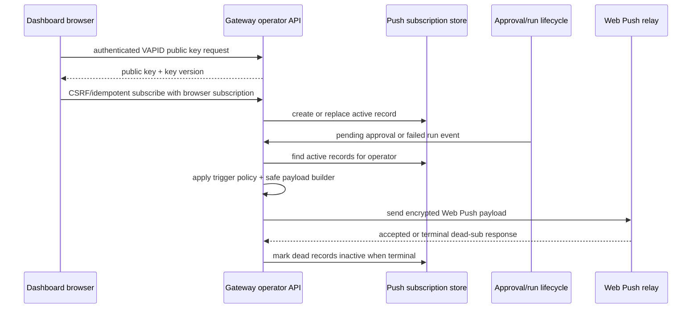

# feat: add Gateway-owned operator push notifications

## Overview

This plan adds the Gateway half of operator Web Push notifications. The Gateway becomes the authoritative owner of operator push subscription records, opt-in state, VAPID dispatch, trigger policy, dead-subscription cleanup, and privacy/export/deactivation semantics. The dashboard remains a thin browser client and will be planned separately: consent UI, `PushManager` handoff, service-worker display/click handling, and logout-side local unsubscribe.

The first Gateway slice is opt-in and fail-closed. Push is disabled unless Gateway push config and VAPID material are present. The v1 trigger set is intentionally narrow: pending operator approvals and failed run outcomes only.

## Problem Frame

The operator PWA can render live run output, recent runs, approval prompts, and sanitized failure reasons, but it only helps while the operator is watching the dashboard. Issue `fro-bot/dashboard#108` introduced opt-in push as the out-of-tab path, but the confirmed requirements put subscription persistence and dispatch with the Gateway because operator identity, approvals, run lifecycle, and session invalidation already live there.

This Gateway plan must add a new outbound notification channel without turning notification payloads, logs, or subscription records into a privacy leak. It also must preserve Gateway conventions: ESM `.js` imports, functions over classes, injected loggers, `Result<T,E>`/Effect boundary discipline, strict booleans, no type suppression, and fail-soft external I/O.

Push is a non-authoritative enhancement channel. The Discord notice and the operator SSE stream remain the required, authoritative delivery paths for approvals and failed runs; silent push loss must never be the only signal an operator gets.

## Requirements Trace

- R1. Push state is Gateway-authoritative: subscription records, opt-in state, dispatch, cleanup, export, deactivation, and server-side deletion live in the Gateway.
- R2. v1 notifications cover pending approvals and failed run outcomes only.
- R3. Push payloads and logs use schema-level allowlists and safe copy keys; no prompts, repo names, commands, paths, tokens, cookies, CSRF values, idempotency keys, session IDs, raw reason codes, or backend free-form text.
- R4. Subscription operations are authenticated, CSRF-protected where mutating, idempotent, bound to one operator identity and one browser/device subscription, and inaccessible cross-account.
- R5. VAPID private key material stays server-side, per-environment, rotatable, never logged, never serialized into client-visible config, and never copied into dashboard bundles.
- R6. Dead subscriptions and logout/session revocation mark Gateway records inactive immediately; browser-side local unsubscribe remains best-effort in the companion dashboard plan.
- R7. (Deferred to the dashboard companion plan — active-view suppression is not implemented in this Gateway v1.)
- R8. Standard Web Push relays are accepted, but relay-visible metadata must be minimized and documented.
- R9. Privacy policy / retention / export / deletion language is a production enablement gate, not a follow-up after rollout.

## Scope Boundaries

- This plan does not implement dashboard consent UI, `PushManager.subscribe`, service-worker `push` / `notificationclick`, local logout unsubscribe, or browser verification. Those belong in the separate dashboard plan.
- This plan does not implement Background Sync, Periodic Sync, Background Fetch, offline approval, offline run launch, deferred actions, quiet hours, digests, preference matrices, succeeded/cancelled notifications, per-repo filtering, snooze, or notification history.
- This plan does not self-host a browser push relay. It uses standards-based Web Push relay endpoints with minimum-data encrypted payloads.
- This plan does not change Discord notification behavior; push is an additional fail-soft operator channel.
- This plan does not ship production enablement until VAPID secrets and privacy/retention documentation are in place.

### Deferred to Separate Tasks

- Dashboard companion plan: browser consent UI, Push API handoff, SW notification rendering/click handling, local unsubscribe, assembled browser verification, and active-view suppression (this Gateway v1 does not implement presence/active-view suppression at all).
- Full VAPID key rotation lifecycle (active/grace/revoked states + bulk key revocation) is deferred to an ops-hardening follow-up; v1 supports only a current key plus an optional previous key during a rollout window.
- Production enablement runbook / infra secret wiring in `marcusrbrown/infra` after Gateway and dashboard code land.
- Compound docs after implementation and review, following the repo's post-PR documentation workflow.

## Context & Research

### Relevant Code and Patterns

- `packages/gateway/src/web/server.ts` — Hono operator app factory and route mounting surface.
- `packages/gateway/src/web/auth/csrf.ts` — browser-origin guard, CSRF, Fetch Metadata, and session-bound mutation protection.
- `packages/gateway/src/web/auth/session.ts` — in-memory session store, revocation hooks, and session lifecycle patterns.
- `packages/gateway/src/web/operator/launch-route.ts` — idempotency-key namespacing and operator mutation route pattern.
- `packages/gateway/src/approvals/registry.ts` — pending approval registration and settlement lifecycle.
- `packages/gateway/src/execute/run.ts` — terminal run state transitions and observer notification sites.
- `packages/gateway/src/discord/status-message.ts` and `packages/gateway/src/discord/cancel-notice.ts` — fail-soft external notification I/O.
- `packages/gateway/src/operator-contract/` — Gateway-owned contract DTOs consumed by the dashboard's vendored contract.
- `packages/gateway/src/operator-contract/redaction.ts` — redaction obligation and fail-closed denylist posture.
- `packages/gateway/src/config.ts` — env-driven config parsing and secret loading conventions.

### Institutional Learnings

- `docs/solutions/security-issues/github-app-credential-domain-conflation-2026-06-15.md` — model VAPID as its own credential domain; do not conflate it with GitHub App keys, dashboard session, or Gateway operator session.
- `docs/solutions/security-issues/gateway-operator-client-no-leak-contract-2026-06-18.md` — browser-direct operator calls use fixed `/operator/*` paths, CSRF/idempotency for mutations, coarse route-template logging, and no dynamic secret logs.
- `docs/solutions/security-issues/gateway-operator-session-cookie-forwarding-trust-boundary-2026-06-20.md` — same-origin and configured-origin boundaries matter; never derive security-sensitive origin from request `Host`.
- `docs/solutions/best-practices/operator-approval-channel-consumption-2026-06-22.md` — approval prompts need discriminated state, settlement dominance, and duplicate/race handling.
- `docs/solutions/best-practices/operator-failure-reason-rendering-contract-1-6-0-2026-07-08.md` — known reason values map to safe labels; unknown/future values degrade to generic copy; raw wire codes never render or log.
- `docs/solutions/security-issues/cross-source-redaction-denylist-before-query-2026-06-15.md` — build payloads only after redaction/denylist constraints are satisfied; fail closed rather than leak.

### External References

- Web Push stack: RFC 8030, RFC 8291, RFC 8292, Push API, Notifications API, Service Worker `push` and `notificationclick` events.
- Operational constraints: 4 KB encrypted payload ceiling, `410 Gone` terminal dead-subscription handling, VAPID `aud` as push-service origin, and `exp <= 24h`.

## Key Technical Decisions

- **Split plans, Gateway first.** Gateway subscription/dispatch work is planned here; dashboard handoff/SW work is planned separately. This keeps the authority boundary explicit and avoids mixing browser UI work with Gateway persistence/dispatch.
- **Gateway-owned subscription records.** Subscription persistence belongs with Gateway operator identity and Gateway event triggers. The dashboard must not grow a persistent subscription store or proxy notification actions. The canonical record model is: endpoint hash as the unique browser capability, operator identity as the current owner, key material as write-only secret fields, and metadata as the only list/export surface.
- **Opt-in flag with fail-closed config.** Push has two config modes. Disabled mode ignores missing VAPID material and exposes no push routes. Enabled mode requires complete, valid VAPID material, route deps, and durable store deps at startup; any missing dependency fails the push surface closed.
- **Authenticated public-key route.** The VAPID public key is safe to expose, but v1 serves it only to authenticated operator sessions to avoid creating a new unauthenticated discovery surface.
- **Safe payload envelope.** Gateway dispatch sends only safe copy keys/labels and neutral routing metadata. The payload never carries run output, prompt text, repo identity, request text, command text, raw `failureKind`, or action-bearing URLs.
- **Notification click target is neutral.** Gateway payload data can only direct the dashboard to the neutral operator entry point; click-time auth and current-state fetch are dashboard concerns.
- **Fail-soft dispatch, non-authoritative channel.** Web Push relay failures must not block approval registration, run execution, Discord notices, or terminal-state persistence. Push is a non-authoritative enhancement: the Discord notice and operator SSE stream remain the required, authoritative delivery paths for approvals and failed runs. Silent push loss must never be the only signal an operator gets.
- **Dead-subscription cleanup is authoritative server-side.** Relay terminal responses mark records inactive immediately; local browser unsubscribe is best-effort and belongs in the dashboard plan.
- **Endpoint ownership transfers only on explicit subscribe, with a linearizable ownership generation.** A browser push endpoint is a capability tied to one browser profile. If another authenticated operator explicitly subscribes with the same endpoint on a shared device, the Gateway subscribe path transfers that endpoint to the current operator, deactivates the old binding before dispatch can occur, and records a coarse transfer event. Passive session refreshes and metadata reads never transfer ownership. Each subscription record carries a monotonically increasing ownership generation; a transfer bumps the generation as part of the same CAS write that deactivates the old binding, giving the dispatcher a happens-before boundary to detect stale reads.
- **VAPID rotation is a minimal current+previous model, not a full lifecycle.** Subscription records store the VAPID key version used at subscription time. v1 supports a single active key plus an optional previous key accepted during a rollout window; records signed with the previous key can still be dispatched during rollout. The full active/grace/revoked rotation lifecycle and bulk key-revocation are deferred to an ops-hardening follow-up.
- **Do not bump `OPERATOR_CONTRACT_VERSION` for additive push routes.** The dashboard enforces an exact-match, fail-closed drift gate on the operator SSE ready frame (`fro-bot/dashboard:src/gateway/operator-sse-reader.ts` — `frame.data.contractVersion !== OPERATOR_CONTRACT_VERSION` → `contract-drift`, stream closed). The gateway emits that same constant on the ready frame (`packages/gateway/src/web/sse/run-stream-route.ts`). Push adds a new `/operator/push/*` REST surface that the SSE ready-frame gate does not observe, so bumping the version constant is unnecessary and would break every operator stream for any dashboard not repinned+redeployed in the same window. Push contract DTOs are added to the operator-contract barrel without touching the version constant; `operator-contract/version.ts` is intentionally excluded from the change set. Any future version bump must be a coordinated cross-repo deploy (mirrors the note behind `fro-bot/dashboard#179` / the 1.6.0 cutover). The dashboard vendors this barrel as a manual selective copy (documented omissions, no automated parity gate), so adding push DTOs upstream does not force a dashboard update or break a conformance check.

## Gateway API Contract

All push routes are privileged operator routes registered with `registerOperatorRoute`, never public or cross-site routes. Mutating routes use the existing browser-origin guard, Fetch Metadata checks, CSRF posture, and operator-scoped idempotency discipline.

| Route | Method | Auth class | CSRF / idempotency | Purpose |
|---|---:|---|---|---|
| `/operator/push/vapid-key` | GET | privileged operator route | none; read-only | Return `{publicKey, keyVersion}` when push is enabled. |
| `/operator/push/subscriptions` | POST | privileged operator route | CSRF + operator/endpoint/action-scoped idempotency | Explicitly register or replace the browser's W3C `PushSubscription.toJSON()` shape. |
| `/operator/push/subscriptions/unsubscribe` | POST | privileged operator route | CSRF + operator/endpoint/action-scoped idempotency | Mark the current operator's matching endpoint inactive. |
| `/operator/push/subscriptions` | GET | privileged operator route | none; read-only | Return safe subscription metadata only. |

Disabled or partially configured push returns the same disabled/404-style result for every push route and never creates subscription records.

## Config Contract

| Env key | Required when enabled | Client-visible | Notes |
|---|---:|---:|---|
| `GATEWAY_OPERATOR_PUSH_ENABLED` | no | no | Defaults false. `true` activates validation and route deps. |
| `GATEWAY_OPERATOR_PUSH_VAPID_PUBLIC_KEY` | yes | yes | Returned only from authenticated `/operator/push/vapid-key`. |
| `GATEWAY_OPERATOR_PUSH_VAPID_PRIVATE_KEY` | yes | no | Server-only signing key; never logged or serialized. |
| `GATEWAY_OPERATOR_PUSH_VAPID_SUBJECT` | yes | no | Mailto or HTTPS subject used for VAPID claims. |
| `GATEWAY_OPERATOR_PUSH_VAPID_KEY_VERSION` | yes | yes | Stored on records; used for rotation and client resubscribe decisions. |
| `GATEWAY_OPERATOR_PUSH_PREVIOUS_VAPID_*` | no | no | Optional previous keypair accepted during a rollout window. |
| `GATEWAY_OPERATOR_PUSH_DEDUPE_WINDOW_MS` | no | no | Defaults to 300000 ms. |

## Durable Store Contract

The push store uses the repo's object-store adapter with `getObject` and `conditionalPut` support. If push is enabled and the configured store lacks conditional writes, the push surface fails closed at startup. Store shape:

- Canonical record key: `operator-push/subscriptions/by-endpoint/{sha256(endpoint)}.json`.
- No secondary operator index exists in v1. Operator lists are derived by listing keys under the canonical prefix (`list(prefix)`), reading each candidate record (`getObject`), and filtering in memory by the decoded operator id. There is no server-side filter; the adapter provides list + get + conditional put/delete only.
- Writes use compare-and-swap / ETag semantics on the single canonical record for endpoint ownership transfer and inactive-state visibility. Each record carries a monotonically increasing ownership generation. Dispatch is linearizable against transfer: the dispatcher re-reads the record's current owner + active state + ownership generation immediately before send, and only sends if the record is still active and owned by the operator the dispatch was queued for. A transfer bumps the ownership generation in the same CAS write that deactivates the prior binding, establishing a happens-before boundary so a stale pre-transfer dispatch read cannot deliver to the new owner.
- A single canonical safe-metadata read-schema governs every non-mutating surface — list, export, audit, metrics, and error responses. Subscription endpoint, `p256dh`, and `auth` are write-only secret fields and never appear in any of those surfaces, including error paths; only opaque endpoint hash, timestamps, key version, active state, and coarse inactive reason are returned.
- Concurrent subscribe/revoke/dispatch must prove: endpoint uniqueness, no cross-operator dispatch after transfer, inactive records excluded from dispatch after the successful write, and safe retry/repair when a CAS conflict occurs.
- When push is enabled, the Gateway runs a startup contended-write self-test proving real compare-and-swap semantics on the configured store (not just interface presence) — concurrent conditional writes to the same key must produce exactly one winner and a detectable conflict on the loser. A store that accepts `conditionalPut` but behaves last-write-wins fails the push surface closed at startup.

## Payload Copy Contract

| Type | Title key | Body key | Payload data |
|---|---|---|---|
| Pending approval | `operator.approval_needed.title` | `operator.approval_needed.body` | `{type:"approval", route:"/"}` only. |
| Failed run | `operator.run_failed.title` | `operator.run_failed.body` | `{type:"run_failed", route:"/", failureLabel?: KnownSafeLabel}` only. |

Copy values are short, single-sentence, localization-ready strings. Notification actions use neutral labels such as `Open dashboard`; they never imply approval, retry, or mutation. Payloads never include repo name, prompt text, approval text, command, path, run output, raw `failureKind`, endpoint, browser key material, tokens, cookies, CSRF, idempotency key, session ID, or backend free-form text. Unknown failure reasons use generic failed-run copy.

## Dashboard Handoff State Contract

The Gateway exposes only server-known subscription state. Browser permission state remains dashboard-owned and must be reconciled by the companion plan.

| Gateway state | Meaning | Dashboard implication |
|---|---|---|
| `push_disabled` | Gateway push config/routes unavailable. | Show unsupported/unavailable state; do not call `PushManager.subscribe`. |
| `not_subscribed` | Authenticated operator has no active record for this endpoint hash. | Offer opt-in if browser prerequisites pass. |
| `subscribed` | Active record exists for current operator and endpoint hash. | Show enabled state and disable action. |
| `stale_key` | Active record exists with a previous/old VAPID key version (rollout window). | Prompt resubscribe with current public key. |
| `inactive` | Record exists but is inactive/dead/revoked. | Offer fresh opt-in; do not treat as enabled. |

If the dashboard detects `Notification.permission === 'denied'` or browser-side subscription loss, it should call the unsubscribe route to reconcile Gateway state. Gateway also reconciles stale records when relays return terminal dead-sub responses.

## Merge / Enablement Gates

| Stage | Allowed state |
|---|---|
| U1-U3 | Mergeable disabled-by-default without Web Push dependency approval if routes stay unavailable until config/deps are valid. |
| U4-U5 | Blocked on explicit dependency approval and a compiled sender adapter probe. |
| U6 | Mergeable as privacy/audit/ops docs, but production enablement remains blocked. |
| Production enablement | Blocked on VAPID secrets, infra wiring, privacy/retention policy, dashboard companion SW support, and an end-to-end push smoke test. |

## Retention / Export / Delete Contract

- Active records persist until opt-out, logout/session revocation, relay dead-sub response, key revocation, or explicit privacy deletion.
- Inactive records are retained for 30 days by default for cleanup/audit correlation, then purged.
- Privacy export returns only safe metadata: record id/hash, created/updated/deactivated timestamps, key version, active state, and coarse inactive reason.
- Privacy delete marks active records inactive immediately, removes inactive records for the operator from the active dispatch set, and writes a durable tombstone (or deletion ledger entry) before returning.
- Any backup/restore or active-dispatch-set rebuild must consult the tombstone/deletion ledger before re-activating a record, so a backup or object-store restore cannot resurrect a deleted record into the active dispatch set.

## Open Questions

### Resolved During Planning

- **One plan or split plans?** Split. This document covers the Gateway; a companion dashboard plan covers browser subscription and SW behavior.
- **v1 trigger set?** Pending approvals and failed run outcomes only. Succeeded/cancelled outcomes are deferred.
- **Subscription store owner?** Gateway.
- **Background Sync?** Explicitly out of v1.
- **VAPID public key route auth?** Authenticated operator route in v1.
- **Active-view suppression guarantee?** Deferred entirely to the dashboard companion plan; not implemented in this Gateway v1.

### Deferred to Implementation

- Explicit approval to add `web-push` or a reviewed equivalent. If approval is denied, U4-U6 pause and the Gateway can only land U1-U3 disabled-by-default.
- Exact object-store layout and migration shape for durable records. The plan defines the lifecycle contract; implementation chooses the smallest persistence shape that survives Gateway restarts and supports endpoint ownership transfer.
- Exact privacy-policy prose after the retention/export/delete contract is reviewed.

## High-Level Technical Design

> This illustrates the intended approach and is directional guidance for review, not implementation specification. The implementing agent should treat it as context, not code to reproduce.



## Output Structure

```text
packages/gateway/src/web/operator-push/
├── config-keys.ts
├── dedupe-cache.ts
├── dispatcher.ts
├── payload-builder.ts
├── subscription-route.ts
├── subscription-store.ts
├── trigger-policy.ts
├── vapid-public-key-route.ts
└── vapid.ts
```

The tree is the expected home for new Gateway push code. Implementation may adjust filenames if the final shape fits existing Gateway conventions better, but the module boundary should remain under `packages/gateway/src/web/operator-push/`.

## Implementation Units

### U1. Push contract and VAPID config foundation

**Goal:** Define the Gateway-side operator push contract and configuration surface without enabling dispatch.

**Requirements:** R1, R4, R5, R8

**Dependencies:** None

**Files:**
- Create: `packages/gateway/src/web/operator-push/config-keys.ts`
- Create: `packages/gateway/src/web/operator-push/vapid.ts`
- Modify: `packages/gateway/src/config.ts`
- Modify: `packages/gateway/src/operator-contract/index.ts`
- Modify: `packages/gateway/src/operator-contract/parse.ts`
- Modify: `packages/gateway/src/operator-contract/responses.ts`
- Do NOT modify: `packages/gateway/src/operator-contract/version.ts` — see the "Do not bump `OPERATOR_CONTRACT_VERSION`" decision. Push DTOs are added to the barrel without changing the version constant, which the dashboard SSE drift gate matches exactly.
- Test: `packages/gateway/src/web/operator-push/vapid.test.ts`
- Test: `packages/gateway/src/config.test.ts`

**Approach:**
- Add push-specific contract DTOs for VAPID public key, subscription metadata, subscribe/unsubscribe requests, and route responses.
- Add an `operatorPush` config block using the exact env keys in the Config Contract section. Disabled mode ignores missing VAPID material; enabled mode requires complete VAPID/store dependencies and fails the push surface closed when invalid.
- Keep private key material in Gateway config only; expose only public key + key version to route code.
- VAPID private key material may never appear in test fixtures, snapshots, thrown errors, debug dumps, or serialized config blobs — this is a hard rule, not a best effort.
- Follow project conventions: functions only, readonly DTOs, explicit boolean checks, no type suppression, and `.js` extensions.

**Execution note:** Start with config/parse contract tests before wiring routes.

**Patterns to follow:**
- `packages/gateway/src/config.ts` for env parsing and fail-closed config.
- `packages/gateway/src/operator-contract/parse.ts` for boundary parsing.
- `packages/gateway/src/web/auth/csrf.ts` for secret handling posture.

**Test scenarios:**
- Happy path: disabled push config loads without VAPID material.
- Happy path: enabled push config accepts a valid VAPID keypair, subject, and key version.
- Error path: enabled push config rejects missing private key, malformed key, blank subject, or invalid key version.
- Error path: enabled push config rejects missing conditional object-store support needed for endpoint ownership transfer.
- Error path: VAPID private key never appears in logged or serialized config objects.
- Error path: config validation failure does not include the private key in the thrown error / serialized error object.
- Privacy: no test fixture or snapshot embeds real private key material.
- Contract: parsed public-key response accepts only the allowlisted response fields.
- Regression: `OPERATOR_CONTRACT_VERSION` is unchanged by this unit (guard against a reflexive bump that would trip the dashboard SSE drift gate). Assert the constant still equals its pre-push value while the new push DTOs are exported from the barrel.

**Verification:** Config and contract tests pass, push remains disabled by default, and no dispatch or route behavior is enabled yet.

### U2. Durable subscription record lifecycle store

**Goal:** Add the Gateway-owned durable subscription store and lifecycle operations for create, replace/transfer, mark inactive, export metadata, and cleanup.

**Requirements:** R1, R4, R6, R9

**Dependencies:** U1

**Files:**
- Create: `packages/gateway/src/web/operator-push/subscription-store.ts`
- Test: `packages/gateway/src/web/operator-push/subscription-store.test.ts`

**Approach:**
- Model a Gateway subscription record as one browser/device subscription bound to one authenticated operator identity.
- Persist records through Gateway restarts using the repo's object-store/runtime persistence patterns rather than a dashboard-local store or a new dashboard database.
- Store endpoint and browser key material only in the Gateway record; never echo these values in public metadata responses.
- Support idempotent create/replace by endpoint and operator identity; if the same endpoint appears for a different authenticated operator, transfer ownership atomically by deactivating the old binding, bumping the record's ownership generation, and creating/replacing the current operator's record in the same CAS write.
- Include `active`, timestamps, `keyVersion`, an `ownershipGeneration` counter, and inactive/dead cleanup semantics.
- Provide metadata export/listing that omits endpoint, `p256dh`, and `auth` values.

**Execution note:** Characterize create/replace/delete semantics with pure unit tests before route work.

**Patterns to follow:**
- `packages/gateway/src/web/auth/session.ts` for revocation behavior and bounded lifecycle cleanup.
- `packages/runtime/src/object-store/` for durable persistence conventions.
- `packages/gateway/src/approvals/registry.ts` for idempotent lifecycle updates.

**Test scenarios:**
- Happy path: create active record for operator + browser subscription; list returns metadata without endpoint/key material.
- Edge case: same operator + same endpoint replaces the existing record instead of duplicating.
- Edge case: different operator + same endpoint transfers ownership to the current operator and prevents future dispatch to the previous operator.
- Error path: different operator cannot replace or revoke another operator's record.
- Edge case: mark inactive stops records from future dispatch queries.
- Durability: records survive store reload/restart and dispatch queries use recovered state.
- Concurrency: CAS conflict retries do not produce duplicate active endpoint owners.
- Startup: a contended-write self-test against the configured store proves real compare-and-swap semantics; a store that behaves last-write-wins fails the push surface closed before any route is mounted.
- Cleanup: inactive/dead records are pruned according to the configured retention window.
- Privacy: endpoint, `p256dh`, and `auth` are never returned by metadata/export methods.
- Privacy: endpoint, `p256dh`, and `auth` never appear in export, audit, metrics, or error payloads (negative assertions on each surface, covering the canonical safe-metadata read-schema shared by all non-mutating surfaces).
- Restore regression: a deleted record stays deleted (excluded from the active dispatch set) after a backup replay / store reload.
- Concurrency: a dispatch queued for operator A that races a transfer to operator B re-reads owner + ownership generation before send and does NOT deliver A's notification to B (and vice versa).

**Verification:** Store tests prove durable Gateway ownership, endpoint-transfer safety, and cross-account operations failing closed.

### U3. Authenticated operator push routes

**Goal:** Expose authenticated operator routes for public key lookup, subscription registration, opt-out, and metadata listing/export.

**Requirements:** R1, R4, R5, R6, R9

**Dependencies:** U1, U2

**Files:**
- Create: `packages/gateway/src/web/operator-push/vapid-public-key-route.ts`
- Create: `packages/gateway/src/web/operator-push/subscription-route.ts`
- Modify: `packages/gateway/src/web/server.ts`
- Test: `packages/gateway/src/web/operator-push/vapid-public-key-route.test.ts`
- Test: `packages/gateway/src/web/operator-push/subscription-route.test.ts`
- Test: `packages/gateway/src/web/operator-route-smoke.test.ts`

**Approach:**
- Mount routes only when push is enabled and required dependencies are present.
- Register every push route with `registerOperatorRoute`; do not use `registerPublicRoute` or `registerPublicCrossSiteRoute` for the VAPID key route.
- Public-key lookup requires an authenticated operator session but no mutation CSRF. The route response is the dashboard handoff contract for subscription setup; do not hardcode the VAPID public key in the dashboard bundle.
- Subscribe/unsubscribe routes require the same browser-origin, CSRF, and idempotency posture as launch/approval mutations.
- Validate subscription endpoint URLs conservatively: HTTPS only, no loopback, no private-network hostnames, no local service names.
- Return only safe metadata. Do not return endpoint or browser key material after subscribe.

**Execution note:** Start with route tests that prove absent deps leave the push surface unavailable.

**Patterns to follow:**
- `packages/gateway/src/web/operator/launch-route.ts` for CSRF/idempotency mutation posture.
- `packages/gateway/src/web/auth/csrf.ts` for browser-origin guard behavior.
- `packages/gateway/src/web/server.ts` route inventory assertions.

**Test scenarios:**
- Happy path: authenticated operator fetches VAPID public key and key version.
- Happy path: authenticated subscribe with valid CSRF/idempotency creates or replaces one active record.
- Happy path: unsubscribe marks the operator's record inactive.
- Error path: unauthenticated requests fail closed without creating records.
- Error path: missing/invalid CSRF or idempotency on mutation fails before store writes.
- Error path: loopback/private/non-HTTPS endpoints are rejected without logging the endpoint value.
- Error path: operator cannot revoke another operator's subscription record.
- Security: route smoke test proves every `/operator/push/*` route is privileged/authenticated and absent/disabled when push deps are invalid.
- Integration: route inventory includes push routes only when push deps are wired.

**Dashboard handoff contract:** The companion dashboard plan consumes the authenticated public-key route, then posts the W3C `PushSubscription.toJSON()` shape to the subscribe route. The Gateway accepts the standard browser subscription shape and returns only safe metadata.

**Verification:** Route tests prove the API is authenticated, mutation-safe, no-leak, and disabled by default.

### U4. Safe payload builder, dedupe policy, and dispatch adapter

**Goal:** Build minimum-data notification payloads, apply dedupe/coalescing, send via Web Push, and classify relay responses without blocking run lifecycle.

**Requirements:** R2, R3, R6, R8

**Dependencies:** U1, U2

**Files:**
- Create: `packages/gateway/src/web/operator-push/dedupe-cache.ts`
- Create: `packages/gateway/src/web/operator-push/payload-builder.ts`
- Create: `packages/gateway/src/web/operator-push/trigger-policy.ts`
- Create: `packages/gateway/src/web/operator-push/dispatcher.ts`
- Modify: `package.json`
- Modify: `bun.lock`
- Test: `packages/gateway/src/web/operator-push/dedupe-cache.test.ts`
- Test: `packages/gateway/src/web/operator-push/payload-builder.test.ts`
- Test: `packages/gateway/src/web/operator-push/trigger-policy.test.ts`
- Test: `packages/gateway/src/web/operator-push/dispatcher.test.ts`

**Approach:**
- Add `web-push` only after explicit dependency approval. First commit in this unit must be a minimal sender-adapter probe compiling against `web-push` with no route/hook wiring.
- Wrap the dependency behind `PushSender.sendNotification(subscription, payload, vapidConfig): Promise<PushRelayResult>`; no other module imports `web-push` directly.
- Build payloads from fixed copy keys and allowlisted labels. Payload data carries neutral routing metadata only.
- Apply one notification per run/kind within the configured dedupe window.
- Use a configurable default five-minute dedupe window keyed by run-or-approval identity plus notification kind; tune later from production signal rather than adding quiet-hours/preferences in v1.
- Send to every active subscription for the operator; relay failures are per-subscription and fail-soft.
- Mark `410 Gone` and equivalent terminal dead-sub responses inactive immediately; retryable relay errors do not delete subscriptions.

**Execution note:** Keep payload builder and trigger policy pure and test-first; inject the Web Push sender into dispatcher tests.

**Patterns to follow:**
- `packages/gateway/src/discord/cancel-notice.ts` for fail-soft external I/O.
- `packages/gateway/src/discord/status-message.ts` for transport isolation.
- `packages/gateway/src/operator-contract/redaction.ts` for fail-closed redaction posture.
- Failure-reason label mapping documented in `fro-bot/dashboard:docs/solutions/best-practices/operator-failure-reason-rendering-contract-1-6-0-2026-07-08.md`.

**Test scenarios:**
- Happy path: pending approval builds generic approval copy and neutral route metadata only.
- Happy path: failed run builds generic failed copy with allowlisted failure label when known.
- Edge case: unknown/future failure reason collapses to generic failed copy.
- Privacy: payload/log fields never include repo name, prompt, command, run output, endpoint, browser keys, raw reason codes, tokens, cookies, CSRF, idempotency keys, or session IDs.
- Dedupe: repeated events for same run/kind inside the window send once.
- Dedupe: different run or different kind can send independently.
- Rotation: records subscribed under the previous key still dispatch during the rollout window; records with an unknown/unsupported key version are skipped (not signed).
- Relay: accepted response leaves record active.
- Relay: terminal dead-sub response marks record inactive and does not retry.
- Relay: transient response is logged coarsely and does not throw into caller.
- Redaction: raw relay exception messages, response bodies, response headers, request URLs, and subscription endpoints are never logged.

**Verification:** Dispatcher tests prove no-leak payloads, dedupe behavior, and fail-soft relay handling.

### U5. Approval, failed-run, and session-revocation hooks

**Goal:** Wire push dispatch into the actual Gateway event sources without changing run/approval semantics.

**Requirements:** R2, R6

**Dependencies:** U2, U4

**Files:**
- Modify: `packages/gateway/src/approvals/coordinator.ts`
- Modify: `packages/gateway/src/execute/run.ts`
- Modify: `packages/gateway/src/web/auth/session.ts`
- Modify: `packages/gateway/src/main-dispatch.ts`
- Test: `packages/gateway/src/approvals/coordinator.test.ts`
- Test: `packages/gateway/src/execute/run.test.ts`
- Test: `packages/gateway/src/web/auth/session.test.ts`

**Approach:**
- Add the pending-approval push hook at the coordinator fan-out seam, not the registry. Verified: `packages/gateway/src/approvals/registry.ts` has no pending-observer seam — the pending fan-out lives one layer up in `packages/gateway/src/approvals/coordinator.ts` (`notifyPending(request)` → `onPending(request)`, errors swallowed), invoked from `onPermissionAsked()`. Add a push-neutral `onPushApprovalPending`-style callback alongside the existing Discord/web `onPending` transports there, after registration succeeds, so push is one more fail-soft transport rather than a change to approval settlement.
- Add failed-run dispatch beside the existing best-effort `notifyObserverBestEffort` calls at the FAILED transition, at **both** `failureKind`-deriving FAILED sites, both in `packages/gateway/src/execute/run.ts` and both routed through the run's FAILED transition helper: the cancel→FAILED fallback (the fallback transition that patches `details.failureKind`) and the in-flight error path (the main error terminalization that patches `details.failureKind`). `packages/gateway/src/execute/cancel.ts` does NOT derive `failureKind` — it only references `FAILED` in a terminal-phase set — so the implementer should not add a hook there. Neither dispatch may alter the run-state transition or existing observer/SSE behavior.
- Dispatch is fire-and-forget and cannot backpressure approval registration, run execution, or Discord notices.
- `SessionStore.onRevoke(sessionId, hook)` is keyed by `sessionId`, not operator identity. The push-record deactivation hook must resolve session→operator at revoke time by reading the authenticated operator from the session before it is cleared, or the logout path must call push-store deactivation directly using the authenticated operator context already available there — do not assume an operator-keyed revoke hook exists.
- Avoid duplicated notification sends for the same terminal transition through trigger policy dedupe.

**Execution note:** Characterize current approval/run terminalization behavior before inserting hooks.

**Patterns to follow:**
- `packages/gateway/src/execute/run.ts` best-effort observer notification posture (`notifyObserverBestEffort`).
- `packages/gateway/src/approvals/coordinator.ts` `notifyPending` / `onPending` transport fan-out (error-swallowing, register-before-send).
- `packages/gateway/src/web/auth/session.ts` `onRevoke` revocation hooks.

**Test scenarios:**
- Happy path: a pending approval reaching the coordinator fan-out invokes the push dispatcher once, alongside the existing Discord/web transports.
- Happy path: failed run terminalization at each `failureKind`-deriving FAILED site invokes push dispatcher once with sanitized failure context.
- Edge case: duplicate approval registration or repeated failure transition does not send duplicate push inside dedupe window.
- Error path: dispatcher failure does not fail approval registration or run terminalization.
- Logout/session revoke: active subscription records for that operator are marked inactive.
- Privacy: hook log contexts never include approval prompt text, run output, repo identity, or subscription endpoint.

**Verification:** Integration tests prove push hooks are additive and fail-soft.

### U6. Privacy, audit, and operational enablement gates

**Goal:** Add the operational artifacts needed before push can be enabled in production: privacy/retention documentation, audit event taxonomy, VAPID rotation notes, and route/config smoke coverage.

**Requirements:** R3, R5, R8, R9

**Dependencies:** U1, U2, U3, U4, U5

**Files:**
- Modify: `packages/gateway/src/web/audit.ts`
- Create: `docs/privacy/operator-push-retention.md`
- Modify: `docs/wiki/Operator Web Control Surface.md` if it describes operator routes or auth surfaces
- Test: `packages/gateway/src/web/audit.test.ts`
- Test: `packages/gateway/src/web/operator-push/dispatcher.test.ts`

**Approach:**
- Add coarse audit events for subscribe, unsubscribe, dispatch accepted, dispatch failed, dead-sub cleanup, and config disabled.
- Redact or omit endpoint, `p256dh`, `auth`, operator login, prompt text, repo names, raw failureKind, CSRF, idempotency, and session identifiers from all audit payloads.
- Document retention, export, deletion, and dead-sub cleanup semantics in a privacy-facing doc.
- Document VAPID key rotation and leak response at the level needed for production enablement.
- Keep production enablement separate: code can merge with push disabled by default.

**Execution note:** Treat audit/log assertions as security tests, not presentation tests.

**Patterns to follow:**
- `packages/gateway/src/web/audit.ts` event taxonomy and redaction discipline.
- Existing `docs/privacy` or closest docs/wiki conventions in the repo.

**Test scenarios:**
- Audit: each push event logs only coarse event type and non-sensitive status/reason.
- Audit: attempted logging of endpoint/key/token-shaped fields is redacted or omitted.
- Privacy: export/list metadata excludes endpoint/key material.
- Config: enabled-without-valid-VAPID fails closed.
- Ops: disabled config leaves routes/dispatch unavailable without breaking the Gateway.

**Verification:** Privacy docs exist, audit tests pass, and push remains off unless explicitly configured.

## System-Wide Impact

- **Interaction graph:** Approval registration, failed run terminalization, session revocation, operator routes, config loading, audit logging, and external Web Push relay dispatch all gain a new optional path.
- **Error propagation:** Push errors must be contained to push result/audit state. They must not fail operator approval registration, run state transitions, Discord notices, SSE streaming, or session deletion.
- **State lifecycle risks:** Browser subscription lifecycle and Gateway record lifecycle can drift. Gateway record inactive state is authoritative for dispatch; browser unsubscribe is companion-dashboard best-effort.
- **API surface parity:** New operator push DTOs must be vendored into the dashboard in the companion plan. The Gateway route contract should be stable before dashboard implementation begins.
- **Integration coverage:** Unit tests alone do not prove end-to-end push. Gateway plan verifies route/store/dispatch hooks; dashboard plan must add real-browser SW notification verification.
- **Unchanged invariants:** Existing `/operator/*` auth/CSRF posture remains; Discord remains independent; read-only GitHub App behavior is unchanged; redaction-before-query remains fail-closed.

## Risks & Dependencies

| Risk | Mitigation |
|------|------------|
| VAPID private key leaks via logs/config/test fixtures | Server-only config reader, redaction tests, no client-visible private-key serialization, per-env key policy. |
| Payload leaks operator/run/repo detail | Schema-level allowlist, safe copy maps, payload/log no-leak tests. |
| Push relay dead subscriptions create retry storms | Classify terminal dead-sub responses at dispatcher boundary and mark inactive immediately. |
| Push dispatch blocks run execution | Fire-and-forget dispatcher with fail-soft result handling. |
| Dashboard consumes unstable route contract | Land Gateway contract/routes before the dashboard companion plan implementation. |
| New dependency or secret provisioning lands without approval | Treat Web Push dependency and VAPID secret provisioning as explicit implementation gates. |
| Chosen persistence layout is insufficient for production durability or endpoint-transfer safety | Keep lifecycle/store API stable and prove restart survival + endpoint-transfer behavior before production enablement. |
| Reflexive `OPERATOR_CONTRACT_VERSION` bump when adding push DTOs trips the dashboard's exact-match SSE drift gate and breaks every operator stream | Do not bump the version constant for additive `/operator/push/*` routes; exclude `version.ts` from the change set; U1 regression test asserts the constant is unchanged. |
| Store claims `conditionalPut` but is last-write-wins → endpoint-transfer safety silently breaks | Startup contended-write CAS probe; fail push closed if real CAS semantics aren't proven. |
| Silent push relay failure leaves operator unaware | Push is non-authoritative; Discord + SSE remain required delivery paths; dispatch failures are counted in coarse audit/metrics. |

## Documentation / Operational Notes

- Production push enablement requires VAPID secret provisioning and privacy/retention documentation before the feature flag turns on.
- The dashboard companion plan should reference this plan for route contracts and should not add a dashboard-owned push subscription store.
- The dashboard companion plan should treat the Gateway public-key route as the VAPID discovery source and should not hardcode environment-specific VAPID keys in the static bundle.
- After implementation and review, compound learnings should document the Gateway-owned push subscription boundary and VAPID/no-leak posture if they prove non-obvious during work.

## Sources & References

- Origin requirements: `fro-bot/dashboard:docs/brainstorms/2026-07-08-operator-push-notifications-requirements.md`
- Dashboard issue: `fro-bot/dashboard#108`
- Related dashboard docs:
  - `fro-bot/dashboard:docs/solutions/best-practices/operator-approval-channel-consumption-2026-06-22.md`
  - `fro-bot/dashboard:docs/solutions/best-practices/operator-failure-reason-rendering-contract-1-6-0-2026-07-08.md`
  - `fro-bot/dashboard:docs/solutions/security-issues/gateway-operator-client-no-leak-contract-2026-06-18.md`
  - `fro-bot/dashboard:docs/solutions/security-issues/gateway-operator-session-cookie-forwarding-trust-boundary-2026-06-20.md`
- Gateway docs:
  - `AGENTS.md`
  - `ARCHITECTURE.md`
  - `STRUCTURE.md`
- External standards: RFC 8030, RFC 8291, RFC 8292, Push API, Notifications API.
