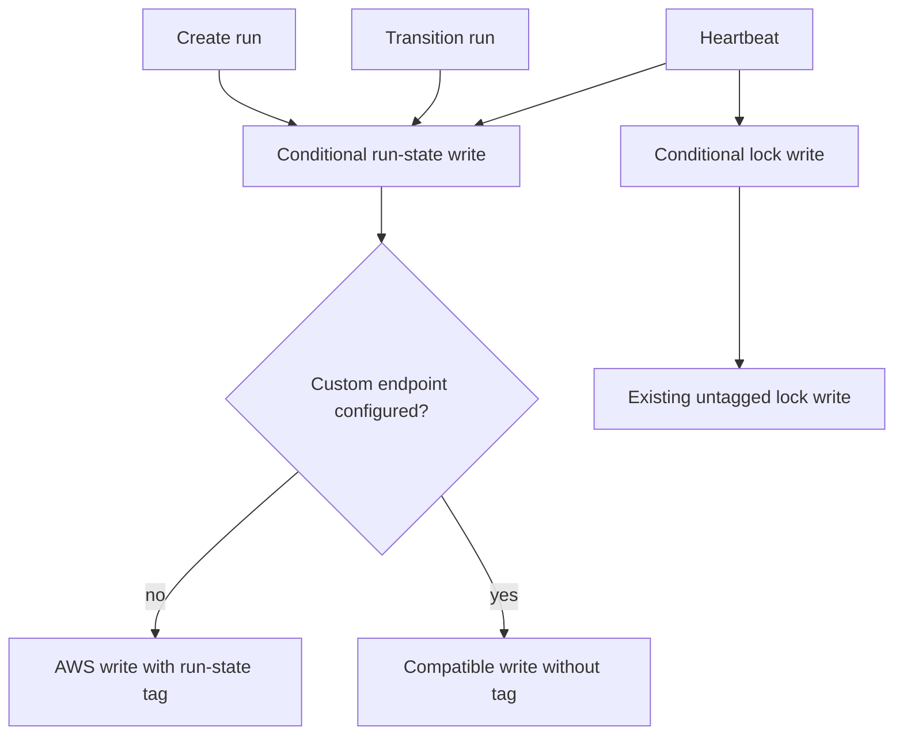

# feat: Tag run-state objects for S3 lifecycle retention

## Overview

Classify AWS S3 run-state objects with the exact tag `object-type=run-state`. Infrastructure can then bound future run-state growth with one tag-filtered lifecycle rule without changing storage keys or adding application-owned retention behavior. Custom S3-compatible endpoints remain untagged because Cloudflare R2 rejects object tags on `PutObject`.

This repository change is the application-side enabler, not the completed retention outcome. Retention becomes active only after infrastructure proves tagged writes and installs the exact lifecycle filter.

## Problem Frame

Run-state objects share the object-store namespace with artifacts, bindings, locks, metadata, sessions, and subscriptions. S3 lifecycle rules can filter by prefix or object tag but cannot match a middle key segment such as `*/runs/*`. A broad prefix would endanger unrelated state, while one rule per repository would require permanent discovery and drift management.

Unbounded `runs/` prefixes also worsen a known correctness edge: `listWithMetadata` stops after 100 pages and sorts only the returned subset. Lifecycle retention bounds future growth but does not replace a separate pagination hardening task.

## Requirements Trace

- R1. New and rewritten AWS S3 run-state objects carry the exact `object-type=run-state` tag.
- R2. Run creation, every phase transition, and heartbeat persistence all preserve the tag across complete-object rewrites.
- R3. Locks, bindings, subscriptions, sessions, artifacts, metadata, and untagged conditional writes keep their current behavior.
- R4. R2, MinIO, and other configured custom endpoints omit object tags.
- R5. Conditional-write preconditions, lock-before-run heartbeat ordering, errors, encryption, logging, and ETag handling do not change.
- R6. Deployment guidance requires `s3:PutObjectTagging` before an AWS gateway starts the tagged runtime.
- R7. The change is prospective: it does not migrate existing objects or deploy a lifecycle rule.
- R8. Infrastructure proves tagged-write permission and lifecycle filter selection before deploying or activating retention; unrelated objects remain outside the filter.

## Scope Boundaries

- Do not create, update, or deploy the lifecycle rule in this repository.
- Do not select the retention window.
- Do not backfill tags onto existing terminal run-state objects.
- Do not change object keys or migrate stored data.
- Do not fix `listWithMetadata` pagination in this work.
- Do not add a custom-endpoint tagging capability flag.
- Do not add a generic tag registry or tag unrelated object types.

### Deferred to Separate Tasks

- Lifecycle rule deployment and retention configuration: `marcusrbrown/infra#729`.
- Pagination hardening for `listWithMetadata`: separate follow-up after lifecycle bounding is in place.
- Optional cleanup of the finite pre-release untagged run-state set: infrastructure follow-up if operational evidence justifies it.

## Context & Research

### Relevant Code and Patterns

- `packages/runtime/src/object-store/types.ts` defines the shared `ObjectStoreAdapter` contract and conditional-write options.
- `packages/runtime/src/object-store/s3-adapter.ts` maps conditional writes to AWS `PutObjectCommand`. It already uses `endpoint != null` as a custom-provider boundary for encryption behavior.
- `packages/runtime/src/object-store/s3-adapter.test.ts` captures generated SDK command inputs and is the contract-test seam for headers and preconditions.
- `packages/runtime/src/coordination/run-state.ts` owns run creation, valid phase transitions, run keys, and CAS writes.
- `packages/runtime/src/coordination/heartbeat.ts` renews the lock before rewriting run state; that order is the split-brain safety boundary.
- `packages/runtime/src/coordination/run-state.test.ts` and `packages/runtime/src/coordination/heartbeat.test.ts` already mock the shared adapter and pin conflict/failure behavior.
- `deploy/README.md` documents the gateway S3 credential and deployment contract.

### Institutional Learnings

- No existing `docs/solutions/` entry covers S3 object tagging or lifecycle filters.
- Existing project invariants require injected adapters, recoverable result propagation, readonly interfaces, explicit booleans, and no type suppression.
- Coordination writes are safety-sensitive: lock ownership, CAS preconditions, and lock-before-run ordering must remain visible in tests.

### External References

- AWS `PutObject` accepts URL-query encoded object tags through `x-amz-tagging` and requires `s3:PutObjectTagging` in addition to `s3:PutObject`.
- AWS lifecycle filters match exact object tag key/value pairs.
- A full S3 object rewrite must resend the tag or the replacement loses it.
- Cloudflare R2 documents `x-amz-tagging` as unsupported on `PutObject`.

## Key Technical Decisions

- KTD1. Gate automatic tagging at the adapter's existing provider boundary. AWS S3 is the only target that receives the tag; configured custom endpoints preserve their current request shape.
- KTD2. Extend conditional-write options additively with optional readonly tagging metadata as a raw, already URL-query encoded string matching the AWS SDK contract. `undefined` and an empty string both omit the header. The adapter does not encode structured tags, and only trusted internal constants supply values. Existing callers remain source- and behavior-compatible.
- KTD3. Keep one run-state tag constant in the run-state module and reuse it from heartbeat. The classification stays near the object type it describes without creating a generic registry.
- KTD4. Resend the tag on every full run-state write. Creation, phase transitions, and heartbeat persistence all participate so active and terminalized objects do not lose classification.
- KTD5. Fail closed on AWS tag errors. Do not retry an untagged write because that would silently defeat lifecycle selection.
- KTD6. Make permission rollout an external prerequisite. The AWS writer must receive `s3:PutObjectTagging` before the tagged runtime is deployed.

## Open Questions

### Resolved During Planning

- Should custom endpoints receive tags when some providers support them? No. R2 explicitly rejects the header, and the target lifecycle mechanism is AWS only. A future explicit capability may add opt-in support if needed.
- Should legacy terminal objects be backfilled? No. The issue is prospective; infrastructure may handle the finite legacy set separately.
- Should tag failures fall back to untagged writes? No. Silent fallback would violate the classification guarantee and hide IAM drift.
- Should the adapter accept structured key/value tags? No. The AWS SDK accepts a pre-encoded query string, and this change has one trusted constant. A structured abstraction adds encoding policy with no current consumer value.
- Does tagged `PutObject` require extra IAM? Yes. AWS documents `s3:PutObjectTagging` as a separate required action.

## High-Level Technical Design

> _This illustrates the intended approach and is directional guidance for review, not implementation specification. The implementing agent should treat it as context, not code to reproduce._

## Implementation Units

- [x] **Unit 1: Extend the conditional-write adapter contract**

**Goal:** Carry optional tagging metadata through the shared CAS boundary while preserving existing callers and custom-provider requests.

**Requirements:** R3, R4, R5

**Dependencies:** None

**Files:**

- Modify: `packages/runtime/src/object-store/types.ts`
- Modify: `packages/runtime/src/object-store/s3-adapter.ts`
- Test: `packages/runtime/src/object-store/s3-adapter.test.ts`

**Approach:**

- Add optional readonly tagging metadata to conditional-write options.
- Include it in AWS `PutObject` input only when no custom endpoint is configured.
- Preserve every existing command-input field and ETag normalization path.

**Execution note:** Test-first. Capture the AWS request and custom-endpoint request before changing the adapter.

**Patterns to follow:**

- Existing conditional-write command-capture tests in `s3-adapter.test.ts`.
- Existing custom-endpoint encryption branch in `s3-adapter.ts`.

**Test scenarios:**

- Happy path: AWS conditional write with requested tagging metadata produces a command containing the exact tag.
- Edge case: custom endpoint receives the same caller option but the generated command omits tagging.
- Regression: a caller that provides no tagging metadata remains untagged.
- Edge case: an empty tagging value is treated as absent rather than emitting an invalid header.
- Regression: create-only and compare-and-swap preconditions remain unchanged.

**Verification:**

- Adapter tests prove provider-specific inclusion and default omission without changing current conditional-write outcomes.

- [x] **Unit 2: Tag run creation and phase transitions**

**Goal:** Ensure every state-machine write, including terminalization, leaves the run-state object lifecycle-selectable on AWS.

**Requirements:** R1, R2, R3, R5, R7

**Dependencies:** Unit 1

**Files:**

- Modify: `packages/runtime/src/coordination/run-state.ts`
- Test: `packages/runtime/src/coordination/run-state.test.ts`

**Approach:**

- Define one exported run-state classification constant.
- Pass it beside the existing create-once precondition for creation.
- Pass it beside the current ETag precondition for every transition.

**Execution note:** Test-first. Update adapter-call expectations before adding tagging to production writes.

**Patterns to follow:**

- Existing `createRun` and `transitionRun` CAS option construction.
- Existing valid-transition and conflict tests.

**Test scenarios:**

- Happy path: run creation passes the exact tag and retains create-once semantics.
- Happy path: a valid non-terminal transition passes the tag and current ETag.
- Edge case: terminalization also passes the tag.
- Error path: transition conflicts and invalid transitions retain their current result/error behavior.

**Verification:**

- All run-state write tests observe one shared classification value while the state machine and ETag contract remain unchanged.

- [x] **Unit 3: Preserve the tag during heartbeat rewrites**

**Goal:** Prevent periodic persistence from stripping classification while keeping heartbeat lock safety intact.

**Requirements:** R1, R2, R3, R5, R7

**Dependencies:** Units 1 and 2

**Files:**

- Modify: `packages/runtime/src/coordination/heartbeat.ts`
- Test: `packages/runtime/src/coordination/heartbeat.test.ts`

**Approach:**

- Reuse the run-state classification constant on the run-state heartbeat write.
- Do not modify the preceding lock-renewal call or its options.

**Execution note:** Test-first. Pin run-state tagging and call order; retain the existing lock-write option coverage.

**Patterns to follow:**

- Existing heartbeat renewal sequence and fake-timer tests.
- Existing adapter mock that distinguishes keys and conditional options.

**Test scenarios:**

- Happy path: heartbeat renews the untagged lock, then writes tagged run state with the current ETag.
- Edge case: repeated heartbeat ticks continue to resend the tag.
- Error path: lock-renewal failure still prevents the run-state write.
- Error path: run-state write failure propagates through the current heartbeat failure channel.

**Verification:**

- Combined adapter, lock, and heartbeat tests prove the lock remains untagged and is renewed before every tagged run-state heartbeat write.

- [x] **Unit 4: Document the deployment contract**

**Goal:** Prevent an AWS deployment from activating tagged writes before its principal has permission to perform them.

**Requirements:** R4, R6, R7, R8

**Dependencies:** Unit 1 and the confirmed AWS/R2 behavior

**Files:**

- Modify: `deploy/README.md`

**Approach:**

- State the AWS `s3:PutObjectTagging` prerequisite.
- Explain that custom endpoints remain untagged.
- Record the rollout boundary with `marcusrbrown/infra#729` and keep retention policy ownership outside the application.
- Define the infra-side tagged-put preflight, exact-filter readback, negative object-selection check, and rollback ownership.

**Patterns to follow:**

- Existing S3 credential and external-infrastructure guidance in `deploy/README.md`.

**Test scenarios:**

- Test expectation: none -- this unit changes operator documentation only; formatting and link validation cover the artifact.

**Verification:**

- The deployment guide makes permission ordering and provider behavior clear without implying that this repository owns lifecycle deployment.

## System-Wide Impact

- **Interaction graph:** Run creation, transition, and heartbeat pass optional metadata through the shared object-store adapter. Lock writes and all other adapter callers remain on the default path.
- **Error propagation:** AWS tag rejection propagates through existing adapter and coordination result channels. No untagged fallback is introduced.
- **State lifecycle risks:** Creation and transition ETags must stay intact; heartbeat lock renewal must remain first; legacy terminal objects remain untagged.
- **API surface parity:** No Action input, gateway environment variable, operator contract, storage key, response shape, or schema version changes.
- **Integration coverage:** Adapter command-capture tests prove AWS/custom provider behavior; coordination tests prove all three run-state write paths; infra deployment proves the permission and lifecycle selector against the target bucket.
- **Unchanged invariants:** Locks remain untagged, CAS remains mandatory, custom endpoints keep their current request shape, and infrastructure owns retention.

## Risks & Dependencies

| Risk or dependency | Mitigation |
| --- | --- |
| AWS writer lacks `s3:PutObjectTagging` | Pre-grant the permission before deploying the tagged runtime. |
| R2 rejects `x-amz-tagging` | Omit tags whenever a custom endpoint is configured and test the generated request. |
| A full rewrite strips the tag | Cover creation, every transition, and heartbeat as separate test scenarios. |
| Shared CAS objects receive the run-state tag | Keep tagging opt-in per call and pin the untagged default and lock call. |
| Legacy terminal objects never expire | State prospective semantics and leave optional legacy handling to infrastructure. |
| Tag value drifts from lifecycle policy | Reuse one run-state constant and assert the exact value. |
| Lifecycle work hides the listing cap | Keep pagination hardening as a separate tracked follow-up. |
| Operators misclassify IAM drift as provider outage | Document a failure-decision path; never weaken tagging as a workaround. |

## Documentation / Operational Notes

- Update `deploy/README.md` with the AWS permission and rollout prerequisite.
- Merge/publish may precede the infrastructure change, but deployment of the tagged runtime to AWS must not.
- `marcusrbrown/infra#729` owns the deployment gate: perform a tagged test put and cleanup with the production principal before bumping the gateway image.
- After deployment, read back a new run-state object's exact tag, read back the lifecycle rule's exact filter, and prove a representative unrelated object does not match before activating retention.
- Inventory the count and age of pre-release untagged terminal objects. Treat any one-time cleanup as a separate explicit infra decision, not an implicit consequence of this release.
- If tagged writes fail with access-denied while ordinary S3 operations remain healthy, treat it as IAM drift: restore `s3:PutObjectTagging` or roll back the runtime. Do not retry untagged.
- If failures are timeouts, 5xx responses, or affect tagged and untagged S3 operations, use the existing provider-incident path; do not weaken tagging.
- If lifecycle selection is wrong, the infra operator disables and reads back removal of the rule before any cleanup or runtime rollback. If only runtime tagging is faulty, rolling back the runtime is sufficient and new writes become untagged until a corrected deployment.
- Do not rewrite historical RFCs or plans; they describe the pre-tagging design.

## Sources & References

- Related issue: [fro-bot/agent#1192](https://github.com/fro-bot/agent/issues/1192)
- Infrastructure dependency: [marcusrbrown/infra#729](https://github.com/marcusrbrown/infra/issues/729)
- External docs: [AWS S3 PutObject API](https://docs.aws.amazon.com/AmazonS3/latest/API/API_PutObject.html)
- External docs: [AWS S3 lifecycle filters](https://docs.aws.amazon.com/AmazonS3/latest/userguide/intro-lifecycle-filters.html)
- External docs: [Cloudflare R2 S3 compatibility](https://developers.cloudflare.com/r2/api/s3/api/)
- Related code: `packages/runtime/src/object-store/types.ts`
- Related code: `packages/runtime/src/object-store/s3-adapter.ts`
- Related code: `packages/runtime/src/coordination/run-state.ts`
- Related code: `packages/runtime/src/coordination/heartbeat.ts`
