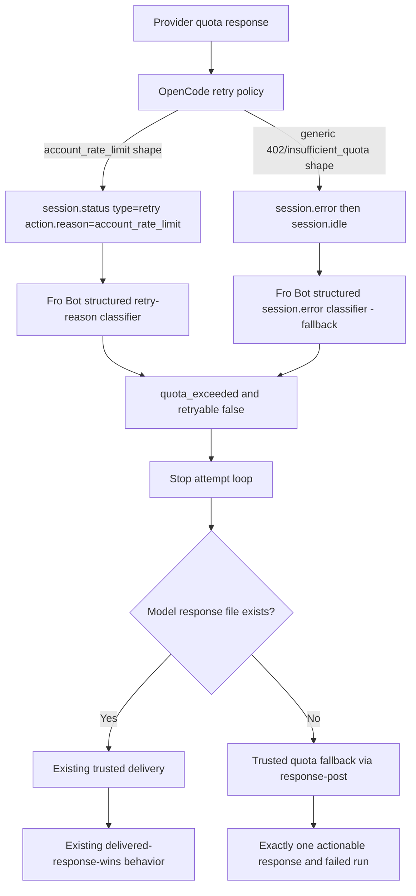

# fix: Fail fast on provider quota exhaustion

## Overview

Prevent provider quota exhaustion from leaving an operator waiting through a silent hang and an eventual Fro Bot
timeout. The user-visible outcome is a bounded run that delivers one safe, actionable failure response and stops
without another provider request. Unit 1's cross-version evidence gate is complete and disproves the original
missing-terminal-event hypothesis: OpenCode already emits a structured `session.status` retry event
(`status.type: 'retry'`, `action.reason: 'account_rate_limit'`) for account-level quota/backoff conditions, on the
exact production artifact, stock v1.17.20, and the current default harness alike. OpenCode intentionally treats
account quota as a long backoff, not a terminal failure — this is correct behavior for its interactive TUI, where a
human can wait out a multi-hour cooldown. Fro Bot's consumer treats any `session.status` event, including this one,
as activity only, so it never stops retrying and eventually hits its own global execution timeout instead of failing
fast. The fix is entirely a Fro Bot consumer-side change: classify the structured `account_rate_limit` retry reason as
terminal for Action runs, stop waiting, and deliver one actionable non-retryable `quota_exceeded` failure. No
OpenCode/harness patch, upstream PR, carry, or harness release is required or in scope.

## Problem Frame

Run [thejustinwalsh/three-flatland#29180223942](https://github.com/thejustinwalsh/three-flatland/actions/runs/29180223942)
used `@fro.bot/harness@1.17.18-harness.4ec05a47` with provider `opencode-go/minimax-m3/ai-sdk` and logged an OpenCode
`AI_APICallError` at `06:04:39.536`:

> Weekly usage limit reached. Resets in 17hr 56min. To continue using this model now, enable usage from your available
> balance.

Fro Bot received no terminal `session.error` and remained blocked until its 4,800,000 ms execution timeout at
`07:24:36`. Unit 1's evidence gate reproduced the exact production shape and proved what actually happens on the wire:

- The exact production response is a **retryable HTTP 429** whose `responseBody` contains a `GoUsageLimitError`, with
  root-level `metadata.workspace` / `metadata.limitName`, and `retry-after: 64560` (seconds, ≈ 17h 56m — matching the
  production log's stated reset window exactly).
- On the exact legacy artifact (`1.17.18-harness.4ec05a47`), stock `opencode-ai@1.17.20`, and the current default
  harness (`1.17.20-harness.b78cc9e1`), this response produces the identical structured event:
  `session.status` with `status.type: 'retry'`, `status.action.reason: 'account_rate_limit'`, and
  `status.next` set roughly 17h56m in the future. No `session.error` and no `session.idle` are emitted during the
  observation window on any of the three artifacts — this is intentional long-backoff behavior, not a bug.
- Separately, a generic non-retryable `402 insufficient_quota` fixture (no `account_rate_limit` framing) does emit a
  structured `session.error` followed by `session.idle` on all three artifacts. OpenCode already handles the generic
  non-retryable quota shape correctly; it is not the production failure mode and needs no producer-side fix.

The failure is therefore entirely a client-side classification gap, not a propagation gap:

1. OpenCode already turns the production quota condition into a structured, typed event
   (`session.status`/`retry`/`account_rate_limit`) — this is intentional design, not a defect, and changing it would
   harm interactive TUI usability.
2. Fro Bot must recognize this specific structured retry reason as terminal for non-interactive Action runs, stop
   retrying, classify it as permanent `quota_exceeded`, and deliver one actionable failure response instead of waiting
   out a multi-hour backoff against a hard execution timeout.

## Requirements Trace

- **R1 — Exact reproduction:** ✅ Complete. Reproduced both the production 429/`GoUsageLimitError`/`account_rate_limit`
  envelope and the generic 402/`insufficient_quota` envelope; observed OpenCode's event stream, session status, and
  terminal state on the production-era, stock, and current-default binaries for both.
- **R2 — Structured retry-reason classification (primary path):** Fro Bot must recognize the
  `session.status`/`type: 'retry'`/`action.reason: 'account_rate_limit'` event as a terminal, non-retryable quota
  condition for Action runs. This is the primary classification path; message/text matching against `session.error`
  variants is a fallback only, used when the canonical structured retry reason is absent (e.g. a genuine
  `session.error` quota shape).
- **R3 — No producer-side change:** OpenCode's structured retry/backoff behavior is correct and intentional for its
  interactive use. No OpenCode patch, upstream PR, or harness carry is required; Fro Bot must not attempt to shorten,
  reinterpret, or scrape around it at the transport level.
- **R4 — Narrow taxonomy:** Add only `quota_exceeded`; preserve existing `rate_limit`, `llm_fetch_error`, and
  `configuration` behavior for transient or unrelated failures. Unknown terminal provider failures must still fail
  fast generically; quota classification controls guidance, not whether termination occurs. A false-positive risk
  exists at the boundary between `account_rate_limit` (permanent-until-reset account quota) and ordinary transient
  `rate_limit` conditions — only the exact structured reason string terminates the run; nothing else does.
- **R5 — Permanent failure semantics:** Quota exhaustion (via either the `account_rate_limit` retry-status path or a
  generic structured `session.error` quota shape) must be non-retryable and must not trigger a continuation prompt or
  another model request.
- **R6 — Duplicate-safe event consumption:** Equivalent `session.error`, `message.updated.info.error`, and the
  terminal `account_rate_limit` retry-status events must produce exactly one terminal error. Ordinary transient retry
  parts/status events continue to enrich activity metadata only and must not become terminal errors.
- **R7 — One trusted response:** PR and issue runs must deliver one actionable quota response through the existing
  trusted response-file surface, including when the model never created its response file.
- **R8 — Red failed run:** A quota-limited invocation must end with a failed Actions result after its error response
  is delivered. A valid model-authored response that was delivered before an unrelated later failure keeps the
  existing delivered-response-wins behavior.
- **R9 — Safe diagnostics:** User-visible output may include only the stable error category, the provider name from
  trusted configuration, a normalized reset duration parsed from an allowlisted form (including `status.next` /
  `retry-after`), and fixed remediation text. It must not echo raw provider messages, response bodies, headers,
  credentials, account identifiers, workspace/limitName metadata, or payload-supplied provider names.
- **R10 — No timeout workaround:** Do not scrape OpenCode logs, shorten the general first-token timeout, or infer
  quota from silence. Correct structured-event classification is required, not heuristics.
- **R11 — Normal release sequence only:** No harness release, default-version sync, or upstream public gate is part of
  this fix. The Action ships through the normal Action semantic-release process once its own PR is reviewed and
  merged.

## Scope Boundaries

### In scope

- Structured `session.status`/`retry`/`account_rate_limit` classification as terminal, non-retryable
  `quota_exceeded` for Action runs.
- Structured SDK error parsing (existing `session.error`/`APIError`/`UnknownError` path) and a new `quota_exceeded`
  `ErrorType`, retained as a fallback for genuine terminal `session.error` quota shapes.
- Non-retryable quota behavior in streaming, polling, retry, and execution finalization.
- Trusted fallback error delivery when the model produced no response file.
- Regression coverage for duplicate terminal events, transient-retry preservation, and the
  `account_rate_limit`-vs-transient-`rate_limit` boundary.
- Regenerated committed `dist/` and release verification (through normal Action release only).

### Deferred

- Broad provider-error taxonomy (`auth_error`, `overloaded`, `aborted`, and output-length categories).
- Redesigning all OpenCode retry/status observability.
- Parsing tool-level errors as session failures.
- Changing global inactivity, execution, or job timeouts.
- Live consumption of a real provider quota in CI.
- Infrastructure, billing, account, or provider-credential changes.

### Explicitly out of scope (resolved by Unit 1 evidence)

- Any OpenCode/upstream patch, PR, or harness carry for terminal-event propagation. The evidence gate proved OpenCode
  already propagates both the production `account_rate_limit` shape and the generic `insufficient_quota` shape
  correctly at the transport layer; there is no producer defect to fix.
- Harness release and default-version sync as part of this fix's release sequence.

## Context & Research

### Repository Patterns

- `src/features/agent/streaming.ts` consumes `session.error`, `message.updated`, `message.part.updated`,
  `session.status`, and `session.idle`. It currently treats all `session.status` events, including retry status with
  `action.reason: 'account_rate_limit'`, as generic activity and never treats them as terminal.
- `src/features/agent/retry.ts` currently sets `shouldRetry` from the presence of `llmError`, not
  `llmError.retryable`.
- `src/features/agent/session-poll.ts` owns inactivity and terminal polling. It must not be turned into a quota
  detector; it must instead observe the terminal `ErrorInfo` that streaming now stores.
- `packages/runtime/src/agent/error-format/` owns `ErrorInfo`, labels, icons, and error factories. `rate_limit`
  already exists and remains distinct from exhausted account quota. `src/features/comments/error-format.ts` is a
  pre-existing, independently drifted duplicate of this module (and `packages/runtime/src/agent/types.ts` separately
  redeclares `ErrorInfo`/`ErrorType` a third time); Unit 3 consolidates all three onto the runtime module as
  canonical (KTD3a) before adding `quota_exceeded`, rather than forking the duplication further.
- `src/harness/phases/finalize.ts` enforces response delivery. File-convention runs currently attempt response-file
  delivery before inspecting `execution.llmError`, so a pre-response quota failure becomes a generic delivery failure.
- `src/features/agent/response-post.ts` is the trusted, event-bound one-response writer. Quota fallback must reuse
  this surface rather than call an ad hoc comment writer.
- Root `dist/` is committed and must be regenerated by the normal build.

### External Research (verified against source)

- `.slim/clonedeps/repos/anomalyco__opencode/packages/opencode/src/session/retry.ts:68-121` — the OpenCode retry
  policy that classifies account-level quota/rate conditions and emits `session.status` with `type: 'retry'` and
  `action.reason: 'account_rate_limit'`, computing `status.next` from the provider's `retry-after` value. This is the
  authoritative source confirming the behavior is intentional backoff scheduling, not an unhandled error path.
- AI SDK documents that `streamText` represents streaming errors as `error` parts; `onError` is a diagnostic callback,
  not a replacement for consuming the terminal stream result. (Relevant to the generic `session.error` fallback path
  only — not implicated in the production failure.)
- Earlier candidate upstream PR #25575 is closed unmerged and is not relevant: no upstream change is needed for this
  fix.

### Production Artifact Evidence

- Run [29180223942](https://github.com/thejustinwalsh/three-flatland/actions/runs/29180223942), artifact
  `opencode-logs-29180223942-1`: `@fro.bot/harness@1.17.18-harness.4ec05a47`, provider
  `opencode-go/minimax-m3/ai-sdk`. `opencode.log` shows the provider's weekly-limit message with a 17h56m reset window
  at `06:04:39.536`, consistent with the reproduced `retry-after: 64560` seconds.
- Unit 1 probe fixtures (durable, non-account-dependent) reproduce this exact response shape (429,
  `GoUsageLimitError`, root `metadata.workspace`/`metadata.limitName`, `retry-after: 64560`) against the pinned
  `1.17.18-harness.4ec05a47`, stock `opencode-ai@1.17.20`, and current default harness artifacts, confirming identical
  `session.status`/`retry`/`account_rate_limit` output on all three.

### Institutional Learnings

- Terminal errors must be typed and propagated; silence is not an error category.
- Not every unhandled-looking condition is a producer defect — verify against the exact artifact and source before
  assuming a missing terminal event; this plan initially hypothesized a producer bug that the evidence gate disproved.
- Retry and watchdog behavior must be bounded by explicit failure semantics, not lower global timeouts.
- Structured event classification takes priority over message matching; message matching is a compatibility fallback
  only.

## Key Technical Decisions

### KTD1 — A cross-version probe decides the fix location (resolved)

The first implementation unit exercised the exact server contract on the production-era binary, current stock
v1.17.20, and the published harness, using both the production-derived 429/`GoUsageLimitError` fixture and a generic
402/`insufficient_quota` fixture. **Result:** all three artifacts behave identically and correctly for both fixtures.
The production shape produces intentional long-backoff `session.status`/`retry`/`account_rate_limit` with no
`session.error`/`session.idle`; the generic shape produces a proper `session.error`/`session.idle` pair. This closes
the server branch: the fix is 100% consumer-side.

**Trade-off:** The proof step before coding cost one implementation unit, but it correctly redirected the entire fix
away from a speculative, unnecessary OpenCode carry and toward the real defect in Fro Bot's own event classification.

### KTD2 — No server change; OpenCode's backoff behavior is preserved as-is

OpenCode's account-quota backoff is deliberate product behavior appropriate for its primary interactive use (a human
operator can wait out a multi-hour reset). Fro Bot must not request, carry, or work around a change to this behavior.

**Trade-off:** Fro Bot's consumer must carry the responsibility of recognizing non-interactive context and converting
an intentionally-long producer backoff into a fast Action failure, rather than pushing that judgment upstream.

### KTD3 — Add one terminal category: `quota_exceeded`

Quota exhaustion is distinct from transient rate limiting. Two producer shapes map to `quota_exceeded` with
`retryable: false`:

1. **Primary:** structured `session.status` with `status.type: 'retry'` and `status.action.reason:
   'account_rate_limit'` (the verified production shape).
2. **Fallback:** structured `session.error`/`APIError`/`UnknownError` carrying status `402`, `insufficient_quota`,
   `usage_not_included`, weekly usage-limit messaging, exhausted credit/balance messaging, or equivalent bounded
   provider signals.

Ordinary HTTP `429` / transient rate-limit retry statuses without the `account_rate_limit` reason remain `rate_limit`
and continue to retry normally.

**Trade-off:** A narrow category leaves broader auth/overload cleanup for later, but keeps #1206 reviewable and avoids
turning one production bug into an error-taxonomy rewrite.

### KTD3a — Runtime error-format is canonical; Action layer re-exports it (approved consolidation)

Unit 3's file discovery found `packages/runtime/src/agent/error-format/` and `src/features/comments/error-format.ts`
as two independent, drifted implementations of `ErrorInfo`, `ErrorType`, `createErrorInfo`, `formatErrorComment`, and
the shared error factories — a pre-existing duplication this fix must not deepen by adding `quota_exceeded` twice.
`packages/runtime/src/agent/types.ts` also declares its own local `ErrorInfo`/`ErrorType`, a third divergent copy.
The approved resolution: the runtime package (`packages/runtime/src/agent/error-format/`) becomes the single
canonical implementation; `packages/runtime/src/agent/types.ts` imports/re-exports the canonical types instead of
redeclaring them; and `src/features/comments/error-format.ts` becomes a thin re-export of the runtime formatter,
constants, and factories, preserving its existing public surface for `src/features/comments/index.ts` and other
Action-layer callers. The duplicate implementation and its now-redundant test cases are deleted only after the
runtime version is confirmed to cover every behavior used by live callers. The canonical runtime
`createAgentError` guidance remains unchanged; the unused oMo-specific wording from the drifted Action copy is not
adopted.

**Trade-off:** Doing this consolidation inside Unit 3 (rather than deferring it) costs one implementation unit more
scope than a minimal quota-only patch, but adding a third quota-aware error-format fork would have made the existing
duplication materially worse and harder to unwind later. The divergent `createAgentError` wording is resolved in
favor of the implementation already used by live streaming code rather than changing user-facing behavior as part
of this fix.

### KTD4 — Structured fields win; text is a bounded fallback

The classifier reads allowlisted SDK/event fields first, in priority order: (1) `session.status` retry
`action.reason`, (2) structured `session.error` name/status/stable code/retryability, and only then (3) a bounded
message used solely for classification as a `session.error` fallback. User-visible output is constructed from fixed
guidance, trusted provider configuration, and a normalized allowlisted reset duration (`status.next` or
`retry-after`) — never raw messages, provider-supplied names, response headers, bodies, workspace/limitName metadata,
or other unknown payload fields.

**Trade-off:** Structural parsing across two event shapes is more code than a single regex path, but it matches
OpenCode's actual verified event contract and avoids false positives against transient `rate_limit` retries.

### KTD5 — First terminal signal wins; only the exact structured reason terminates

`session.error` remains canonical when present. The `account_rate_limit` retry-status event is *also* treated as
terminal — despite being a "retry" event by OpenCode's own type — specifically and only when
`action.reason === 'account_rate_limit'`; no other retry reason, and no bare `session.status`/`retry` event, is ever
promoted to terminal. `message.updated.info.error` remains a defensive fallback. Equivalent terminal events are
deduplicated per session.

**Trade-off:** Treating one specific retry-status shape as terminal is an intentional asymmetry from OpenCode's own
"retry" typing, and must be guarded tightly (exact reason-string match only) to avoid misclassifying transient
backoff as permanent failure.

### KTD6 — Retry decisions use `ErrorInfo.retryable`

`runPromptAttempt` retries only when the classified error explicitly permits it. Permanent quota failure (from either
the `account_rate_limit` path or the `session.error` fallback path) exits the outer attempt loop before a
continuation prompt or another provider call.

**Trade-off:** This changes an existing presence-based behavior, so transient fetch/rate-limit tests must prove
retries remain intact.

### KTD7 — Trusted fallback delivery preserves the one-response invariant

`runResponsePost` accepts a discriminated content source: `{kind: 'model-file', responseFilePath}` or
`{kind: 'trusted-fallback', body}`. The model-file branch retains existing parsing. The trusted-fallback branch
receives only harness-formatted safe copy, derives the bound target and response surface itself, and never accepts a
target, verdict, review event, or provider payload from its caller. On a `pull_request` surface it submits a
head-SHA-guarded GitHub `COMMENT` review. It does not post a second ad hoc comment.

**Trade-off:** The response-post contract gains a fallback input/result distinction, but the trusted writer remains
the single delivery authority.

### KTD8 — Quota fallback delivery still fails the run

After a trusted quota fallback is delivered, the Action reports failure. If a valid model-authored response was
already delivered before a later execution failure, the current delivered-response-wins behavior remains unchanged.

**Trade-off:** Quota runs become visibly red instead of green-with-comment, which is intentional operator signaling.

### KTD9 — No inference from silence

The general inactivity watchdog is unchanged. This fix acts on an explicit structured event
(`account_rate_limit`), never on elapsed silence; it does not justify a shortened timeout or log-file parser.

**Trade-off:** Correctness depends on recognizing the exact structured signal OpenCode already emits, rather than
masking absence of progress with a timing heuristic.

## Open Questions

### Resolved

- **Does the production run prove OpenCode fails to propagate terminal errors?** No. Unit 1 proved OpenCode correctly
  and intentionally emits a structured `account_rate_limit` retry-status event with no `session.error`/`session.idle`
  by design; there is no propagation defect.
- **Is an OpenCode patch/carry/harness release required?** No. All three tested artifacts (production-era, stock
  current, published current harness) behave identically and correctly. Unit 2 is skipped as a no-op.
- **Should quota reuse `rate_limit`?** No. Rate limiting is transient; exhausted quota (via `account_rate_limit` or a
  generic quota `session.error`) is permanent until operator action.
- **Should ordinary retry parts/status events terminate the run?** No. Only the exact
  `action.reason === 'account_rate_limit'` structured retry-status shape is terminal; all other retry activity
  continues to enrich activity metadata only.
- **Should the fix shorten the inactivity timeout?** No.
- **Should file-convention runs bypass trusted delivery for errors?** No.

### Deferred to Implementation

- **Exact `session.status` field access path in the SDK event types:** Unit 4 confirms the concrete TypeScript shape
  exposed by `@opencode-ai/sdk` for `status.action.reason` and `status.next` before wiring the classifier.
- **Minimum fixed runtime:** Not applicable — no runtime requires a fix; current default harness is unchanged.

## High-Level Technical Design

The diagram expresses intended boundaries, not exact method signatures.

## Implementation Units

- [x] **Unit 1: Build the cross-version terminal-error evidence gate**
  - **Goal:** Determine whether production-era and current OpenCode binaries surface a quota response as a bounded,
    structured terminal failure, and identify the exact production event shape.
  - **Requirements:** R1
  - **Dependencies:** None.
  - **Status:** Complete. Verified against `@fro.bot/harness@1.17.18-harness.4ec05a47` (production-pinned),
    `opencode-ai@1.17.20` (stock), and `@fro.bot/harness@1.17.20-harness.b78cc9e1` (current default harness).
  - **Verified matrix (RED/GREEN evidence):** The negative control first asserted that the production-derived 429
    fixture must produce `session.error` and `session.idle`; it failed on all three artifacts because each emitted the
    same long-backoff `account_rate_limit` retry status without terminalizing. The final characterization assertions
    then pin that verified producer contract while the 402 positive control pins OpenCode's real terminal path.

    | Artifact | Fixture: production 429 `GoUsageLimitError` (`retry-after: 64560`) | Fixture: generic 402 `insufficient_quota` |
    | --- | --- | --- |
    | `1.17.18-harness.4ec05a47` (production) | GREEN — `session.status`/`retry`/`action.reason=account_rate_limit`, `status.next` ≈ +17h56m; no `session.error`/`session.idle` observed | GREEN — `session.error` then `session.idle` |
    | `opencode-ai@1.17.20` (stock) | GREEN — identical `account_rate_limit` retry-status shape | GREEN — `session.error` then `session.idle` |
    | `1.17.20-harness.b78cc9e1` (current default) | GREEN — identical `account_rate_limit` retry-status shape | GREEN — `session.error` then `session.idle` |

    All three artifacts are behaviorally identical for both fixtures. The negative control's RED result disproves the
    plan's original missing-terminal-event hypothesis: OpenCode intentionally treats account-level quota as a long
    backoff (`session.status`/`retry`), which is correct for interactive use but is consumed by Fro Bot as generic
    activity, letting the run coast to its own global execution timeout instead of failing fast. The final GREEN
    characterization records that upstream contract rather than weakening the desired Fro Bot behavior.
  - **Pinned artifact specs:** `@fro.bot/harness@1.17.18-harness.4ec05a47`, `opencode-ai@1.17.20`,
    `@fro.bot/harness@1.17.20-harness.b78cc9e1`; fixture provider `opencode-go/minimax-m3/ai-sdk`-shaped
    OpenAI-compatible endpoint with `retry-after: 64560`.
  - **Source confirmation:**
    `.slim/clonedeps/repos/anomalyco__opencode/packages/opencode/src/session/retry.ts:68-121` implements the
    `account_rate_limit` classification and `status.next` scheduling that produced the observed events.
  - **Verification:** Result selects the no-carry branch with captured event evidence recorded above; Unit 2 is
    skipped as a result.

- [x] **Unit 2: Repair OpenCode terminal propagation when the current runtime fails** — **Skipped (no-op), evidence-based**
  - **Goal (original):** Ensure generic AI SDK stream errors reach the existing OpenCode processor halt path and
    terminal session events.
  - **Disposition:** Definitively skipped. Unit 1's matrix shows no failing artifact on either fixture path across
    production-era, stock, and current-default binaries — the RED condition that would have justified this unit never
    occurred. There is no upstream PR, carry, harness release, or default-version sync in this plan.
  - **Why no producer change belongs here:** OpenCode's `account_rate_limit` long-backoff behavior
    (`retry.ts:68-121`) is intentional and correct for its primary interactive TUI use case, where a human can choose
    to wait out a multi-hour reset. Changing it to emit `session.error` unconditionally would degrade that
    interactive behavior for all OpenCode users to work around a Fro Bot-specific non-interactive constraint. The
    correct layering is: OpenCode continues emitting its honest structured retry-status signal; Fro Bot, which knows
    it is running a bounded non-interactive Action job, is the layer responsible for deciding that a 17+ hour backoff
    is unacceptable and converting it into a fast, actionable failure. All remaining requirements/units 3-7 build only
    this consumer-side classification.

- [x] **Unit 3: Consolidate on runtime error-format as canonical, then add narrow structured quota classification**
  - **Goal:** Resolve the pre-existing `ErrorInfo`/error-factory duplication between
    `packages/runtime/src/agent/error-format/` and `src/features/comments/error-format.ts` in favor of the runtime
    implementation as the canonical source while preserving the Action's historical `createAgentError` guidance
    behind a narrow compatibility wrapper, then convert both the primary `account_rate_limit` retry-status signal and
    the fallback structured/text quota `session.error` signal into one actionable non-retryable `ErrorInfo`.
  - **Requirements:** R2, R4, R5, R9
  - **Dependencies:** Unit 1 fixtures. Independent of Unit 2 (skipped).
  - **Files:**
    - **Modify:** `packages/runtime/src/agent/error-format/types.ts` — add `quota_exceeded` to `ERROR_TYPES`.
    - **Modify:** `packages/runtime/src/agent/error-format/format.ts` — add quota classification/formatting; this
      remains the one canonical implementation of `ErrorInfo`, `ErrorType`, `createErrorInfo`, `formatErrorComment`,
      and the error factories (`createRateLimitError`, `createLLMTimeoutError`, `createLLMFetchError`,
      `createAgentError`, `isLlmFetchError`, `isAgentNotFoundError`).
    - **Modify:** `packages/runtime/src/agent/types.ts` — replace the locally-declared `ErrorInfo`/`ErrorType` with an
      import/re-export of the canonical types from `error-format/types.ts` so the package has exactly one
      `ErrorInfo` shape.
    - **Modify:** `packages/runtime/src/agent/index.ts` only when the integration boundary needs a new export.
    - **Modify:** `src/features/comments/error-format.ts` — re-export the runtime formatter, constants, and factories
      while retaining only the Action-specific `createAgentError` compatibility wrapper required to preserve its
      historical oMo guidance.
    - **Migrate:** `src/features/comments/error-format.test.ts` — move test cases that exercise now-deleted local
      logic to a colocated runtime test file (`packages/runtime/src/agent/error-format/format.test.ts` or existing
      equivalent); keep in `src/features/comments/error-format.test.ts` only a thin smoke test proving the re-export
      surface still resolves correctly for existing callers.
    - **Retain:** The Action-specific `createAgentError` compatibility assertions; delete only cases fully covered by
      the migrated runtime tests.
    - **Test:** Colocated runtime error-format tests (primary), plus the thin re-export smoke test above.
  - **Approach:** Add `quota_exceeded` to the existing error union and display maps. Primary path: recognize
    `status.action.reason === 'account_rate_limit'` from a structured retry-status input and classify it
    non-retryable, deriving the reset guidance from `status.next`. Fallback path: parse allowlisted `session.error`
    SDK fields (name, status, stable code, retryability, bounded classification-only message); recognize status 402
    and explicit exhausted-quota codes/messages; preserve HTTP 429 without the `account_rate_limit` reason as
    `rate_limit`. Build output from fixed guidance, trusted provider configuration, and a normalized allowlisted reset
    duration without retaining or echoing raw provider payloads.
  - **Execution note:** Keep the parser provider-neutral and avoid unrelated auth/overload categories. The
    `account_rate_limit` reason string must match exactly — do not pattern-match on partial/prefix strings.
    Preserve the canonical runtime `createAgentError` behavior and generic suggested action unchanged. Preserve the
    Action's historical oMo-specific wording only in its narrow compatibility wrapper; do not introduce a variant
    argument into the runtime contract.
  - **Patterns to follow:** Existing error factories, readonly `ErrorInfo`, explicit booleans, and redacted logger
    boundaries.
  - **Test scenarios:**
    - `session.status`/`retry` with `action.reason: 'account_rate_limit'` becomes non-retryable `quota_exceeded` with
      a normalized reset duration derived from `status.next`.
    - `session.status`/`retry` with any other `action.reason` (or none) does not become `quota_exceeded`.
    - Structured `APIError` with 402 or `insufficient_quota` becomes non-retryable `quota_exceeded` (fallback path).
    - Structured or string `UnknownError` containing the production weekly-limit fixture becomes `quota_exceeded`
      (fallback path).
    - `usage_not_included`, exhausted credits, and available-balance guidance classify as quota (fallback path).
    - HTTP 429 without `account_rate_limit` and ordinary rate-limit messages remain `rate_limit`.
    - Fetch, auth, overloaded, arbitrary, empty, and malformed values do not become quota.
    - Unknown terminal provider errors remain bounded generic failures rather than hangs.
    - Raw messages, payload-supplied provider names, response bodies, headers, workspace/limitName metadata, and
      account identifiers are absent from `ErrorInfo`, logs, and user-visible output.
    - The runtime `quota_exceeded` factory/classifier has dedicated colocated unit tests (both the
      `account_rate_limit` primary path and the structured/text fallback path) independent of any Action-layer test.
    - `src/features/comments/error-format.ts`'s compatibility surface still resolves and behaves identically for
      existing callers after the shared implementations move to runtime.
    - The canonical runtime and Action compatibility `createAgentError` messages remain unchanged after
      consolidation.
  - **Verification:** Tests prove classification boundaries (both paths), actionable formatting without broad
    taxonomy changes, and that the Action-layer compatibility surface preserves its historical behavior.

- [x] **Unit 4: Consume the structured terminal signal once**
  - **Goal:** Treat the specific `account_rate_limit` retry-status event as terminal for Fro Bot while preserving
    OpenCode's normal transient retry handling, and preserve the structured `session.error` fallback path.
  - **Requirements:** R2, R5, R6, R9
  - **Dependencies:** Unit 3.
  - **Files:**
    - **Modify:** `src/features/agent/streaming.ts`.
    - **Modify:** `src/features/agent/session-poll.ts` and `src/features/agent/retry.ts` for poll-only and v2-wait
      parity.
    - **Modify:** Shared activity/error tracker types in the existing agent streaming/polling seam.
    - **Test:** Colocated streaming tests and existing event-stream fixtures.
  - **Approach:** Subscribe to `session.status` alongside existing `session.error`/`message.updated`/
    `message.part.updated`/`session.idle` handling. On a `session.status` event where `status.type === 'retry'` and
    `status.action.reason === 'account_rate_limit'`, classify it via Unit 3's primary path, store the resulting
    `ErrorInfo` as the terminal error for the session (deduplicated against any existing terminal error), and signal
    the existing poll loop to stop after its bounded grace rather than waiting for `status.next` to elapse. REST
    polling uses the same classifier so a missed SSE event cannot degrade to timeout, and v2 wait treats quota's
    terminal signal as failure rather than successful completion. All other `session.status` events
    (including other retry reasons and non-`account_rate_limit` backoff) continue to update activity/attempt metadata
    only and do not terminate the loop — this preserves OpenCode's normal transient retry handling unchanged. Keep the
    existing `session.error` structural/text parse as the generic quota fallback. A quota classification may upgrade
    an earlier generic error, but no later generic signal may downgrade quota. OpenCode v1.17.20 publishes
    `session.error` before persisting the same error on the assistant message, so `message.updated.info.error` is a
    duplicate persistence surface and needs no parser here. Ordinary structured 429 errors remain retryable.
  - **Execution note:** Guard the reason match with an exact string comparison; do not subscribe to broader new status
    surfaces beyond what this exact contract requires.
  - **Patterns to follow:** Directory-scoped SSE filtering, explicit property guards, bounded logger fields, and
    quota-priority terminal state.
  - **Test scenarios:**
    - `session.status`/`retry`/`account_rate_limit` produces one non-retryable `quota_exceeded` terminal error and the
      stream/poll returns immediately without waiting for `status.next`.
    - `session.status`/`retry` with any other reason (or ordinary transient rate-limit backoff) does not terminate the
      loop and continues to be treated as activity.
    - Structured quota `session.error` (fallback shape) still creates one non-retryable error when no
      `account_rate_limit` status was already observed.
    - Either arrival order (retry-status vs. session.error) produces exactly one terminal error, not two.
    - Poll-only account quota produces the same authoritative `quota_exceeded` attempt result as SSE.
    - v2 wait cannot convert quota's terminal signal into successful completion.
    - An earlier generic string error can be upgraded by later structured quota evidence.
    - A transient fetch error keeps existing retryable behavior.
    - Events from another session are ignored.
  - **Verification:** Event-stream tests prove classification, deduplication, session isolation, no-wait termination,
    preserved transient retry handling, and no payload leakage.

- [x] **Unit 5: Make retries honor the classified error**
  - **Goal:** Stop provider calls immediately for permanent quota failures while preserving transient retries.
  - **Requirements:** R5, R10
  - **Dependencies:** Units 3 and 4.
  - **Files:**
    - **Modify:** `src/features/agent/retry.ts`.
    - **Modify:** `packages/runtime/src/agent/retry.ts`.
    - **Test:** Existing Action retry/execution tests plus a colocated runtime retry behavior test.
  - **Approach:** Derive `shouldRetry` from `llmError?.retryable === true`, not error presence, in the Action and
    exported-runtime `runPromptAttempt` implementations. A quota error (from either classification path) exits the attempt loop before
    backoff and before another prompt. Do not alter global inactivity or execution timeouts. Use the direct predicate;
    do not add an abstraction for this one-field check. `prompt-sender` only constructs retryable
    `llm_fetch_error` values and is not a quota-classification seam.
  - **Execution note:** Preserve the continuation prompt for genuine transient interruptions only.
  - **Patterns to follow:** Existing attempt result union, explicit booleans, and bounded retry delays.
  - **Test scenarios:**
    - Quota error produces one provider attempt and `shouldRetry: false`.
    - Retryable fetch/rate-limit error still retries with existing delay policy.
    - Missing `llmError` does not cause a model retry.
    - Continuation prompt is never sent for quota failure.
    - Action and exported-runtime implementations make the same retry decision for equivalent `ErrorInfo` values.
  - **Verification:** Attempt-level tests prove call counts and retry decisions on both implementations rather than
    source-shape assertions.

- [x] **Unit 6: Deliver one trusted actionable failure and fail the run**
  - **Goal:** Preserve the Response Protocol when quota failure occurs before the model writes its response file.
  - **Requirements:** R7, R8, R9
  - **Dependencies:** Units 3 through 5.
  - **Files:**
    - **Modify:** `src/harness/phases/finalize.ts`.
    - **Test:** `src/harness/phases/finalize.test.ts`.
  - **Approach:** After writing the job summary and before file-convention delivery, detect `quota_exceeded`. Rebuild
    a trusted quota `ErrorInfo` with `createQuotaExceededError`, carrying only the already-normalized reset time, and
    render it through the canonical `formatErrorComment`. Reuse finalize's existing event-bound target mapping and
    `postComment`; a pull request receives a PR comment, not a review verdict. Then call `core.setFailed` with fixed
    guidance and return `1` regardless of whether the comment writer succeeds. Extract the existing target/post logic
    into a local helper if needed so normal model-gh errors retain their current behavior without duplication.
  - **Execution note:** Never read or interpolate the incoming quota error's message, details, provider text, or
    suggested action. Never call `runResponsePost` or a second writer after the trusted quota comment attempt.
  - **Patterns to follow:** Existing event-bound comment targets, canonical trusted error formatting, and
    exactly-one-response tests.
  - **Test scenarios:**
    - File-convention quota error delivers one issue or PR comment and fails the run without reading a response file.
    - Model-gh quota error delivers the same trusted comment and fails the run.
    - Discussion quota errors retain the existing discussion-comment target mapping.
    - `delivery: "none"` remains silent even when the event has a bound target.
    - `commentsPosted > 0` suppresses fallback delivery so an existing response always wins.
    - Workflow-dispatch and schedule runs with no bound target post no comment but still fail with fixed guidance.
    - Existing valid model response is delivered once and keeps current completion semantics.
    - Malformed model response without classified LLM error remains a delivery failure.
    - Fallback delivery API failure fails closed without attempting a second surface.
    - A sentinel incoming quota message/details/provider value does not appear in the public comment or failure text.
  - **Verification:** Finalization tests assert response count, bound surface, failure status, and no duplicate
    delivery.

- [ ] **Unit 7: Verify and release**
  - **Goal:** Prove the exact production failure mode is fixed and ship through the normal Action release process.
  - **Requirements:** R1 through R11
  - **Dependencies:** Units 1 and 3 through 6. Unit 2 is skipped/no-op.
  - **Files:**
    - **Modify:** Root committed `dist/` through the normal build.
    - **Create or refresh:** A documented solution after production-shape verification.
  - **Approach:** Run targeted and full Action test/build/type-check/lint gates, plus the deterministic provider-error
    probe (both the `account_rate_limit` and generic `insufficient_quota` fixtures) against the release candidate.
    Regenerate committed `dist/`. Release the Action only through the normal Action semantic-release process after the
    implementing PR is reviewed and merged — no harness release, default-version sync, or upstream public gate is
    part of this sequence, since no harness/producer change was made.
  - **Execution note:** Every push and the Action PR merge/release is a normal public-action gate; nothing upstream is
    touched.
  - **Patterns to follow:** Frozen install before build, committed-dist verification, current-head Fro Bot review, and
    release narration verification.
  - **Test scenarios:**
    - Exact production `account_rate_limit` fixture terminates without another model attempt and without waiting for
      `status.next`.
    - Generic `insufficient_quota`/`session.error` fixture (fallback path) still terminates correctly and produces
      the same `quota_exceeded` outcome.
    - One actionable bound response is delivered and the Action result is failed.
    - Transient fetch/rate-limit fixture (including ordinary non-`account_rate_limit` retry-status backoff) still
      retries and can recover.
    - Current default harness (unchanged, no release needed) emits the required terminal contract via the consumer
      fix alone.
    - No response body, credential, account data, or workspace/limitName metadata appears in logs, public comments,
      or failure text.
  - **Verification:** All project gates and probe fixtures pass; release proceeds through normal semantic release only.

## System-Wide Impact

- **Interaction graph:** Provider quota condition → OpenCode retry policy (`retry.ts:68-121`, unchanged) →
  `session.status`/`retry`/`account_rate_limit` (primary) or `session.error` (fallback) → Fro Bot structured
  classifier → retry decision → trusted response-post → Actions failure.
- **Error and failure propagation:** Quota moves from being consumed as generic retry activity to a structured,
  non-retryable terminal state recognized from OpenCode's existing honest signal. Transient network, rate-limit, and
  non-`account_rate_limit` backoff remain retryable. No consumer infers quota from elapsed time.
- **State lifecycle risks:** Terminal classification must stop the Fro Bot stream/poll loop without waiting for
  `status.next` to elapse, and without altering OpenCode's own session lifecycle (which continues its normal backoff
  independently). Fro Bot stores one terminal error per session and does not retain raw provider payloads or
  workspace/limitName metadata.
- **API surface parity:** PR, issue, review, autonomous, and file-convention surfaces receive equivalent actionable
  semantics. Agent tools do not gain a new operation; this is failure-path parity.
- **Integration coverage:** The evidence probe (Unit 1, complete) covers real OpenCode server/SSE behavior for both
  fixture shapes; unit tests cover classification, deduplication, retry, response delivery, and final exit status.

## Risks & Dependencies

| Risk or dependency | Impact | Mitigation |
| --- | --- | --- |
| `account_rate_limit` reason string misclassified against ordinary transient `rate_limit` retries | Permanent-failure false positive on a recoverable backoff | Match `status.action.reason` by exact string only; explicit negative tests for other retry reasons and bare rate-limit backoff |
| Quota regex/text matching (fallback path) matches transient rate limits | Permanent failure misclassification | Structured-first status/code parsing on the fallback path; explicit 429 negative tests |
| Duplicate error events (retry-status and session.error both firing) produce multiple responses | Response Protocol violation | First terminal writer wins; response-post remains the only delivery authority; dedup tested for both arrival orders |
| Raw provider payload (including workspace/limitName metadata) leaks secrets or account data | Privacy/security incident | User output is an explicit allowlist of stable category, trusted-config provider, normalized reset duration, and fixed guidance; never echo raw messages, names, headers, bodies, metadata, or unknown payload fields |
| Retry predicate change suppresses legitimate recovery | Reliability regression | Preserve retryable fetch/rate-limit fixtures and assert provider call counts |
| Trusted fallback changes review verdict semantics | Incorrect PR approval/rejection | Keep model verdict schema unchanged; trusted fallback derives the bound surface and submits a guarded GitHub `COMMENT` review |
| Red run after delivered fallback surprises workflows | Status-contract change | Limit red result to trusted fallback/non-retryable quota path and document behavior |
| Terminating on `status.next` without waiting could race a near-simultaneous legitimate `session.idle` | Premature failure on an edge-case fast recovery | Only terminate on the exact `account_rate_limit` reason; dedup against any terminal signal already stored before this event arrives |
| Consolidation accidentally adopts the unused Action copy's oMo-specific `createAgentError` wording | User-facing behavior changes outside the quota fix | Preserve the canonical runtime factory used by live streaming code and pin its generic message and suggested action in the migrated tests |
| Deleting the duplicate `src/features/comments/error-format.ts` implementation/tests before the runtime re-export is proven equivalent | Behavioral drift or lost coverage during consolidation | Delete only after the re-export surface has a passing smoke test and all local test cases are migrated to the runtime colocated tests |

## Documentation / Operational Notes

- Update #1206 with the Unit 1 evidence result (root cause: consumer classification gap, not producer propagation
  defect) before implementation proceeds beyond Unit 1.
- Document the final behavior and the exact `account_rate_limit` classification contract in `docs/solutions/` after
  production-shape verification.
- Error output should tell the operator that quota is exhausted, include only a normalized reset duration when an
  allowlisted form (`status.next` or `retry-after`) is present, and identify the provider from trusted configuration
  without echoing payload details.
- No action input or operator configuration is added.
- No carry-removal tracking is needed; nothing was carried.

## Sources & References

### Internal

- [Issue #1206](https://github.com/fro-bot/agent/issues/1206)
- [Failed run 29180223942](https://github.com/thejustinwalsh/three-flatland/actions/runs/29180223942)
- Uploaded artifact `opencode-logs-29180223942-1`, especially `opencode.log` around the weekly-limit entry at
  `06:04:39.536`; harness `1.17.18-harness.4ec05a47`; provider `opencode-go/minimax-m3/ai-sdk`
- `.slim/clonedeps/repos/anomalyco__opencode/packages/opencode/src/session/retry.ts:68-121` — `account_rate_limit`
  classification and `status.next` scheduling
- `src/features/agent/streaming.ts`
- `src/features/agent/retry.ts`
- `src/features/agent/session-poll.ts`
- `src/features/agent/response-post.ts`
- `src/harness/phases/finalize.ts`
- `packages/runtime/src/agent/error-format/`
- `packages/runtime/src/agent/types.ts`
- `src/features/comments/error-format.ts`

### Upstream and external

- [AI SDK: Generating Text — streaming errors](https://ai-sdk.dev/docs/ai-sdk-core/generating-text)
- [AI SDK: Error Handling](https://ai-sdk.dev/docs/ai-sdk-core/error-handling)
- [OpenCode v1.17.20 AI SDK adapter](https://github.com/anomalyco/opencode/blob/v1.17.20/packages/opencode/src/session/llm/ai-sdk.ts)
