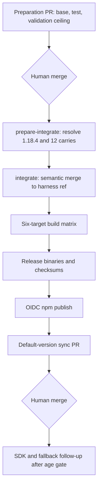

# feat: Rebase @fro.bot/harness to OpenCode 1.18.4

## Overview

Advance the patched OpenCode harness from base `1.17.20` to `1.18.4`, preserve the full 12-carry integration set for both supported harness surfaces, and complete the existing six-target release pipeline. The change is contract-compatible for the SDK, SSE, session, permission, and question APIs consumed by Fro Bot.

---

## Problem Frame

The published harness remains on OpenCode `1.17.20`, so headed/local users and the gateway workspace do not receive the provider reliability and compatibility changes released through `1.18.4`. The primary outcome is one validated harness build adopted coherently by Action and workspace defaults. Carries that serve headed/local use remain compatibility constraints on that shared artifact, while independent stock and SDK versions keep their own release cadences.

The harness base, published harness default, stock fallback, and SDK dependency are separate artifacts. Updating them together before the SDK's three-day release-age gate clears would either bypass the supply-chain policy or conflate artifacts with different owners. This plan advances the harness base first; the release workflow then publishes the patched artifact and opens the coupled default-version sync PR.

---

## Requirements Trace

- R1. Set the authoritative harness base to OpenCode `1.18.4`.
- R2. Preserve all 12 existing integration refs in their current order.
- R3. Keep carries whose value belongs to headed/local consumers, including #33713 and #36045; do not assess them only against headless CI.
- R4. Keep #33444 because Space Bus consumes the harness's aggregate `session.summary.diffs` behavior, which stock `1.18.4` still lacks.
- R5. Raise the deliberate Renovate validation ceiling for OpenCode and its SDK to `1.18.4` without changing the SDK dependency in this PR.
- R6. Do not add a CI `subagent_depth` override. Headless CI has no verified nested native-task flow, while headed/local users own that OpenCode setting.
- R7. Require a human merge of the preparation PR before dispatching the release workflow from `main`.
- R8. Require successful integration of every carry and all six build targets before release and publish.
- R9. Let the post-publish sync job exclusively update `DEFAULT_OPENCODE_VERSION`, the workspace Dockerfile pin, and generated `dist/`; never hand-edit those release-owned values.
- R10. Record the upstream behavior changes and verify the published npm package, GitHub release assets, checksums, version provenance, and sync PR before declaring the cycle complete.
- R11. Set the local harness integration model to `anthropic/claude-sonnet-5` while preserving the workflow's operator-controlled `HARNESS_MODEL` boundary; the live repository variable already uses Sonnet 5.

---

## Scope Boundaries

- The preparation PR changes the harness manifest, its lockstep test, the Renovate validation ceiling, and this plan.
- The existing 12-carry list remains unchanged; no new carry is added during this cycle.
- No generated CI configuration or workflow behavior changes are required for `subagent_depth`.
- No release workflow redesign is included; the existing integration, build, publish, and sync jobs are the release mechanism.

### Deferred to Separate Tasks

- Upgrade `@opencode-ai/sdk`, stock `FALLBACK_VERSION`, and stock live probes after `2026-07-23T15:26:39Z`, when SDK `1.18.4` clears the three-day age gate.
- Reconsider #36368 only if an observed SSE event exceeds the current 1 MiB limit.
- Reconsider #36105, #36163, and #36126 only on a future v2-based OpenCode integration line.

---

## Context and Research

### Relevant Code and Patterns

- `packages/harness/harness.config.json` is the single source for the harness base and ordered carry list.
- `packages/harness/src/provenance.ts` reads the manifest; `packages/harness/src/cli.test.ts` pins the expected live base.
- `packages/harness/src/integrate.ts` applies refs sequentially through the semantic merge flow.
- `packages/harness/src/integrate-command.ts` reads `harness.config.json.model` for local/headed integration.
- `.github/workflows/harness-release.yaml` owns preparation, integration, six-target builds, binary release, OIDC npm publish, and default-version synchronization.
- `.github/workflows/harness-release.yaml` and `.github/workflows/harness-integrate.yaml` use the repository variable `HARNESS_MODEL` for CI integration rather than the config's local model field.
- `packages/runtime/src/shared/constants.ts` and `deploy/workspace.Dockerfile` are coupled outputs of `sync-default-version`, not inputs to this preparation PR.
- `src/services/setup/opencode.ts` owns the independent stock `FALLBACK_VERSION`.

### Institutional Learnings

- `docs/solutions/workflow-issues/harness-base-version-source-of-truth-2026-06-12.md` requires the consumed harness manifest to remain the sole authored base-version source.
- `docs/solutions/best-practices/cross-libc-build-and-release-safety-2026-06-14.md` requires all coupled default pins to update atomically and all platform artifacts to pass their native/linkage gates before publish.
- `docs/solutions/best-practices/harness-carry-exclusion-on-value-2026-07-11.md` requires carries to provide verified value, not merely apply safely. Value is assessed across both harness surfaces.
- `docs/solutions/workflow-issues/bun-local-cache-masks-minimum-release-age-2026-07-13.md` makes registry publication time, not a warm local install, authoritative for SDK age eligibility.

### External References

- OpenCode releases: `v1.18.0` through `v1.18.4`.
- OpenCode comparison: `v1.17.20...v1.18.4`.
- `@opencode-ai/sdk@1.18.4` publication time: `2026-07-20T15:26:39.333Z`.

---

## Key Technical Decisions

- KTD1. **Preserve all 12 carries.** The set supports more than headless CI: #33444 prevents Space Bus from falling back to per-turn diff aggregation; #33713 bounds memory growth for local users who run one long-lived server across multiple directories; #36045 prevents headed TUI responsiveness from degrading under high-volume streamed deltas. These retained behaviors justify their integration cost, and no carry is equivalent in stock `1.18.4`.
- KTD2. **Do not override `subagent_depth`.** OpenCode `1.18.2` introduces a one-hop default for the native TaskTool. Headless CI does not use council and has no verified two-hop native-task dependency; headed/local configuration remains the user's responsibility.
- KTD3. **Separate harness and SDK timing.** The harness can build from the upstream tag immediately. SDK/FALLBACK changes wait for the existing age policy instead of adding another temporary exclusion.
- KTD4. **Treat the release workflow as the integration arbiter.** Carry conflicts are resolved and verified in the dedicated integration job; local patch simulation is not an equivalent gate.
- KTD5. **Keep default pins single-writer.** Only the post-publish sync job writes the published harness version into runtime defaults and the workspace image.
- KTD6. **Keep local and CI model selection explicit.** `harness.config.json.model` controls local CLI integration; CI uses `HARNESS_MODEL`. Align both on Sonnet 5 today without replacing the repository-variable override.

---

## Open Questions

### Resolved During Planning

- **Do UI-oriented carries remain relevant?** Yes. The published harness has a headed/local surface, so #33713 and #36045 retain value even though CI does not exercise them.
- **Does the native depth limit require CI config changes?** No. The two harness surfaces are distinct, and no supported headless flow requires a two-hop native task.
- **Should the SDK bump ship in the preparation PR?** No. Its API is compatible and its age gate has not cleared; it follows separately through the normal dependency path.
- **Does the config model drive the release workflow?** No. It drives local CLI integration. The release workflow uses `HARNESS_MODEL`, whose live value is already `anthropic/claude-sonnet-5`.

### Deferred to Implementation

- Which carries require semantic conflict resolution on `1.18.4` is knowable only when the integration job applies the live PR heads.
- The final harness version suffix is derived from the integration commit and is unavailable until the release build completes.

---

## High-Level Technical Design

> This illustrates the intended approach and is directional guidance for review, not implementation specification. The implementing agent should treat it as context, not code to reproduce.

---

## Implementation Units

- [x] **Unit 1: Prepare the validated harness rebase**

- **Goal:** Move the authoritative harness base and validation ceiling to `1.18.4` without changing the carry set or independent runtime pins.
- **Requirements:** R1-R6
- **Dependencies:** None
- **Files:**
  - Modify: `packages/harness/harness.config.json`
  - Modify: `packages/harness/src/cli.test.ts`
  - Modify: `.github/renovate.json5`
  - Modify comments/examples only: `.github/workflows/harness-release.yaml`, `.github/workflows/harness-integrate.yaml`
- **Approach:** Change `base_version`, local integration `model`, the live-config assertion, and the deliberate OpenCode/SDK ceiling. Preserve every integration ref byte-for-byte and in order, verified by review of the manifest diff. Update stale workflow comments/examples to Sonnet 5 without changing the `HARNESS_MODEL` variable contract. Leave SDK packages, `FALLBACK_VERSION`, runtime defaults, Dockerfile, probes, lockfile, and `dist/` untouched.
- **Patterns to follow:** The prior validated-base bumps in `packages/harness/harness.config.json` and the cap comment in `.github/renovate.json5`.
- **Test scenarios:**
  - Happy path: loading the harness manifest reports base `1.18.4` and exactly the same 12 ordered refs.
  - Regression: provenance/CLI tests read `1.18.4` from the manifest rather than a duplicate literal source.
  - Boundary: Renovate accepts versions through `1.18.4` but remains capped above it.
  - Surface parity: local integration resolves `anthropic/claude-sonnet-5`; CI still resolves its model from `HARNESS_MODEL`, whose live value is already Sonnet 5.
  - Negative: the preparation diff contains no SDK, fallback, default harness, Dockerfile, probe, lockfile, or generated bundle changes.
- **Verification:** Harness tests, repository type checks, lint, tests, and build pass; committed `dist/` remains unchanged.

- [x] **Unit 2: Integrate and build the 12-carry harness**

- **Goal:** Resolve all carries against stock `1.18.4` and produce verified binaries for every supported target.
- **Requirements:** R2-R4, R7-R8
- **Dependencies:** U1 merged to `main` by a human.
- **Files:**
  - Operational reference: `.github/workflows/harness-release.yaml`
  - Operational reference: `.github/workflows/harness-integrate.yaml`
  - Operational reference: `packages/harness/prompt.txt`
  - Operational reference: `packages/harness/scripts/build-platform.ts`
  - Operational reference: `packages/harness/scripts/verify-binary.ts`
- **Approach:** Dispatch the release workflow for base `1.18.4`. The integration job applies all refs sequentially and pushes the integration ref. The matrix then builds Darwin x64/arm64, Linux glibc x64/arm64, and Linux musl x64/arm64 artifacts.
- **Test scenarios:**
  - Integration: all 12 carry results are present in the integrated tree; an unresolved carry blocks every build.
  - Headed/local compatibility: the integrated tree retains #33713's opt-in instance-eviction flags and #36045's streamed-delta batching; the published harness starts successfully in headed mode.
  - Failure path: any failed or missing matrix target prevents release and publish.
  - Happy path: native verification reports `1.18.4+harness.<sha>` rather than bare stock `1.18.4`.
  - Integration: musl artifacts pass the linkage assertion and do not reference a glibc loader.
- **Verification:** Integration, all six matrix jobs, provenance checks, native binary checks, and musl linkage checks succeed at one integration commit.

- [x] **Unit 3: Publish and reconcile defaults**

- **Goal:** Publish one complete harness release and advance the action/workspace defaults through the existing coupled sync PR.
- **Requirements:** R8-R10
- **Dependencies:** U2 succeeds for all targets.
- **Files:**
  - Operational reference: `.github/workflows/harness-release.yaml`
  - Verify generated sync changes: `packages/runtime/src/shared/constants.ts`
  - Verify generated sync changes: `deploy/workspace.Dockerfile`
  - Verify generated sync changes: `dist/`
- **Approach:** Release binaries only after the full matrix passes, publish npm packages through OIDC, verify GitHub assets and checksums, then inspect the automatically opened sync PR. The sync PR must remain the sole writer of published default pins and requires a separate human merge.
- **Test scenarios:**
  - Happy path: GitHub release and npm `latest` identify the same `1.18.4+harness.<sha>` integration build.
  - Integrity: the GitHub release contains all six platform assets plus `SHA256SUMS`.
  - Failure path: release-binary or npm publication failure leaves the sync job unable to open a default-version PR; rerun the full workflow rather than patching a partial publish.
  - Idempotency: rerunning sync when both default pins already match produces no duplicate update.
  - Regression: the sync PR updates runtime default, workspace Dockerfile, and regenerated `dist/`, but does not modify SDK dependencies or `FALLBACK_VERSION`.
- **Verification:** Published package metadata, release assets/checksums, and the sync PR all point to one build; the sync PR passes CI before human merge. After publish, run a headed/local startup smoke with the new harness and confirm its patch/provenance report includes all 12 refs.

---

## Acceptance Examples

- AE1. Given the preparation branch, reading the manifest returns `1.18.4` and the same ordered 12-ref list that exists on `main` before the bump.
- AE2. Given a carry conflict, the integration job fails before any platform package or release artifact publishes.
- AE3. Given a successful integration, all six targets report the same harness version and integration commit; both musl targets pass linkage inspection.
- AE4. Given successful release and npm publish, the sync PR changes only the coupled defaults and generated bundle required to adopt the new harness.
- AE5. Given the SDK is still younger than three days, the preparation and sync PRs leave SDK, fallback, and stock probe versions at `1.17.20`.

The harness release cycle is complete when the harness is published and the coupled default-sync PR is merged. SDK, fallback, and probe alignment is a separately tracked native-dependency follow-up and does not block this release outcome.

---

## System-Wide Impact

- **Interaction graph:** Harness manifest -> integration prompt/ref -> six-target matrix -> binary release -> npm publish -> coupled default sync PR -> Action and workspace adoption.
- **Error propagation:** Integration or build failures stop before publish; release/publish failures stop default synchronization; sync failures leave the published harness available but do not change consumers.
- **State lifecycle risks:** A release can create partial external state before a later publish step fails. Recovery is a full workflow rerun using the same validated base/carry set, with release asset clobber/idempotency handled by the workflow.
- **API surface parity:** SDK, SSE, session, permission, and question contracts remain unchanged. Provider behavior advances only when consumers adopt the published harness.
- **Integration coverage:** Workflow evidence, not unit tests alone, proves carry application, cross-platform binaries, OIDC publish, checksums, and sync behavior.
- **Unchanged invariants:** CI/headed configuration remains separate; default harness pins remain release-job-owned; response and session protocols are unchanged; `dist/` is never edited manually.

---

## Risks and Dependencies

| Risk | Mitigation |
| --- | --- |
| One or more live carry heads conflict with `1.18.4` | Let the dedicated integration agent resolve each carry; unresolved results block the matrix. |
| A carry head changes after the preparation PR is reviewed | Treat the integration commit and provenance manifest—not mutable PR heads—as the immutable release identity; review the integration report before allowing publish to complete. |
| Headed users depend on deeper native task nesting | Preserve upstream configurability and document `subagent_depth`; do not impose an unverified CI-wide value. |
| A target builds with incorrect provenance or libc linkage | Require native version checks, a common integration commit, and explicit musl linkage assertions. |
| GitHub release or npm publish is partial | Do not advance defaults; rerun the full release workflow and verify both distribution surfaces. |
| SDK age gate is bypassed by a warm cache | Defer the SDK/fallback change until registry timestamp arithmetic proves eligibility. |
| Sync PR updates only one default pin | Existing coupled idempotency checks must require runtime and Dockerfile pins to agree before skip/open decisions. |

---

## Documentation and Operational Notes

- Release notes should distinguish inherited upstream behavior from Fro Bot carries: OpenAI's header-timeout increase, the Azure endpoint correction, Kimi/Moonshot adaptive thinking, Meta `xhigh` reasoning, and the native `subagent_depth` default all arrive through the `1.18.4` base.
- Operational review must distinguish the headless CI Action from the headed/local harness; carries may serve either surface.
- After the age gate clears, open the independent SDK/FALLBACK/probe update rather than extending this release PR.

---

## Resolution

Completed on 2026-07-20.

- Preparation PR [#1254](https://github.com/fro-bot/agent/pull/1254) merged the `1.18.4` base, Sonnet 5 local-integration model, preserved carry manifest, and validation ceiling.
- Release run [29772360474](https://github.com/fro-bot/agent/actions/runs/29772360474) integrated all 12 carries at commit `1ff4b3232a0ca1637c450192e6ff6dfebb4f17ef`, built all six targets, and published `1.18.4-harness.1ff4b323` to npm and GitHub Releases.
- The published package provenance contains all 12 ordered carry refs, npm `latest` resolves to the new harness, and `SHA256SUMS` covers all six platform assets.
- Default-sync PR [#1256](https://github.com/fro-bot/agent/pull/1256) advanced both `DEFAULT_OPENCODE_VERSION` and the workspace Dockerfile pin to `1.18.4+harness.1ff4b323`.
- A headed/local installation successfully started OpenCode `1.18.4` from the published harness.

---

## Sources and References

- `packages/harness/harness.config.json`
- `.github/workflows/harness-release.yaml`
- `docs/solutions/workflow-issues/harness-base-version-source-of-truth-2026-06-12.md`
- `docs/solutions/best-practices/cross-libc-build-and-release-safety-2026-06-14.md`
- `docs/solutions/best-practices/harness-carry-exclusion-on-value-2026-07-11.md`
- `docs/solutions/workflow-issues/bun-local-cache-masks-minimum-release-age-2026-07-13.md`
- https://github.com/anomalyco/opencode/compare/v1.17.20...v1.18.4
- https://github.com/anomalyco/opencode/releases/tag/v1.18.4
