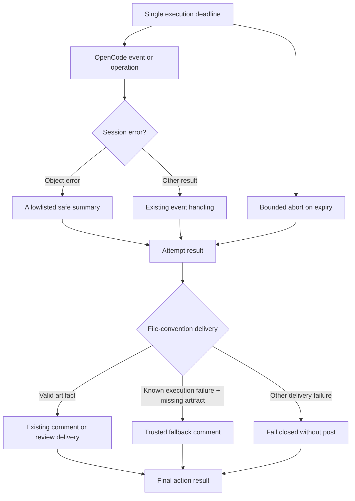
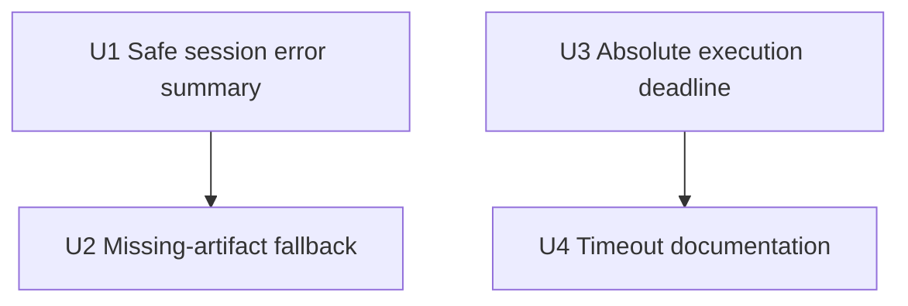

# fix: Preserve session failures during file-convention delivery

## Overview

Harden the Action's post-#1170 file-convention failure path: retain a bounded, safe session-error summary; deliver one trusted fallback comment when an already-failed run never wrote its response artifact; and make a configured execution timeout a true deadline across the OpenCode lifecycle.

---

## Problem Frame

Issue #1252 exposed two failures that compound badly. An object-valued `session.error` loses all useful context when coerced to `[object Object]`. If that early execution failure prevents the model from writing its run-scoped response file, finalization then reports the secondary `ENOENT` instead of the actual session failure.

The same report showed a long-running background workflow can keep a session active until its execution deadline. The Action already exposes a timeout, but its current implementation starts independent budgets and does not consistently propagate cancellation to all OpenCode operations. A configured timeout is therefore not an absolute execution deadline.

The response-file security model remains correct and must not be weakened: the file is untrusted, trusted routing owns the target and surface, and normally missing or malformed artifacts fail closed without a post (see origin: `docs/brainstorms/2026-07-11-remove-agent-github-credential-requirements.md`).

---

## Requirements Trace

- R1. Preserve an object-valued session failure as a bounded, allowlisted, redaction-safe diagnostic; raw event payloads must never reach logs, artifacts, or user-visible output.
- R2. Post at most one trusted fallback error comment only when file-convention delivery reports `file-read-failed` after a known execution failure, a prior model response was not posted, and a trusted comment target resolves.
- R3. Do not fabricate a review verdict, relax review guards, let the response file choose its target or surface, or use response-file content or raw event data in fallback text.
- R4. Continue failing closed without a fallback comment for malformed artifacts, missing artifacts without a known execution failure, or any normal response-delivery failure.
- R5. Treat a nonzero Action `timeout` as one absolute deadline across session setup, prompt execution, polling, retries, and bounded post-attempt cleanup; preserve `timeout: 0` as the explicit opt-out.
- R6. Keep the 30-minute default and document GitHub Actions `timeout-minutes` as the whole-job backstop with enough headroom for setup, finalization, and cleanup.

---

## Scope Boundaries

- Do not block, reinterpret, or special-case `ce:*` workflows in the runtime. Consumer prompt restrictions remain a mitigation; runtime policy is a separate concern.
- Do not lower the Action's default execution timeout or introduce an inactivity watchdog. Long silent work can be legitimate in CI.
- Do not change credential withholding, response-file parsing, trusted-context derivation, review guards, or autonomous `workflow_dispatch` / `schedule` delivery.
- Do not turn the execution deadline into a whole-harness deadline. Bootstrap and finalization remain governed by GitHub Actions job timeout. After the execution result becomes terminal, only a fixed, bounded remote-abort teardown may run under the job timeout; it cannot extend or alter execution.

### Deferred to Separate Tasks

- Runtime policy for unsupported or non-terminating background workflows, including whether to prevent them rather than merely bound their effects.
- Any provider-specific error taxonomy beyond the existing quota classification.

---

## Context and Research

### Relevant Code and Patterns

- `src/features/agent/streaming.ts` observes `session.error`; its unknown-object fallback currently uses `String(...)` and stores only a string on `ActivityTracker`.
- `src/features/agent/session-poll.ts` waits a three-cycle grace period before promoting the tracked error into the attempt failure.
- `src/harness/phases/finalize.ts` already has a quota-specific, trusted-context error-comment path and intentionally runs file delivery even after execution failure to prevent green-but-silent runs.
- `src/features/agent/response-post.ts` is the exclusive normal-path authority for comment-versus-review delivery and keeps successful model output behind strict parsing and review guards.
- `src/features/agent/execution.ts` establishes the current timer, while `src/features/agent/retry.ts`, `src/features/agent/prompt-sender.ts`, and `src/features/agent/session-poll.ts` introduce operations that must share the same remaining budget.
- The gateway's execution path computes remaining time from a single budget origin, which is the established local pattern for a hard deadline.

### Institutional Learnings

- `docs/solutions/best-practices/response-file-is-untrusted-input-2026-07-11.md`: trusted routing, not model-authored content, controls posting authority; delivery must be explicitly asserted.
- `docs/solutions/logic-errors/injected-deny-blocks-own-delivery-path-2026-07-13.md`: a security-hardened delivery path needs direct validation rather than a home-repo-only green result.
- `docs/solutions/workflow-issues/build-pipeline-fallible-preflight-and-finally-cleanup-2026-06-22.md`: cleanup or finalization must not replace the causal failure with a later secondary error.
- `docs/solutions/best-practices/extract-timer-primitive-keep-policy-per-surface-2026-07-13.md`: share timer mechanics only where appropriate; do not transplant a gateway inactivity policy into CI.

---

## Key Technical Decisions

- **Normalize session errors at the event boundary.** Retain only a bounded allowlist of diagnostic fields such as provider, name, status, code, and message. The unknown-object fallback is a generic safe summary, never `String(rawObject)` or serialization of arbitrary nested data.
- **Use a trusted error comment for missing-artifact failures.** The fallback is eligible only after file-convention delivery returns `file-read-failed` for a failed execution with no prior response action and a resolved trusted comment target. A failed review receives one comment rather than a synthetic approve/request-changes review. Its text is static and action-owned; the normalized primary error stays on the action failure path. It never incorporates response-file content, raw event data, provider details, or review-verdict language.
- **Make normal and fallback delivery mutually exclusive.** A `file-read-failed` result occurs before parsing or attempting the normal comment/review post, so the finalizer chooses one terminal delivery branch. A missing trusted target or a failed fallback post preserves the primary run failure and never attempts another surface.
- **Preserve causal ordering.** The known execution failure is the run's primary failure and supplies any safe operator-facing context. The unreadable artifact is logged as secondary evidence; it must not replace the action failure reason.
- **Keep normal delivery fail-closed.** The fallback is available only for `file-read-failed` after `execution.success === false`. Successful runs with missing/malformed files, review-guard failures, parse failures, and fallback-post failures remain failed without alternate delivery surfaces.
- **Use one absolute execution budget.** A nonzero timeout has one clock origin, one terminal timeout outcome, and derived remaining budget passed through every OpenCode operation and retry. Expiry first latches the execution result; late results cannot change it or begin more work. Only after that latch may a short, non-retrying, fail-soft remote session abort run as teardown under the job timeout, without extending or changing execution.
- **Separate execution and job bounds.** The Action retains its 30-minute default and explicit unlimited mode. GitHub Actions `timeout-minutes` is documented as the process-level cap and must leave headroom beyond the configured execution budget.

---

## Open Questions

### Resolved During Planning

- **Fallback surface:** use a trusted comment for all eligible failure fallback cases; an error is not a review verdict.
- **Timeout scope:** harden the existing execution timeout rather than adding an inactivity timeout, changing the default, or applying a deadline to bootstrap/finalization.
- **Background workflows:** retain prompt-level mitigations and defer runtime enforcement.

### Deferred to Implementation

- The precise bounded field lengths and generic wording for unknown provider errors should follow existing error-format conventions while retaining the no-raw-payload invariant.
- The short cleanup grace for a timed-out session abort should be calibrated against the existing request-timeout pattern without extending the absolute execution deadline.

---

## High-Level Technical Design

> *This illustrates the intended approach and is directional guidance for review, not implementation specification. The implementing agent should treat it as context, not code to reproduce.*

---

## Implementation Units

### U1. Preserve bounded session-error diagnostics [completed]

- **Goal:** Replace opaque object coercion with a safe, useful error summary that survives the event stream and poller grace period.
- **Requirements:** R1.
- **Dependencies:** None.
- **Files:**
  - Modify: `src/features/agent/streaming.ts`
  - Modify: `src/features/agent/session-poll.ts`
  - Test: `src/features/agent/opencode.test.ts`
- **Approach:** Extend the tracked session-error state enough to retain its bounded display fields from the `session.error` boundary through polling. The first normalized session error becomes immutable terminal state for the attempt; repeated or late error events cannot overwrite it with a weaker string fallback. Reuse the existing quota classification without broadening that taxonomy. Keep raw event data out of logs and persisted artifacts.
- **Execution note:** Add the object-error regression coverage before changing normalization.
- **Patterns to follow:** existing quota extraction in `src/features/agent/streaming.ts`; redaction-safe `ErrorInfo` formatting in `packages/runtime/src/agent/error-format/format.ts`.
- **Test scenarios:**
  - Happy path: an object error with allowlisted fields reaches poll failure with those safe details rather than `[object Object]`.
  - Edge case: an object with no usable allowlisted field produces the generic safe summary.
  - Race: repeated or late session-error events during the grace period retain the first normalized summary.
  - Security: nested secrets, arbitrary keys, and raw object representation do not appear in the tracked summary or logger payload.
  - Compatibility: string session errors and recognized quota errors keep their existing classifications and grace-period behavior.
- **Verification:** The primary session error is actionable without exposing the raw provider payload, and existing session error behavior remains stable for string and quota cases.

### U2. Preserve primary failures through missing-artifact delivery [completed]

- **Goal:** Report and surface a known agent failure when file-convention delivery cannot read the response artifact, without double-posting or fabricating a review.
- **Requirements:** R2, R3, R4.
- **Dependencies:** U1.
- **Files:**
  - Modify: `src/harness/phases/finalize.ts`
  - Test: `src/harness/phases/finalize.test.ts`
- **Approach:** Extend the existing trusted error-comment pattern for the narrow intersection of file-convention delivery, failed execution, no prior response action, a resolved trusted comment target, and `file-read-failed`. A file-read failure happens before normal parsing or posting, so this branch is mutually exclusive with normal comment/review delivery. Use static action text only; keep the normalized execution failure on the action failure path and record the artifact read failure secondarily. A missing target or failed fallback post never attempts another surface. All other response-post failures retain the current fail-closed behavior.
- **Patterns to follow:** quota error fallback in `src/harness/phases/finalize.ts`; comment writer failure handling in `src/features/comments/writer.ts`; trusted delivery derivation in `src/features/agent/response-post.ts`.
- **Test scenarios:**
  - Happy path: a failed execution plus missing response file posts one trusted error comment and fails with the primary execution failure.
  - Integration: a pull-request review failure posts a comment rather than submitting an approve/request-changes review.
  - Edge case: a successful execution with a missing file remains a fail-closed delivery failure with no fallback post.
  - Error path: malformed files, review-guard blocks, normal writer failures, an absent trusted target, and response-file contents with hostile text never trigger fallback or an alternate review.
  - Security: fallback text excludes the response artifact, raw event object, provider details, and verdict language while retaining only static action text.
  - Idempotency: the `file-read-failed` branch proves no normal post was attempted; a prior posted response or a failed fallback post does not cause a second delivery attempt.
- **Verification:** The response protocol delivers at most one trusted surface action, and an `ENOENT` cannot mask the causal execution failure.

### U3. Make configured execution timeout absolute [completed]

- **Goal:** Enforce a configured nonzero Action timeout across the full OpenCode execution lifecycle while preserving explicit unlimited mode.
- **Requirements:** R5.
- **Dependencies:** None.
- **Files:**
  - Modify: `src/features/agent/execution.ts`
  - Modify: `src/features/agent/prompt-sender.ts`
  - Modify: `src/features/agent/retry.ts`
  - Modify: `src/features/agent/session-poll.ts`
  - Modify: `packages/runtime/src/session/title-reassert.ts`
  - Test: `src/features/agent/opencode.test.ts`
- **Approach:** Capture one deadline context at Action execution entry. It owns the deadline timestamp, cancellation signal, remaining-budget calculation, and a monotonic terminal timeout outcome; child execution operations receive derived budget/cancellation rather than creating a fresh full timeout. Every blocking wait and external operation must observe cancellation and re-check the deadline before side effects. Thread the context through session creation, event subscription, prompt submission, V2 completion wait, polling requests, artifact reconciliation, retry delay, and title reassertion; an expired deadline short-circuits retries and skips title reassertion rather than allowing a `finally` block to extend execution. Expiry latches the result before any teardown. The only post-latch work is a short, non-retrying, fail-soft remote session abort under the GitHub Actions job timeout; it cannot change the result or start workspace-affecting work.
- **Execution note:** Start with fake-timer and never-resolving-operation coverage for the live Action execution root before threading the budget.
- **Patterns to follow:** single-clock remaining-budget calculations in `packages/gateway/src/execute/run.ts`; bounded request handling in `src/features/agent/session-poll.ts`.
- **Test scenarios:**
  - Happy path: normal completion before deadline preserves current success and retry behavior.
  - Error path: never-resolving session creation, subscription, prompt, poll request, and title update each settle at the shared deadline; only the separately bounded remote-abort teardown may continue afterward.
  - Edge case: retries consume a shared budget instead of receiving fresh full-timeout windows.
  - Race: timeout wins when an attempt reports success after the deadline; all late poll, retry, and cleanup results are ignored by the terminal timeout outcome.
  - Race: expiry while retry sleep, poll wait, or title reassertion is pending cancels or short-circuits the work before a new side effect.
  - Error path: timed-out session abort is bounded, non-retrying, and fail-soft when the abort request rejects or times out; it cannot delay or rewrite the terminal execution result.
  - Compatibility: `timeout: 0` remains internally unbounded, and the existing initial-activity watchdog behavior is unchanged.
- **Verification:** A configured timeout deterministically terminates OpenCode execution without leaving background work to mutate the workspace during finalization.

### U4. Clarify execution and whole-job timeout responsibilities [completed]

- **Goal:** Make the two timeout layers explicit to action consumers without changing defaults.
- **Requirements:** R6.
- **Dependencies:** U3.
- **Files:**
  - Modify: `action.yaml`
  - Modify: `README.md`
  - Modify: `docs/examples/fro-bot.yaml`
- **Approach:** Document that the Action input limits OpenCode execution only, that `timeout: 0` disables this internal protection, and that consumers should configure a job-level `timeout-minutes` with headroom beyond the execution timeout for process-level containment.
- **Patterns to follow:** existing timeout input documentation in `action.yaml` and workflow guidance in `docs/examples/fro-bot.yaml`.
- **Test expectation:** none — this unit changes documentation and input descriptions, not runtime behavior.
- **Verification:** Public configuration guidance distinguishes execution timeout from job timeout and does not imply the 30-minute default is a whole-job boundary.

---

## System-Wide Impact

- **Interaction graph:** streamed session errors feed polling, which feeds the execution result consumed by finalization; finalization alone decides whether to post an action-owned fallback.
- **Error propagation:** raw provider payloads stop at event normalization; safe summaries reach logs and failure reporting; finalization keeps the execution failure causal and records artifact-read failure secondarily.
- **State lifecycle risks:** timeout expiry must latch the terminal outcome before finalization begins; all pending waits must observe that latch. The only post-latch work is remote-abort teardown, which cannot re-open retries, accept late results, start workspace-affecting work, or overwrite the timeout outcome.
- **API surface parity:** `timeout` remains the existing public Action input, but its description must accurately distinguish its execution scope from GitHub Actions job limits.
- **Integration coverage:** tests must exercise event-to-poller propagation, failed execution-to-finalize fallback, and a shared deadline through retry and late-success races.
- **Unchanged invariants:** trusted routing still owns all post targets and surfaces; successful model responses retain normal comment/review delivery; one comment or review remains the maximum per invocation.

---

## Risks and Dependencies

| Risk | Mitigation |
| --- | --- |
| Safe diagnostics leak provider payload data | Allowlist and bound fields at the event boundary; test nested untrusted data stays absent. |
| Fallback turns a failed review into an approval or duplicate response | Always use one trusted comment, never a review; retain existing target resolution and delivery count checks. |
| Missing file on a successful or malformed run becomes a soft failure | Restrict fallback to known failed execution plus `file-read-failed`; keep all other delivery failures fail-closed. |
| Deadline change falsely aborts long, valid CI work | Preserve 30-minute default and unlimited opt-out; use an absolute configured budget, not inactivity. |
| Timeout leaves OpenCode working after finalization starts | Latch the timeout result, then run only a bounded fail-soft remote abort that cannot affect execution or finalization. |
| Job ends before error delivery/cleanup | Document job timeout headroom beyond execution timeout. |

---

## Documentation and Operational Notes

- Validate the changed error and missing-artifact paths against a consumer-style pull-request run, not only the home repository, because workflow configuration and injected permissions can affect response delivery.
- The plan does not close #1252 by forbidding background workflows; it makes their failure mode bounded and diagnosable while a separate policy decision remains open.

---

## Sources and References

- **Origin document:** [`docs/brainstorms/2026-07-11-remove-agent-github-credential-requirements.md`](../brainstorms/2026-07-11-remove-agent-github-credential-requirements.md)
- **Incident and triage:** [#1252](https://github.com/fro-bot/agent/issues/1252) and [Fro Bot triage](https://github.com/fro-bot/agent/issues/1252#issuecomment-5037161696)
- **Related plan:** [`docs/plans/2026-07-11-001-fix-remove-agent-credential-comment-review-flows-plan.md`](2026-07-11-001-fix-remove-agent-credential-comment-review-flows-plan.md)
- **Related learnings:** [`docs/solutions/best-practices/response-file-is-untrusted-input-2026-07-11.md`](../solutions/best-practices/response-file-is-untrusted-input-2026-07-11.md), [`docs/solutions/workflow-issues/build-pipeline-fallible-preflight-and-finally-cleanup-2026-06-22.md`](../solutions/workflow-issues/build-pipeline-fallible-preflight-and-finally-cleanup-2026-06-22.md)
