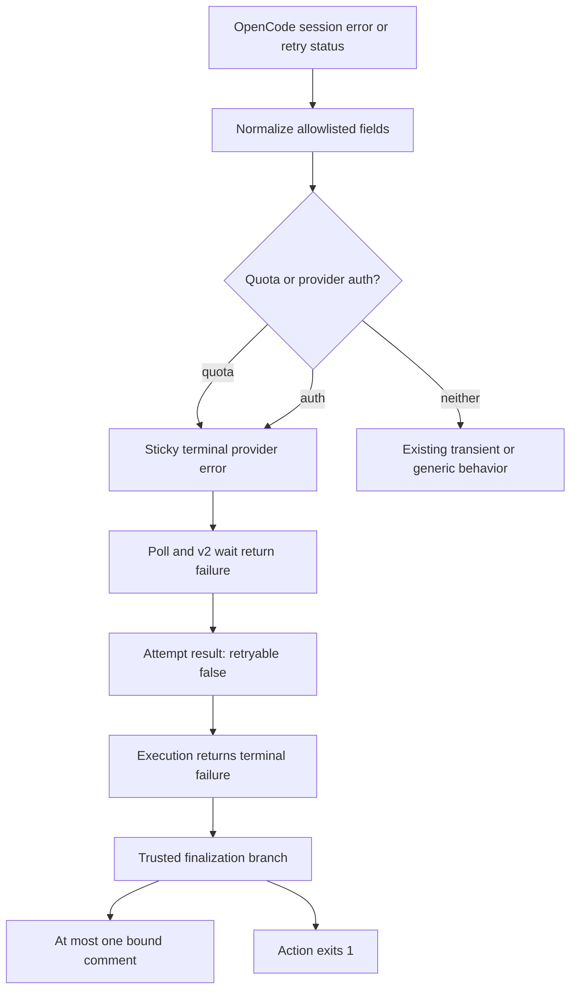

# fix: Fail fast on model-provider authentication failures

## Overview

Issue #1253 shows that an upstream model-provider authentication failure can be consumed as ordinary retry activity until the Action reaches its full execution deadline. Fro Bot already gives account-quota exhaustion a narrow, non-retryable terminal path; this plan extends that architecture with a separate `provider_auth_error` category, without broadening generic provider-outage handling or exposing provider-controlled error text.

The fix is consumer-side. OpenCode continues to emit its existing `session.error` and `session.status` contracts; the Action recognizes the stable authentication signals, stops retrying, delivers at most one trusted failure response, and exits non-zero.

---

## Problem Frame

The Action currently has two incomplete behaviors for model-provider authentication failures:

- A structured `session.error` is normalized into bounded generic diagnostics, but it has no actionable authentication category and still passes through the generic session-error grace path.
- A `session.status` retry carrying the reported `auth_unavailable` reason is not terminalized at all, so polling and retry handling can continue until the absolute execution deadline.

PR #1277 made the deadline authoritative and preserved primary failures through cleanup and missing response files. That work prevents unbounded SDK operations and error masking, but it deliberately does not classify authentication failures. The remaining defect is therefore classification and propagation, not timeout mechanics.

The highest-risk failure mode is a false positive: a generic service outage must not be reclassified as a credential failure. The implementation must prefer stable structured fields, use exact bounded markers, and never use arbitrary provider prose as public output or a broad regex oracle.

---

## Requirements Trace

- R1. Classify OpenCode's structured `ProviderAuthError` session failure as a first-class `provider_auth_error` through both supported SDK event envelopes.
- R2. Classify the reported `session.status` retry reason `auth_unavailable` as the same terminal error through both SSE and REST polling, even when one observation path misses the event.
- R3. Treat provider authentication failure as non-retryable: no continuation prompt, retry delay, additional model attempt, or wait until the execution deadline.
- R4. Preserve existing behavior for quota exhaustion, ordinary rate limiting, network failures, generic 5xx outages, ambiguous 403 responses, and unrelated retry-status reasons.
- R5. Construct all public comments and Action failure text from fixed trusted guidance. Raw provider messages, response bodies, headers, URLs, account identifiers, provider-supplied IDs, and credentials must never be echoed.
- R6. Preserve one authoritative terminal outcome. The first classified terminal provider failure wins; later idle, retry, generic error, cleanup, enrichment, or deadline activity cannot downgrade or rewrite it. Classification into the shared terminal slot before deadline expiry is the acceptance point; the next poll cycle must not let a later deadline callback replace that already-classified failure.
- R7. Deliver at most one trusted authentication failure response when delivery is enabled and a bound target exists, bypassing response-file parsing and the generic missing-file fallback. The Action must fail whether or not posting succeeds.
- R8. Preserve delivery-mode semantics: `file-convention` and `model-gh` may use the trusted harness writer; `delivery: none` remains silent; autonomous runs without a bound target fail without inventing a target.
- R9. Preserve the existing absolute execution deadline, activity timeout, teardown, title-reassertion, and remote abort policies. This fix acts on explicit error signals, not elapsed silence.
- R10. Keep runtime exports, exhaustive error-label maps, tests, and committed `dist/` output synchronized.

---

## Scope Boundaries

### In scope

- The GitHub Action's OpenCode event-stream, status-poll, wait, retry, execution-result, and finalization paths.
- The shared runtime error taxonomy, classifier, fixed formatter, and exports used by the Action.
- Positive and negative classification fixtures derived from issue #1253 and OpenCode v1.18.4 source contracts.
- Trusted failure delivery and non-zero Action completion for all delivery modes.

### Deferred to Separate Tasks

- Automatic credential refresh, OAuth login, provider failover, or model switching.
- Changes to proxy, broker, provider, or GitHub credential architecture.
- An upstream OpenCode patch, harness carry, or harness release; OpenCode's interactive retry policy remains unchanged.
- Gateway execution behavior. The gateway has its own Effect-based run-core error contract and is not implicated by issue #1253.
- Broader provider outage taxonomy, generic 403 permission classification, anti-abuse handling, or 5xx retry-policy changes.
- A post-fix `docs/solutions/` write-up; capture that through the normal compounding workflow after the behavior is verified.

---

## Context and Research

### Relevant Code and Patterns

- `packages/runtime/src/agent/error-format/types.ts` owns the canonical `ErrorType` union and normalized classifier input types.
- `packages/runtime/src/agent/error-format/format.ts` owns fixed error factories, exhaustive labels, formatting, and the existing quota classifier.
- `src/features/agent/streaming.ts` normalizes `session.error`, classifies quota from stream events, and owns the mutable per-attempt activity tracker.
- `src/features/agent/session-poll.ts` consumes the same tracker, applies generic session-error grace cycles, and has a poll-only quota fast-fail path.
- `src/features/agent/retry.ts` races v2 wait against polling, merges poll-observed terminal errors, and derives `shouldRetry` from `ErrorInfo.retryable`.
- `src/features/agent/execution.ts` owns the absolute deadline and outer attempt loop. Its current retry predicate is already suitable once the authentication error reaches the attempt result.
- `src/harness/phases/finalize.ts` gives quota an early trusted-delivery branch before response-file processing. That branch is the behavioral model for authentication failure.
- `src/features/agent/opencode.test.ts`, `packages/runtime/src/agent/error-format/format.test.ts`, and `src/harness/phases/finalize.test.ts` contain the relevant behavioral seams.

OpenCode v1.18.4 converts AI SDK `LoadAPIKeyError` into the stable session error shape `{name: "ProviderAuthError", data: {providerID, message}}`. The separate v2 provider-auth HTTP API error union (`ProviderAuthOauthMissing`, `ProviderAuthValidationFailed`, and related names) belongs to provider-configuration endpoints, not the session execution event contract, and must not be conflated with this fix.

Issue #1253's production evidence records the non-terminal shape that motivates this fix: `session.status` with `type: "retry"` and `action.reason: "auth_unavailable"`. That captured status object is the canonical retry fixture. The upstream v1.18.4 `ProviderAuthError` schema is the canonical terminal-error fixture. Implementation must pin both fixtures through the stream and poll normalization paths rather than infer compatibility from prose or a broad error message match.

### Institutional Learnings

- [`opencode-quota-retry-treated-as-activity-2026-07-15.md`](../solutions/integration-issues/opencode-quota-retry-treated-as-activity-2026-07-15.md): classify explicit provider terminal signals in the consumer while preserving OpenCode's interactive retry policy.
- [`terminal-outcomes-must-survive-deadline-cleanup-2026-07-24.md`](../solutions/logic-errors/terminal-outcomes-must-survive-deadline-cleanup-2026-07-24.md): cleanup and enrichment may degrade after a deadline but cannot rewrite an accepted terminal outcome.
- [`response-file-is-untrusted-input-2026-07-11.md`](../solutions/best-practices/response-file-is-untrusted-input-2026-07-11.md): target and surface remain harness-owned; trusted fallback content must not accept model-controlled routing.
- [`injected-deny-blocks-own-delivery-path-2026-07-13.md`](../solutions/logic-errors/injected-deny-blocks-own-delivery-path-2026-07-13.md): a failure before response-file creation still needs one trusted delivery lane.
- [`authenticated-sse-run-observation-2026-06-20.md`](../solutions/best-practices/authenticated-sse-run-observation-2026-06-20.md) and [`sse-output-streaming-terminal-drain-2026-06-21.md`](../solutions/best-practices/sse-output-streaming-terminal-drain-2026-06-21.md): terminal state is sticky, teardown is bounded, and late async work cannot reopen or regress completion.

### External Research

- RFC 9110 distinguishes authentication failures from service unavailability: a structured 401 is authentication evidence, while a generic 503 is only an availability signal.
- OpenAI and Anthropic document invalid, revoked, or expired credentials as non-retryable until configuration changes; ordinary 5xx responses remain service failures.
- OpenCode v1.18.4 source confirms the stable `ProviderAuthError` session schema and the retry-status envelope with an optional structured `action.reason`.

---

## Key Technical Decisions

### KTD1. Fix the non-interactive consumer, not OpenCode

OpenCode's retry status is useful for headed/local sessions where an operator may repair credentials and continue. The Action has a bounded CI execution window and must interpret the explicit authentication signal as terminal. No upstream patch or harness carry is required.

### KTD2. Add `provider_auth_error` as a distinct terminal category

Authentication failure is neither generic `configuration` nor transient `llm_fetch_error`. A dedicated category provides fixed remediation, non-retryable semantics, and exhaustive compile-time coverage without weakening existing categories.

### KTD3. Use a structured-first, exact-marker classifier

The positive classification boundary is deliberately narrow:

1. `session.error.name === "ProviderAuthError"` from OpenCode's stable session schema.
2. `session.status.type === "retry"` with exact `action.reason === "auth_unavailable"`, matching the reported production failure shape.

The classifier may consume bounded message text only if implementation fixtures prove a required compatibility case; that fallback must use exact, narrow patterns and remain classification-only. It must never scan response bodies, headers, URLs, or arbitrary nested payloads. Bare HTTP status is not sufficient: 401 may be added only when paired with fixture-proven provider-auth context such as an allowlisted structured auth name/code. Status 403 alone, generic 5xx responses, network failures, ordinary rate limits, quota signals, and other retry reasons remain outside the authentication category.

### KTD4. Build a fixed provider-neutral error

The runtime exposes a factory that returns a non-retryable `provider_auth_error` with fixed message and suggested action. It accepts no raw provider message and does not include payload-supplied provider identity. Finalization rebuilds this trusted value instead of rendering the incoming `llmError` directly.

### KTD5. Generalize the quota-only terminal slot instead of adding a parallel auth flag

The activity tracker currently carries `quotaExceeded` as a special sticky error. With a second provider-terminal category, keeping separate flags would duplicate poll, v2-wait, merge, and retry branches. Replace the quota-specific concept with one discriminated terminal-provider-error slot that may hold `quota_exceeded` or `provider_auth_error`.

An earlier generic error may be upgraded by a later terminal provider signal. Once a terminal provider error is stored, the first terminal signal wins; later quota/auth/generic/idle events cannot replace it. Existing quota behavior must remain covered by regression tests. SSE and poll observations update this state through one small merge point: generic-to-terminal upgrades are permitted, while terminal-to-terminal and terminal-to-generic transitions preserve the existing terminal value.

### KTD6. Reuse the existing completion and teardown architecture

The SSE consumer records the terminal error and terminal-turn signal. The poller bypasses generic error grace when the terminal slot is set; the poll-only status path uses the same classifier; v2 wait cannot reinterpret a terminal provider error as success; and attempt teardown continues through the existing idempotent shutdown path. Do not add a new stream-abort callback, timeout, inactivity policy, or competing completion latch.

This deliberately accepts one bounded scheduling delay: an SSE-observed auth failure completes on the poller's next check cycle. It must bypass generic error grace and the full execution deadline, but it does not need a second direct abort channel that would compete with the existing completion race.

The shared terminal slot is authoritative at write time. If auth or quota is classified before deadline expiry, deadline rejection during the short poll handoff must return that classified failure rather than timeout. If the deadline expires before the terminal slot is populated, timeout remains authoritative and a later event cannot reopen the attempt.

### KTD7. Give auth failure quota-level finalization priority

After job-summary output and before response-file handling, finalization recognizes `provider_auth_error`, rebuilds the fixed safe error, posts at most once through the event-bound harness writer when permitted, calls `core.setFailed`, and returns `1`. It never reads a response file or enters the generic missing-file fallback for this outcome.

Target authority remains exclusively harness-owned: the existing routing result determines issue, pull request, or discussion destination. Provider IDs, URLs, account names, payload metadata, and route-like hints may inform neither target selection nor response surface.

`delivery: none` posts nothing. Missing targets and writer failures are warning-only delivery failures; the Action still fails. If the execution already recorded a response, no second comment is posted, but the authentication failure remains a failed run.

### KTD8. Preserve retry and deadline policy

`ErrorInfo.retryable === false` is sufficient to stop the outer attempt loop; `executeOpenCode` needs integration coverage, not a new retry branch. The existing absolute deadline remains the terminal ceiling for all other failures. Authentication is never inferred from silence or timing.

---

## Open Questions

### Resolved During Planning

- **New category or existing type?** Use `provider_auth_error`; generic configuration/fetch categories cannot express the required non-retryable guidance cleanly.
- **Which upstream auth schema?** Use the session `ProviderAuthError` plus the reported retry-status marker. Do not use the provider-configuration HTTP API union as a session-event contract.
- **Should provider identity appear publicly?** No. Fixed provider-neutral guidance is actionable without exposing routing or account context.
- **Should a bare 401, generic 403, or generic 503 terminate as auth?** No. Require `ProviderAuthError`, the exact reported retry reason, or a future fixture-proven structured provider-auth name/code.
- **Should auth failure use a distinct exit code?** No. Return the standard terminal failure code `1`; timeout retains `130`.

### Deferred to Implementation

- Exact internal helper and tracker-property names. The behavioral contract is one shared classifier and one sticky terminal-provider-error slot; naming should follow the surrounding source once tests are in place.
- Whether a proven compatibility fixture needs one bounded classification-only message pattern. Start without text matching and add only what a failing issue-derived fixture requires.
- Whether the two trusted finalization branches share a small local posting helper. Avoid an abstraction unless it removes real quota/auth duplication without hiding type-specific guidance.

---

## High-Level Technical Design

> This illustrates the intended approach and is directional guidance for review, not implementation specification. The implementing agent should treat it as context, not code to reproduce.

### Classification and Outcome Matrix

| Observed input | Classification | Retry behavior | Final outcome |
| --- | --- | --- | --- |
| Structured `session.error` named `ProviderAuthError` | `provider_auth_error` | No retry | Trusted auth failure; exit 1 |
| Retry status with exact reason `auth_unavailable` | `provider_auth_error` | No retry | Trusted auth failure; exit 1 |
| Structured API error with fixture-proven provider-auth name/code | `provider_auth_error` | No retry | Trusted auth failure; exit 1 |
| Generic 503 without an auth marker | Existing fetch/outage path | Existing policy | No auth-specific output |
| Bare 401/403 without structured provider-auth evidence | Existing generic path | Existing policy | No auth-specific output |
| `account_rate_limit` or quota `session.error` | `quota_exceeded` | No retry | Existing trusted quota failure |

---

## Implementation Units

### U1. Add the safe provider-auth classifier and error primitive

- **Goal:** Represent stable upstream authentication signals as one fixed, non-retryable `ErrorInfo` without retaining provider-controlled content.
- **Requirements:** R1, R4, R5, R10.
- **Dependencies:** None.
- **Files:**
  - Modify `packages/runtime/src/agent/error-format/types.ts`.
  - Modify `packages/runtime/src/agent/error-format/format.ts`.
  - Modify `packages/runtime/src/agent/error-format/format.test.ts`.
  - Verify `packages/runtime/src/index.ts` exposes the new classifier, factory, and types through its existing root exports; modify `packages/runtime/src/agent/index.ts` only if an existing consumer imports that sub-barrel.
- **Approach:** Extend the canonical error union and exhaustive label map; add a provider-neutral auth factory and a classifier input shaped like the existing quota input. Normalize `error.name` explicitly alongside bounded status/reason/code fields. Keep matching bounded and explicit. Never return incoming text in `message`, `details`, or `suggestedAction`.
- **Execution note:** Implement the classifier test-first from the issue-derived retry-status fixture and the upstream `ProviderAuthError` schema.
- **Patterns to follow:** `QuotaErrorInput`, `classifyQuotaError`, fixed error factories, readonly discriminated unions, exhaustive `Record<ErrorType, string>`, explicit booleans.
- **Test scenarios:**
  - **Happy path:** Exact `ProviderAuthError` structured input becomes non-retryable `provider_auth_error`.
  - **Happy path:** Exact retry reason `auth_unavailable` becomes the same fixed error.
  - **Edge case:** Missing provider ID or message does not prevent classification and does not change fixed output.
  - **Negative control:** Generic 500/502/503/504, network failures, and arbitrary retry reasons do not classify as provider auth.
  - **Negative control:** Bare 401/403, quota, rate-limit, context-overflow, and malformed values do not classify as provider auth without structured provider-auth evidence.
  - **Security:** Sentinel token, URL, account, provider ID, and raw message values are absent from the returned `ErrorInfo` and formatted comment.
  - **Regression:** Every pre-existing error type and quota classifier case retains its current label, retryability, formatting, and classification.
- **Verification:** Runtime tests prove the complete positive/negative boundary and exhaustive type-map coverage.

### U2. Propagate one sticky terminal provider error through stream, poll, and wait

- **Goal:** Stop Action execution promptly when either SSE or REST polling observes provider authentication failure, while preserving quota and transient retry behavior.
- **Requirements:** R2, R3, R4, R6, R9.
- **Dependencies:** U1.
- **Files:**
  - Modify `src/features/agent/streaming.ts`.
  - Modify `src/features/agent/session-poll.ts`.
  - Modify `src/features/agent/retry.ts`.
  - Test `src/features/agent/opencode.test.ts`.
- **Approach:** Replace the quota-only fast-fail tracker concept with one terminal-provider-error state. Apply the same classifier to `session.error`, SSE retry status, and poll-only retry status. Bypass generic session-error grace for that state, make v2 wait report failure rather than success, and merge poll-observed terminal errors into the attempt result before deriving `shouldRetry`. Route every SSE and poll write through one merge helper that permits generic-to-terminal upgrade and freezes the first terminal provider error. Reuse the existing idempotent event-processor shutdown.
- **Execution note:** Add characterization coverage for quota and existing transient retry behavior before changing the shared tracker and wait outcome.
- **Patterns to follow:** Existing session-ID filtering, bounded event parsing, first-terminal-signal semantics, `ErrorInfo.retryable`, shared absolute deadline, and terminal-outcome preservation from PR #1277.
- **Test scenarios:**
  - **Integration:** SSE `ProviderAuthError` produces one terminal provider error, bypasses grace, and returns an attempt failure without a continuation prompt.
  - **Integration:** The same auth `session.error` fixture is recognized through both `properties.error` and `data.error` event envelopes.
  - **Integration:** Poll-only retry status with `auth_unavailable` reaches the same attempt result when SSE misses the event.
  - **Integration:** v2 wait resolving after auth terminalization cannot report success.
  - **Timing:** Auth failure completes before the full execution deadline and without consuming the generic error grace cycles or retry delays.
  - **Retry:** `shouldRetry` is false and only one model attempt occurs.
  - **Conflict:** A generic error followed by auth is upgraded; auth followed by generic/idle remains auth.
  - **Conflict:** Auth and quota arrival orders preserve the first terminal provider error and produce one outcome.
  - **Negative control:** Generic 503 retry status, fetch failure, rate limit, and unrelated retry reason retain their current retry/activity behavior.
  - **Regression:** Quota still fails fast through SSE, polling, and v2 wait with unchanged safe output.
  - **Isolation:** Auth events for another session are ignored.
  - **Deadline:** A deadline latched before auth classification remains timeout. Auth classified into the shared terminal slot before expiry remains auth even when deadline rejection fires before the next poll cycle; teardown and enrichment cannot rewrite either accepted outcome.
  - **Security:** Sentinel provider message, provider ID, token, account, and URL values are absent from the shared tracker state, `PollResult.error`, `EventStreamResult.llmError`, `AttemptResult.error`, `AttemptResult.llmError`, `AgentResult.error`, and `AgentResult.llmError`.
- **Verification:** Action-level tests prove event-envelope/source parity, non-retryability, bounded completion, terminal-state stickiness, and unchanged transient/quota behavior. Source verification finds no orphaned quota-specific tracker or v2 outcome consumers after the generalization unless each retained name is documented as intentionally quota-specific.

### U3. Deliver one trusted authentication failure and synchronize the distribution

- **Goal:** Surface the terminal authentication error safely across delivery modes, fail the Action, and ship the source change with synchronized committed output.
- **Requirements:** R5, R7, R8, R10.
- **Dependencies:** U1 and U2.
- **Files:**
  - Modify `src/harness/phases/finalize.ts`.
  - Modify `src/harness/phases/finalize.test.ts`.
  - Test `src/features/agent/opencode.test.ts` for execution-loop attempt counts and exit status.
  - Modify generated files under `dist/` through the normal build.
- **Approach:** Add a high-priority authentication finalization branch adjacent to quota. Rebuild the fixed trusted `ErrorInfo`, derive the bound target from routing, post at most once when delivery permits, call `core.setFailed` with fixed provider-neutral guidance, and return `1`. Do not call `runResponsePost` or the generic missing-file fallback after auth classification. The target and surface come only from the existing routing result; ignore every provider-supplied ID, URL, account name, metadata field, or route-like value. Regenerate committed `dist/` from a frozen dependency state.
- **Execution note:** Test all delivery modes before refactoring any shared quota/auth posting code.
- **Patterns to follow:** Quota finalization, `resolveCommentTarget`, `postErrorComment`, file-convention failure preservation, one-response protocol, deterministic committed build output.
- **Test scenarios:**
  - **File convention:** Auth failure posts one trusted issue/PR/discussion comment, skips response-file reads and the missing-file fallback, sets failure, and returns 1.
  - **Model-gh:** Auth failure with a bound target posts the same trusted comment and returns 1.
  - **Silent mode:** `delivery: none` posts nothing and still returns 1.
  - **Missing target:** Autonomous or malformed target context posts nothing, logs a bounded warning, and still returns 1.
  - **Target authority:** Sentinel provider IDs, URLs, account names, and route-like values cannot alter the routed issue/PR/discussion target or switch the response surface.
  - **Duplicate guard:** `commentsPosted > 0` suppresses a second response but does not turn the run green.
  - **Writer failure:** A failed comment API call does not trigger another surface and does not mask the auth failure.
  - **Security:** Sentinel raw message, provider ID, token, account, and URL values are absent from public body, `AgentResult.error`, `AgentResult.llmError`, `core.setFailed`, and structured logs owned by the new path.
  - **Regression:** Quota finalization, ordinary recoverable LLM errors, valid file-convention delivery, and generic missing-response fallback retain current behavior.
  - **Regression:** Existing quota delivery-mode cases remain type-specific and pass alongside the equivalent auth cases; a shared local helper must not replace the quota assertions with weaker generic coverage.
  - **Integration:** The execution loop performs one attempt for auth failure and exits with code 1 rather than 0 or timeout code 130.
- **Verification:** Focused and full project gates pass; generated `dist/` is deterministic and reflects only the intended source change.

---

## System-Wide Impact

- **Interaction graph:** Provider auth failure → OpenCode structured session error or retry status → runtime classifier → sticky terminal provider state → poll/v2 wait failure → non-retryable attempt result → trusted finalization → failed Action.
- **Error propagation:** Authentication moves from generic/graceful retry handling to an explicit terminal `ErrorInfo`. Raw upstream content ends at the normalization/classification boundary; fixed guidance crosses into execution results and public delivery.
- **State lifecycle risks:** SSE, REST polling, and v2 wait race over one shared tracker. The first terminal provider error must stay authoritative through stream teardown, title handling, enrichment, finalization, and deadline cleanup.
- **API surface parity:** The internal `ErrorType` union expands, requiring exhaustive label/export/test updates. No Action input, environment variable, public API, agent tool, or operator contract changes.
- **Integration coverage:** Runtime classifier tests prove the trust boundary; Action tests prove SSE/poll/wait parity, retry counts, delivery mode behavior, exit status, and no duplicate response.
- **Unchanged invariants:** OpenCode server behavior, gateway run-core behavior, provider configuration, credential provisioning, global timeout values, response target authority, and exactly-one response remain unchanged.

---

## Risks and Dependencies

| Risk or dependency | Impact | Mitigation |
| --- | --- | --- |
| Generic outage is falsely classified as authentication | Recoverable provider incident becomes a permanent Action failure | Structured-first classifier; exact `ProviderAuthError` and `auth_unavailable` markers; bare 401/403 and generic 5xx negative controls |
| Raw provider content enters comments or job failure text | Credential, account, URL, or routing-data leak | Fixed provider-neutral factory; finalization rebuilds trusted error; sentinel no-leak tests across comment, log, and `core.setFailed` paths |
| Generalizing the quota tracker regresses quota behavior | Existing quota fast-fail or guidance breaks | Characterize quota before the tracker change; preserve quota-specific factory/finalization; SSE/poll/v2 regression tests |
| SSE and poll observe different event shapes | One path still waits until deadline | One shared classifier applied to stream and poll; poll-only and SSE integration fixtures |
| v2 wait races ahead of terminal event processing | Authentication is incorrectly reported as success | Preserve terminal grace; check the shared terminal provider state before accepting wait success |
| Finalization posts both auth and response-file fallback | Response Protocol violation | Auth branch precedes response-file processing and returns immediately; response-count assertions |
| New internal error union breaks exhaustive consumers | Type/build failure or missing label | Update canonical label/export maps; workspace type checks and formatter tests; regenerate committed `dist/` |
| Reported retry reason changes in a future OpenCode release | Auth outage regresses to generic timeout | Pin current exact contract in tests; treat future marker changes as an explicit compatibility update, not broad message matching |

---

## Documentation and Operational Notes

- No Action input or operator configuration changes.
- No OpenCode or harness release is required; this ships through the normal Action release path.
- Release notes should call out that upstream model authentication failures now stop promptly, post safe guidance when a trusted target exists, and fail the Action instead of consuming the full timeout.
- After production verification, run the normal compounding workflow and consider cross-linking the quota and terminal-outcome learnings rather than expanding this implementation PR with post-hoc process documentation.

---

## Sources and References

### Internal

- [Issue #1253](https://github.com/fro-bot/agent/issues/1253)
- [Issue #1206](https://github.com/fro-bot/agent/issues/1206) and [`2026-07-15-002-fix-quota-limit-fail-fast-plan.md`](2026-07-15-002-fix-quota-limit-fail-fast-plan.md)
- [PR #1277](https://github.com/fro-bot/agent/pull/1277) and [`2026-07-21-001-fix-session-failure-delivery-plan.md`](2026-07-21-001-fix-session-failure-delivery-plan.md)
- `packages/runtime/src/agent/error-format/types.ts`
- `packages/runtime/src/agent/error-format/format.ts`
- `src/features/agent/streaming.ts`
- `src/features/agent/session-poll.ts`
- `src/features/agent/retry.ts`
- `src/features/agent/execution.ts`
- `src/harness/phases/finalize.ts`

### Upstream and External

- [OpenCode v1.18.4 session auth error schema](https://github.com/anomalyco/opencode/blob/v1.18.4/packages/opencode/src/session/message-error.ts)
- [OpenCode v1.18.4 `LoadAPIKeyError` conversion](https://github.com/anomalyco/opencode/blob/v1.18.4/packages/opencode/src/session/message-v2.ts)
- [OpenCode v1.18.4 generated SDK event/error types](https://github.com/anomalyco/opencode/blob/v1.18.4/packages/sdk/js/src/v2/gen/types.gen.ts)
- [RFC 9110: HTTP Semantics](https://www.rfc-editor.org/rfc/rfc9110)
- [OpenAI API error codes](https://developers.openai.com/api/docs/guides/error-codes)
- [Anthropic API errors](https://platform.claude.com/docs/en/api/errors)
