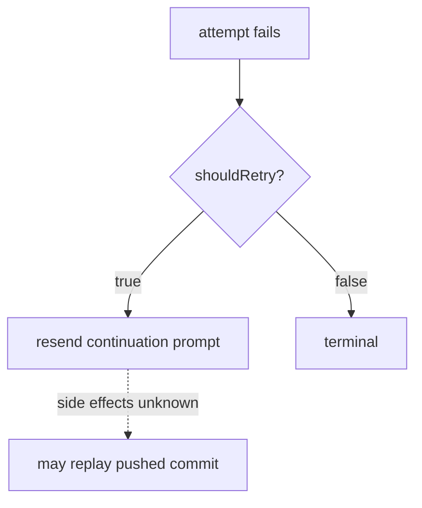
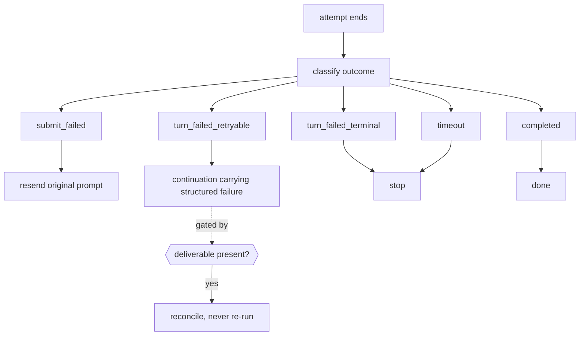
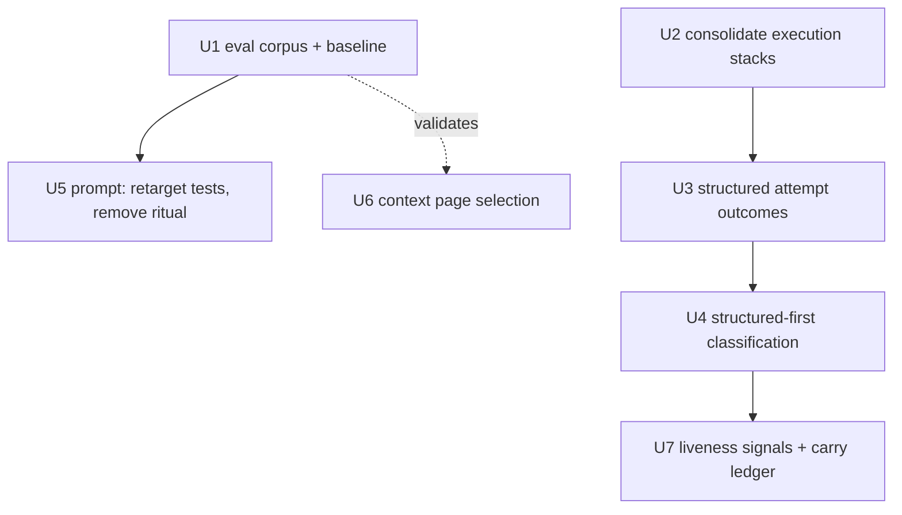

# refactor: Make the harness improve when the models do

## Summary

Audit the harness against Sutton's Bitter Lesson and remove the structure that will cap capability as models improve, without touching the structure that constrains what the agent may cause. The audit found the ceiling is not where expected: the prompt is disciplined, but the harness cannot represent what happened during a failed attempt, and there is no way to measure whether any agent-facing change helped or hurt.

## Problem Frame

Sutton's essay makes two claims that are usually collapsed. The first is that general methods leveraging computation beat hand-encoded human knowledge over time. The second, and the one that matters here, is: "We want AI agents that can discover like we can, not which contain what we have discovered."

A harness is not a learning system, so the essay does not apply uniformly. The distinction that makes it actionable:

| Structure constrains         | Example                                            | Durability                    |
| ---------------------------- | -------------------------------------------------- | ----------------------------- |
| How the model **thinks**     | prescribed step order, mandated tool sequence      | Rots as models improve        |
| What the model may **cause** | auth gates, target binding, one-response invariant | Durable at any model strength |

"Post exactly one comment per invocation" is an execution contract and stays. "Before investigating any issue, first call `session_search`" encodes our theory of how to work, and caps a model that would do better unaided.

The audit covered prompt architecture, execution and error handling, routing and delivery, and config and tooling. Three findings reframed the work:

1. **The prompt is not where the ceiling is.** Emphasis markers across `packages/runtime/src/agent/prompt.ts` and `packages/runtime/src/agent/prompt-thread.ts` total 16 (7 MUST, 5 REQUIRED, 2 ONLY, 1 NEVER, 1 EXACTLY), and composition is roughly 35% environment facts, 35% safety and output contract, 20% reasoning scaffold, 10% workaround. Marker count is weak evidence on its own — a prompt can be bloated with redundant constraints and zero emphatic language — so the conclusion rests on the composition breakdown and on the specific redundancy identified in finding 4, not on the count. What the count rules out is an emphasis-escalation spiral, not bloat generally. A broad prompt diet is therefore unjustified; one targeted removal is.
2. **The harness cannot describe its own failures.** The retry path does not distinguish failure before prompt acceptance, failure during inference, failure after external side effects, or failure after valid output was written. Only a successful attempt assigns `final`. An attempt that already pushed a commit can be retried as though it never ran.
3. **Nothing measures agent outcomes.** 237 test files, zero agent-outcome evaluations. Every `eval`/`golden` match in the tree is inside vendored `.slim/clonedeps`. Coverage of plumbing is strong; coverage of whether the agent is any good is absent.
4. **The prompt prescribes work the harness already did.** `packages/runtime/src/agent/prompt.ts:219-230` instructs the model to run `session_search` and `session_read` before investigating, but `src/harness/phases/session-prep.ts:52,93` already called both and injected the results as `priorWorkContext`. Every run pays for the retrieval, receives the answers, and is then told to repeat it.

## Assumptions

These are load-bearing and unproven. Each is a place the plan could be wrong.

- Models improve in ways that make current scaffolding unnecessary, rather than in ways that require different scaffolding. If capability shifts sideways instead of upward, removals may need to be re-added in another form.
- Outcome quality is measurable enough for subjective work like code review. U1 assumes hard executable gates capture most of what matters; if they do not, the corpus produces confident noise.
- Removing a prescribed workflow raises capability rather than merely reducing predictability. Less prescription is not automatically better; it is a bet that the model's judgment beats ours.
- The OpenCode substrate keeps exposing the signals U3, U4, and U7 depend on. A substrate change could invalidate parts of this plan.
- The think/cause distinction is separable in practice. It is not perfectly clean — the response protocol constrains output format (a cause constraint) while also shaping how the model approaches the task (a think constraint). Where an item is genuinely both, the plan treats it as durable and leaves it alone.

## Requirements

- R1. Changes to prompt, model, plugin set, or OpenCode pin can be evaluated against a frozen baseline before merge.
- R2. Recovery decisions account for whether an attempt produced external side effects.
- R3. Error classification prefers structured provider signals; prose matching is a bounded, instrumented fallback.
- R4. The prompt states what is available rather than prescribing a working method.
- R5. Context selection surfaces the newest evidence rather than the oldest.
- R6. Upstream carries and model-weakness accommodations carry explicit removal conditions — carries in a ledger, code accommodations alongside the code that owns them.
- R7. Execution and retry policy has exactly one owning implementation.
- R8. No safety structure identified as durable is weakened by this work.

## Scope Boundaries

- No changes to auth, fork, or draft gates (`src/features/triggers/skip-conditions-pr.ts`).
- No changes to review guards blocking APPROVE on self or fork PRs (`src/features/reviews/review-guards.ts`).
- No changes to the response-file trust boundary — target and surface derive from the trusted event, never from model output.
- No changes to the exactly-one-response invariant, credential scrubbing, env filtering, the execution deadline as a cost bound, or fail-closed delivery.
- No changes to the `.github/workflows` strip in the integration commit — a hard GitHub App platform constraint.
- No simplification of the four-layer `src/` architecture or the XML-tagged prompt sections. Both express dependency direction and authority boundaries; neither constrains model intelligence.
- No broad prompt diet. The measurement does not support one.
- No conversion of timing constants into configuration. Adaptive timeouts without a hard deadline produce indefinite hangs.
- No restoration of `gh` credentials to enable model-driven retrieval. That trades a real security boundary for a theoretical flexibility gain.

### Deferred to Separate Tasks

- **Release-integration driver split.** `packages/harness/prompt.txt` uses the model as a shell-script runner: it prescribes an exact clone, fetch, merge, squash, strip, build, verify, and push transcript. That is a genuine ceiling and the largest one this plan does not close — deferring it is a sequencing decision, not a judgement that it is unimportant. The correct split is that code owns the deterministic, security-sensitive procedure and the model owns only merge-conflict resolution, where judgement is actually required. It is deferred because it restructures a production release pipeline that shipped three failed attempts this week, and because it must be dry-run against multiple upstream releases before cutover. This plan is a first pass, not a full harness extraction. Track as a named follow-on with that boundary.
- Deleting the vestigial `extractCommand` action/args split (`src/features/triggers/mention-command.ts`). Its result is consumed only by a log statement at `src/harness/phases/routing.ts:71`. Cleanup, not a ceiling.

## Context & Research

### Relevant Code and Patterns

- `packages/runtime/src/agent/error-format/format.ts` — already contains the target pattern. `classifyContextOverflowError` and `classifyProviderAuthError` match structured signals (exact error `name`, `retry-status.reason`, HTTP 402). `isLlmFetchError` (`:86-95`) and `isAgentNotFoundError` (`:129-136`) match prose. The fix extends a pattern already present.
- `src/harness/phases/session-prep.ts:52,93` — already calls `listSessions` and `searchSessions` and injects results as `priorWorkContext`.
- `src/features/agent/live-probe-1.17.20.test.ts` — exercises the real SDK, event, and poll path. The correct seed for an eval runner; it tests transport, not effectiveness.
- `src/features/context/graphql.ts:22,66,77,87` — uses `first:` for comments, commits, and files.
- Duplicate execution stacks:

| Path                                      | Live                                        | Lines |
| ----------------------------------------- | ------------------------------------------- | ----- |
| `src/features/agent/execution.ts`         | yes, via `src/harness/phases/execute.ts:14` | 268   |
| `packages/runtime/src/agent/execution.ts` | exported, parallel                          | 245   |
| `src/features/agent/retry.ts`             | yes                                         | 542   |
| `packages/runtime/src/agent/retry.ts`     | parallel                                    | 131   |

`MAX_LLM_RETRIES = 4` is declared in both `src/features/agent/retry.ts:257` and `packages/runtime/src/agent/retry.ts:43`.

### Institutional Learnings

- `docs/solutions/logic-errors/terminal-outcomes-must-survive-deadline-cleanup-2026-07-24.md` — cleanup may degrade metadata but must never rewrite an accepted outcome. Directly constrains U3.
- `docs/solutions/logic-errors/failed-run-reported-success-with-no-delivery-surface-2026-08-07.md` — exit codes must not encode a claim ("the failure was reported") that may be false.
- `docs/solutions/best-practices/response-file-is-untrusted-input-2026-07-11.md` — model output never selects its own delivery target.
- `docs/solutions/workflow-issues/integrate-push-strips-workflow-files-2026-08-07.md` — a pipeline step that works only because the agent improvises is not a working step. Why `packages/harness/src/prompt-template.test.ts:65-92` must keep exact assertions.

### External References

- Sutton, _The Bitter Lesson_ — http://www.incompleteideas.net/IncIdeas/BitterLesson.html
- Anthropic, _SWE-bench Sonnet_ — https://www.anthropic.com/engineering/swe-bench-sonnet — "The scaffold allows the model to use its own judgment of how to pursue the problem, rather than be hardcoded into a particular pattern or workflow."
- Anthropic, _Building Effective Agents_ — https://www.anthropic.com/engineering/building-effective-agents — simple composable patterns over frameworks; routing, parallelization, and evaluator-optimizer workflows still help with frontier models.
- Anthropic, _Writing Tools for Agents_ — https://www.anthropic.com/engineering/writing-tools-for-agents — leverage lives in tool ergonomics and context economy; return only high-signal information.

Sourcing caveat: the widely repeated claim that named products "deleted scaffolding after a model upgrade" did not survive a source check. This plan does not rest on it.

## Key Technical Decisions

- KTD1. Build a regression corpus, not an evaluation platform. An over-built eval becomes the ceiling it was meant to remove. Both architecture reviews flagged this independently.

- KTD2. Evals assert outcomes, never method. No assertion that the agent called a particular tool, used N steps, or reasoned in a given order. Asserting method fossilizes current behavior more effectively than any prompt.

- KTD3. The harness decides whether recovery is safe; the model decides how to repair the task. Side-effect safety is a code concern. Task repair, given a structured account of the failure, is a model concern. Today the harness does both.

- KTD4. Prose error matching is demoted, not deleted. Some JavaScript network failures genuinely arrive without stable structured fields. Removing the fallback blind would convert recoverable failures into terminal ones.

- KTD5. Context caps stay; page selection changes. The caps are cost, latency, and prompt-injection controls. Fetching the oldest N comments is the defect.

- KTD6. Timing constants stay fixed. The 500 ms poll, two-poll race guard, three grace cycles, and bounded backoff are ordinary reliability controls. Only the 90-second silence-as-failure proxy encodes a model assumption, and the fix is protocol signals rather than configuration.

- KTD7. Prompt test assertions split by mutability. Contract assertions (response-file path, verdict tokens, one-response rule, credential and push semantics, workflow strip) stay exact. Only coaching copy is retargeted.

## Acceptance Examples

- AE1. A prompt edit is merged only after the eval corpus runs against the frozen baseline and reports no regression on hard gates.
- AE2. An attempt that pushes a commit and then fails is not retried by replaying the original prompt; the harness detects the side effect and reconciles.
- AE3. A provider failure arriving with a structured error name is classified without any prose match, and the classification-path metric records `structured`.
- AE4. A provider failure arriving with no structured fields still classifies via bounded prose fallback, and the metric records `fallback`.
- AE5. An agent run where prior session context is irrelevant does not spend tool calls re-searching session history.
- AE6. A PR with 80 comments where the decisive evidence is in the newest 10 surfaces that evidence in the assembled context.
- AE7. A clean PR produces a PASS verdict with no invented blocking findings.

## High-Level Technical Design

> This illustrates the intended approach and is directional guidance for review, not implementation specification. The implementing agent should treat it as context, not code to reproduce.

Current recovery collapses every failure into one boolean, losing the facts needed to decide safely:

Proposed shape — a discriminated outcome the recovery policy can reason over. The signal investigation in U3 dropped `completed_with_side_effects`, because no observable input can populate it honestly; side-effect risk is carried by the credential axis instead, and the decision the lattice actually drives is _resend versus continue_:

## Implementation Units

U1 and U2 are independent and may run in parallel. U3 → U4 → U7 is a serial chain. U5 cannot start before U1, because the eval corpus is its only meaningful verification path — without it, prompt edits are unverifiable opinion. U6 is independent but should be validated against the U1 corpus once that exists.

If U1 slips or is abandoned, U5 must not proceed on judgement alone — that is the failure mode where prompt refactors become unverifiable edits.

- [ ] **U1. Differential eval corpus and baseline**

**Goal:** Make agent-facing change measurable before anything is deleted.

**Requirements:** R1

**Dependencies:** None

**Files:**

- Create: `evals/scenarios/` (fixture repos and normalized event payloads)
- Create: `evals/runner.ts`
- Create: `evals/gates.ts`
- Test: `evals/gates.test.ts`

**Approach:**

- **Hard cap: eight scenarios.** The corpus exists to validate U3, U4, U5, and U6 — nothing more. Coverage expansion is deferred until a specific change needs a scenario that does not exist. A corpus that grows to satisfy completeness becomes the platform KTD1 forbids.
- Eight frozen scenarios run through the real `executeOpenCode` path against disposable fixture repos.
- The real path is **not** "just a test": it spins up an OpenCode server, creates a session, and runs a live SDK session. `src/features/agent/live-probe-1.17.20.test.ts` shows the required shape — gated execution, isolated `HOME`/`PATH`/`XDG_*`, and a pinned low-cost model. Budget the server lifecycle, env isolation, and model-cost strategy as part of this unit rather than discovering them during implementation.
- The runner is **credentialless**. `file-convention` delivery covers the delivery surface only, not every GitHub-backed action the agent might attempt, so no GitHub token is provisioned to the eval environment at all. A misconfigured eval must be incapable of mutating a real repository, not merely discouraged from it.
- Fixture content is **untrusted input**. Scenario repos and event payloads carry adversarial text by design (a PR body containing instructions is a legitimate scenario), so the runner treats fixtures as a prompt-injection surface and never grants them more authority than a real untrusted PR would have.
- Hard executable gates score the run: response file parses, correct verdict enum, exactly one delivery, no forbidden mutation, no secret leakage, tests pass where applicable, planted defect found, clean PR stays clean.
- Record the full tuple per run: model, OpenCode build, plugin versions, prompt hash, scenario commit, cost, duration. This tuple is what makes a model upgrade measurable.
- An LLM judge may score clarity as a secondary signal, never as the merge gate.
- Scenario set covers: issue answerable from known files; PR with one planted defect; clean PR; implementation task with a failing test; continuation where prior work is relevant; continuation where prior work is irrelevant; long thread with decisive evidence in the newest comments; malformed or missing response file.

**Patterns to follow:**

- `src/features/agent/live-probe-1.17.20.test.ts` for driving the real SDK and poll path.

**Test scenarios:**

- Happy path: a scenario with a planted defect scores a blocking verdict naming the defect.
- Happy path: a clean-PR scenario scores PASS and fails if the agent invents findings.
- Edge case: a scenario producing no response file fails the delivery gate rather than erroring the runner.
- Error path: a scenario whose fixture repo is missing fails loudly with the scenario name, not silently.
- Integration: the runner captures the full provenance tuple and writes a JSON report consumable in CI.

**Verification:**

- Baseline captured for current prompt and model across all scenarios, committed as the reference artifact.
- No gate asserts tool usage, step count, or reasoning order.

- [x] **U2. Consolidate duplicate execution stacks**

**Goal:** One owning implementation of execution and retry policy.

**Requirements:** R7

**Dependencies:** None (may run parallel to U1)

**Files:**

- Modify: `src/features/agent/execution.ts`
- Modify: `src/features/agent/retry.ts`
- Modify: `packages/runtime/src/agent/execution.ts`
- Modify: `packages/runtime/src/agent/retry.ts`
- Modify: `packages/runtime/src/agent/index.ts`
- Test: `src/features/agent/opencode.test.ts`

**Approach:**

- Establish which stack owns execution and retry policy, then remove or reduce the other to a re-export.
- Collapse the duplicated `MAX_LLM_RETRIES` and backoff constants to a single declaration.
- `src/features/agent/execution-adapter.ts` is an **abandoned consolidation attempt**: it delegates to the runtime implementation but is imported nowhere outside its own test. Its existence is evidence this merge was already started once. Decide deliberately whether to finish that direction or delete the adapter — do not leave a third partial path.
- Precision on the duplication: `src/features/agent/execution.ts:53` genuinely defines `executeOpenCode` and is the live path via `src/features/agent/index.ts:18`. The runtime copy at `packages/runtime/src/agent/execution.ts` is separately exported from `packages/runtime/src/agent/index.ts` and serves its own consumers. These are parallel implementations with different consumers, not one wrapper around the other, which makes consolidation higher-risk than a mechanical merge.

**Execution note:** Characterization-first — capture current behavior before collapsing, since both stacks are exported.

**Patterns to follow:**

- The runtime-owns-primitive split already used for `packages/runtime/src/agent/prompt.ts`, re-exported by the action layer.

**Test scenarios:**

- Happy path: the live Action path resolves to the owning implementation and existing execution tests pass unchanged.
- Edge case: importing the retry constants from either entry point yields the same value.
- Integration: a full execute-phase run produces byte-identical behavior to the pre-consolidation baseline.

**Verification:**

- Exactly one declaration of retry count and backoff exists in the tree.
- No public export is silently dropped.

- [x] **U3. Structured attempt outcomes and recovery policy**

**Goal:** Make recovery decisions account for observed side effects.

**Requirements:** R2, R8

**Dependencies:** U2

**Files:**

- Modify: `src/features/agent/retry.ts`
- Modify: `src/features/agent/execution.ts`
- Modify: `src/harness/phases/execute.ts`
- Test: `src/features/agent/opencode.test.ts`

**Signal investigation outcome (2026-08-07): the premise was refuted.**

This unit required naming the side-effect signal before building the lattice, and explicitly allowed for the answer being negative. It is. There is **no sufficient pre-replay detector** for "this attempt caused an external effect."

Evidence, verified against source:

- `prsCreated`, `commitsCreated`, and `commentsPosted` (`src/features/agent/streaming.ts:22-26`) are populated by artifact detection over SSE events and tool-output text, not by a write confirmation. They evidence _attempted_, never _landed_.
- They read empty exactly when an attempt dies mid-flight, which is the unsafe direction: a write that reached GitHub before the stream died leaves the counters at zero, and a replay keyed on them would duplicate the effect.
- The signals that genuinely prove an effect — the return values of `createCommit`, `postComment`, `submitReview`, and `runResponsePost` — exist only in the delivery/finalize path, downstream of the retry decision.

The investigation also corrected the shape of the defect. `src/features/agent/execution.ts:167` already sends `CONTINUATION_PROMPT` on every attempt after the first, so the harness never resends the original prompt. The replay hazard is not the harness repeating an instruction — it is the continuation itself, which is a fixed string that both misstates the cause and invites redoing work:

> "The previous request was interrupted by a network error (fetch failed). Please continue where you left off. If you were in the middle of a task, resume it."

Only three error types are retryable (`packages/runtime/src/agent/error-format/format.ts`): `rate_limit`, `llm_timeout`, and `llm_fetch_error`. The prompt asserts a fetch failure for all of them, so it states a cause the harness did not observe in two of the three cases, and "resume it" is the instruction most likely to make a model repeat a write that already landed. This is the unit's core defect: a fabricated narrative substituted for the structured signal the harness already holds.

Two signals _are_ trustworthy, and the design rests only on these:

1. **Credential disposition.** `resolveResponseDelivery` (`packages/runtime/src/agent/response-delivery.ts`) withholds the GitHub credential entirely for `pull_request`, `issue_comment`, and `issues`. On those events the agent structurally cannot write to GitHub, so undetectable external effects are confined to credential-provisioned runs (`workflow_dispatch`, `schedule`, and the unknown-event default).
2. **Response-file presence.** `src/harness/phases/execute.ts:117` removes the response file before the run, so its presence after a failed attempt proves the model produced a deliverable during _this_ attempt.

**Approach:**

- **Separate the two operations the boolean conflated.** The hazard was never "retry" — it is _resending the original prompt_, which redoes work. A continuation carrying the structured failure and the remaining objective is safe even when effects occurred, because it does not repeat the original instruction. The lattice exists to decide between resend, continue, and stop.
- Replace the boolean `shouldRetry` with a discriminated outcome: `submit_failed`, `turn_failed_retryable`, `turn_failed_terminal`, `timeout`, `completed`.
- **`completed_with_side_effects` is dropped.** Nothing can populate it honestly. A variant whose only inputs are inference-derived counters would assert a fact the harness cannot observe, which is the "wider lattice resting on false confidence" this unit was told to avoid. Side-effect risk is carried instead by the credential axis, which is structural.
- Carry `deliverablePresent` and `credentialProvisioned` as orthogonal facts rather than outcome variants — both are observable, and neither describes _why_ the turn ended.
- Recovery policy: `submit_failed` resends the original prompt (the sole case where nothing was accepted, so nothing ran); `turn_failed_retryable` sends a continuation carrying the structured failure and never resends; a deliverable present reconciles rather than re-runs; terminal and timeout stop; anything unclassifiable is treated as effect-bearing and never resends.
- **Replace the fixed continuation string with the observed failure.** The continuation must name the actual error type rather than asserting a fetch failure, and must not instruct the model to "resume" blindly. On a credential-provisioned event it should direct the model to verify what already landed before acting, since that is exactly the case where an unobserved write may have succeeded.
- **Outcome classification never upgrades run status.** The outcome describes what happened, not whether the run succeeded. A failed attempt remains a failed run unless delivery independently succeeded, preserving the invariant from `docs/solutions/logic-errors/failed-run-reported-success-with-no-delivery-surface-2026-08-07.md`: an exit code must not encode a claim that may be false.
- **Delivery bookkeeping is authoritative over recovery.** If a response was already delivered, recovery must not produce a second one. The exactly-one-response invariant is enforced by delivery state, never inferred from the outcome variant.
- **Unknown is treated as side-effect-bearing.** Where observability is absent, the policy assumes effects occurred and declines to resend.
- **Accept that observability is partial.** Effects outside the harness's inspection surface are undetectable by construction. The policy is safe only because unknown declines to resend; it must never be tightened into "unknown means no side effects."
- Accumulate artifacts from failed attempts so a later attempt can see what already happened.
- Instrument the combined attempt budget across OpenCode's internal retries and the harness's own.

**Execution note:** Test-first. The dangerous cases are side-effect-bearing failures, and those tests should exist before the policy changes.

**Patterns to follow:**

- `packages/runtime/src/agent/error-format/format.ts` discriminated `ErrorType` union.
- The terminal-outcome preservation rule in `docs/solutions/logic-errors/terminal-outcomes-must-survive-deadline-cleanup-2026-07-24.md`.

**Test scenarios:**

- Happy path: a transport failure before prompt acceptance resends the original prompt.
- Happy path: an interrupted turn sends a continuation containing the structured failure rather than the original prompt.
- Error path: a failed attempt on a credential-provisioned event never resends, because effects are undetectable there.
- Error path: an attempt that wrote a valid response file and then failed does not overwrite that delivery.
- Edge case: a terminal provider error stops immediately without consuming the retry budget.
- Edge case: an unclassifiable failure does not resend the original prompt.
- Integration: the combined OpenCode-plus-harness attempt count is recorded in the run summary.

**Verification:**

- No path resends the original prompt after the prompt was accepted.
- The continuation prompt carries the structured failure, not a generic string.
- No branch consults `prsCreated`, `commitsCreated`, or `commentsPosted` to decide recovery.

- [ ] **U4. Structured-first error classification**

**Goal:** Stop parsing provider prose to make control-flow decisions.

**Requirements:** R3, R6

**Dependencies:** U3

**Files:**

- Modify: `packages/runtime/src/agent/error-format/format.ts`
- Modify: `src/features/agent/streaming.ts`
- Modify: `src/features/comments/error-format.ts`
- Test: `packages/runtime/src/agent/error-format/format.test.ts`

**Approach:**

- Classification order: exact structured signal, then stable error `name`/`code`/`status`/`cause`, then narrowly bounded prose fallback, then generic unclassified failure.
- Extend the pattern already established by `classifyContextOverflowError` and `classifyProviderAuthError`.
- **Convert only what the SDK actually exposes.** The structured surface is bounded — roughly `type`, `reason`, `name`, `status`, `code`, `message`, `resetAt`. Provider-auth and quota shapes are convertible; general network failures and agent-not-found are not, because the SDK does not expose structured fields for them. This unit does not claim to promote most classification, only the cases with real structured signal.
- **The removal gate is correctness, not coverage.** A high structured-coverage percentage can coexist with the remaining fallback cases being precisely the critical ones. Removing a fallback requires evidence that the specific error shapes it handles are covered structurally — not that the aggregate percentage looks good.
- Emit a classification-path metric (`structured` / `name` / `fallback` / `unclassified`) into the job summary as a structured local metric, not external telemetry.
- Keep the prose fallback until there is evidence the shapes it handles are covered structurally. Record its removal condition alongside the fallback itself, in code.
- **Auth and quota failures fail closed.** Reclassification must never move a provider-auth or quota failure from terminal to retryable. Retrying a credential failure burns credentials and produces noise; absent an explicit credential-refresh path, these stay terminal regardless of what the structured signal suggests.

**Patterns to follow:**

- `classifyProviderAuthError` in `packages/runtime/src/agent/error-format/format.ts`.

**Test scenarios:**

- Happy path: a structured provider error classifies without touching prose patterns, and the metric records `structured`.
- Happy path: an error with a stable `code` but no structured payload classifies at the name/code tier.
- Edge case: an error with neither structured fields nor a matching prose pattern yields `unclassified` rather than a wrong terminal verdict.
- Error path: a prose-only network failure still classifies as retryable via fallback, and the metric records `fallback`.
- Error path: a false-positive-prone message does not classify as agent-not-found unless a structured signal supports it.
- Integration: the classification path appears in the job summary for a full run.

**Verification:**

- No classifier reachable from control flow depends on prose alone when a structured signal is available.
- Retry and terminal decisions are unchanged for every currently-covered error shape.

- [ ] **U5. Retarget prompt assertions and remove the redundant session ritual**

**Goal:** Stop prescribing a working method the harness already performed.

**Requirements:** R4, R8

**Dependencies:** U1 (baseline required before prompt changes)

**Files:**

- Modify: `packages/runtime/src/agent/prompt.ts`
- Modify: `packages/runtime/src/agent/prompt.test.ts`
- Modify: `packages/runtime/src/agent/prompt-thread.test.ts`
- Test: `packages/runtime/src/agent/prompt.test.ts`

**Approach:**

- Split prompt assertions by an **enumerated** contract inventory rather than judgement. The following must remain exact assertions, and the unit is not complete until each is confirmed still exact: the response-file path; the verdict token set; the exactly-one-response rule; the `gh`-unavailable statement in `file-convention` mode; the non-posting prohibition in `responseDelivery: 'none'`; the delivery-mode authority over user-supplied instructions; and the bot identification marker requirement. Everything outside that list is coaching copy and may become behavioral.
- Enumerating rather than judging is deliberate: a fuzzy split lets a test refactor silently downgrade a contract assertion, which would make a later prompt edit look safe while relaxing a boundary.
- Replace the prescribed sequence at `packages/runtime/src/agent/prompt.ts:219-230` with an affordance stating that prior session context may be provided and the session tools are available when further history would help.
- Consolidate delivery rules that currently appear in multiple sections into one authoritative statement.
- Keep the completion-summary requirement. The automatic writeback does not capture qualitative decisions; evaluate that gap separately.
- One block per change, each measured against the U1 baseline.

**Patterns to follow:**

- Existing semantic substring assertions in `packages/runtime/src/agent/prompt.test.ts`.

**Test scenarios:**

- Happy path: the prompt still states the response-file path, verdict enum, and one-response rule exactly.
- Happy path: the prompt no longer mandates a tool call order.
- Edge case: `responseDelivery: 'none'` still produces the silent-run contract unchanged.
- Edge case: `file-convention` mode still states that `gh` is unavailable.
- Integration: eval corpus shows no regression on continuation scenarios where prior work is relevant.
- Integration: eval corpus shows reduced tool calls on the scenario where prior work is irrelevant.

**Verification:**

- `packages/harness/src/prompt-template.test.ts` is untouched and still pins the workflow strip and its ordering.
- No safety or output-contract assertion was relaxed.

- [ ] **U6. Context page selection**

**Goal:** Surface the newest evidence rather than the oldest.

**Requirements:** R5

**Dependencies:** None

**Files:**

- Modify: `src/features/context/graphql.ts`
- Modify: `src/features/context/pull-request.ts`
- Modify: `src/features/context/issue.ts`
- Test: `src/features/context/graphql.test.ts`

**Approach:**

- Change comment, commit, and file selection from oldest-first to newest-tail while preserving every cap in `src/features/context/types.ts`.
- Keep the truncation disclosure in the assembled prompt so the model knows the set is partial.
- This is **not a local edit**. Moving to `last:` inverts page semantics, and the downstream budget and truncation logic in `src/features/context/budget.ts` assumes a forward-ordered capped list. The change spans the query layer and the budget layer together, and the truncation math and notice behavior must be preserved across both. Scope this unit accordingly.

**Patterns to follow:**

- Existing budget and truncation handling in `src/features/context/budget.ts`.

**Test scenarios:**

- Happy path: a thread longer than the comment cap yields the newest comments up to the cap.
- Edge case: a thread shorter than the cap is unchanged.
- Edge case: an empty comment set produces no error and no misleading truncation notice.
- Integration: the eval scenario with decisive evidence in the newest comments passes where it previously failed.

**Verification:**

- All existing caps are unchanged in value.
- Truncation is still disclosed in the prompt.

- [ ] **U7. Liveness signals and the carry ledger**

**Goal:** Replace the silence-as-failure proxy, and give the twelve upstream carries an exit path.

**Requirements:** R6

**Dependencies:** U4 (classification metric feeds the register)

**Files:**

- Modify: `src/features/agent/session-poll.ts`
- Modify: `packages/harness/harness.config.json`
- Create: `docs/reference/carry-ledger.md`
- Test: `src/features/agent/opencode.test.ts`

**Approach:**

- Prefer real protocol signals over the 90-second no-initial-activity timeout, bounded always by the absolute deadline. Leave the poll interval, race guard, grace cycles, and backoff alone.
- The available signals are `session.idle`, `session.next.tool.progress`, and the server-level `server.heartbeat`; the harness already consumes `session.idle` and `message.part.delta`. Note that `busy` is **internal pool state, not an SSE event** — do not build on it. Distinguish server-level heartbeats (the process is alive) from session-level progress (this run is advancing); only the latter is evidence the agent is working.
- Scope the ledger to the twelve upstream carries only. A generalised "expiry register" covering every accommodation is process overhead ahead of demonstrated need; the carries have that need already — the same carry has been wrongly proposed for removal in two consecutive base-bump audits, each time costing a source-level re-litigation.
- For each carry, record the capability it provides, upstream status, the test proving it is still needed, the first upstream version that would contain it, and its removal condition. The exact version pin stays; the liability is fork-delta with no exit path.
- Ordinary deadlines, safety gates, and race guards get no entry. Prose-fallback and prompt-coaching removal conditions live with the code that owns them (U4, U5), not in a central register.
- The ledger is **documentation, not enforcement**, and is explicitly non-authoritative for auth, delivery, and retry policy. An entry never justifies weakening a guard; removal still requires the normal review path.

**Patterns to follow:**

- The carry-value policy already applied during OpenCode base bumps: absence from stock plus value to a served surface is the KEEP case.

**Test scenarios:**

- Happy path: a run emitting protocol progress signals is not aborted while the deadline remains.
- Edge case: a run emitting no signals at all is still bounded by the absolute deadline.
- Error path: a provider supplying `Retry-After` has it honored within the deadline rather than overridden by a fixed backoff.
- Integration: the absolute deadline still terminates a hung run.

**Verification:**

- No path can wait indefinitely; the absolute deadline remains the hard bound.
- Every carry in `packages/harness/harness.config.json` has a ledger entry with a removal condition.

## System-Wide Impact

- **Interaction graph:** U3 touches the execute phase and finalize; U4 touches streaming, comments error formatting, and the runtime error surface; U5 touches every prompt consumer including the gateway.
- **Error propagation:** U3 and U4 change how failures are represented but must not change which failures are terminal for any currently-covered shape.
- **State lifecycle risks:** U3 is the highest-risk unit. A mistake in side-effect detection could either duplicate an external effect or wrongly suppress a legitimate retry.
- **API surface parity:** `packages/runtime` exports are consumed by both the Action and the gateway. U2 must not silently drop an export.
- **Integration coverage:** U5's effect on agent behavior is only observable through the U1 corpus; unit tests cannot prove it.
- **Unchanged invariants:** the exactly-one-response rule, response-file trust boundary, review guards, credential scrubbing, execution deadline, fail-closed delivery, and the workflow strip are explicitly unchanged by every unit above.

## Risks & Dependencies

| Risk | Likelihood | Impact | Mitigation |
| --- | --- | --- | --- |
| The eval corpus encodes today's behavior as the ceiling | Medium | High | Assert outcomes only; explicitly forbid assertions on tool usage, step count, or reasoning order (KTD2) |
| Removing prose fallback turns recoverable failures terminal | Medium | High | Demote rather than delete; gate removal on the classification-path metric (KTD4) |
| Side-effect detection in U3 is wrong in either direction | Medium | High | Test-first on side-effect-bearing failures; characterization baseline from U2 first |
| Prompt change regresses continuation quality | Medium | Medium | U5 depends on U1; one block per change, measured against baseline |
| Execution-stack consolidation drops a consumed export | Low | Medium | Characterization-first; verify both entry points before removal |
| Eval corpus grows into a platform | Medium | Medium | Corpus and runner only; JSON report and CI artifacts, no dashboard or service (KTD1) |

## Open Questions

### Resolved During Planning

- Are the fixed timing constants Bitter Lesson violations? No. The poll interval, two-poll race guard, grace cycles, and backoff are ordinary reliability controls. Only the 90-second silence proxy encodes a model assumption.
- Do the wording-pinned prompt tests entrench the scaffold? Only partly. `packages/harness/src/prompt-template.test.ts` must stay exact — it pins the workflow strip that broke three consecutive releases.
- Is the four-layer architecture over-structured for an agent harness? No. Both architecture reviews were explicit that layers and XML sections express dependency direction and authority, not reasoning constraints.
- Is pinning an exact upstream OpenCode build a Bitter Lesson problem? No. The pin is good dependency management. The liability is the twelve carries accumulating without exit paths.
- Is `isAgentNotFoundError` dead code? No. One review claimed it was; verification found it live via `src/features/comments/error-format.ts:11`.

### Deferred to Implementation

- Which execution stack should own policy after U2 — the action layer or the runtime package. Requires reading both call graphs against current consumers.
- Whether the automatic session writeback can be extended to capture qualitative decisions, which would let the completion-summary requirement drop from the prompt.
- The exact protocol signals available for liveness in the current OpenCode build, and whether they cover the cases the 90-second timeout currently catches.
- Final scenario count for the eval corpus. Eight is the floor; twelve is the working ceiling.

## Documentation / Operational Notes

- The carry ledger (`docs/reference/carry-ledger.md`) becomes a maintained artifact reviewed at each OpenCode base bump.
- Eval baselines are versioned artifacts; a model or pin change requires a re-baseline, not a silent comparison against a stale reference.
- `AGENTS.md` should gain a pointer to the eval corpus once U1 lands, so agent-facing changes route through it.

## Sources & References

- Sutton, _The Bitter Lesson_ — http://www.incompleteideas.net/IncIdeas/BitterLesson.html
- Anthropic, _SWE-bench Sonnet_ — https://www.anthropic.com/engineering/swe-bench-sonnet
- Anthropic, _Building Effective Agents_ — https://www.anthropic.com/engineering/building-effective-agents
- Anthropic, _Writing Tools for Agents_ — https://www.anthropic.com/engineering/writing-tools-for-agents
- Related learnings: [terminal outcomes must survive deadline cleanup](../solutions/logic-errors/terminal-outcomes-must-survive-deadline-cleanup-2026-07-24.md), [failed run reported success with no delivery surface](../solutions/logic-errors/failed-run-reported-success-with-no-delivery-surface-2026-08-07.md), [integrate push strips workflow files](../solutions/workflow-issues/integrate-push-strips-workflow-files-2026-08-07.md)
