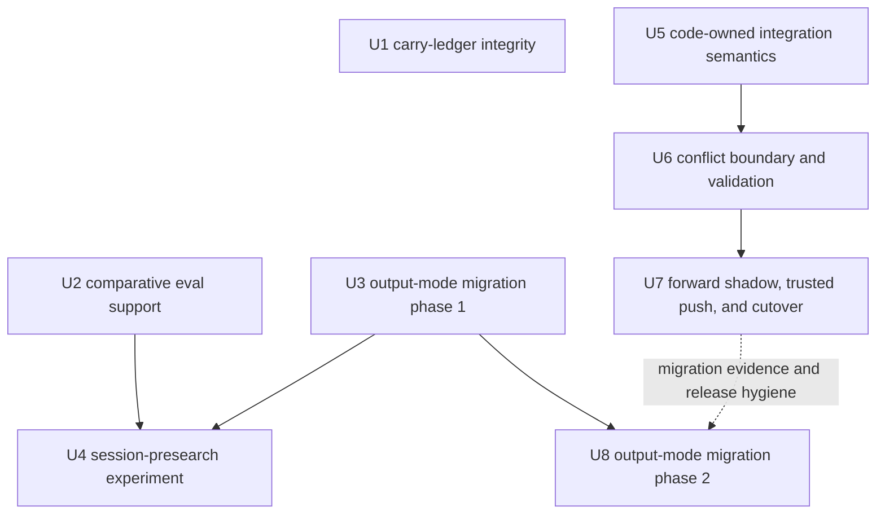

# refactor: Audit and upgrade Bitter Lesson delta flexibility

## Summary / Overview

This plan is a fresh, source-grounded audit of the remaining Bitter Lesson risk in the harness after the completed work in [`2026-08-07-001-refactor-bitter-lesson-harness-flexibility-plan.md`](2026-08-07-001-refactor-bitter-lesson-harness-flexibility-plan.md). The audit baseline is `origin/main`/`HEAD` `e8ec9134ac3b76c8dc17d46a76e6f2b85b0f5987`.

The August 7 U1-U6 units shipped and remain valid. U7's carry ledger shipped. Its proposed liveness rewrite was correctly abandoned: the shipped OpenCode surface has no truthful per-session progress signal that can replace the current initial-activity semantics. This plan does not reopen that decision.

The current harness is substantially Bitter-Lesson-aligned. The largest remaining capability ceiling is not a broad prompt problem. It is the release integration path, where the same deterministic procedure exists in TypeScript, bash/YAML, and an English model prompt and has drifted. A smaller contract defect remains in phrase-inferred output mode. The existing outcome corpus is useful but needs one bounded comparative projection so agent-facing changes can be judged without becoming a benchmark platform. The carry ledger needs machine-enforced referential integrity, and one carefully bounded experiment should test whether eager session presearch still earns its cost.

The units are phased rather than one all-at-once landing: U1-U7 form the active completion path, while U8 is deliberately delayed until the next minor-release migration window.

The governing direction is simple:

- code owns deterministic sequencing, authority, side effects, and verification;
- the model is invoked where judgment is actually required, principally merge-conflict repair;
- explicit configuration owns delivery semantics rather than model-selected phrases;
- tests, evals, provenance, logs, and stop conditions make additional computation safe to scale;
- no change is justified by a plausible theory when the repository or dependency cannot observe the property that theory needs.

## Problem Frame

### A revised Bitter Lesson rubric for a harness

Sutton's _The Bitter Lesson_ argues for methods that continue to benefit from increasing computation rather than systems that encode a fixed body of human-discovered knowledge. The essay is a useful design lens, not a complete classification for an agent harness. The old plan's **think-vs-cause** split was necessary but incomplete: some structures shape both the model's approach and the world-facing contract, and a harness also contains capability infrastructure and a verifier layer that do not fit cleanly into either side.

Use this five-part rubric for each proposed constraint:

| Rubric | What it governs | Default durability | Audit question |
| --- | --- | --- | --- |
| **Reasoning prescription** | Fixed step order, mandated tool sequence, canned investigation workflow, or prose that tells the model how to think | Likely to rot as models improve | Does this encode our current theory of competent work rather than a durable contract? |
| **Capability/access infrastructure** | Tools, context access, session continuity, useful parallelism, and evidence surfaces | Durable when it expands perception or action without selecting the model's method | Does this give a stronger model more useful computation or evidence, or merely force a transcript? |
| **Side-effect/security constraints** | Credential withholding, target binding, auth/fork/head guards, response validation, one-response limits, and hard resource bounds | Durable at any model strength | Does weakening this allow an agent to cause an unsafe or unauthorized effect? |
| **Measurable temporary accommodation** | A workaround for a known model or substrate weakness | Valid only with evidence and a removal trigger | What observed failure justifies it, and what exact evidence permits deletion? |
| **Verifier layer** | Tests, outcome evals, logs, provenance, shadow comparisons, and deterministic gates | Durable infrastructure for scaling computation safely | Can the system distinguish improvement, regression, infrastructure loss, and unknown? |

Search, decomposition, routing, and orchestration are not automatically Bitter-Lesson violations. They are general methods only when they increase useful computation, parallelism, or evidence available to the system. They become a ceiling when they encode a fixed human workflow that the model must imitate regardless of outcome.

### Audit conclusions

1. **Do not prescribe a broad prompt diet.** The August 7 prompt audit found a disciplined prompt whose durable sections state authority, environment, safety, and delivery contracts. The one redundant session ritual was removed. Remaining prompt changes should be contract-preserving and outcome-measured, not a generalized deletion campaign.
2. **Collapse the release integration implementations.** `packages/harness/src/integrate.ts` and its CLI already contain useful deterministic primitives, but production still runs the workflow's bash/YAML rendering plus `packages/harness/prompt.txt`. The three representations have different semantics: the TypeScript path does not yet own squash, workflow stripping, or push, while the production prompt does.
3. **Make delivery mode explicit.** `resolveAutoMode` is brittle code guessing a side-effect routing decision from English. This is not chiefly a model-capability violation; it is a trusted configuration decision placed in the wrong layer. Keep compatibility briefly, make `auto` safe and deterministic, warn on legacy matches, and remove the detector after migration.
4. **Use the existing eval corpus as a verifier, not a platform.** The six-scenario corpus and reviewed baseline remain authoritative and capped at eight scenarios. Add only a stable candidate-vs-baseline comparison and lazy, bounded repeats for a stochastic quality failure.
5. **Machine-check the carry ledger's integrity.** The ledger documents upstream carry rationale; it must not become an external-truth oracle. Static checks can prevent drift between the manifest and documentation without making network claims about upstream PR state.
6. **Test eager session presearch once.** The current action phase eagerly lists recent sessions and searches prior work, while native `session_*` tools remain available. The question is whether the injected context still pays for itself. The experiment must preserve logical-key session continuity and must not assert tool usage or a prescribed model method.

## Requirements

- **R1 — Single integration driver:** One code-owned driver must own clone, anonymous fetch, branch setup, ordered merges, conflict boundaries, squash, workflow stripping, build, version verification, provenance, and push.
- **R2 — Judgment only at conflicts:** The model is invoked only when a code-owned `git merge --no-ff` reports conflicts. A clean merge must not spend model computation on a deterministic operation.
- **R3 — No push credential to the model:** The conflict resolver child process runs inside the GitHub runner trust boundary and receives only the short-lived broker-minted model credential through the existing `auth.json` channel. That credential is model-scoped, short-lived, push-incapable, and cannot perform authenticated GitHub operations; it is model-readable by design. The resolver receives no raw provider-env-key channel, GitHub token, App private key, AWS/cloud credentials, browser/session auth, askpass helper, or inherited secret-bearing environment. In-process environment and tool permissions reduce blast radius but are not kernel containment. Network egress remains governed by the runner/broker workflow boundary; public sources are fetched anonymously and an auth-required source fails closed.
- **R4 — Conflict-scoped artifact validation:** Each model-resolution attempt runs in a disposable isolated checkout rooted under the runner's temporary scratch area. The checkout is recreated from the exact pre-conflict commit before every attempt, then the same merge is reapplied to regenerate the conflict set; `git reset --hard` alone is insufficient because it does not remove ignored or untracked state. The resolver does not claim to prevent or reliably detect arbitrary external filesystem writes from a model running inside the runner trust boundary. Instead, attempt filesystem state is never artifact authority: code extracts bytes only from the exact allowed conflict paths, rejects symlink components and non-regular files, applies strict encoding/marker/size checks, and copies accepted blobs into an independently reconstructed integration merge state. Code stages only explicit validated paths, never `git add -A`, requires an empty unmerged index, and preserves the late deterministic validation/push boundary. Broader read-only context may be allowed after trusted reassessment, but write scope never widens implicitly. Any invalid extracted result destroys the attempt and fails it.
- **R5 — Bounded conflict recovery:** Each integration ref receives at most two conflict-resolution attempts. Exhausting the bound fails the release integration hard.
- **R6 — Release preservation:** The one-job/OIDC security invariant, workflow-file strip, all-or-nothing build/publish dependency, provenance, and rollback behavior remain intact.
- **R7 — Explicit output contract:** Public `auto` remains temporarily for compatibility but deterministically resolves to `working-dir`. The old matcher may warn during one minor-release window but never chooses `branch-pr`. Keep the existing scalar `resolved-output-mode` output backward-compatible and add a dedicated `output-mode-migration` machine-readable output that lets external callers detect requested/omitted `auto`, final `working-dir`, and whether legacy inference would have selected `branch-pr`.
- **R8 — Credential override remains absolute:** `pull_request`, `issue_comment`, and `issues` events continue to withhold GitHub credentials even if any caller requests a non-posting or alternate output mode.
- **R9 — Stable comparative evaluation:** Candidate comparison uses only scenario state, structured verdict, and gate IDs/semantics. Prompt hashes, runtime/plugin versions, duration, cost, and tokens remain provenance or advisory data, never quality-equality gates.
- **R10 — Conservative eval verdicts:** Safety or contract-gate failure blocks without retries. Inconclusive infrastructure outcomes are neither pass nor fail and require rerun. Stochastic quality repeats are lazy and bounded to at most 4-vs-4 samples per affected scenario, including the initial run.
- **R11 — Corpus law:** Green means no large observed regression across the six covered scenarios. It does not prove improvement, production GitHub delivery, gateway quality, integration quality, or release-notes narration quality.
- **R12 — Carry integrity without external truth:** One deterministic test enforces manifest/ledger set equality in both directions, base-version agreement, and evidence/removal-condition structure. It performs no network check.
- **R13 — Session experiment isolation:** The eager-presearch experiment has a narrow injected strategy/dependency at the `runSessionPrep` boundary, supplied only by the eval runner/scenario path. Production defaults to the current eager `listSessions`/`searchSessions` behavior; the treatment disables only eager recent/prior-work injection, preserves logical-key resolution/session continuity and native `session_*` tools, and compares outcomes rather than model method.
- **R14 — No accidental architecture expansion:** The work does not unify the Action and Gateway execution loops, add a generic plugin/config or model-parameter framework, redesign trigger policy/deduplication, or create a benchmark platform.
- **R15 — Reversible rollout:** Integration cutover is preceded by dry-run and outcome-based forward-shadow evidence from immutable real inputs. Base and ordered carry sources are frozen once; structural equivalence, conflict-scope limits, fresh-checkout builds, version/provenance/workflow-strip/clean-tree/security invariants, and release outcomes are authoritative. Tree differences remain diagnostic evidence, not a cutover verdict. Rollback is a revert to the prior workflow/driver version, not an invented runtime fallback.
- **R16 — Operator-value evidence:** Before and after shadow/cutover releases record release completion/failure, elapsed time, and manual operator interventions as operational evidence using existing release/job results and operator notes. These are not hard acceptance gates unless enough comparable releases exist; they must not be presented as capability gains or as a new telemetry platform.

## Scope Boundaries

### Durable invariants unchanged and out of scope

The following remain authoritative and are not weakened or redesigned by this plan:

- `NormalizedEvent`-only routing and the prohibition on raw event access;
- auth, fork, self, draft, and head/TOCTOU guards;
- credential withholding, environment filtering, redaction, and secret scrubbing;
- trusted event binding for response surface and delivery target;
- exactly one response or review per invocation;
- response-file location, schema, allowlist, and fail-closed validation;
- coordination locks, heartbeats, cleanup, and session persistence invariants;
- the hard execution deadline and context caps;
- XML authority sections and the four-layer Action architecture;
- deterministic release-notes validation, assembly, application, idempotency, and auth split;
- exact version/checksum pins and the committed `dist/` policy;
- the unconditional `.github/workflows` strip required by GitHub App permissions;
- the one-job/OIDC security invariant in `harness-integrate.yaml`;
- release all-or-nothing publishing semantics.

No hand-authored `dist/` change is an implementation unit. Generated distribution synchronization remains a normal build consequence of a later source change, subject to the existing committed-dist policy.

### Deferred or rejected findings

- **Broad prompt diet:** rejected. The evidence supports targeted contract-preserving changes, not prompt-wide simplification.
- **Liveness rewrite:** abandoned correctly. `busy` is latched state without progress information; no truthful per-session signal replaces the current initial-activity timeout. Revisit only when the upstream protocol exposes a real timestamped progress/tool signal.
- **Fixed retry, backoff, poll, grace, and deadline constants:** retained as reliability controls. They become a Bitter Lesson concern only if tied to a false model-progress proxy. Initial-activity semantics remain settled until upstream provides a real signal.
- **`buildContinuationPrompt`:** not a named experiment. Measuring it requires artificial mid-turn failure machinery and would grow the eval platform without a current decision that needs it.
- **`extractCommand`:** vestigial cleanup, not a model ceiling; defer as a separate cleanup.
- **Release-notes prompt coaching:** not worth scarce eval capacity. The code already owns validation, assembly, apply, idempotency, and the auth split; the model owns only the narrative candidate.
- **Gateway/Action execution-loop unification:** rejected. The loops are distinct surface adapters with distinct lifecycles, not a duplicate execution-stack regression.
- **Broad trigger-policy consolidation or dedup redesign:** deferred.
- **Generic plugin/config abstraction or richer model-parameter framework:** deferred.
- **External upstream truth checks for carries:** rejected from normal tests. Upstream status and removal satisfaction remain human/advisory research.
- **Registry for every workaround:** rejected. Carries belong in the carry ledger; code-owned accommodations belong beside the code that owns them.
- **Judge model, significance tests, score aggregation, flake database, dashboard, parallel eval runner, and benchmark platform:** rejected.

## Current-State Audit Verdict

| Surface | Verdict | Audit conclusion |
| --- | --- | --- |
| Prompts, context, and session tools | **Partial** | XML authority, safety/output contracts, context caps, and the August 7 prompt correction are aligned. Eager `listSessions`/`searchSessions` plus injected `priorWorkContext` remains a measurable capability/cost question, not grounds for a broad prompt diet. Native `session_*` tools remain available. |
| Execution and recovery | **Aligned** | August 7 execution/recovery and structured classification work shipped. Unknown and side-effect-sensitive paths remain conservative. Fixed retry/backoff/poll/deadline values are reliability controls; the liveness rewrite is correctly absent. |
| Routing and delivery | **Partial** | Trusted event routing, response-file delivery, and credential withholding are durable and aligned. Manual `auto` still infers a branch/PR side effect from phrases, including the one-off “pull the request” workaround; the scalar output does not yet expose enough migration state to external callers. |
| Config, plugins, and model pins | **Aligned** | Exact OpenCode/Systematic/oMo pins and checksum verification are dependency management, not a model ceiling. Carry documentation exists; referential integrity is not yet machine-enforced. |
| Evals | **Partial** | The six-scenario outcome corpus, tri-state results, diagnostics, and reviewed baseline are useful verifier infrastructure. Candidate comparison on stable outcomes and explicit corpus law are still missing; the cap remains eight and no platform expansion is justified. |
| Harness integration | **Misaligned** | Deterministic integration is represented in TypeScript, bash/YAML, and English prompt instructions. Production behavior depends on model compliance and historical improvisation for workflow stripping, while the code-owned path is incomplete and unused. This is the primary active delta. |
| Release narration | **Aligned** | The generate model writes a bounded narrative candidate; trusted code validates, assembles, applies, and enforces idempotency and auth separation. Prompt coaching is not a current investment. |
| Gateway and workspace | **Aligned** | Gateway mention execution and Action execution are distinct surface adapters with separate lifecycle/transport/security concerns. No unification is planned. Workspace egress and operator redaction boundaries remain durable. |
| Security and persistence | **Aligned** | Credential withholding, response-file trust, locks, cleanup, S3/cache persistence, and fail-closed delivery are the right durable constraints. The session experiment may remove eager context, never logical-key continuity or persistence itself. |

## Context & Research

### Repository code and operational sources

- `packages/harness/src/integrate.ts`, `packages/harness/src/cli.ts`, `packages/harness/src/integrate-command.ts`, `packages/harness/src/sources.ts`, `packages/harness/src/verify.ts` — existing typed integration primitives, source parsing, packaging, provenance, and binary verification.
- `packages/harness/harness.config.json` — authoritative base version and integration-ref set.
- `packages/harness/prompt.txt` — production English procedure that currently instructs the model to clone, fetch, merge, squash, strip workflows, build, verify, and push.
- `.github/workflows/harness-release.yaml` — production prepare/integrate/build/release flow, including duplicated YAML source parsing and prompt rendering.
- `.github/workflows/harness-integrate.yaml` — reusable one-job integration workflow with the OIDC/App-token security boundary.
- `packages/runtime/src/agent/output-mode.ts`, `packages/runtime/src/agent/output-mode.test.ts`, `action.yaml`, `src/harness/config/inputs.ts`, `src/harness/phases/execute.ts`, `src/harness/phases/finalize.ts`, `.github/workflows/fro-bot.yaml` — current output-mode contract, in-repo callers, action output, and job-summary observability.
- `src/harness/config/outputs.ts`, `src/harness/config/outputs.test.ts`, `packages/runtime/src/shared/types.ts`, and `packages/runtime/src/agent/filter-env.ts` — existing machine-readable Action output and deny-by-default child-environment contract that the migration and resolver boundaries extend without weakening.
- `evals/runner.ts`, `evals/types.ts`, `evals/gates.ts`, `evals/corpus-verdict.ts`, `evals/corpus-runner.ts`, `evals/update-baseline.ts`, `evals/README.md`, `evals/baselines/u1.json`, and the existing eval tests — current six-scenario corpus, tri-state verdicts, stable provenance, and reviewed baseline.
- `src/harness/phases/session-prep.ts`, `src/harness/phases/execute.test.ts`, `packages/runtime/src/agent/session-tools.ts`, `packages/runtime/src/session/search.ts`, and logical-key/session tests — eager presearch, continuity resolution, and on-demand tool availability.
- `scripts/release/assemble-release-notes.ts`, `scripts/release/release-notes.ts`, `.github/workflows/fro-bot.yaml` — release-narration code/model boundary.

The completed August 7 plan is treated as a completed baseline and decision record, not as active work. Its source-level corrections are especially important here: verify signals before designing control flow, retain unknown states, test every equivalent data path, and do not turn missing evidence into a fabricated justification.

### Institutional learnings

- [`deterministic-agent-outcome-eval-corpus-2026-08-09.md`](../solutions/best-practices/deterministic-agent-outcome-eval-corpus-2026-08-09.md) — outcome gates, tri-state results, bounded diagnostics, independent provenance, and read-only corpus scope.
- [`evidence-first-scope-correction-under-incomplete-signals-2026-08-08.md`](../solutions/workflow-issues/evidence-first-scope-correction-under-incomplete-signals-2026-08-08.md) — prove signal existence and sufficiency before adding state-machine branches; narrow scope when the signal is not truthful.
- [`checks-report-clean-for-what-they-cannot-observe-2026-08-10.md`](../solutions/workflow-issues/checks-report-clean-for-what-they-cannot-observe-2026-08-10.md) — a green check is only a claim about the population it can observe; derive expectations independently.
- [`response-file-is-untrusted-input-2026-07-11.md`](../solutions/best-practices/response-file-is-untrusted-input-2026-07-11.md) — trusted event context owns target and surface; model output is untrusted and credentialless on affected events.
- [`integrate-push-strips-workflow-files-2026-08-07.md`](../solutions/workflow-issues/integrate-push-strips-workflow-files-2026-08-07.md) — a release step that succeeds only because an agent improvises a required workaround is not deterministic.
- [`delegated-contract-refactors-need-an-enumerated-inventory-2026-08-09.md`](../solutions/workflow-issues/delegated-contract-refactors-need-an-enumerated-inventory-2026-08-09.md) — enumerate contract-bearing text and exported surfaces before changing them.
- [`delivery-mode-contract-for-manual-triggers-2026-04-17.md`](../solutions/workflow-issues/delivery-mode-contract-for-manual-triggers-2026-04-17.md) — explicit caller wiring and advisory `resolved-output-mode` are safer than prompt-wording inference.

### External primary references

- Richard Sutton, [_The Bitter Lesson_](http://www.incompleteideas.net/IncIdeas/BitterLesson.html) — the primary source for preferring methods that continue to exploit computation over fixed human knowledge.
- Anthropic, [_SWE-bench Sonnet_](https://www.anthropic.com/engineering/swe-bench-sonnet) — primary engineering evidence for scaffolds that preserve model judgment rather than hard-code a workflow.
- Anthropic, [_Building Effective Agents_](https://www.anthropic.com/engineering/building-effective-agents) — primary engineering guidance on simple composable patterns, routing, parallelization, and evaluator loops; this plan uses the principle conditionally, not as a claim that all orchestration is bad.
- Anthropic, [_Writing Tools for Agents_](https://www.anthropic.com/engineering/writing-tools-for-agents) — primary engineering guidance on tool ergonomics and context economy.

**Sourcing caveat:** these sources support general design principles and describe the cited authors' systems. They do not establish a folklore claim that named products removed scaffolding after a particular model upgrade. That claim did not survive the prior source check and is not used as evidence here.

## Key Technical Decisions

- **KTD1 — Put deterministic work in code.** Clone/fetch/branch/merge/squash/strip/build/verify/provenance/push have bounded, testable semantics and should not be delegated to prose-following model behavior.
- **KTD2 — Invoke judgment at the conflict boundary.** A model is useful when a merge conflict requires contextual repair. It is not useful as a shell-script runner for operations the harness can perform exactly.
- **KTD3 — Treat each model attempt as disposable and its output as untrusted data.** Every attempt starts from the exact pre-conflict commit in a recreated temporary checkout and reapplies the merge. The runner trust boundary is explicit: in-process permissions and validation reduce blast radius but do not claim kernel containment. The resolver may produce bytes only for regular files in the allowed conflict set; code owns extraction, encoding/marker checks, independent application, staging, merge completion, verification, credentials, cleanup, and push.
- **KTD4 — Scope the broker credential, not a raw provider-env channel.** The resolver receives only the short-lived broker-minted model credential through `auth.json`; it is model-scoped, push-incapable, and cannot perform authenticated GitHub operations. It receives no GitHub/App/AWS/cloud/browser/session/askpass secrets. Runner and broker workflow controls remain the authority for egress and trust-boundary containment; public sources fail closed on auth requirements.
- **KTD5 — Preserve the known artifact shape.** Workflow files are stripped from the pushed integration commit before push, while remaining on disk for build. The App token is not widened with `workflows` permission.
- **KTD6 — `auto` becomes a safe alias with visible migration state.** A phrase matcher is not an authority for side-effect routing. Explicit callers are migrated first; the compatibility warning observes old behavior without reproducing it, and the dedicated machine-readable migration output makes requested/omitted mode, final mode, and legacy-match state visible to external callers.
- **KTD7 — Compare outcomes, not methods.** The eval layer may record tool/cost/token provenance for diagnosis, but it must not make tool calls, call counts, ordering, or prompt hashes into quality equality.
- **KTD8 — Safety failures dominate quality evidence.** A secret leak, forbidden mutation, delivery-contract failure, or invalid response blocks immediately. Infrastructure inconclusive is not a model regression and must be rerun.
- **KTD9 — Lazy repeats only.** A clean initial candidate corpus is enough to say no large regression was observed on the covered slice. Repeats are added only when a stochastic quality gate fails, and only for the affected scenario.
- **KTD10 — Documentation can be structurally checked without becoming truth.** The carry ledger records evidence and removal conditions, but static tests enforce only internal consistency; upstream state remains advisory research.
- **KTD11 — Experiment the presearch, not continuity.** A narrow injected strategy at the `runSessionPrep` boundary removes only eager recent/search injection for eval scenarios. Logical-key resolution, continuation identity, and native `session_*` tools remain production invariants; a corpus pass cannot claim better model reasoning.
- **KTD12 — Roll back by version, not by hidden branch.** If the integrated driver fails after cutover, revert the workflow/driver release. Do not ship a second runtime path whose existence itself becomes another drift source.
- **KTD13 — Gate cutover on structural and outcome equivalence.** The code-owned path must repeatedly produce a releasable artifact from the same immutable manifest while enforcing R3/R4. It must not be required to reproduce conflict bytes from one stochastic model invocation; tree diffs are retained for diagnosis only.

### Alternatives rejected

- Keep the English integration prompt and add more exact instructions — rejected because it preserves the three-way drift and leaves deterministic work dependent on model compliance.
- Give the model `GH_TOKEN` so it can push after resolving conflicts — rejected because it makes a reasoning surface a side-effect surface and violates least privilege.
- Ask the model to emit a patch artifact — rejected because it adds a second protocol and parser; direct edits in the isolated worktree are easier to validate and revert.
- Let the model decide when it needs files outside the conflict set — rejected as an authority leak; broader context requires code/reviewer reassessment and remains bounded.
- Make `auto` a semantic classifier or add a new configuration abstraction — rejected; the existing input is sufficient, and a model-selected delivery mode is the wrong authority.
- Run baseline and candidate four times by default — rejected as premature eval-platform behavior and cost. Repeat only the failed stochastic scenario.
- Use tool-call traces to prove eager presearch is unnecessary — rejected because method assertions fossilize a workflow and do not measure outcome quality.

## Acceptance Examples

- **AE1 — Clean integration does not invoke a model.** A ref with no merge conflict follows the code-owned merge/build/verify path and records zero conflict-resolver turns.
- **AE2 — Conflict repair is bounded and hermetic.** A conflict in one file invokes the model in a disposable worktree rooted inside the integration workspace, recreated from the exact pre-conflict commit before the attempt; the same merge regenerates the conflict. The model process has no push credential, and the code accepts the result only after no unmerged paths or conflict markers remain.
- **AE3 — File and artifact boundaries fail closed.** Resolver filesystem state is not treated as artifact authority, and the resolver does not claim to prevent or detect arbitrary writes elsewhere in the runner. Code extracts only exact allowed conflict paths, rejects symlink components, non-regular outcomes, invalid encoding, conflict markers, oversize/binary content, and unmerged entries, then applies accepted bytes into an independently reconstructed merge state. Accepted staged paths are explicit regular files, never the result of `git add -A`; invalid output destroys the attempt.
- **AE4 — Retry starts clean.** After a failed first attempt, the second attempt is recreated from the exact pre-conflict commit and reapplies the merge; ignored, untracked, and temporary state from attempt one cannot influence attempt two.
- **AE5 — Resolver credential authority is bounded.** The model turn receives only the short-lived broker-minted model credential through its private `auth.json` channel. GitHub/App/AWS/cloud/browser/session/askpass secrets and raw provider environment keys are absent, and the credential cannot push or perform authenticated GitHub operations. The resolver itself makes no kernel-containment claim; runner/broker workflow controls remain responsible for egress and trust-boundary enforcement.
- **AE6 — Workflow strip remains deterministic.** The final integration tree matches the merged source modulo the unconditional `.github/workflows` strip, and the strip is reverified immediately before push.
- **AE7 — Dry-run is a real pipeline.** A dry-run performs build, version verification, provenance checks, and final-tree validation but never acquires push credentials or performs a push.
- **AE8 — Public-source auth failure is visible.** An anonymous fetch that receives an auth-required response fails the integration rather than granting the model a token or switching source authority.
- **AE9 — `auto` is safe and externally observable.** A prompt containing every legacy branch/PR phrase resolves to `working-dir`; the compatibility detector may warn but cannot return `branch-pr`. An external/manual caller that does not surface warnings can read the dedicated migration output and see requested/omitted `auto`, final `working-dir`, and legacy branch/PR inference state.
- **AE10 — Affected-event credentials remain withheld.** `pull_request`, `issue_comment`, and `issues` keep `credential: withhold` regardless of response mode or output-mode input.
- **AE11 — Comparative eval does not overclaim.** A clean candidate corpus report produces “no large observed regression across six scenarios,” not “improvement,” and does not compare prompt hashes, duration, cost, or token usage as quality.
- **AE12 — Safety failure blocks without retries.** A candidate that leaks the eval canary or mutates a read-only fixture is rejected even if its verdict and evidence gates pass.
- **AE13 — Inconclusive is rerunnable.** A timeout with no assessable response is recorded as inconclusive, not failed quality and not baseline-eligible.
- **AE14 — Carry documentation cannot drift silently.** Removing one manifest ref, adding one undocumented ledger heading, changing the base version, or omitting an evidence/removal field fails the static test without network access.
- **AE15 — Presearch experiment preserves continuity.** The production default and eval treatment are selected through an injected `runSessionPrep` strategy supplied only by the eval runner/scenario path; the treatment keeps the same logical-key session selection and native `session_*` tools while varying only injected recent/search context.
- **AE16 — Presearch deletion is a judgment.** If both modes pass outcome gates, the corpus says it cannot attribute causal improvement. Removing eager presearch may be a consciously documented simplicity/cost decision, but it is not evidence that the model reasoned better and is not inferred from a green boolean.
- **AE17 — Forward-shadow authority is structural and outcome-based.** A selected case freezes the base and ordered carry SHAs once, gives both paths the same immutable manifest, requires non-conflict paths to equal the deterministic merge projection, limits differences to the recorded conflict-path union, builds the frozen shadow commit through the six-platform matrix, and passes the version, provenance, workflow-strip, clean-tree, and security invariants. Tree differences remain diagnostic evidence and do not independently count toward cutover.

## High-Level Technical Design

### Integration split

```mermaid
flowchart LR
  W[Release workflow] --> D[Code-owned integration driver]
  D --> C[Clone and anonymous fetch]
  C --> B[Base-tag branch]
  B --> M[Ordered git merge --no-ff]
  M -->|clean| S[Code-owned squash + workflow strip]
  M -->|conflict only| R[Credentialless model resolver]
  R --> CW[Disposable in-workspace checkout]
  CW --> T[Model edits conflict files with bounded egress]
  T --> V[Code validates root, paths, modes, markers, index, and file sets]
  V -->|valid| S
  V -->|invalid, attempt 1: destroy and recreate| R
  V -->|invalid after attempt 2| X[Fail hard]
  S --> BLD[Build and version verification]
  BLD --> P[Provenance and final-tree verification]
  P --> DRY{Dry run?}
  DRY -->|yes| OUT[Verified local result]
  DRY -->|no| PUSH[Code-owned push with late scoped credential]
  PUSH --> OUT
```

The model sees the conflicted set and read-only context, not the push credential and not a request to produce a patch file. The code owns the state machine and can terminate without asking the model to narrate deterministic steps.

### Dependency graph

U1 is independent. U2 and U3 may proceed independently. U4 waits for U2 and runs after U3 for measurement hygiene. U5-U7 are an independent deterministic integration chain. U7c is a prerequisite to U7b but is independently valuable: trusted freezing and fresh-checkout build validation improve the release boundary whether or not the conflict-only driver is cut over. U7 remains in this plan because the integration objective is incomplete if a correct code-owned driver exists while production still runs the prompt/YAML duplicate; verified cutover must activate the single owner. U8 is deliberately delayed until the next minor-release migration window has produced caller/output evidence. It remains visible so the compatibility detector cannot become permanent architecture, but it is not on the critical path for U1-U7 completion and the eight units do not land together.

## Implementation Units

### U1 — Machine-enforce carry-ledger referential integrity

**Goal:** Make the carry ledger fail loudly when it drifts from the authoritative harness manifest, without pretending to know upstream truth.

**Requirements:** R12, R14

**Dependencies:** None.

**Repo-relative files:**

- Modify: `docs/reference/carry-ledger.md` — add a parseable document-level `verifiedAgainstBaseVersion` field and update the authority note to describe the static check.
- Test: `packages/harness/src/carry-ledger.test.ts` — new deterministic static test following the colocated harness-test convention.
- Read: `packages/harness/harness.config.json`.

**Approach:**

- Parse `integrationRefs` from `harness.config.json` and extract the canonical upstream ref identity from each configured source.
- Parse carry headings from the ledger. Duplicate identities, malformed identities, and undocumented headings are failures.
- Enforce set equality in both directions: every manifest integration ref has exactly one ledger entry, and every ledger entry maps to exactly one manifest ref.
- Require `verifiedAgainstBaseVersion` to equal `base_version` exactly.
- Require every entry to contain structurally recognizable evidence and removal-condition fields with non-empty values. The literal `Unestablished in-repo.` is valid evidence and must not be replaced with an invented justification.
- Do not check PR existence, merge state, upstream source contents, or removal-condition satisfaction over the network. Those remain human/advisory research at base bumps.
- Do not create a generalized workaround registry or assert that unrelated comments exist.

**Patterns:** `packages/harness/src/*.test.ts` colocated tests; independent derivation rather than constants copied from the document; explicit source-of-truth wording already used by the ledger.

**Test scenarios:**

- Happy: the current twelve refs and twelve ledger entries pass, and the current base version matches.
- Edge: an `Unestablished in-repo.` evidence value passes while an empty evidence value fails.
- Error: one manifest ref is removed, one ledger heading is added, a duplicate heading appears, or the base version changes; each fails with the identity and direction of the mismatch.
- Error: an entry missing evidence or removal condition fails without network access.
- Integration: a URL-form PR ref and its canonical ledger number compare equal regardless of list order.

**Expected verification outcomes:** The static test is green against the current manifest and ledger; no test performs network I/O; a one-line manifest or ledger drift causes a targeted failure rather than a silent stale-document state.

**Test-first note:** Test-first. The parser contract and failure messages should exist before changing the ledger metadata.

### U2 — Add bounded candidate-vs-reviewed-baseline comparison

**Goal:** Turn the existing six-scenario corpus into a minimal comparative verifier for agent-facing changes without creating a benchmark platform.

**Requirements:** R9, R10, R11, R14

**Dependencies:** None. Independent of integration work.

**Repo-relative files:**

- Create: `evals/compare.ts` — stable outcome projection and candidate-vs-reviewed-baseline report entry point.
- Test: `evals/compare.test.ts`.
- Modify: `evals/types.ts` — expose a stable outcome projection containing scenario state, structured verdict, and gate semantics separately from provenance.
- Modify: `evals/runner.ts` — retain the observed structured verdict and stable gate projection in each report.
- Modify: `evals/gates.ts` and `evals/corpus-verdict.ts` — preserve decisive safety/contract failures and explicit inconclusive behavior for comparison.
- Modify: `evals/update-baseline.ts` and `evals/baselines/u1.test.ts` only as needed to validate the stable projection without self-copying expectations.
- Modify: `evals/README.md` — document comparison semantics and corpus law.
- Read/possibly schema-migrate: `evals/baselines/u1.json` — keep the reviewed baseline authoritative; do not silently replace it with a candidate report.
- Modify: `package.json` only if a small direct comparison entry point needs a named workspace script; no second runner or dependency is permitted.

**Approach:**

- Define one stable comparison projection per scenario: `scenarioId`, `state`, structured `verdict`, and gate IDs plus their pass/fail/not-evaluated semantics. Keep prompt hash, fixture hash, model/runtime/plugin versions, duration, cost, and token counts as provenance/advisory fields.
- Compare a candidate report against the reviewed baseline and the scenario registry. Do not compare raw response prose, exact wording, tool calls, step count, or reasoning order.
- Preserve the current six-scenario registry and at-most-eight capacity. A new scenario requires deleting an existing one first.
- A clean candidate corpus run is sufficient evidence for the bounded statement “no large observed regression on the covered slice.” It is not evidence of improvement or production-surface quality.
- A failed safety or response-contract gate is decisive and blocks without retrying the scenario as a stochastic sample.
- An inconclusive infrastructure outcome is neither pass nor fail. The report marks it for rerun rather than treating it as a regression or as a green comparison.
- Add repeat support lazily: only when a stochastic quality gate fails, sample candidate and reviewed baseline for that scenario up to 4-vs-4 total including each initial run. No significance test, judge model, aggregate score, flake database, dashboard, or parallel execution.
- If the reviewed baseline artifact lacks an observed field needed for comparison, derive it from an independently validated completed report or stop with an explicit missing-evidence result. Never manufacture a baseline fact by copying a value from the artifact under test.

**Patterns:** `evals/runner.ts` report/provenance separation; `evals/corpus-verdict.ts` tri-state result; the independent-provenance correction in the deterministic eval-corpus solution.

**Test scenarios:**

- Happy: candidate and reviewed baseline match on all stable outcome fields and produce a bounded no-regression report.
- Happy: cost, duration, token count, prompt hash, and runtime-version differences appear as advisory provenance and do not fail quality equality.
- Error: a candidate safety or response-contract gate fails; comparison blocks immediately and does not add stochastic retries.
- Error: candidate has a missing/unparseable response and no safety finding; comparison reports inconclusive and requests rerun.
- Edge: one quality gate fails on an initial run; only that scenario receives bounded 4-vs-4 sampling.
- Edge: repeated samples are mixed or both modes pass without discrimination; output is inconclusive or a clearly labeled judgment, never an improvement claim.
- Integration: the report names scenario IDs, stable field differences, advisory provenance differences, and corpus-law limitations.

**Expected verification outcomes:** The comparison report can distinguish pass, decisive failure, and inconclusive infrastructure loss; no method assertion is reachable from the quality result; the six-scenario cap remains enforced.

**Test-first note:** Test-first for the projection and truth table. Characterize the current baseline shape before any schema extension; a baseline migration must be independently derived and reviewed.

### U3 — Output-mode migration phase 1: explicit callers and safe `auto`

**Goal:** Stop phrase inference from selecting a branch/PR side effect while preserving public compatibility for one minor-release window.

**Requirements:** R7, R8, R10, R14

**Dependencies:** None.

**Repo-relative files:**

- Modify: `packages/runtime/src/agent/output-mode.ts`.
- Modify: `packages/runtime/src/agent/output-mode.test.ts`.
- Modify: `src/harness/phases/execute.ts` and/or the owning output-mode adapter for warning-only legacy detection and structured local observability.
- Modify: `src/harness/phases/execute.test.ts` if warning emission is owned at the Action layer.
- Modify: `src/harness/config/outputs.ts`, `src/harness/config/outputs.test.ts`, and `packages/runtime/src/shared/types.ts` — preserve the existing scalar `resolved-output-mode` output and add the dedicated machine-readable migration-state output contract.
- Modify: `.github/workflows/fro-bot.yaml` — make every source-confirmed conditional caller explicit.
- Modify: `.github/workflows/harness-integrate.yaml` — retain explicit `working-dir`.
- Modify: `action.yaml` — document safe `auto` compatibility semantics and the migration warning without adding a new input/config layer; add one dedicated machine-readable migration-state output while preserving the existing scalar `resolved-output-mode` output.
- Read: `src/harness/config/inputs.ts`, `src/harness/phases/finalize.ts`, `packages/runtime/src/agent/response-delivery.ts`.

**Approach:**

- Keep the public `auto` input accepted. For manual triggers, `auto` deterministically resolves to `working-dir`.
- During one minor-release window, retain the old phrase list and the one-off `pull the request` detector only as a warning-only diagnostic: if the old matcher would have selected `branch-pr`, emit a structured warning that the caller must set `output-mode: branch-pr` explicitly. The warning path must not influence the resolved mode.
- Migrate all source-confirmed in-repo callers before relying on the warning: the wiki paths in `.github/workflows/fro-bot.yaml` explicitly select `branch-pr`; correlation-id and custom-prompt paths explicitly select `working-dir`; the remaining manual fallback is safe `auto`; the harness integration reusable workflow remains explicit `working-dir`.
- Do not name external consumers that source inspection cannot confirm. The migration contract for external callers is a dedicated `output-mode-migration` Action output plus the existing `resolved-output-mode` Action output/job-summary field. The new output exposes a stable structured record with requested mode (`auto`, an explicit mode, or omitted), final resolved mode, and whether legacy inference would have selected `branch-pr`; it is intended for callers that do not surface warnings or summaries. Keep the existing scalar output unchanged.
- Preserve `resolveResponseDelivery` as an absolute override: affected comment/review/issue events keep `credential: withhold` and cannot opt into model-side branch credentials.
- Do not let the model, prompt text, skill text, or response file choose delivery mode. Do not add a new input abstraction.

**Patterns:** existing exhaustive event/mode switch; explicit caller wiring from the April delivery-mode solution; backward-compatible scalar `resolved-output-mode` output plus the dedicated `output-mode-migration` machine-readable output.

**Test scenarios:**

- Happy: `auto` resolves to `working-dir` for empty, legacy branch/PR, and ordinary prompts alike.
- Happy: explicit `working-dir` and `branch-pr` remain unchanged for manual triggers.
- Edge: warning-only legacy detection reports a would-have-selected branch/PR match but the returned mode remains `working-dir`.
- Edge: all non-manual/unsupported event types still resolve to `null`.
- Error/security: affected events remain credentialless for `github` and `none` response modes.
- Integration: source-confirmed workflow callers contain explicit values; `resolved-output-mode` remains available for compatibility; external/manual callers that do not surface warnings can inspect `output-mode-migration` and distinguish omitted/requested `auto`, final `working-dir`, and legacy branch/PR inference.

**Expected verification outcomes:** No prompt phrase can cause a branch/PR resolution; all known in-repo callers are explicit; warning telemetry and the primary machine-readable migration contract identify remaining external/legacy use without changing behavior; credential withholding tests remain green.

**Test-first note:** Characterize current explicit modes and affected-event credential behavior first. Then write the safe-`auto` and warning-only assertions before deleting the side-effecting branch from the resolver.

### U4 — Bounded session-presearch differential experiment

**Goal:** Determine whether eager recent-session listing and prior-work search still improve covered outcomes enough to justify two SDK calls and injected context.

**Status:** Complete. The bounded differential ran over the two covered scenarios and produced an auditable report.

**Outcome:** Both modes passed both scenarios with no stable differences, so the corpus cannot attribute causal improvement in either direction. The result supports non-regression on the covered slice only.

The operational delta does not favor deletion. Eager presearch costs two SDK calls and roughly 300 bytes of injected context per run, both deterministic. Disabling it did not remove that cost so much as relocate it. Wall-clock time rose in both scenarios, by 17% and 60%. Token accounting is mixed and favors neither mode: the candidate spent substantially more output and reasoning tokens on `continuation-relevant` (116 and 129 against 10 and 44) while spending fewer reasoning tokens on `continuation-irrelevant-non-degradation` (14 against 57), and total input tokens fell under the candidate, as expected once injected context is removed. Combined across both scenarios the input, output, and reasoning delta is roughly 5%. Durations and token counts are advisory and were observed at one sample per cell on a single small model, so this is directional evidence rather than a measurement.

**Decision:** Retain eager presearch. This rests on non-regression plus an operational delta that does not favor removal. It is not a claim that eager presearch improves model reasoning, and it does not preclude a later deletion decision on different evidence.

**Prerequisite defect:** The first execution of this experiment was invalid and its result must not be cited. The isolated eval never provisioned the native `session_*` tools, never persisted scenario prior work as a retrievable session, and never applied `continueSessionId`. The treatment strategy therefore removed the only reachable copy of the prior decision instead of isolating eager injection, and failed every sample for want of data rather than for want of retrieval capability. Corrected before the reported run.

**Requirements:** R9, R10, R11, R13, R14

**Dependencies:** U2 and U3. The comparison machinery must exist, and output-mode migration should be stable so measurement is not confounded by delivery routing.

**Repo-relative files:**

- Modify: `src/harness/phases/session-prep.ts` — add a narrow injected strategy/dependency at the `runSessionPrep` boundary, with current eager behavior as the production default and no public action input or general feature flag.
- Modify: `src/harness/phases/session-prep.test.ts` — new colocated phase tests for production-default compatibility and treatment switching.
- Modify: `src/harness/phases/execute.ts` and `src/harness/phases/execute.test.ts` — preserve logical-key continuation while varying only eager injected context.
- Modify: `evals/runner.ts` — supply the eval-only strategy through the scenario/runner path and record advisory presearch/context accounting without threading globals through production layers.
- Modify: `evals/compare.ts` and `evals/compare.test.ts` — use stable outcome comparison and bounded repeat policy from U2.
- Modify: `evals/README.md` — document the experiment and its non-method claims.
- Read/characterize: `packages/runtime/src/agent/session-tools.ts`, `packages/runtime/src/agent/session-tools.test.ts`, `packages/runtime/src/session/search.ts`, `packages/runtime/src/session/logical-key.ts`, and their tests.

**Approach:**

- Use only the existing `continuation-relevant` and `continuation-irrelevant-non-degradation` scenarios.
- Candidate mode supplies an injected `runSessionPrep` strategy that disables only eager `listSessions`/`searchSessions` recent/prior-work injection while leaving the native `session_*` tools available for on-demand use. Production defaults to the current eager behavior until a separate deletion decision is made. Do not add a public action input or general feature flag.
- Preserve logical-key session resolution, `continueSessionId`, and continuation semantics in both modes. This is an experiment about recent/search context injection, not about session continuity.
- Compare outcome gates and advisory token/cost use. Do not assert that a particular session tool was called, that a model searched on demand, or that a workflow order occurred.
- Record the deterministic operational delta honestly: two eager SDK calls and the associated injected context are the removable cost if the candidate is retained. Do not call that a measured model improvement or evidence that the model reasoned better.
- If the initial candidate run is clean, conclude only non-regression on the covered slice. Decide whether to delete eager presearch using the bounded evidence plus the operational benefit, and label that conclusion as judgment.
- If a stochastic quality gate fails, apply U2's per-scenario 4-vs-4 bound. If the candidate loses, retain eager presearch. If both modes pass and the corpus cannot discriminate, either retain presearch under uncertainty or make a consciously documented simplicity tradeoff. Do not precommit a deletion unit.

**Patterns:** `runSessionPrep`'s existing default behavior; logical-key resolution as the continuity authority; the corpus's prohibition on tool-use and reasoning-order assertions.

**Test scenarios:**

- Happy: the production-default injected strategy is byte/behavior-compatible with the current `runSessionPrep` behavior and still records recent/search sessions.
- Happy: eval treatment mode toggles through the injected seam, preserves the logical key and continuation session selection, and omits only eager recent/search injection.
- Edge: no logical key exists; both modes avoid inventing continuity.
- Edge: eager lookup fails; current fail-soft behavior remains and the candidate can still run with on-demand tools.
- Quality: both existing continuation scenarios compare on verdict/state/gate semantics only.
- Error: a candidate safety/contract failure blocks without stochastic retries.
- Integration: the eval runner can toggle treatment without ad hoc globals or a public action input; advisory token/cost/context accounting is present, while no report field asserts a tool call or order.

**Expected verification outcomes:** The experiment produces an auditable differential report, not a platform. A clean candidate supports only non-regression; if both modes pass outcome gates, the corpus is classified as unable to attribute causal improvement. Operational savings may support a consciously documented simplicity decision, but no claim is made that the model reasoned better; continuity invariants remain preserved.

**Test-first note:** Characterization-first for current eager context and logical-key behavior. Test the disabled strategy as an injectable branch before any production default can change.

### U5 — Characterize and complete code-owned integration semantics

**Goal:** Make `packages/harness/src/integrate.ts` the sole deterministic owner of the release integration procedure before introducing model conflict repair.

**Requirements:** R1, R3, R5, R6, R15

**Dependencies:** None. This chain is independent of the eval corpus.

**Repo-relative files:**

- Modify: `packages/harness/src/integrate.ts` — own ordered per-ref fetch/merge, squash, workflow strip, build, verification, provenance, dry-run, and push orchestration.
- Modify: `packages/harness/src/integrate-command.ts` and `packages/harness/src/cli.ts` — expose the one driver and its dry-run/result contract.
- Modify: `packages/harness/src/sources.ts` and `packages/harness/src/verify.ts` only where the single driver needs stronger typed source/provenance/verification semantics.
- Modify: `packages/harness/src/integrate.test.ts`.
- Modify: `packages/harness/src/integrate-command.test.ts` and `packages/harness/src/sources.test.ts` as needed for the public driver boundary.
- Modify: `packages/harness/src/verify.test.ts` and `packages/harness/src/provenance.test.ts` as needed for final-tree/provenance assertions.
- Read: `packages/harness/harness.config.json`, `packages/harness/scripts/build-platform.ts`.

**Approach:**

- Preserve the existing typed adapter pattern, but make the driver own the full procedure rather than delegating a whole merge transcript to `runMerge`.
- Resolve sources once in TypeScript and process them in configured order. Each ref gets a code-owned `git merge --no-ff`; only a reported conflict crosses to U6.
- Code owns the base-tag branch, final single-commit squash, unconditional cached workflow-file strip, build, exact version verification, provenance manifest, final-tree checks, and push.
- The driver must support dry-run through build/verification/provenance while skipping push and push-credential acquisition.
- Separate model-provider credentials from GitHub push credentials. The driver may run the existing configured model auth path, but the child resolver environment is explicitly stripped of push credentials and askpass state.
- Public fetches use anonymous HTTPS. A fetch auth failure is a hard failure with source identity; no silent credential fallback.
- Make the driver fail hard before publishing on source, merge, build, version, provenance, scope, or push-precondition failure. Preserve all-or-nothing downstream release dependencies.

**Patterns:** adapter injection in the existing harness package; `verify.ts`'s combined result; provenance manifest validation; the workflow-strip ordering invariant documented in the institutional solution.

**Test scenarios:**

- Happy: ordered public refs fetch and clean-merge onto the exact base tag without invoking a resolver.
- Happy: final tree is squashed to one integration commit, workflow files are absent from the commit but available on disk for build, version matches, and provenance records resolved source SHAs.
- Happy: dry-run completes build/verify/provenance and produces no push or credential-acquisition event.
- Edge: empty integration refs use the stock-tag path without a model turn and preserve the existing release behavior.
- Error: anonymous fetch auth failure, missing source, failed merge, failed build, wrong version, invalid provenance, or push refusal fails hard and does not emit a publishable result.
- Error: workflow stripping is missing or occurs after the final commit; the driver/test rejects the result.
- Integration: the CLI and workflow-facing adapter expose one driver result, not a second implementation of source parsing or prompt rendering.

**Expected verification outcomes:** Characterization tests preserve existing valid source/provenance behavior; new tests prove the driver can complete the deterministic non-conflict path and dry-run without model or push credentials.

**Test-first note:** Characterization-first. Both the current TypeScript path and production workflow have observable semantics; capture the intended successful artifact shape before replacing any live step.

### U6 — Conflict-resolver boundary and post-model validation

**Goal:** Give the model only the contextual repair work that cannot be made deterministic, with a bounded broker-scoped model turn and a data-only conflict-repair contract. The resolver runs inside the GitHub runner trust boundary; in-process permissions and validation reduce blast radius but are not kernel containment.

**Requirements:** R2, R3, R4, R5, R6

**Dependencies:** U5.

**Repo-relative files:**

- Create: `packages/harness/src/conflict-resolver.ts` — model-turn boundary, conflict context, attempt accounting, and resolver result.
- Create: `packages/harness/src/conflict-resolver.test.ts`.
- Modify: `packages/harness/src/integrate.ts` — call the resolver only on merge conflicts and apply its validated result.
- Modify: `packages/harness/src/integrate.test.ts` — integration-level conflict cases.
- Modify: `packages/harness/src/format-error.test.ts` only if conflict failures need package-standard error formatting.
- Read: `.github/workflows/harness-integrate.yaml` — production input wiring and the one-job/OIDC boundary are deferred to U7; U6 does not edit workflow YAML.
- Read/characterize: `packages/runtime/src/agent/filter-env.ts`, `packages/runtime/src/agent/filter-env.test.ts`, `packages/runtime/src/agent/with-scrubbed-env.test.ts`, `src/services/setup/gh-auth.ts`, and `deploy/mitmproxy/allowlist.py` for the existing child-environment and egress boundaries.

**Approach:**

- Treat every model-resolution attempt as disposable scratch under the real `RUNNER_TEMP` root, outside the integration worktree. Recreate it from the exact pre-conflict commit before every attempt, then reapply the same merge to regenerate the conflict set. Do not rely on `git reset --hard` alone: ignored, untracked, temporary, and metadata state must not survive an attempt.
- Accept only the short-lived broker-minted model credential through the existing model-readable `auth.json` channel. Write it mode `0600` to a private per-attempt `XDG_DATA_HOME/opencode/auth.json`; do not inherit outer `OPENCODE_CONFIG_CONTENT` or expose raw provider API-key environment variables. GitHub/App/AWS/cloud/browser/session/askpass secrets remain absent, and the model credential cannot push or perform authenticated GitHub operations.
- Code constructs a minimal OpenCode config for the turn: no plugins, oMo, Systematic, or autoupdate; permission ordering is deny-first with last-match-wins and allows only conflict-path read/edit plus minimal glob/grep. Bash, web, task, skill, question, and `external_directory` permissions are denied. These permissions are blast-radius reduction, not kernel containment.
- The resolver prompt contains the conflicted path set, conflict metadata, bounded read-only context, and the objective to repair native files. It does not ask for a patch artifact, final shell transcript, push, or release summary. If payload construction exceeds the context cap, fail hard rather than silently truncating.
- The initial allowed output set is exactly the conflicted set. After the turn, code extracts bytes only from those paths and rejects symlink components, missing/non-regular files, rename/delete/type-change outcomes, oversized content, invalid UTF-8, UTF-16, NUL/binary content, conflict markers, and unresolved index entries. The attempt filesystem is not artifact authority, so no claim is made to prevent or reliably detect arbitrary external writes inside the runner.
- Code copies accepted blobs into an independently reconstructed integration merge state, explicitly stages only those regular-file paths with `git add -- <paths>`, requires `git ls-files -u` to be empty, and then lets the deterministic integration driver perform merge completion, squash, workflow stripping, build, version verification, provenance, and the late trusted push boundary.
- If broader context is genuinely required, the first attempt records an out-of-scope request and fails validation. A bounded trusted code/reviewer reassessment may provide read-only context for the second attempt, but write scope never widens implicitly and the model cannot self-authorize additional writable paths.
- Count resolver attempts per ref. Cleanup is part of the result: failure to destroy attempt/scratch state fails the integration on every path, and retry always starts from fresh reconstructed state. After two attempts, fail the integration hard.
- Instrument conflict size, conflict-path count, resolver attempt count, and out-of-scope context requests as local provenance/diagnostic fields. They are not external telemetry.

**Patterns:** untrusted response-file validation; `filterAgentEnv` deny-by-default child environment; existing off-environment GitHub auth handling; explicit path validation in delegated file reconstruction; fail-closed unknown handling from the August 7 recovery work.

**Test scenarios:**

- Happy: a real disposable git repository repairs one conflicted regular file, accepted bytes are applied to an independently reconstructed integration merge state, all markers/unmerged paths disappear, only the conflicted regular file is explicitly staged, and the integration continues.
- Happy: a clean merge never constructs or invokes the model resolver.
- Edge: a resolver edits or requests a second path; the requested/out-of-scope data is irrelevant to artifact authority, validation rejects the attempt, and a trusted reassessment may provide bounded read-only context on retry.
- Edge: symlink components, non-regular files, submodule/gitlink paths, rename/delete/type-change outcomes, unexpected modes, ignored/untracked attempt state, `.git` mutation, and temp artifacts cannot become accepted output; tests prove allowed-path extraction remains unchanged.
- Edge: conflict markers remain in non-obvious byte forms, content is UTF-16/NUL/binary/invalid UTF-8, payload exceeds the cap, or the unmerged index remains; validation fails before staging/push.
- Error: resolver process fails, times out, exits non-zero, or returns without editing an allowed file; the ref receives at most one further attempt and then fails hard.
- Security: the actual spawned subprocess sees private XDG directories and mode-0600 broker auth JSON, receives no denied GitHub/cloud/browser/session/askpass secret or raw provider env key, and cannot push with the model credential; runner/broker trust-boundary limitations are documented rather than overstated.
- Integration: after attempt one leaves ignored/untracked/temp state, attempt two recreates the exact pre-conflict checkout and reapplies the merge without using attempt-one filesystem state; cleanup failure fails every outcome.
- Integration: a valid conflict resolution reaches build/version/provenance, while invalid resolution cannot reach push.
- Handoff: U7 adds the static workflow assertion for one-job/OIDC operation, disabled sudo/container escapes, and the production broker-auth input wiring; U6 does not edit workflow YAML.

**Expected verification outcomes:** Only conflict turns invoke the model; accepted output consists only of validated regular-file bytes from the allowed conflict set; no accepted output contains unmerged paths, conflict markers, invalid encoding, binary/NUL content, oversize content, symlink/non-regular outcomes, or unapproved paths; accepted staged paths are explicit regular files; broker auth is private and mode `0600`; denied secrets and raw provider env keys are absent; no push/auth operation is possible with the model credential; the attempt/scratch state is destroyed or the integration fails; attempt count never exceeds two per ref. No kernel-containment or arbitrary-external-write detection claim is made.

**Test-first note:** Test-first. The dangerous contract is the post-model boundary, not the prompt wording. Write failing tests for unmerged paths, marker remnants, out-of-scope edits, credential absence, and two-attempt exhaustion before wiring the resolver into the driver.

### U7a — Forward-shadow evidence collection (implemented)

**Goal:** Collect durable, credentialless forward-shadow records beside the existing authoritative prompt-driven release path without changing production authority.

**Status:** Implemented in the code-owned comparator, strict record/gate core, integrate result seam, reusable-workflow wiring, and 90-day artifact/version-sync retention path.

**Requirements:** R1, R2, R3, R4, R5, R6, R15, R16

**Dependencies:** U5 and U6.

**Contract:**

- The existing authoritative `Run Fro Bot` path remains first and remains the release authority.
- A trailing in-job dry-run uses the resolved dispatch/tag `base_version`, a short-lived broker model credential, and no push credential or App-token output.
- A separate record step always attempts to compare the shadow tree with the anonymous `fro-bot/agent` `refs/harness-integrate/<base-version>` ref while preserving `anomalyco/opencode` as the upstream evidence repository.
- Missing, malformed, failed, or divergent shadow outcomes produce inconclusive/mismatch evidence and never block the release.
- Only the JSON record is uploaded for 90 days, then copied into `docs/evidence/harness-shadow/<base-version>.json` by the existing human-gated version-sync PR when refs exist.
- The static one-job/OIDC/disabled-sudo-and-containers invariant remains unchanged.

**Historical path closed:** The historical audit found zero provenance-complete cases. Historical resolved SHAs, expected trees, and retained workflow artifacts are unavailable or expired, so historical replay is not a truthful route to cutover and must not be substituted with nearby refs or inferred trees. Forward evidence is the sole route.

**Test scenarios:**

- Happy: shadow and authoritative tree OIDs, conflict metrics, and run identity are recorded; tree equality is retained as diagnostic evidence and does not decide cutover.
- Error: missing/invalid/failed shadow outcomes produce an `inconclusive` record; the release and existing build gates remain unchanged.
- Security: the single integrate job, late scoped mint, blank GitHub tokens, no App-token reference, no `secrets: inherit`, and public anonymous comparison remain statically enforced.
- Retention: the current run's JSON record is fail-soft downloaded and copied into the normal version-sync PR only when present and valid.

**Expected verification outcomes:** Forward records are machine-readable, non-secret, atomically written, durably retained, and provide the immutable inputs, structural comparison, conflict-path diagnostics, and release outcomes required by the cutover gate.

**Test-first note:** Workflow wiring and comparator repository identity are covered by RED/GREEN static and focused tests. This unit does not retire prompt rendering or alter production release authority.

### U7c — Trusted push separation

**Goal:** Keep the model on a local integration candidate boundary while trusted code freezes, builds, validates, and pushes the resulting commit.

**Status:** Planned. This unit is a prerequisite for production cutover and is independently valuable because it removes model-owned push and mutable-working-tree build risk without depending on shadow machinery.

**Requirements:** R1, R3, R5, R6

**Dependencies:** U5 and U6.

**Repo-relative files:**

- Modify: `packages/harness/prompt.txt` — stop the model after producing the local integration candidate; do not give it push credentials or ask it to build or push the release artifact.
- Modify: `packages/harness/src/integrate-command.ts` — freeze the integration commit, reject dirty tracked state, and route build/package/push through the trusted commit boundary.
- Modify: `packages/harness/src/integrate.ts` — materialize the frozen commit in a fresh checkout or archive, validate it, build from that state, and acquire the push credential only after validation.
- Modify: `.github/workflows/harness-integrate.yaml` — keep the model credential separate from the late trusted push credential and invoke the trusted frozen-commit path.

**Approach:**

- The model receives no push credential and performs no push. It produces only the local integration candidate needed by the code-owned driver.
- Code freezes the candidate to an immutable integration commit, rejects dirty tracked state, and builds only from that commit in a fresh checkout or archive. The mutable integration working directory is not build authority.
- Trusted code validates version, provenance, workflow stripping, tree state, and artifact identity before minting the late push credential and pushing the already-validated commit.
- The separation is independent of forward-shadow comparison. It delivers the R3 security benefit and prevents a successful build of a state different from the pushed commit even if shadow cutover is deferred.

**Test scenarios:**

- Happy: the model produces a local integration commit without a push credential or push operation, trusted code re-materializes that commit, builds it, validates it, and pushes only after late credential acquisition.
- Error: a dirty tracked working tree, mutable-tree-only build, missing frozen commit, invalid provenance, wrong version, absent workflow strip, or failed fresh-checkout validation blocks push.
- Security: the model process cannot access GitHub/App push credentials, while trusted code acquires the scoped push credential only after frozen-commit validation.
- Integration: the workflow preserves the one-job/OIDC boundary and sends the trusted push path the same immutable integration commit that passed build and verification.

**Expected verification outcomes:** The model cannot push; no build result is accepted from a dirty or mutable-only state; the pushed commit is the commit that was freshly checked out, built, and validated; late credential minting and all-or-nothing release gating remain intact.

**Test-first note:** Test the frozen-commit and dirty-tree boundaries before changing prompt or workflow wiring. The security benefit must be observable without shadow evidence.

### U7b — Production cutover (blocked)

**Goal:** Make the code-owned integration driver authoritative after forward-shadow evidence demonstrates structural and outcome equivalence.

**Status:** Blocked — the outcome-based gate is not yet satisfied. The former three-distinct-base tree-equality requirement is deleted because it measures stochastic conflict bytes rather than release readiness. U7b is not complete and U7 is not complete.

**Decision:** Replace the three strict tree-OID `match` records across distinct base versions with structural-plus-outcome equivalence. Base and ordered carries are resolved to immutable SHAs once in trusted code; both paths receive the same immutable manifest; the shadow is judged on deterministic structure and release outcomes, not on reproducing one model invocation's conflict bytes. Three distinct base versions add calendar delay, not confidence, because the authoritative process is not self-reproducible.

**Gate before cutover:**

1. Base and ordered carries resolve to immutable SHAs once, in trusted code.
2. Both paths receive the same immutable manifest.
3. The shadow's non-conflict paths equal the deterministic merge projection.
4. Differences are permitted only within the recorded conflict-path union.
5. A fresh checkout of the frozen shadow commit builds through the same six-platform matrix.
6. Version, provenance, workflow-strip, clean-tree, and security invariants hold.
7. The authoritative tree diff is retained as diagnostic evidence only, not as a verdict.

The cutover property is that the code-owned path can repeatedly produce a releasable artifact from immutable real inputs while enforcing R3/R4. It is not that the code-owned path guessed the same conflict bytes as one LLM invocation.

**Operational finding:** `.github/workflows/harness-integrate.yaml` has no `timeout-minutes`, and the shadow step has `continue-on-error: true`. A wedged resolver can therefore consume GitHub's six-hour default job timeout while the job still reports green. The resolver budget of two attempts at 30 minutes across 12 refs exceeds that job timeout, and no overall integration deadline exists.

**Cutover constraints:** Retire prompt-driven deterministic duplication only after the gate passes; preserve one-job/OIDC, late credential minting, trusted push re-materialization, build integration-commit handoff, and all-or-nothing release gating. Do not add a hidden runtime fallback.

**Rollback:** Revert the workflow/driver authority change without granting new credentials or restoring model-owned push.

### U8 — Output-mode migration phase 2 in the next minor release

**Goal:** Remove the legacy phrase detector and warning after the bounded compatibility window.

**Requirements:** R7, R8, R15

**Dependencies:** U3; caller migration and warning review must be complete. U7 may provide release hygiene evidence but is not a semantic dependency.

U8 is an explicitly delayed, trigger-bound unit for the next minor release. It remains visible so the one-minor compatibility detector cannot become permanent architecture, but it is not on the critical path for U1-U7 completion and should not be presented as landing with the integration cutover.

**Repo-relative files:**

- Modify: `packages/runtime/src/agent/output-mode.ts` — remove phrase-list and one-off detector; keep `auto` as the safe compatibility alias unless a separately approved breaking-input policy removes it.
- Modify: `packages/runtime/src/agent/output-mode.test.ts` — delete phrase-selection expectations and assert deterministic safe `auto` behavior.
- Modify: `action.yaml` and relevant workflow/docs text — remove migration-warning language while preserving explicit-mode documentation and the dedicated `output-mode-migration` contract.
- Modify: `src/harness/phases/execute.ts` and tests — remove warning-only plumbing.

**Approach:**

- Do not introduce another resolver or config layer. `auto` remains deterministic `working-dir` for compatibility, and explicit `branch-pr` remains the only branch/PR selection.
- Remove the frozen phrase list and warning path only after the minor-release migration window has been observed and known in-repo callers are explicit.
- Retain the dedicated `output-mode-migration` output for external compatibility; after detector removal it reports the explicit/safe resolution and no legacy branch/PR inference rather than disappearing with the warning.
- Reassert affected-event credential withholding and trusted delivery routing unchanged.

**Patterns:** phase-1 warning tests and explicit caller inventory; no model-selected delivery semantics.

**Test scenarios:**

- Happy: `auto` always resolves to `working-dir` for all legacy phrases and ordinary prompts.
- Happy: explicit `branch-pr` remains available for callers that need it.
- Security: affected event types still return no resolved output mode and withhold credentials as before.
- Integration: external callers can continue reading `output-mode-migration` after the warning detector is removed and observe the final safe/explicit decision.
- Error: no phrase list or legacy warning path remains reachable.

**Expected verification outcomes:** The compatibility detector is gone, safe `auto` behavior is stable, and all branch/PR delivery is attributable to explicit trusted configuration.

**Test-first note:** This is a delayed cleanup unit. Do not remove the warning before the migration window and caller evidence exist.

## System-Wide Impact

- **Release integration:** The code-owned driver changes the authority boundary of the harness release pipeline. It affects source fetching, merge conflict handling, build inputs, provenance, push, and the build matrix's integration-commit handoff.
- **Security:** The plan narrows model authority. Push credentials remain late, code-owned, and absent from the conflict resolver. The one-job/OIDC boundary and App permission model remain intact.
- **Delivery routing:** Manual schedule/workflow-dispatch behavior becomes safer and more deterministic. Affected GitHub events retain their independent credential/delivery rules.
- **Eval infrastructure:** Only the report/projection layer expands. The live corpus remains sequential, read-only, six scenarios, and at most eight capacity.
- **Session context:** The experiment may reduce eager prompt context and two SDK calls if evidence supports it, but continuity identity and native tools remain unchanged.
- **Gateway:** No gateway execution-loop changes. Existing shared runtime/session primitives remain available to both surfaces.
- **Persistence:** No cache/S3/session-store redesign. Eager context selection is distinct from durable session continuity.
- **Documentation:** Carry metadata, corpus law, output-mode migration, and integration operations become explicit and reviewable.

## Risks and Mitigations

| Risk | Likelihood | Impact | Mitigation / stop condition |
| --- | --- | --- | --- |
| Code-owned integration semantics differ from the authoritative process | Medium | Critical | Deterministic merge projection, conflict-path union, fresh-checkout build, invariant checks, and release outcomes; any unexplained non-conflict divergence stops cutover. |
| Conflict resolver edits paths outside the intended scope or contaminates a retry | Medium | High | Disposable in-workspace checkout, exact pre-conflict recreation, root/file-set/mode validation, explicit staging, worktree destruction, bounded reassessment, hard failure after two attempts. |
| Model receives push credential or authenticated egress through inherited environment/askpass | Low/High impact | Critical | Existing deny-by-default child environment, explicit model/provider allowlist, egress allowlist, no askpass, secret-key canaries, static workflow tests, and proof that push/auth cannot occur from the model turn. |
| Anonymous source fetch unexpectedly requires auth | Low | High | Public-source assumption is explicit; auth response fails closed instead of widening authority. |
| Workflow strip is omitted or reordered | Medium | High | Code-owned unconditional strip, final-tree recheck, characterization test that fails when strip is removed or moved. |
| Output-mode migration breaks an external caller or hides deprecation state | Medium | Medium | Safe `auto` fallback, warning-only legacy detector for one minor window, backward-compatible `resolved-output-mode`, dedicated `output-mode-migration` output, no new configuration layer. |
| Comparative eval overstates a clean run | Medium | High | Corpus law in code/docs; compare stable outcomes only; no improvement claim from one clean run. |
| Stochastic quality failure consumes an unbounded budget | Low | Medium | Lazy repeats only for the failed scenario, maximum 4-vs-4 including initial samples, no platform expansion. |
| Baseline comparison becomes self-referential | Medium | High | Independently derive live scenario/projection values; fail on missing baseline evidence; never copy expected values from the artifact under test. |
| Removing eager presearch degrades continuation quality | Medium | Medium | Existing continuation scenarios, outcome-only comparison, candidate loses → keep presearch; both pass → explicit uncertainty/simplicity judgment. |
| Session experiment accidentally breaks continuity | Low | High | Preserve logical key/current session ID in both modes; dedicated phase tests and logical-key characterization. |
| Carry ledger gives false confidence about upstream state | Low | Medium | Static test enforces only internal referential integrity; upstream status/removal remains advisory research. |
| Forward-shadow evidence is incomplete or non-reproducible | Medium | Critical | Freeze the base, ordered carries, and shared manifest once; require structural comparison, conflict-path diagnostics, fresh-checkout matrix builds, invariant checks, and release outcomes. Missing immutable inputs or failed outcome checks do not count. |
| Operational comparisons are overinterpreted as capability gains | Medium | Medium | Record completion/failure, elapsed time, and manual intervention as advisory operator evidence only; use as hard gates only with enough comparable releases. |
| Cutover failure requires emergency rollback | Low | Critical | Versioned revert to prior workflow/driver; no invented runtime fallback. |

## Stop Conditions

Stop implementation or cutover rather than widening scope when any of these occurs:

- the dependency or repository cannot provide a truthful signal for a proposed branch;
- a conflict resolver needs unrestricted repository mutation or a push credential;
- the driver differs from the deterministic merge projection outside the recorded conflict-path union;
- the base, ordered carries, or shared manifest cannot be frozen to immutable SHAs in trusted code;
- the frozen shadow commit cannot be built from a fresh checkout through the six-platform matrix, or any required invariant is missing;
- post-turn root, changed/unmerged/untracked/ignored sets, git modes, symlink boundaries, metadata, gitlinks, or child environment/egress do not match the allowed contract;
- any model output can choose the integration push target, delivery surface, or credential disposition;
- a safety/contract eval gate fails, regardless of quality outcome;
- the eval runner needs a judge model, aggregate scoring, parallel execution, or more than the bounded repeat budget;
- the six scenarios cannot distinguish the session modes and the proposed deletion would be justified only by a green boolean;
- carry documentation requires fabricated evidence or network assertions in normal tests;
- preserving the old implementation as a hidden runtime fallback becomes necessary to ship the new one;
- a change would require unreviewed auth, infrastructure, release-permission, or committed-dist policy changes outside this plan.

## Documentation and Rollout Plan

1. Land the carry-ledger integrity test and metadata correction; keep the ledger's authority and non-network scope explicit.
2. Land the comparative projection/report and corpus-law documentation without changing production execution.
3. Migrate known output-mode callers, ship safe `auto`, and observe warning/output behavior plus the primary `output-mode-migration` contract for one minor-release window.
4. Run the session-presearch differential experiment; record the outcome and the judgment separately from the measured fields. Do not activate a deletion follow-on automatically.
5. Characterize and complete the code-owned integration driver, then add the credentialless conflict boundary.
6. Run outcome-based forward dry-run/shadow verification with the base, ordered carries, and shared manifest frozen to immutable SHAs. Attach deterministic projection comparison, conflict-path union, tree-diff, conflict-size, attempt, out-of-scope-context, fresh-checkout matrix-build, completion/failure, elapsed-time, and manual-intervention evidence to the cutover review. Treat tree-diff as diagnostic evidence, not as the verdict.
7. Cut production over by removing live bash/English duplication only after all stop conditions pass. Preserve one-job/OIDC and release all-or-nothing behavior.
8. In the next minor release, remove the phrase detector/warning and leave explicit `branch-pr` as the only branch/PR selection.
9. Update the relevant architecture/operational references when the driver becomes authoritative; do not add a new broad workaround registry.

Rollback is a normal revert to the previous workflow/driver version. A rollback must not grant new credentials or restore a model-owned push path.

## Success Metrics

- **Integration determinism:** one authoritative code driver; conflict-free integrations invoke the model zero times; conflicted integrations require model turns only for actual conflict sets; no manual workflow-strip or push improvisation remains; every accepted conflict turn is within the two-attempt bound; no unexplained historical final-tree divergence.
- **Operator value:** compare manual operator interventions across shadow/cutover releases with the current prompt-driven path; lower or zero intervention is the desired direction. Record release completion/failure and elapsed time before and after as operational evidence, without treating them as hard acceptance gates unless enough comparable releases exist.
- **Security boundary:** no increase in credential exposure; zero accepted resolver turns with push credentials; denied secret keys remain absent and the model turn cannot push or perform authenticated GitHub operations; anonymous source fetch remains the only normal source path; workflow-strip and one-job/OIDC tests remain green.
- **Delivery explicitness:** every source-confirmed in-repo caller is explicit before phase 2; no legacy warning remains after the next minor release; the scalar `resolved-output-mode` and dedicated `output-mode-migration` output keep the decision observable.
- **Eval usefulness:** candidate reports compare only stable outcome fields; safety/contract failures block; inconclusive outcomes are visible and rerunnable; existing verifier/scope metrics remain guardrails rather than claims of capability gain; no method assertion or benchmark-platform surface is added.
- **Carry integrity:** manifest and ledger sets remain equal in both directions and the base-version metadata remains synchronized without network access.
- **Session decision quality:** the experiment records outcome gates and advisory cost/token/context deltas; any deletion decision states whether evidence was discriminating or merely a simplicity judgment; logical-key continuity remains intact.
- **Tree/release safety:** no unexplained final-tree divergence is accepted, and release completion/failure, elapsed time, and manual-intervention observations are retained as operator evidence where comparable.
- **Scope discipline:** no gateway unification, broad prompt diet, retry/liveness rewrite, trigger/dedup redesign, generic config abstraction, model framework, or unreviewed dist/infrastructure expansion enters the implementation.

## Sources and References

- [`docs/plans/2026-08-07-001-refactor-bitter-lesson-harness-flexibility-plan.md`](2026-08-07-001-refactor-bitter-lesson-harness-flexibility-plan.md) — completed baseline and source-grounded U1-U7 decisions.
- [Sutton, _The Bitter Lesson_](http://www.incompleteideas.net/IncIdeas/BitterLesson.html).
- [Anthropic, _SWE-bench Sonnet_](https://www.anthropic.com/engineering/swe-bench-sonnet).
- [Anthropic, _Building Effective Agents_](https://www.anthropic.com/engineering/building-effective-agents).
- [Anthropic, _Writing Tools for Agents_](https://www.anthropic.com/engineering/writing-tools-for-agents).
- [`docs/solutions/best-practices/deterministic-agent-outcome-eval-corpus-2026-08-09.md`](../solutions/best-practices/deterministic-agent-outcome-eval-corpus-2026-08-09.md).
- [`docs/solutions/workflow-issues/evidence-first-scope-correction-under-incomplete-signals-2026-08-08.md`](../solutions/workflow-issues/evidence-first-scope-correction-under-incomplete-signals-2026-08-08.md).
- [`docs/solutions/workflow-issues/checks-report-clean-for-what-they-cannot-observe-2026-08-10.md`](../solutions/workflow-issues/checks-report-clean-for-what-they-cannot-observe-2026-08-10.md).
- [`docs/solutions/best-practices/response-file-is-untrusted-input-2026-07-11.md`](../solutions/best-practices/response-file-is-untrusted-input-2026-07-11.md).
- [`docs/solutions/workflow-issues/integrate-push-strips-workflow-files-2026-08-07.md`](../solutions/workflow-issues/integrate-push-strips-workflow-files-2026-08-07.md).
- [`docs/solutions/workflow-issues/delegated-contract-refactors-need-an-enumerated-inventory-2026-08-09.md`](../solutions/workflow-issues/delegated-contract-refactors-need-an-enumerated-inventory-2026-08-09.md).
- [`docs/solutions/workflow-issues/delivery-mode-contract-for-manual-triggers-2026-04-17.md`](../solutions/workflow-issues/delivery-mode-contract-for-manual-triggers-2026-04-17.md).
- `packages/harness/harness.config.json` and `docs/reference/carry-ledger.md` — current carry authority and rationale.
- `.github/workflows/harness-release.yaml` and `.github/workflows/harness-integrate.yaml` — current release integration and security boundaries.
- `packages/runtime/src/agent/output-mode.ts`, `packages/runtime/src/agent/response-delivery.ts`, and `src/harness/phases/execute.ts` — current delivery-mode and credential axes.
- `evals/` — current six-scenario outcome corpus, reviewed baseline, tri-state gates, and diagnostics.
