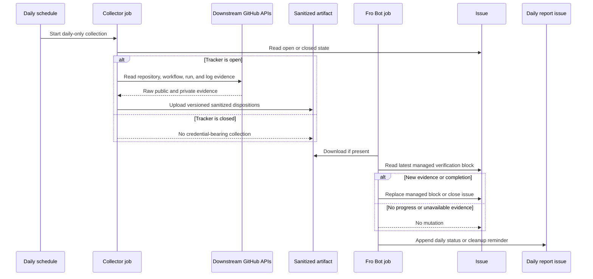

# feat: Automate daily runtime verification

## Overview

The checkout migration in #1598 is complete, but static workflow inspection cannot prove that each downstream runner now reaches Fro Bot without an effective persisted Git credential. The remaining evidence must come from real `pull_request`, `issue_comment`, or `issues` runs using a `v0` revision that contains #1597.

This adds a temporary verification sweep to the existing Daily Maintenance Report. A new `collect-dmr-runtime-verification` job reads the fixed 27-repository inventory and uploads a sanitized evidence artifact. The daily DMR path adds no collector credential or private repository identity to the existing `fro-bot` job; it updates only the managed runtime-verification block in #1598 when progress changes. Automatic closure requires all 24 public entries resolved plus all 3 private entries positively terminal in the current artifact or covered by an operator-backed disposition.

## Problem Frame

Release `v0.111.0` contains #1597, and #1598 currently records 0 of 27 active repositories as runtime-verified. Organic qualifying events will arrive asynchronously across 24 public and 3 private repositories. A local smart note can remind one operator to check them, but it cannot provide autonomous progress updates or close the tracker.

The existing scheduled workflow has one `fro-bot` job plus a separate trusted release-apply job, a short-lived owner-wide App token for issue mutation, a Daily Maintenance Report prompt, and a pinned artifact handoff pattern. The missing piece is a dedicated pre-agent collector job that can inspect cross-owner Actions evidence without exposing its durable credential or private inventory to the autonomous agent (see origin: `docs/brainstorms/2026-09-11-daily-report-runtime-verification-requirements.md`).

## Requirements Trace

| Origin requirements | Planning obligation |
|---|---|
| R1-R5 | Scan the fixed 27-repository inventory daily; qualify only real affected-event runs using a revision containing #1597; support evidence-backed no-longer-applicable dispositions. |
| R6-R11 | Keep cross-owner access in trusted pre-agent code, expose no private identity to the agent or public artifacts, and fail closed on missing or ambiguous evidence. |
| R12-R17 | Preserve monotonic tracker state, edit #1598 only on progress, keep private status aggregate-only, and use the existing owner-wide App token for issue mutation. |
| R18-R21 | Apply the canonical 24-public-plus-3-private closure rule, create no synthetic events, skip credential-bearing work after closure, and leave code removal to a separate cleanup change. |

## Scope Boundaries

- The sweep is a temporary #1598-specific task, not a reusable scheduled-watch registry.
- The workflow does not create issues, comments, pull requests, review requests, or workflow reruns in downstream repositories.
- The agent never receives `FRO_BOT_PAT`, the private inventory secret, raw private API responses, or private run URLs.
- The plan does not change the `v0` release process, the affected-event classification, or the credential preflight implemented by #1597.
- The plan does not expand `FRO_BOT_PAT` permissions. Activation stops if the existing token cannot read the required repositories and Actions evidence.
- A private-repository `404` is never deletion proof. It remains unavailable until authenticated evidence or an operator-backed disposition exists.

### Deferred to Separate Tasks

- Remove the temporary collector, prompt block, artifact wiring, and private inventory secret after #1598 closes.
- Replace the classic cross-owner PAT with dedicated, installation-scoped App credentials if this pattern becomes reusable or long-lived.
- Generalize issue-scoped recurring maintenance only after a third concrete use justifies a registry.

## Context & Research

### Relevant Code and Patterns

- `.github/workflows/fro-bot.yaml` — owns the existing `fro-bot` and `apply-release-notes` jobs, Daily Maintenance Report prompt, owner-wide App-token routing, and pinned artifact upload/download pattern.
- `scripts/fro-bot-workflow.test.ts` — parses the checked-in workflow and pins trigger routing, checkout credential posture, token selection, and step ordering.
- `scripts/harness/mint-app-token.ts` — masks secrets before use, emits constant-class failures, and mints the owner-wide token whose profile includes `issues: write`.
- `scripts/release/assemble-release-notes.ts` — validates untrusted model output before privileged mutation and provides the nearest artifact-consumer validation pattern.
- `src/services/setup/git-credential-check.ts` — remote `main` now checks effective Git configuration, repository context, and origin URL before agent execution; terminal Fro Bot success therefore proves the preflight did not reject the run.
- `src/shared/logger.ts` — project-wide redaction contract; the collector script should emit constant-class public messages rather than raw caught errors.

### Institutional Learnings

- [`same-job-phase-split-not-a-security-boundary`](../solutions/best-practices/same-job-phase-split-not-a-security-boundary-2026-07-04.md) — the collector must remain in a trusted job that completes before the autonomous agent job; ordering two steps inside the agent job is not isolation.
- [`response-file-is-untrusted-input`](../solutions/best-practices/response-file-is-untrusted-input-2026-07-11.md) — the artifact carries evidence only. The trusted workflow fixes the target issue and allowed operation; artifact data cannot choose a repository or mutation surface.
- [`key-credential-switch-on-operation-input-not-audit-token`](../solutions/best-practices/key-credential-switch-on-operation-input-not-audit-token-2026-07-17.md) — credential injection keys on the exact daily schedule and open-tracker state, not on correlation or logging metadata.
- [`isolate-ci-credential-via-oidc-broker`](../solutions/workflow-issues/isolate-ci-credential-via-oidc-broker-2026-07-01.md) — durable credentials stay outside the agent process; process isolation matters more than tool permission wording.
- [`integrate-push-strips-workflow-files`](../solutions/workflow-issues/integrate-push-strips-workflow-files-2026-08-07.md) — the collector must encode every permission and evidence dependency explicitly rather than relying on agent improvisation.

### External References

- [GitHub Actions secure use reference](https://docs.github.com/en/actions/reference/security/secure-use) — least privilege, secret handling, and untrusted-workflow guidance.
- [Workflow runs REST API](https://docs.github.com/en/rest/actions/workflow-runs) — `Actions: read`, run metadata, attempts, and log retrieval.
- [Repository REST API](https://docs.github.com/en/rest/repos/repos) — metadata reads and public/private access behavior.
- [Store and share data with workflow artifacts](https://docs.github.com/en/actions/tutorials/store-and-share-data) — immutable cross-job artifacts and digest validation.
- [Issues REST API](https://docs.github.com/en/rest/issues/issues) — `Issues: write` for body updates and closure.
- [GitHub App installation tokens](https://docs.github.com/en/apps/creating-github-apps/authenticating-with-a-github-app/generating-an-installation-access-token-for-a-github-app) — repository and permission scoping limits for the stronger long-term credential alternative.

The plan is grounded against authoritative remote `main` at `34ac2c07abd3056b4f1fb08c311269af4a4c0344`, not the stale local worktree baseline.

## Prior-Art Survey

```json
{
  "schema_version": 2,
  "verdict": "extend",
  "scope": ".github/workflows/fro-bot.yaml and adjacent scripts",
  "freshness": {
    "vcs_reference": "34ac2c07abd3056b4f1fb08c311269af4a4c0344"
  },
  "budget": {
    "max_search_passes": 3,
    "max_candidate_inspections": 10,
    "exhausted": false
  },
  "candidates": [
    {
      "path_or_symbol": ".github/workflows/fro-bot.yaml::jobs.fro-bot",
      "description": "Existing agent job, trigger condition, owner-wide App-token routing, and artifact-consumer seam; extend the workflow with a dedicated collector job and explicit dependency.",
      "disposition": "extend"
    },
    {
      "path_or_symbol": ".github/workflows/fro-bot.yaml::apply-release-notes",
      "description": "Existing immutable artifact handoff on a fresh runner with missing-artifact fail-soft behavior and separately scoped mutation authority.",
      "disposition": "extend"
    },
    {
      "path_or_symbol": "scripts/harness/mint-app-token.ts::main",
      "description": "Secret-masking and constant-class failure pattern for trusted workflow scripts that handle GitHub credentials.",
      "disposition": "reuse"
    },
    {
      "path_or_symbol": "scripts/release/assemble-release-notes.ts::validateCandidate",
      "description": "Validation boundary for artifact data before a later workflow phase performs a privileged GitHub mutation.",
      "disposition": "reuse"
    },
    {
      "path_or_symbol": "scripts/fro-bot-workflow.test.ts",
      "description": "Workflow contract suite that pins trigger routing, credential selection, checkout posture, and trusted step order.",
      "disposition": "extend"
    }
  ]
}
```

## Key Technical Decisions

| Decision | Rationale |
|---|---|
| Add `collect-dmr-runtime-verification` as the collector boundary | The checked-in workflow has no trusted pre-agent job today. Add a daily-only job and make `fro-bot` depend on it with fail-soft `always()` and not-cancelled semantics. The only cross-job payload is the sanitized artifact. |
| Separate read authority from mutation authority | `FRO_BOT_PAT` is collector-only read authority. #1598 and DMR mutations remain exclusively on the existing owner-wide App-token path with `issues: write`. Neither credential may substitute for the other. |
| Gate secret-bearing work on the exact daily cron and open #1598 state | Weekly, comment, issue, reusable-call, release-narration, and manual paths must not consume the credential or scan downstream repositories. |
| Transfer only a versioned sanitized artifact | Pinned upload/download actions provide an immutable cross-job handoff and digest validation. The artifact is advisory evidence only: it may influence whether the fixed managed block changes, but cannot select a target, operation, credential, or mutation shape. |
| Prove qualification through an evidence chain | A qualifying record combines affected-event metadata, terminal success, workflow content using either literal `fro-bot/agent@v0` or a full 40-character action SHA, GitHub's resolved action SHA log line, and ancestry from #1597's merge commit to that SHA. Version tags and other mutable refs do not qualify. No single proxy signal is sufficient. |
| Treat absence conservatively | Authenticated `200` metadata may prove archive or default-branch removal. Public deletion may be confirmed independently. Private `403`/`404`, missing logs, ambiguous action resolution, and retention loss remain unresolved. |
| Keep the managed runtime-verification block as the public monotonic progress record | The agent re-reads the latest issue body and replaces only that managed block. Existing resolved public entries and the private aggregate never decrease automatically. |
| Use one canonical closure rule | Automatic closure requires all 24 public entries resolved plus all 3 private entries positively terminal in the current artifact or covered by an operator-backed disposition. Historical private aggregate progress alone never authorizes closure. |
| Preserve normal DMR delivery on collector failure | The collector emits a safe unavailable artifact when possible; missing or invalid artifacts cause no #1598 mutation but still produce a normal DMR entry that makes the unavailable sweep visible to the operator. |
| Keep security classification deterministic and narration agent-owned | The collector decides evidence validity and privacy before the model. Fro Bot retains the agent-native action of summarizing progress and updating the trusted issue through existing GitHub tools. |
| Fail closed on cross-boundary inconsistency | Downstream workflow content, logs, and artifact values are untrusted evidence. Any disagreement between the artifact, current #1598 managed block, or fixed workflow contract causes no mutation and an operator-visible DMR warning. |

## Open Questions

### Resolved During Planning

- **Where should collection run?** In a new `collect-dmr-runtime-verification` job that precedes `fro-bot` through an explicit `needs` edge and sanitized artifact handoff.
- **What credential reads downstream evidence?** The existing `FRO_BOT_PAT`, step-scoped as `GH_TOKEN`, provided activation proves its existing access is sufficient. No scope expansion is part of this plan.
- **What credential updates and closes #1598?** The existing owner-wide App installation token with `issues: write`, already passed to direct scheduled Fro Bot runs.
- **How is `v0` qualification proven?** Combine the run's workflow content and resolved action SHA from logs, then prove the #1597 merge commit is an ancestor of that resolved SHA.
- **How is private deletion handled?** It is not inferred from `404`. Private archive or workflow removal requires an authenticated successful response; deletion remains unavailable until an operator supplies evidence.
- **How does the DMR survive collection failure?** Missing, partial, or invalid evidence is a no-progress state, not a reason to skip the agent job.

### Deferred to Implementation

- The exact bounded page and candidate-log limits should be chosen after fixtures exercise representative repository activity; exhaustion must emit `unavailable`, never silently truncate to success.
- GitHub log archive filenames and ordering are not contractual. The parser must search all returned log text for the resolved action line rather than depend on one filename.
- Activation must empirically confirm that the existing `FRO_BOT_PAT` can read all required public/private workflow metadata and logs without permission expansion.
- The final wording inside the managed #1598 block and DMR summary may be tightened during implementation, but it must preserve the origin document's privacy and progress-only behavior.

## High-Level Technical Design

> *This illustrates the intended approach and is directional guidance for review, not implementation specification. The implementing agent should treat it as context, not code to reproduce.*



The artifact contract should communicate only the state the agent needs:

- schema version, producer workflow run ID/attempt, exact daily schedule identity, generation timestamp, and collector status (`ready`, `partial`, or `unavailable`);
- minimum qualifying release and commit provenance;
- public repository dispositions with public evidence URLs when available;
- private aggregate totals only: resolved, unresolved, and unavailable;
- constant-class failure reasons that contain no repository identity or raw API text.

Use artifact name `dmr-runtime-verification-${{ github.run_id }}-${{ github.run_attempt }}` and one file named `runtime-verification-evidence.json`. The collector writes it under runner temp; `fro-bot` downloads it to `.fro-bot/dmr-runtime-verification/runtime-verification-evidence.json` after checkout and before the Action step. The version-1 envelope contains only `producer`, `baseline`, `collectorStatus`, `public`, and aggregate `private` sections; private per-repository records are invalid.

The artifact is not a command channel. The workflow and prompt fix the only allowed targets—the rolling DMR issue and #1598—and the agent must ignore any artifact field that attempts to select another target or operation.

## Implementation Units

- [x] **U1. Deterministic runtime-evidence collector**

**Goal:** Produce a bounded, versioned, sanitized evidence file for the fixed 27-repository inventory without leaking credentials or private identities.

**Requirements:** R1-R11, R19

**Dependencies:** Existing #1597 merge/release provenance and the fixed inventory in #1598.

**Files:**
- Create: `scripts/collect-dmr-runtime-verification.ts`
- Test: `scripts/collect-dmr-runtime-verification.test.ts`

**Approach:**
- Keep the 24 public repository/workflow entries in one exported temporary constant; parse the 3 private entries from a JSON GitHub Actions secret.
- Separate pure classification and sanitization from GitHub I/O through injected fetch/exec adapters so tests never require live credentials.
- Keep action-provenance parsing as a named sub-scope inside this script family; do not create a generic evidence framework without a second caller.
- Scan from the `v0.111.0` publication boundary rather than incrementally trusting yesterday's output. Bound pagination, log downloads, response sizes, and request duration per repository.
- Use one terminal-state lattice: `qualified` and evidence-backed `no-longer-applicable` are terminal; `unresolved`, `preflight-failed`, and `unavailable` are non-terminal. Private `no-longer-applicable` requires authenticated positive archive or workflow-removal evidence and is never inferred from `403`/`404`.
- Resolve action provenance from the workflow file at the run revision plus the action download SHA in the run logs; prove ancestry against #1597's merge commit.
- Include privacy-safe provenance for every public disposition and unresolved candidate: observation time, run ID/attempt when present, fetch-status class, and constant rejection reason. Private output exposes only aggregate counts by disposition class.
- Always write a schema-valid sanitized result when recoverable. Unexpected process failure may omit the file, but must emit only a constant-class message and never a raw caught error.
- Treat every collector sink as tainted: private inventory values and credentials must not enter logs, debug output, annotations, step summaries, outputs, artifact names, cache keys, exception text, or serialized metadata.
- Exclude private names, URLs, per-repository statuses, API bodies, and error strings from the serialized artifact. Private output is aggregate-only.

**Execution note:** Implement the classifier and sanitizer test-first using the canonical `test-driven-development` discipline before adding live GitHub adapters.

**Patterns to follow:** `scripts/harness/mint-app-token.ts` for secret masking and bounded failures; `scripts/release/assemble-release-notes.ts` for validating data before a privileged downstream phase.

**Test scenarios:**
- Happy path: an affected-event run starts after `v0.111.0`, its workflow uses literal `fro-bot/agent@v0` or a full 40-character action SHA, the resolved action SHA contains #1597, and the run succeeds → public repository qualifies with a public run URL.
- Happy path: an authenticated repository response reports archived, or its default branch successfully proves no Fro Bot consumer workflow remains → no-longer-applicable.
- Edge case: the latest attempt fails but a later rerun attempt succeeds with qualifying provenance → the successful attempt qualifies and carries its attempt metadata.
- Edge case: more runs exist than one API page → pagination continues until the release boundary or the configured bound; bound exhaustion returns unavailable.
- Error path: a successful run lacks an unambiguous action-resolution log line → unresolved, not qualified.
- Error path: realistic log fixtures contain duplicated, truncated, reordered, or multiple candidate action-resolution lines → provenance parsing searches the complete returned log text and fails closed on ambiguity.
- Error path: terminal failure, preflight refusal, pre-release run, wrong event type, direct non-`v0` action reference, or non-descendant action SHA → does not qualify.
- Error path: private `403`/`404`, deleted logs, rate limiting, timeout, malformed JSON, or unexpected workflow contents → unavailable without a no-longer-applicable inference.
- Closure safety: all three private entries must have positive terminal evidence in the current collector run before the private portion of automatic closure can pass; a stale aggregate floor is insufficient.
- Privacy: serialized output and constant-class logs contain none of the private names, private URLs, token value, raw API bodies, or transformed secret fragments supplied by fixtures.
- Contract: every recoverable path emits a schema-valid artifact, and invalid private inventory input yields an unavailable artifact without exposing the input.

**Verification:** The script test suite proves every disposition, provenance gate, bound, and privacy invariant without network access; a fixture containing deliberate private canaries produces no canary match in artifact or logs.

- [x] **U2. Trusted workflow collection and artifact handoff**

**Goal:** Add a dedicated daily-only collector job and make its sanitized output available to the existing `fro-bot` job without weakening or delaying any other trigger.

**Requirements:** R1, R6-R11, R15-R17, R19-R20

**Dependencies:** U1.

**Files:**
- Modify: `.github/workflows/fro-bot.yaml`
- Modify: `scripts/fro-bot-workflow.test.ts`

**Approach:**
- Add a `collect-dmr-runtime-verification` job gated by the exact daily cron and repo-scoped temporary enablement variable. Inside it, read #1598 state before injecting `FRO_BOT_PAT` and the private inventory secret into the collector step.
- Pass both secrets only through that collector step's environment, never command arguments, job-level env, outputs, or reusable-workflow inputs. Disable command tracing and capture all adapter failures into constant-class results before they can reach logs or summaries.
- Upload the sanitized file with the existing pinned artifact action and one-day retention. Use a fixed run-scoped artifact name and no secret-derived metadata; upload completion is the only allowed handoff from the collector job.
- Add `needs: collect-dmr-runtime-verification` to `fro-bot` and wrap its existing condition with `always()` and not-cancelled semantics so a skipped or failed collector does not suppress triggers that previously ran.
- Download the artifact in `fro-bot` only after the collector job has completed and only for the exact daily schedule. Missing-artifact handling is fail-soft so the normal DMR still runs.
- Use artifact name `dmr-runtime-verification-${{ github.run_id }}-${{ github.run_attempt }}`, upload only `runtime-verification-evidence.json`, and download it to `.fro-bot/dmr-runtime-verification/` so `SCHEDULE_PROMPT` has one fixed agent-readable path.
- Preserve current owner-wide App-token minting and `github-token` selection. The collector credential and private inventory must not appear in the Fro Bot job environment, step inputs, prompt expression, outputs, caches, or artifacts.
- Keep weekly wiki, issue, issue-comment, reusable-call, release-narration, and manual-dispatch routing unchanged.

**Execution note:** Add failing workflow contract assertions before editing YAML; workflow security regressions are easier to catch structurally than from a later live run.

**Patterns to follow:** the existing release-notes artifact upload/download pins and missing-artifact behavior in `.github/workflows/fro-bot.yaml`; token-routing assertions in `scripts/fro-bot-workflow.test.ts`.

**Test scenarios:**
- Happy path: exact daily cron plus open #1598 → the collector job receives both secrets, uploads the artifact, and `fro-bot` downloads it before the action step.
- Edge case: the temporary feature flag is absent or false → the collector receives no cross-owner credential, no verification artifact is required, and the normal DMR still runs.
- Edge case: #1598 is closed → collector secret-bearing step and downstream scan are skipped; the normal DMR job still runs.
- Edge case: the collector job is skipped, fails, exits unexpectedly, or uploads no file → `fro-bot` still evaluates its preserved trigger condition, runs when it previously would have run, and sees no trusted evidence.
- Security: wrapping the existing job condition with `always()` and not-cancelled semantics does not bypass its same-repo PR-head, bot-author, mention, or authorization filters.
- Security: the private inventory secret appears only in the dedicated collector job's trusted step; its `FRO_BOT_PAT` binding is step-local; `fro-bot` gains no new PAT surface and its pre-existing non-DMR PAT routes remain unchanged.
- Security: private canaries appear in none of the collector's logs, annotations, step summaries, outputs, artifact names, or failure messages.
- Security: malformed secret input and forced adapter exceptions still emit only constant-class messages; neither secret appears in command lines, inherited job env, or action inputs outside the collector step.
- Contract: the uploaded envelope binds to the current workflow run ID/attempt, exact daily schedule, generation time, and release baseline; `fro-bot` rejects any mismatch even when JSON and artifact digest validation succeed.
- Secondary regression: weekly wiki schedule, manual dispatch, workflow call, release narration, issues, and issue comments retain their existing prompt, token, checkout, and response-mode routing.
- Regression: pinned artifact action SHAs, one-day retention, and collector-before-agent ordering remain structurally asserted.

**Verification:** Workflow parsing tests prove credential isolation, schedule discrimination, fail-soft DMR delivery, artifact ordering, and unchanged routing for every existing trigger scenario.

- [x] **U3. Progress-only #1598 protocol in the DMR prompt**

**Goal:** Let Fro Bot consume only sanitized dispositions, preserve human-authored tracker content, update #1598 only on material progress, and close it at 27 resolved repositories.

**Requirements:** R12-R21

**Dependencies:** U2 and a marker-bounded runtime-verification block in #1598.

**Files:**
- Modify: `.github/workflows/fro-bot.yaml`
- Modify: `scripts/fro-bot-workflow.test.ts`

**Approach:**
- Extend `SCHEDULE_PROMPT` with a temporary #1598 section that reads the fixed artifact path only when present and schema-valid.
- Bind the exception to issue `fro-bot/agent#1598`. Artifact content cannot choose a repository, issue number, mutation type, or credential.
- Treat every repository file, workflow body, log line, and artifact field as untrusted evidence. Only the predeclared managed block is mutable; any target or state inconsistency causes no mutation and an operator-visible DMR warning.
- Reject schema-valid artifacts whose producer run ID/attempt, schedule identity, generation time, or digest do not match the current workflow run; stale, replayed, or mismatched evidence is a no-mutation state.
- Capture the initial full issue body, re-read immediately before mutation, and abort if any byte outside the managed markers changed. Rebuild the patch from that final body; the remaining post-read race is explicitly accepted because GitHub offers no issue-body compare-and-swap API.
- Union new public dispositions with the existing managed block and never demote an existing resolution automatically. Preserve the private aggregate floor for progress reporting, but permit automatic closure only when the current collector artifact positively resolves all three private entries in the same run or an operator-backed disposition is already recorded.
- Leave #1598 untouched on no progress, missing/invalid evidence, collector unavailability, or ambiguous private state. Record those outcomes in the DMR instead.
- When all 24 public entries resolve and all 3 private entries are positively terminal in the current artifact or operator-backed, write the final managed runtime-verification block and close #1598 with the existing owner-wide App token. Later DMR runs skip collection and report the cleanup reminder without opening a pull request.

**Execution note:** Pin the prompt contract with failing static assertions before changing the instructions; validate the real agent behavior on the next organic DMR run rather than manufacturing downstream events.

**Patterns to follow:** the existing rolling DMR find/reopen/update protocol in `SCHEDULE_PROMPT`; trusted-target binding from the response-delivery architecture; progress-only issue update language already present in #1598.

**Test scenarios:**
- Happy path: one public repository newly qualifies → only its managed entry and aggregate count change, with its public evidence link preserved.
- Happy path: the private aggregate advances without any private name, URL, alias, or per-repository status entering the prompt or issue body.
- Edge case: no new evidence → #1598 is not edited; the DMR records the no-change result.
- Edge case: artifact missing, schema-invalid, partial, or unavailable → #1598 is not edited; the DMR records an unavailable verification sweep.
- Edge case: a human edits content outside the managed markers between daily runs → the next update preserves that content byte-for-byte.
- Edge case: current issue progress is greater than the collector's observed state because logs expired or access regressed → existing progress remains the floor.
- Edge case: artifact state is stale, contradictory, or irreconcilable with the current managed block → #1598 is not edited and the DMR requests operator review.
- Edge case: artifact run ID/attempt, schedule identity, generation time, or digest does not match the current workflow run → #1598 is not edited.
- Edge case: the issue changes outside the managed markers between initial read and final pre-write read → no mutation; the DMR records the conflict.
- Edge case: the historical private aggregate is 3/3 but the current artifact cannot positively resolve all three private entries → no automatic closure.
- Completion: all 24 public entries resolve and all 3 private entries are positively terminal in the current artifact or operator-backed → the final managed runtime-verification block is written once, #1598 closes, and the DMR records the cleanup reminder.
- Security: artifact text attempting to select another issue, target, or operation is ignored by the prompt contract.
- Security: malformed or compromised repository content cannot widen the fixed #1598 mutation target or managed-marker boundary.
- Regression: normal DMR issue creation/reopen/update behavior remains intact, and no other issue or pull request becomes an allowed mutation target.

**Verification:** Static workflow tests pin the temporary exception, fixed target, progress gate, privacy rules, marker preservation, closure condition, and no-synthetic-event rule; the first natural daily run confirms end-to-end agent behavior.

## Activation Runbook

### Code and Remote Readiness

**Goal:** Document the shipped trust boundary and prepare remote state behind an explicit disabled-by-default activation gate.

**Entry gate:** U1-U3 merged; explicit approval for CI changes, remote configuration, and the #1598 body edit.

**Files:**
- Modify: `ARCHITECTURE.md`
- Modify: `AGENTS.md`
- Reference: `docs/brainstorms/2026-09-11-daily-report-runtime-verification-requirements.md`
- Reference: `docs/plans/2026-09-11-001-feat-daily-runtime-verification-plan.md`

**External state:**
- Create the repo-scoped variable `DMR_RUNTIME_VERIFICATION_ENABLED` with value `false`; `.github/workflows/fro-bot.yaml` reads it through `vars.DMR_RUNTIME_VERIFICATION_ENABLED`.
- Configure the repo-scoped encrypted secret `DMR_RUNTIME_VERIFICATION_PRIVATE_INVENTORY` as a JSON array of three repository/workflow records; only the collector job reads `secrets.DMR_RUNTIME_VERIFICATION_PRIVATE_INVENTORY`.
- Confirm the configured `FRO_BOT_PAT` secret is available to the collector job without adding scopes; the first enabled collector run performs the empirical read-access preflight and cannot authorize a #1598 mutation if that preflight is incomplete.
- Seed the managed runtime-verification markers in #1598 while preserving its current 0/27 baseline.

**Approach:**
- Document the dedicated collector job, sanitized artifact, agent mutation boundary, private aggregate rule, and temporary cleanup lifecycle.
- Separate code readiness, remote readiness, and launch authorization. Keep the enablement variable disabled until code/tests/docs have landed, the private secret is configured, and the #1598 managed block is verified.
- Seed only the managed block; preserve all content outside the markers byte-for-byte and leave labels, assignees, comments, and other issue metadata untouched.
- Treat secret setup, issue-body seeding, and enablement as explicit remote actions, not hidden implementation steps.
- Hard stop before enablement if the collector job/`fro-bot` dependency is not the reviewed job-boundary shape, the repo-scoped variable or secret is missing, or the #1598 markers are malformed.
- Define two rollback modes. Before any valid progress, set `DMR_RUNTIME_VERIFICATION_ENABLED=false`, delete the dedicated private-inventory secret, and restore the exact pre-enable issue-body snapshot. After valid progress, disable the variable and delete the dedicated secret but preserve the managed runtime-verification block as the audit record. In both modes, leave the normal DMR path active.
- `FRO_BOT_PAT` is shared existing infrastructure: rollback removes this workflow's use but does not delete or rotate the PAT. Rotation is incident response only when logs, canaries, or review indicate possible exposure.

**Patterns to follow:** the release-notes generate/apply trust-boundary documentation in `ARCHITECTURE.md`; concise operational notes in `AGENTS.md`.

**Test scenarios:**
- Go/no-go: any failed code-readiness, remote-readiness, marker-integrity, or authorization check leaves the feature flag disabled.
- Safety: malformed marker seeding is rolled back before enablement; content and metadata outside the managed block remain unchanged.
- Security: secret presence alone does not activate the collector, and disabling the variable prevents `FRO_BOT_PAT` injection on the next run.
- Rollback: disabling the variable plus deleting the dedicated private-inventory secret restores the prefeature credential-use boundary while preserving evidence already published to #1598.

**Verification:** Documentation matches shipped behavior; tests pass on the merged code; remote readiness is independently read back; the exact pre-enable #1598 body and metadata are preserved for rollback comparison.

### Natural-Run Proof and Rollback

**Goal:** Prove the autonomous path on the next organic Daily Maintenance Report run before treating the temporary monitor as operational.

**Entry gate:** Code and Remote Readiness passed and explicit approval to set `DMR_RUNTIME_VERIFICATION_ENABLED=true`.

**Approach:**
- Enable the temporary variable only after the readiness gate passes, then observe the next naturally scheduled DMR run. Do not create downstream events to accelerate the test.
- Accept the run only if the normal DMR completes, evidence is consumed only when schema-valid, private identity remains absent from every external surface, and #1598 changes only for actual new valid progress.
- Inspect workflow logs, annotations, step summaries, artifact names/content, the DMR body, #1598, and collector/agent failure messages for private names, workflow paths, run URLs, owner-identifying values, token fragments, secret-derived metadata, and transformed canaries.
- If there is no progress, require #1598 to remain untouched. If there is progress, require a marker-bounded monotonic update with evidence-backed public entries and aggregate-only private state.
- Reject the rollout on DMR suppression, unexpected issue mutation, target drift, malformed marker edits, credential/private leakage, or ambiguous artifact state. Roll back by disabling the feature variable and preserving the last known-good #1598 body.
- After this single launch gate passes, require no further per-run approval: the daily sweep continues autonomously until closure or a fail-closed condition disables it for operator review.
- After #1598 closes, verify the next DMR run skips secret-bearing collection and records the operator-owned cleanup reminder.

**Test scenarios:**
- Natural no-progress run: the DMR completes, collector status is visible, and #1598 is byte-for-byte unchanged.
- Natural progress run: only the managed block advances, all outside content/metadata remain unchanged, and public/private evidence rules hold.
- Partial/unavailable run: the DMR completes with an unavailable status and #1598 is untouched.
- Rollback: disabling the temporary variable prevents collector credential injection while preserving normal DMR delivery.
- Post-close: no secret-bearing collection occurs, no tracker mutation is attempted, and cleanup remains explicitly operator-owned.

**Verification:** The first natural run receives an explicit go/no-go disposition with captured URLs and readbacks; any no-go state leaves the feature disabled until corrected and re-approved.

## System-Wide Impact

- **Interaction graph:** exact daily schedule → `collect-dmr-runtime-verification` job → GitHub repository/Actions APIs → immutable artifact → existing `fro-bot` job → DMR and #1598.
- **Error propagation:** per-repository/API failures become sanitized unavailable dispositions; catastrophic collector failure becomes a missing artifact; neither blocks the normal DMR or authorizes a tracker edit.
- **State lifecycle risks:** #1598's managed runtime-verification block is the monotonic public progress record. Public evidence persists there; private status remains aggregate-only and may require operator intervention if historical evidence disappears before all three private repositories are simultaneously observable.
- **API surface parity:** no public Action input/output, runtime package API, gateway surface, or trigger contract changes. The behavior exists only in this repository's scheduled workflow.
- **Integration coverage:** script tests prove classification/privacy; workflow tests prove credential and trigger wiring; the next natural scheduled run proves artifact-to-agent-to-issue behavior.
- **Unchanged invariants:** `NormalizedEvent`, response-file enforcement for issue/PR triggers, one-response delivery, setup credential preflight, release narration, weekly wiki generation, and all non-DMR credential routes remain unchanged.

## Dependencies & Prerequisites

- Release `v0.111.0` and #1597's merge commit remain the minimum qualification baseline.
- The existing `FRO_BOT_PAT` must already have read access to the fixed cross-owner/private inventory and Actions logs; implementation does not expand its scopes.
- The owner-wide Fro Bot App installation must continue granting `issues: write` for #1598 and the rolling DMR issue.
- A new encrypted GitHub Actions secret must supply the three private repository/workflow entries only to the trusted collector step.
- A temporary non-secret repository variable must default to disabled and gate all secret-bearing collection independently of issue state.
- #1598 must remain open and receive a managed runtime-verification marker block before the first enabled daily sweep.
- CI workflow edits, secret configuration, and the public issue-body edit require separate explicit execution approval.

## Risks & Dependencies

| Risk | Mitigation |
|---|---|
| `FRO_BOT_PAT` is broader and longer-lived than a dedicated App token | Isolate it in the dedicated collector job's single step, perform read-only operations only, disable tracing, never persist or forward it, stop activation if existing access is insufficient, remove this workflow's reference immediately after closure, and rotate on any suspected exposure. |
| A private identity leaks through errors or serialized evidence | Constant-class failures, aggregate-only private output, deliberate canary fixtures, no raw caught errors, and no secret-derived artifact metadata. |
| Private identity escapes through a non-artifact sink | Treat logs, debug output, annotations, step summaries, outputs, artifact names, cache keys, and exception text as tainted; canary-test every externally visible surface. |
| Collector failure suppresses the Daily Maintenance Report | Make `fro-bot` depend on the collector job while preserving its existing trigger expression under `always()` and not-cancelled semantics; make artifact download optional and treat absence as no mutation. |
| A private access failure is mistaken for deletion | Never resolve private `403`/`404`; require authenticated successful archive/workflow-removal evidence or an operator-backed disposition. |
| GitHub log wording changes | Search all log text for the resolved action record, classify ambiguous results as unresolved, and keep parsing isolated behind fixtures. |
| A stale or replayed artifact is schema-valid | Bind the envelope to the current workflow run ID/attempt, exact schedule, generation time, release baseline, and artifact digest; mismatch causes no mutation and an operator-visible DMR warning. |
| Human edits race an automated body update | Snapshot the full body, re-read immediately before mutation, abort when any byte outside the managed markers changed, and rebuild from the final body. No API supports a true compare-and-swap issue edit after that read, so a narrow non-blocking residual race remains. |
| Compromised workflow or repository content tries to steer mutation | Treat all collected content as untrusted evidence, bind authority to the fixed #1598 managed block, and make any artifact/body/workflow inconsistency a no-mutation operator-review state. |
| Private evidence expires before closure | Re-scan from the release boundary daily and preserve aggregate progress for reporting only. Apply the canonical closure rule: all three private entries must be positively terminal in the current artifact or operator-backed. |
| Temporary automation survives closure or rollback | Secret-bearing steps gate on open #1598 state and the enablement variable. Rollback disables the variable and deletes the dedicated private-inventory secret; post-closure DMR runs emit a cleanup reminder, and code/variable removal remains a named operator-owned task. |

## Alternative Approaches Considered

- **Keep the local smart note only.** Rejected because it cannot autonomously update or close #1598 and depends on an active operator session.
- **Give `FRO_BOT_PAT` to the agent job.** Rejected because it breaks the credential-minimization boundary established by this migration.
- **Run collector and agent in one job.** Rejected because step ordering is not a security boundary and would share too much runner state.
- **Create a dedicated cross-owner GitHub App now.** Stronger least-privilege design, but disproportionate for a temporary 27-repository sweep because it requires coordinated installations and credentials across multiple owners. Revisit only if the capability becomes durable.
- **Build a generic recurring-watch registry.** Rejected as premature abstraction for one finite tracker.

## Documentation / Operational Notes

- The artifact retention period is one day; #1598's managed runtime-verification block, not the artifact, is the durable public progress record.
- Public repositories may receive evidence links in the managed block. Private progress is always one aggregate count with no aliases or timing detail.
- The collector should make one bounded metadata/run-list pass per repository and fetch logs only for candidate successful affected-event runs.
- The daily task remains enabled after closure only long enough to emit the cleanup reminder; removal happens in a separately approved cleanup pull request.
- Cleanup is operator-owned: automatic closure stops credential use but does not claim the workflow code, variable, or private inventory secret have already been removed.
- If issue state changes unexpectedly between read and write, preserve the last known-good body, treat the run as no progress, and require operator review rather than forcing a rewrite.
- If activation access is incomplete or private evidence expires before completion, keep #1598 open and report the inaccessible aggregate rather than expanding credentials or inferring success.
- CI workflow edits, secret creation, and the public #1598 marker edit each require explicit approval during execution.

## Success Metrics

- **Primary outcome:** #1598 closes autonomously after all 24 public entries resolve and all 3 private entries are positively terminal in the current artifact or covered by operator-backed dispositions. A correct collector or clean tracker state without closure is incomplete unless an evidence-backed blocker explicitly prevents safe completion.
- The exact daily schedule completes its normal DMR path even when collection, upload, or download fails.
- The first enabled natural schedule proves that the collector does not suppress or replace the normal DMR path in ready, partial, unavailable, or missing-artifact states.
- Every public qualification is backed by affected-event metadata, terminal success, a literal `@v0` or full-SHA workflow reference, a resolved action SHA, and #1597 ancestry.
- The agent job, public artifact, workflow logs, DMR, and #1598 contain no private repository identity or cross-owner credential material.
- #1598 changes only when a repository gains an evidence-backed disposition, a material blocker changes, or the canonical closure rule passes.
- Existing public progress and the private aggregate never decrease automatically.
- #1598 closes only under the canonical 24-public-plus-3-private rule, and later daily runs skip secret-bearing collection while reporting the cleanup reminder.
- Marker seeding and every automated edit preserve all text outside the managed block byte-for-byte and leave labels, assignees, comments, and unrelated issue metadata unchanged.
- Weekly wiki, manual, reusable-call, issue, issue-comment, and release-narration behavior remains unchanged.
- After one approved launch and accepted natural-run proof, no further operator approval is required for daily scans, progress edits, or final closure.

## Phased Delivery

1. **Code:** complete U1, then U2 and U3 together so the job dependency, artifact envelope, and DMR prompt contract cannot drift independently.
2. **Activation:** follow the Activation Runbook once under the required remote-action approvals; the runbook is the sole source of rollout, proof, and rollback detail.
3. **Cleanup:** after autonomous closure, use a separately approved pull request to remove all temporary code, variable, prompt, and secret wiring.

## Sources & References

- **Origin document:** [`docs/brainstorms/2026-09-11-daily-report-runtime-verification-requirements.md`](../brainstorms/2026-09-11-daily-report-runtime-verification-requirements.md)
- Related issue: `fro-bot/agent#1598`
- Related implementation: `fro-bot/agent#1597`, release `v0.111.0`
- Relevant workflow: `.github/workflows/fro-bot.yaml`
- Workflow contract tests: `scripts/fro-bot-workflow.test.ts`
- Official GitHub references are listed in Context & Research.
