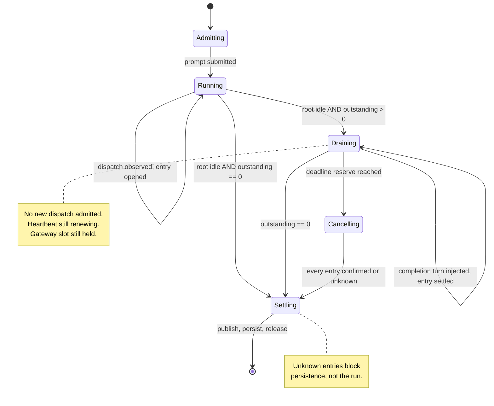

# feat: Background subagent ownership and drain

## Overview

Enable OpenCode background subagents on the Action and the gateway behind an ownership ledger, bounded dispatch, and a drain that completes before any terminal step. The flag itself is one line; everything here exists because a detached subagent is invisible to both surfaces and survives the signals they currently treat as terminal.

## Problem Frame

A background dispatch returns immediately and runs as a detached fiber in a registry upstream documents as process-local and non-durable. Session idle is computed from explicit status updates and never consults background jobs, so a session reports idle while its subagents are still running. Both surfaces filter every event by root-session equality, so a child's tool calls, approvals, and activity are invisible today.

The Action then acts on that idle: it finalizes, publishes, prunes, shuts the server down, checkpoints the database, saves cache, and releases its lock — on top of live work, with no error surfaced. The gateway hands its concurrency slot to the next queued run while the previous run's subagents are still writing the same workspace.

Two failure paths carry the most cost. Context-overflow recovery archives the overflowed session and re-runs under a new one; its subagents keep running, and the recovery session dispatches its own, so two sets of writers share a workspace and a git index. And a stream discontinuity that swallows a dispatch event leaves the ledger reading zero while a child writes.

See origin: `docs/brainstorms/2026-09-13-opencode-background-subagents-requirements.md`.

## Requirements Trace

R3–R24 of the origin document. R1 and R2 (the file watcher) shipped separately and are not in scope.

- R3–R8. Ownership ledger, descendant event handling, retry survival, unknown-not-zero, subscription readiness, discontinuity handling
- R9–R11. Descendant approval routing, tree-aware activity, run ownership through drain
- R12–R15. Depth limit, dispatch caps, pre-execution enforcement, no dispatch after finalization
- R16–R22a. Drain before terminal steps, every terminal path, single deadline, expiry behaviour, confirmed cancellation, publication ownership, persistence declining, lock lease
- R23–R24. Labelled reporting, gateway startup reconciliation

## Scope Boundaries

- No change to OpenCode itself. The events and APIs required already exist.
- Background work is not resumable across runs. The upstream registry is process-local; cache persistence does not change that.
- Subagent depth stays at one. Raising it requires solving the grandchild traversal gap below on its own terms.
- The four declined flags from the origin document remain unset.

### Deferred to Separate Tasks

- Validating the dispatch caps against real reviewer fan-out: needs production data this plan cannot produce.
- Revisiting the teardown reserve once drain exists and can be measured: the value here is derived from teardown as it exists today. The concrete follow-up is re-measuring from the drain tail — timing teardown from when drain ends, not from run start — once Unit 10 exists.

## Context & Research

### Relevant Code and Patterns

Closure-state, which this repo uses instead of classes:
- `packages/gateway/src/execute/queue.ts` (`createChannelQueue`) — per-key map, bounded, explicit handoff primitive
- `packages/gateway/src/execute/concurrency.ts` (`createConcurrencyRegistry`) — cap plus per-channel exclusivity
- `packages/gateway/src/approvals/registry.ts` (`createApprovalRegistry`) — entries, timers, session ownership, fail-closed settlement
- `packages/gateway/src/approvals/coordinator.ts` (`createPermissionCoordinator`) — owned session IDs, pending/replied/dispose hooks

Integration points:
- `src/features/agent/streaming.ts` — ten root-session filters between lines 294 and 590
- `packages/gateway/src/execute/run-core.ts` — nine root-session filters between lines 437 and 672
- `src/features/agent/retry.ts` — four independent terminal paths (see Unit 9)
- `src/harness/run.ts:171-233` — finalize precedes cleanup
- `src/harness/phases/cleanup.ts:65-286` — prune, shutdown, artifacts, checkpoint and save, outputs, lock release in `finally`
- `src/harness/phases/execute.ts:99-203` — `recoverFromContextOverflow`
- `packages/gateway/src/execute/run.ts:1162-1224` — `executeWorkOnHeldSlot`

Testing patterns: fake timers for deadline-sensitive paths, event streams mocked as async generators with an initial `setTimeout(0)` so setup state arms before the first event, lightweight server-handle mocks with `shutdown()`, and explicit ordering assertions (`src/harness/phases/cleanup.test.ts`, `src/harness/phases/cache-restore.test.ts`).

### Institutional Learnings

- `docs/solutions/logic-errors/submission-failure-does-not-prove-the-work-never-started-2026-08-08.md` — a failed submit does not prove the server never accepted the prompt. Independently validates keying cancellation off observable terminal signals rather than return values.
- `docs/solutions/logic-errors/terminal-outcomes-must-survive-deadline-cleanup-2026-07-24.md` — once a terminal outcome is known, later cleanup must not rewrite it. Drain runs long by design, so this separation has to be explicit.
- `docs/solutions/best-practices/sse-output-streaming-terminal-drain-2026-06-21.md` — a terminal signal drains queued frames rather than aborting the stream.
- `docs/solutions/logic-errors/repair-before-capture-sqlite-session-cache-loop-2026-09-02.md` — persisting after a bad restore entrenches the failure. Writer quiescence must precede capture.
- `docs/solutions/logic-errors/retry-clobbers-previous-invocation-comment-2026-07-11.md` — publication idempotency has to be run-scoped.
- `docs/solutions/integration-issues/read-only-actions-cache-token-broke-session-continuity-2026-08-11.md` — a discarded return value hid a silent persistence failure for a month.

Lease renewal is not new: `packages/runtime/src/coordination/heartbeat.ts`, already wrapped at `packages/gateway/src/runtime-effect.ts`, is existing machinery this plan extends to a longer interval rather than invents. What has no prior art in this codebase is the ownership ledger and treating the two surfaces as one lifecycle problem.

## Prior-Art Survey

```json
{
  "schema_version": 2,
  "verdict": "build-new-within-scope",
  "scope": "packages/gateway/src/execute + packages/gateway/src/approvals + src/features/agent + src/harness/phases + packages/runtime/src/agent",
  "freshness": {
    "vcs_reference": "62e8e466d3e09e2020e1d690c1a2661b5ccf2169",
    "scope_baseline": "packages/gateway/src/{execute,approvals} + src/{features/agent,harness/phases} + packages/runtime/src/agent"
  },
  "budget": {
    "max_search_passes": 3,
    "max_candidate_inspections": 10,
    "exhausted": true
  },
  "candidates": [
    {
      "path_or_symbol": "packages/gateway/src/execute/run.ts:1249-1257 (inFlightRuns)",
      "description": "Process-local set of immediate gateway run promises; owns the admitted run promise until the handoff path removes it.",
      "disposition": "insufficient",
      "insufficiency_reason": "Tracks whole-run promises per channel, not detached child work keyed by child session identifier, and provides no drain barrier before terminal publish or persist."
    },
    {
      "path_or_symbol": "packages/gateway/src/execute/run.ts:1162-1224 (executeWorkOnHeldSlot)",
      "description": "Atomic channel-slot handoff: drains the next queued task while the slot is still held, otherwise releases it.",
      "disposition": "insufficient",
      "insufficiency_reason": "Queue and slot management, not ownership of work spawned by an invocation; it cannot observe or settle descendant sessions before finalization."
    },
    {
      "path_or_symbol": "packages/gateway/src/approvals/registry.ts:280-349,509-627 (createApprovalRegistry)",
      "description": "Permission-request registry with requestID and sessionID entries, deadline settlement, claimed and confirmed state, fail-closed behaviour.",
      "disposition": "insufficient",
      "insufficiency_reason": "Specific to approval prompts and reply settlement; it does not track arbitrary outstanding work or drain terminal steps after the turn ends."
    },
    {
      "path_or_symbol": "packages/gateway/src/execute/run-core.ts:247-672 (runOpenCodeCore)",
      "description": "Single-run execution loop with heartbeat, abort, terminal-signal flags, and run-state transitions.",
      "disposition": "insufficient",
      "insufficiency_reason": "Owns one execution lifecycle, not a ledger of detached jobs that must settle before terminal writes and later persistence."
    },
    {
      "path_or_symbol": "src/features/agent/retry.ts:351-585 (runPromptAttempt and ActivityTracker)",
      "description": "Prompt-attempt watchdog carrying first-meaningful-event, terminal-signal, idle, and provider-error flags with poll and wait orchestration.",
      "disposition": "insufficient",
      "insufficiency_reason": "Tracks completion of one prompt attempt, not outstanding detached work, and does not survive retry or overflow session replacement."
    }
  ]
}
```

## Key Technical Decisions

- **Key the ledger on the child session identifier, not the job identifier.** Job ids can be reused, and notifications carry the child session id. Keying on the job id lets a delayed notification settle a newer execution (see origin: R3).
- **Reconcile against the server, not only the stream.** The stream provides no replay after a reconnect, so a dispatch observed by nobody would otherwise leave the ledger reading zero while a child writes. `GET /session/{sessionID}/children` supplies candidates and session status supplies liveness — `children` alone is a `parent_id` lookup that returns completed children too, so presence is not evidence of outstanding work.
- **Cancel every ledger entry individually.** Upstream `SessionRunState.cancel()` traverses running jobs only, so a completed child linking the root to a running grandchild is never reached. Depth one makes that unreachable today; cancelling per entry means raising the depth later does not silently reintroduce it.
- **Cancel owned work before archiving an overflowed session.** Overflow recovery archives and re-runs under a new session id. Without this, the archived session's subagents and the recovery session's subagents write the same workspace concurrently.
- **Reserve 30 seconds of the deadline for teardown.** Measured post-execution teardown on real runs was 5.1 s and 14.7 s, dominated by S3 session sync at up to 10.2 s; the reserve doubles the worst observation. It is configurable, because drain does not exist yet and this measures teardown without it.
- **Keep the heartbeat alive through drain.** It currently stops before terminal writes. A run draining for minutes without one is swept as stale by another gateway instance, which kills the subagents mid-drain.
- **Bound the drain rather than waiting indefinitely.** Holding the gateway slot until owned work settles means one hung descendant can occupy a channel and back up its queue. The drain is bounded by the invocation deadline, and expiry cancels rather than continuing to wait — a run cannot hold a channel longer than its own budget allows.
- **Escalate a persistently unknown entry rather than degrading silently.** Unknown blocks persistence without failing the run, which left alone means a run that looks finished while its session state is never saved. An entry still unknown when drain ends is reported as such and surfaced in the run's outcome, so the degraded state is visible rather than inferred later from missing continuity.
- **Auto-reject a descendant approval whose notification cannot be delivered.** A deleted or archived thread otherwise leaves the subagent waiting until the deadline for an answer nobody can give.
- **Descendant approval routing is gateway-only.** The Action auto-denies every `permission.asked` immediately (`src/features/agent/streaming.ts:300-336`) and has no human path, so R9 and R10 do not apply there.

## Open Questions

### Resolved During Planning

- How much deadline to reserve for teardown: 30 seconds, derived from measured runs rather than assumed (origin left this as the one blocking question).
- What correlates an execution across dispatch, extension, promotion, and notification: the child session identifier.
- Where caps are enforced: the dispatch path, before the background execution starts.
- Whether lease renewal reuses the gateway's heartbeat: yes — `packages/runtime/src/coordination/heartbeat.ts` already provides the primitive, and `packages/gateway/src/runtime-effect.ts:77-87` already wraps renewal.
- Whether reconciliation needs to run on a timer as well as on discontinuity: yes — periodic reconciliation is a requirement (Unit 3), bounded and cheap, running on an interval as well as on subscription and discontinuity. Discontinuity detection alone leaves the plan's central hazard unresolved: a dispatch event dropped without a detected discontinuity would leave the ledger reading zero while a child writes, with nothing to trigger a re-check.
- The exact shape of the cap-rejection surfaced to the model: a structured tool error the agent can read and adapt to, not a silent refusal — an agent that cannot see the refusal keeps spending turns on a path that can never start.

### Deferred to Implementation

- Whether the Action's drain warrants its own phase module or belongs inside the execute phase.

## High-Level Technical Design

> *This illustrates the intended approach and is directional guidance for review, not implementation specification. The implementing agent should treat it as context, not code to reproduce.*



The ledger distinguishes three states per entry — outstanding, settled, unknown — and `unknown` is never collapsed into zero. Terminal steps read `outstanding == 0`; persistence additionally requires no `unknown` entries.

## Implementation Units

### Phase 1 — Shared primitive

- [ ] **Unit 1: Ownership ledger**

**Goal:** A reusable ledger that records the executions an invocation owns and settles each exactly once.

**Requirements:** R3, R6

**Dependencies:** None

**Files:**
- Create: `packages/runtime/src/agent/ownership-ledger.ts`
- Modify: `packages/runtime/src/agent/index.ts`
- Test: `packages/runtime/src/agent/ownership-ledger.test.ts`

**Approach:**
- Closure state over a `Map` keyed by child session identifier, following `createChannelQueue` and `createConcurrencyRegistry`.
- Three entry states: outstanding, settled, unknown. Settling an already-settled entry is a no-op rather than an error, because a notification can arrive for an entry already resolved by reconciliation.
- Expose `outstanding()`, `unknown()`, and an `adopt` that is idempotent on the same key — an extension notifies once for several dispatches, so adopting twice must not double-count.

**Patterns to follow:**
- `packages/gateway/src/execute/concurrency.ts` for the closure shape and accessor style
- `Result<T, E>` at the boundary where a caller can act on failure

**Test scenarios:**
- Happy path: adopt two entries, settle both, outstanding reaches zero
- Edge case: adopting the same session id twice counts once
- Edge case: settling an entry that was never adopted does not create one
- Edge case: settling the same entry twice leaves the count unchanged
- Error path: an entry marked unknown is excluded from settled but still blocks a persistence check
- Integration: a ledger with one unknown and zero outstanding reports drain-complete but persistence-unsafe

**Verification:**
- A caller can distinguish "nothing outstanding" from "nothing known to be outstanding" without reading ledger internals.

- [ ] **Unit 2: Bounded dispatch admission**

**Goal:** Refuse a dispatch that would exceed depth, outstanding, or total caps, before the execution starts.

**Requirements:** R12, R13, R14, R15

**Dependencies:** Unit 1

**Files:**
- Create: `packages/runtime/src/agent/dispatch-admission.ts`
- Modify: `packages/runtime/src/shared/constants.ts`
- Test: `packages/runtime/src/agent/dispatch-admission.test.ts`

**Approach:**
- Admission consults the ledger and a phase flag. Two outstanding and eight total, both configurable; depth stays fixed at one, because a depth knob reopens the grandchild traversal gap the rest of this plan assumes stays shut.
- The caps live in `packages/runtime/src/shared/constants.ts` as `DEFAULT_MAX_OUTSTANDING_DISPATCHES` and `DEFAULT_MAX_TOTAL_DISPATCHES`, following the existing `DEFAULT_*` tunables there (e.g. `DEFAULT_SHUTDOWN_QUIESCE_TIMEOUT_MS`) rather than `packages/gateway/src/config.ts` — both surfaces admit through this same module, and neither surface owns the value.
- The defaults are provisional, on the same footing as the teardown reserve: revising them needs production fan-out data from real reviewer runs (see Deferred to Separate Tasks), not a number picked during planning.
- Extensions and promotions count toward the total — an extension is a new submission against an existing entry, and a promotion converts foreground work the caps never saw.
- Once the invocation enters finalization or cancellation, admission refuses everything.
- A refusal returns a structured error identifying which cap was exceeded, so the caller can surface it to the model rather than failing silently.
- Admission decides only whether a dispatch may proceed; it never mutates the ledger. The dispatching caller adopts the entry after admission succeeds. Every unit that wires admission into a call site owns that adopt, and a caller that admits without adopting produces work the ledger cannot see — the exact failure this plan exists to prevent.
- Depth arrives on the request rather than being inferred from the dispatch kind, because the caller is the only party that knows how deep the requesting session already sits.

**Test scenarios:**
- Happy path: a dispatch below both caps is admitted
- Edge case: the dispatch that would make outstanding three is refused, and the ledger is unchanged
- Edge case: an extension against an existing entry counts toward the total
- Edge case: a promotion of foreground work counts toward the total
- Error path: every dispatch is refused once finalization has begun
- Edge case: depth beyond one is refused
- Error path: a refused dispatch's error identifies which cap was exceeded

**Verification:**
- No path admits work after the invocation stops accepting it, and a refusal leaves no ledger residue.

- [ ] **Unit 3: Ledger reconciliation**

**Goal:** The ledger recovers from events it never saw.

**Requirements:** R6, R8

**Dependencies:** Unit 1

**Files:**
- Modify: `packages/runtime/src/agent/ownership-ledger.ts`
- Create: `packages/runtime/src/agent/ledger-reconcile.ts`
- Test: `packages/runtime/src/agent/ledger-reconcile.test.ts`

**Approach:**
- `GET /session/{sessionID}/children` discovers candidates. It is a `parent_id` lookup with no liveness filter, so it returns every child ever created under the parent — adopting its result wholesale would keep the ledger permanently non-empty with historical children and block drain and persistence forever.
- Liveness comes from session status, which holds an entry only while a session is non-idle. A candidate that reports idle has finished; one that reports busy is live. Only live candidates absent from the ledger are adopted, and only those created during this invocation.
- Run on subscription, after any discontinuity, and on a bounded interval. A dispatch event dropped without a detected discontinuity is the plan's central hazard otherwise: the ledger would read zero while a child writes, and nothing would ever trigger a re-check. The interval reconciliation is bounded and cheap — the same `children` call and status check, not a heavier sweep.
- A ledger entry whose session is no longer live is settled.
- A failed reconciliation marks the ledger unknown rather than empty. Specifically it marks the entries that were outstanding at the time of the failure, and leaves settled entries alone — a settled entry was confirmed finished by a positive observation, and a later failed call is not evidence against it.
- An entry discovered by reconciliation rather than by an observed dispatch has no dispatch-site label to carry, so it is labelled as reconciled. Unit 13 reports by label, and a reader should be able to tell work the harness watched start from work it found already running.
- The gateway consumes this primitive through `packages/gateway/src/runtime-effect.ts`, following how that file already wraps other runtime primitives (Unit 7 depends on it for startup reconciliation); the Action consumes it directly (Unit 8), since it has no equivalent wrapper layer.

**Test scenarios:**
- Happy path: a live child absent from the ledger is adopted
- Happy path: a ledger entry whose session reports idle is settled
- Edge case: a completed child from a previous invocation is not adopted
- Edge case: a child that completed during this invocation is not re-adopted after settling
- Edge case: reconciliation is idempotent across repeated runs
- Edge case: reconciliation runs on its interval even with no subscription event or discontinuity
- Error path: a failed reconciliation call leaves the ledger unknown, not empty
- Integration: a dispatch whose event was dropped is still discovered without a detected discontinuity

**Verification:**
- A lost dispatch event does not produce a ledger reading of zero even when no discontinuity is detected, and a parent with a long history of completed children still drains.

### Phase 2 — Gateway

- [ ] **Unit 4: Descendant event handling and approval routing**

**Goal:** Events from owned descendant sessions reach the gateway's handlers, and their approvals reach the existing coordinator.

**Requirements:** R4, R9, R10

**Dependencies:** Unit 1

**Files:**
- Modify: `packages/gateway/src/execute/run-core.ts`
- Modify: `packages/gateway/src/approvals/coordinator.ts`
- Modify: `packages/gateway/src/approvals/registry.ts`
- Test: `packages/gateway/src/execute/run-core.test.ts`
- Test: `packages/gateway/src/approvals/approval-flow.integration.test.ts`

**Approach:**
- Replace root-session equality at the nine filters in `run-core.ts:437-672` with an ownership check. An unowned session stays out of scope — widening to every workspace session would route a stranger's approval to this run's thread.
- The registry's settlement gate at `registry.ts:581-598` moves from root equality to ownership, so a reply settles only the approval it names.
- Activity accounting covers the owned tree, so a busy descendant does not read as an inactive run.

**Patterns to follow:**
- `packages/gateway/src/approvals/coordinator.ts` already tracks `ownedSessionIDs`; extend that rather than introducing a parallel notion of ownership

**Test scenarios:**
- Happy path: a descendant's approval request posts to the originating thread
- Edge case: a session belonging to no run is ignored rather than routed
- Edge case: two descendants requesting approval concurrently settle independently
- Error path: a reply naming an already-settled approval is rejected, not applied to another
- Integration: a busy descendant keeps the run from reading as inactive while the root is idle

**Verification:**
- A descendant tool call passes the same fail-closed gate a foreground call does.

- [ ] **Unit 5: Undeliverable approval auto-rejects**

**Goal:** A descendant whose approval notification cannot be delivered is refused rather than left waiting.

**Requirements:** R9

**Dependencies:** Unit 4

**Files:**
- Modify: `packages/gateway/src/approvals/discord-transport.ts`
- Test: `packages/gateway/src/approvals/discord-transport.test.ts`

**Approach:**
- A terminal post failure — thread deleted, channel gone — rejects the permission on the server immediately. A retryable failure keeps existing behaviour.
- Distinguishing the two matters: treating a transient failure as terminal denies work that would have succeeded.
- Keep the auto-reject — a subagent hanging to the deadline is worse — but make the rejection operator-visible rather than silent, so a pattern of delivery failures is diagnosable instead of reading as arbitrary refusals. Delivery-failure rejections otherwise turn notification availability into an undocumented approval-denial control.

**Test scenarios:**
- Happy path: a successful post leaves the request open for a human
- Error path: a thread-not-found failure rejects the request on the server
- Error path: a rate-limit failure does not reject
- Edge case: rejection after a post failure settles the registry entry exactly once
- Integration: a delivery-failure rejection is surfaced in the run's observability output, not only settled silently in the registry

**Verification:**
- No descendant waits on an approval that reached nobody, and a delivery-failure rejection is visible to an operator rather than indistinguishable from a deliberate denial.

- [ ] **Unit 6: Hold the run through drain**

**Goal:** The gateway keeps its slot, lease, and approval routing until owned work settles.

**Requirements:** R11, R16, R17, R18

**Dependencies:** Unit 1, Unit 4

**Files:**
- Modify: `packages/gateway/src/execute/run-core.ts`
- Modify: `packages/gateway/src/execute/run.ts`
- Test: `packages/gateway/src/execute/run.test.ts`

**Approach:**
- Root idle with outstanding work enters drain rather than completing. The run stays `EXECUTING` with a draining indication; no new persisted phase is needed.
- The heartbeat keeps renewing through drain. Stopping it is what lets another instance sweep the run as stale and kill the subagents.
- `executeWorkOnHeldSlot` hands off only after drain, so the next run cannot start writing the workspace under the previous one.
- One deadline covers execution and drain, reserving 30 seconds for teardown. A completion notification does not extend it.

**Test scenarios:**
- Happy path: a run with outstanding work drains, then completes and hands off the slot
- Edge case: the slot is not handed off while outstanding work remains
- Edge case: the heartbeat renews during a drain longer than its interval
- Error path: the deadline expires mid-drain, cancellation runs, and the run reports incomplete
- Edge case: a completion notification arriving during drain does not extend the deadline
- Integration: a second queued run for the same channel does not start until the first has drained

**Verification:**
- No two runs hold the same workspace concurrently, and no draining run is swept as stale.

- [ ] **Unit 7: Startup reconciliation**

**Goal:** A restarted gateway reconciles owned work surviving in the workspace server before admitting anything that would conflict.

**Requirements:** R24

**Dependencies:** Unit 1, Unit 3

**Files:**
- Modify: `packages/gateway/src/execute/recovery.ts`
- Test: `packages/gateway/src/execute/recovery.test.ts`

**Approach:**
- Gateway restart is not workspace restart: the server survives with background jobs running. Existing recovery marks stale runs failed and releases locks without reconciling remote sessions.
- Rebuild ownership from persisted run state where possible, but treat that state as advisory only, not authoritative: intersect it with live server state through the reconciliation primitive (Unit 3) before restoring ownership. Stale, corrupted, or partially written persisted state would otherwise let a restart re-adopt sessions it does not own, misroute approvals, or hold a slot while another party's work is live.
- Any mismatch between persisted state and live server state downgrades that entry to unknown until reconciliation completes, rather than trusting the persisted side. Cancel or mark unknown what cannot be reattached. Admit no conflicting run until that completes.

**Patterns to follow:**
- `packages/gateway/src/execute/recovery.ts:148-306` for the existing sweep shape

**Test scenarios:**
- Happy path: a restart with no surviving work admits runs immediately
- Edge case: a run whose owned sessions still exist is reconciled before admission
- Edge case: persisted state naming a session the live server does not recognize as owned is downgraded to unknown rather than restored
- Error path: an owned session that cannot be reattached is cancelled and recorded
- Edge case: no conflicting run is admitted until reconciliation finishes
- Integration: a lock held by a reconciled run is not released while its work is live

**Verification:**
- A restart cannot admit a run that would write alongside surviving work, and stale persisted ownership cannot be restored without confirmation from the live server.

### Phase 3 — Action

- [ ] **Unit 8: Descendant event handling and ledger integration**

**Goal:** The Action observes owned descendant sessions and records dispatches as they occur.

**Requirements:** R4, R7, R8

**Dependencies:** Unit 1, Unit 3

**Files:**
- Modify: `src/features/agent/streaming.ts`
- Test: `src/features/agent/streaming.test.ts`

**Approach:**
- Replace root-session equality at the ten filters in `streaming.ts:294-590` with an ownership check. `permission.asked` keeps auto-denying; widening it only means a descendant's request is denied rather than ignored.
- Adopt an entry when a background dispatch is observed; settle when its completion turn is injected into the parent.
- Confirm the subscription is live before submitting, so a dispatch cannot occur before anything is listening.
- A discontinuity marks outstanding entries unknown and triggers reconciliation (Unit 3).

**Execution note:** Add characterization coverage for the existing filters before changing them — this function carries ten call sites and its behaviour is load-bearing for every run.

**Test scenarios:**
- Happy path: a dispatch on a descendant session opens a ledger entry
- Happy path: an injected completion turn settles that entry
- Edge case: an event from an unowned session is ignored
- Edge case: a descendant `permission.asked` is auto-denied, as a root one is
- Error path: a stream discontinuity marks outstanding entries unknown
- Integration: a run with no background dispatch behaves exactly as before

**Verification:**
- Existing single-session runs show no behavioural change.

- [ ] **Unit 9: Gate every terminal path**

**Goal:** No path ends the invocation while owned work is outstanding.

**Requirements:** R16a

**Dependencies:** Unit 1, Unit 8

**Files:**
- Modify: `src/features/agent/retry.ts`
- Modify: `src/features/agent/session-poll.ts`
- Test: `src/features/agent/retry.test.ts`
- Test: `src/features/agent/session-poll.test.ts`

**Approach:**
- Four paths currently end a run independently: the stable completed-assistant poll (`retry.ts:185-234`), the v2 session-wait success path (`retry.ts:290-349`), the sticky terminal flags (`retry.ts:371-378`), and the early `promptStartResult != null` return after `collectEventResults()` (`retry.ts:434-456`). The origin document names the first three; the fourth was found during research.
- Each consults the ledger before resolving as complete. Gating one and not another leaves the run exiting through whichever is left.

**Execution note:** Start with a failing test per path, since the paths race and a passing suite can hide one that was never gated.

**Test scenarios:**
- Happy path: with nothing outstanding, each path completes as it does today
- Edge case: with work outstanding, the completed-assistant poll does not resolve complete
- Edge case: with work outstanding, the session-wait success path does not resolve complete
- Edge case: with work outstanding, sticky terminal flags do not end the run
- Edge case: with work outstanding, the early prompt-start return does not end the run
- Integration: the paths racing with work outstanding produce drain, not completion

**Verification:**
- Each of the four paths has a test proving it declines while work is outstanding.

- [ ] **Unit 10: Drain before finalize**

**Goal:** Owned work settles before the Action publishes, persists, or releases anything.

**Requirements:** R16, R17, R18, R19, R19a

**Dependencies:** Unit 9

**Files:**
- Modify: `src/harness/phases/execute.ts`
- Modify: `src/harness/run.ts`
- Test: `src/harness/phases/execute.test.ts`

**Approach:**
- Finalize precedes cleanup (`run.ts:171-233`), so drain belongs ahead of finalize, not inside cleanup. A drain in cleanup would publish a response while children still modify the repository.
- On expiry: stop admission, cancel owned work with a teardown signal distinct from the expired execution signal, settle approvals, report once.
- Cancellation is confirmed only on an observable terminal signal — an injected completion or error turn, a server-acknowledged cancellation, or confirmed server termination. Anything else is unknown.
- A known terminal outcome must survive drain. Cleanup running long must not rewrite a decided result into a timeout.

**Test scenarios:**
- Happy path: outstanding work settles, then finalize runs
- Edge case: drain completing early does not delay finalize
- Error path: the deadline expires, cancellation runs with a fresh signal, and the run reports incomplete
- Error path: cancellation that cannot be confirmed leaves entries unknown
- Edge case: a terminal outcome decided before the deadline is not rewritten by a long drain
- Integration: no publish, prune, shutdown, or persist occurs before drain returns

**Verification:**
- An ordering assertion pins drain ahead of finalize, matching the existing style in `cleanup.test.ts`.

- [ ] **Unit 11: Ownership through retry and overflow**

**Goal:** Replacing a session does not orphan the work the previous one owned.

**Requirements:** R5

**Dependencies:** Unit 1, Unit 10

**Files:**
- Modify: `src/harness/phases/execute.ts`
- Modify: `src/features/agent/retry.ts`
- Test: `src/harness/phases/execute.test.ts`

**Approach:**
- `recoverFromContextOverflow` archives the overflowed session and re-runs under a new id. Its subagents keep running, and the recovery session dispatches its own — two sets of writers on one workspace and git index.
- Cancel and settle owned work before archiving. Caps reset for the recovery session, so recovery does not inherit an exhausted budget.
- Retry reuses the same session, so ownership carries rather than transfers; the ledger must not be rebuilt per attempt.
- This is in scope because background work is what makes the corruption reachable at all — without background subagents, an overflowed session's work ends when the session is archived. It is also what makes surviving overflow recovery possible: the ledger is what lets the recovery session know what to cancel before two sets of writers touch the same workspace.

**Test scenarios:**
- Happy path: retry preserves the ledger across attempts
- Edge case: overflow recovery cancels owned work before archiving
- Edge case: the recovery session starts with caps reset
- Error path: cancellation failing during recovery marks entries unknown and blocks persistence
- Integration: no two sessions hold outstanding work concurrently

**Verification:**
- A test proves the archived session has no outstanding work once recovery begins.

- [ ] **Unit 12: Publication, persistence, and lease**

**Goal:** One response, no persistence over unconfirmed writers, and a lease that lasts the protected interval.

**Requirements:** R19a, R20, R21, R22, R22a

**Dependencies:** Unit 10

**Files:**
- Modify: `src/harness/phases/cleanup.ts`
- Modify: `src/harness/phases/acquire-lock.ts`
- Modify: `src/features/agent/execution.ts`
- Test: `src/harness/phases/cleanup.test.ts`
- Test: `src/harness/phases/acquire-lock.test.ts`

**Approach:**
- The harness publishes after drain; a background subagent never publishes an invocation response. Publication stays run-scoped, so a retry cannot clobber another invocation's output.
- Persistence declines when entries are unknown or the server's quiescence is unconfirmed. The checkpoint needs a quiet writer, and the existing shutdown poll is best-effort.
- Persistence declining is a visible outcome, not a silent skip: the run's observability output states that the cache was not saved and why, so an operator does not discover it later only from a missing session on the next run.
- The lease renews across execution, drain, and persistence, reusing `packages/runtime/src/coordination/heartbeat.ts`. A failed renewal fails closed.
- When no lock was acquired — S3 unconfigured or acquisition failed — the fail-open posture is unchanged and R21 still governs persistence (see origin: R22a).

**Test scenarios:**
- Happy path: one response is published after drain
- Edge case: a run with unknown entries declines cache persistence
- Edge case: unconfirmed server quiescence declines persistence
- Edge case: a declined persistence is recorded in the run's outcome, not only omitted from the cache save
- Error path: a failed lease renewal fails closed
- Edge case: a run holding no lock persists normally and does not fail for want of a lease
- Integration: exactly one comment or review is delivered when a subagent produced a result

**Verification:**
- The existing one-response invariant holds with background work present.

- [ ] **Unit 13: Labelled reporting**

**Goal:** The response names what did not finish.

**Requirements:** R23

**Dependencies:** Unit 10, Unit 12

**Files:**
- Modify: `packages/runtime/src/agent/ownership-ledger.ts`
- Modify: `src/features/observability/job-summary.ts`
- Test: `src/features/observability/job-summary.test.ts`

**Approach:**
- Each dispatch carries a stable label identifying the work. The response names unfinished executions by label rather than reporting a count, so a reviewer can tell which coverage was lost.
- Metrics account for owned descendants, since the current collection reads the root session only.
- A run that finishes with unknown entries reports the degraded state explicitly in the same output that names unfinished work, so nobody discovers it later from a session that silently failed to persist.

**Test scenarios:**
- Happy path: a fully drained run reports no unfinished work
- Edge case: one unfinished execution is named by label
- Edge case: an unknown entry is reported as unknown rather than finished
- Edge case: a run finishing with unknown entries explicitly reports the degraded state, not just an empty unfinished-work list
- Integration: descendant token usage appears in the run's accounting

**Verification:**
- A reader can tell from the output which work finished, which was cancelled, and which is unknown.

### Phase 4 — Release gate

- [ ] **Unit 14: Enable the flag and verify end to end**

**Goal:** Turn the capability on once the machinery holds.

**Requirements:** R3–R24

**Dependencies:** Units 1–13

**Files:**
- Modify: `packages/runtime/src/agent/server.ts`
- Modify: `deploy/workspace.Dockerfile`
- Modify: `.github/workflows/ci.yaml`
- Test: `packages/runtime/src/agent/server.test.ts`

**Approach:**
- This phase gates Phases 1–3 rather than sitting beside them as a peer step: the flag flips only once every prior unit has merged with its tests passing.
- Set `OPENCODE_EXPERIMENTAL_BACKGROUND_SUBAGENTS` on both surfaces, following the pattern established for the file watcher — default only when unset or empty, so an operator value wins.
- Note the umbrella interaction: `OPENCODE_EXPERIMENTAL=true` enables background subagents independently, so the ownership machinery must hold whether or not this project sets the specific flag. The umbrella is unset everywhere in this repository today, so the interaction is latent rather than active; the rollout should assert it stays unset until Units 1–13 land, rather than assuming it.
- Background subagents are new execution contexts, not exceptions to containment: descendants run under the same `filterAgentEnv` scrub (`packages/runtime/src/agent/filter-env.ts`) as the root, and on the gateway, the same mitmproxy egress allowlist, with no additional inherited credentials or destinations.

**Test scenarios:**
- Happy path: the flag reaches the Action's child at spawn and survives the env scrub
- Edge case: an operator-set value is preserved
- Edge case: the workspace image carries the value
- Edge case: a background-dispatched descendant inherits the root's `filterAgentEnv` scrub and, on the gateway, its mitmproxy egress allowlist — no additional credentials or destinations
- Integration: a run dispatching background work drains and publishes once

**Verification:**
- A real run with background dispatch completes without losing work or publishing twice.
- The first real runs with background dispatch should be checked against the 30-second teardown reserve, since that value predates drain.

## System-Wide Impact

- **Interaction graph:** Both surfaces' event processors, the Action's four terminal paths and cleanup chain, the gateway's coordinator, registry, queue, concurrency cap, heartbeat, and recovery sweep.
- **Error propagation:** Unknown is a first-class state, not an error. It blocks persistence and reporting-as-success without failing the run.
- **State lifecycle risks:** Double writers across an overflow boundary, a checkpoint over a live writer, a slot handed off under a draining run, and a lease lost mid-drain.
- **API surface parity:** None. No public API or action input changes.
- **Integration coverage:** Ordering — drain before finalize, quiescence before checkpoint, handoff after drain — is not provable by unit tests alone and needs the ordering-assertion style already used in `cleanup.test.ts`.
- **Unchanged invariants:** Exactly one comment or review per invocation; the four-layer import rule; committed `dist/` staying in sync; the gateway's fail-closed approval gate; the Action's fail-open posture when no lock was acquired.

## Risks & Dependencies

| Risk | Mitigation |
|------|------------|
| A dispatch event is never observed and the ledger reads zero | Reconcile against `session.children` on subscription, after any discontinuity, and on a bounded interval (Unit 3) |
| Overflow recovery leaves two sets of writers on one workspace | Cancel and settle owned work before archiving (Unit 11) |
| A terminal path is left ungated and the run exits through it | One test per path, each proving it declines while work is outstanding (Unit 9) |
| Cache persists over a live writer | Persistence declines on unknown entries or unconfirmed quiescence, and the decline is a visible outcome, not a silent skip (Unit 12) |
| A draining gateway run is swept as stale and its subagents killed | The heartbeat renews through drain (Unit 6) |
| A descendant approval reaches nobody and hangs to the deadline | Terminal post failures auto-reject on the server, and the rejection is operator-visible (Unit 5) |
| A restarted gateway replays stale or corrupted persisted ownership and re-adopts sessions it does not own | Persisted state is advisory only; it is intersected with live server state and mismatches downgrade to unknown before restoring ownership (Unit 7) |
| The 30-second reserve is wrong once drain exists | It is configurable, the value is recorded as derived from teardown measured without drain, and re-measurement from the drain tail is tracked once drain exists |
| An operator sets the experimental umbrella and enables this before the machinery lands | The machinery must hold independently of who set the flag; the umbrella is confirmed unset everywhere in this repository today, and rollout asserts it stays unset until the machinery lands (Unit 14) |

## Documentation / Operational Notes

- `ARCHITECTURE.md` gains a cross-cutting section covering the ledger, drain ordering, and the unknown state, alongside the existing watcher and cache-save sections.
- `deploy/README.md` notes that a gateway run may now stay active past its visible turn, so operators do not read a draining run as stuck.

## Sources & References

- **Origin document:** [docs/brainstorms/2026-09-13-opencode-background-subagents-requirements.md](../brainstorms/2026-09-13-opencode-background-subagents-requirements.md)
- Upstream behaviour verified against `anomalyco/opencode` at the pinned `1.18.30`, read from `.slim/clonedeps/repos/anomalyco__opencode/` — an untracked local clone, not available from a fresh checkout
- Teardown timings measured from runs `34774150089` and `34709243308`
- Related: PR #1608 (file watcher, R1 and R2)
