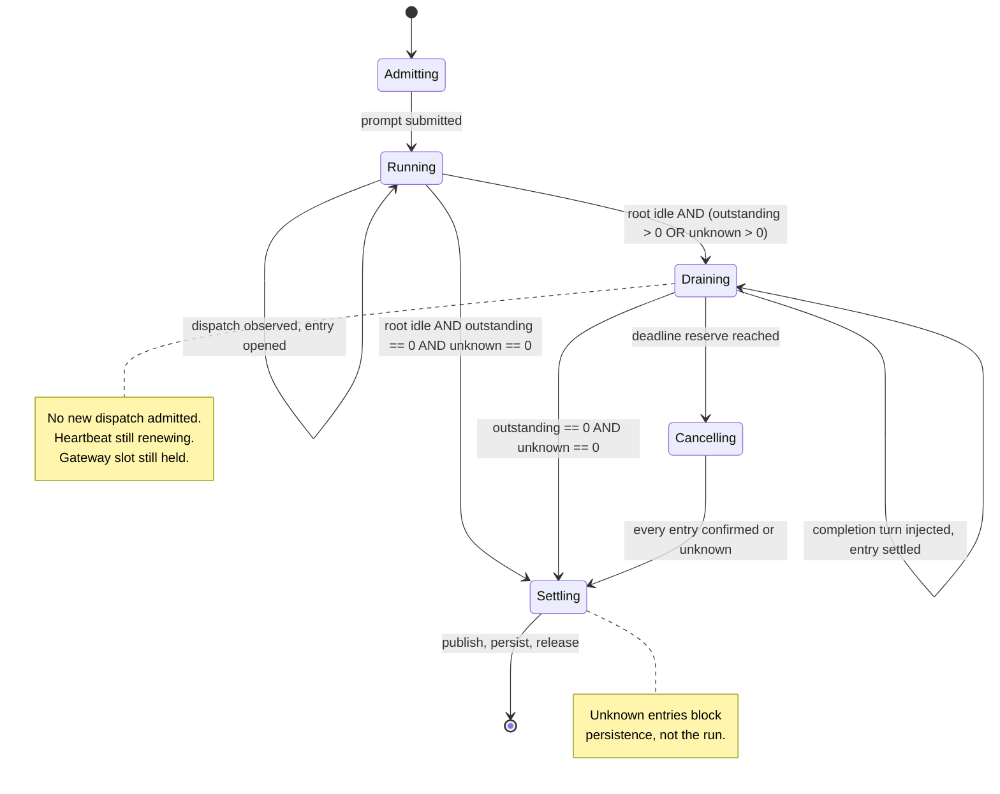

# feat: Background subagent ownership and drain

## Overview

Enable OpenCode background subagents on the Action and the gateway behind an ownership ledger, bounded dispatch, and a drain that completes before any terminal step. The flag itself is one line; everything here exists because a detached subagent is invisible to both surfaces and survives the signals they currently treat as terminal.

## Problem Frame

A background dispatch returns immediately and runs as a detached fiber in a registry upstream documents as process-local and non-durable. Session idle is computed from explicit status updates and never consults background jobs, so a session reports idle while its subagents are still running. Both surfaces filter every event by root-session equality, so a child's tool calls, approvals, and activity are invisible today.

The Action then acts on that idle: it finalizes, publishes, prunes, shuts the server down, checkpoints the database, saves cache, and releases its lock — on top of live work, with no error surfaced. The gateway hands its concurrency slot to the next queued run while the previous run's subagents are still writing the same workspace.

Two failure paths carry the most cost. Context-overflow recovery archives the overflowed session and re-runs under a new one; its subagents keep running, and the recovery session dispatches its own, so two sets of writers share a workspace and a git index. And a stream discontinuity that swallows a dispatch event leaves the ledger reading zero while a child writes.

See origin: `docs/brainstorms/2026-09-13-opencode-background-subagents-requirements.md`.

## Requirements Trace

Scope only — not a completion claim. R3–R24 of the origin document map to the units below; see [Requirement Status](#requirement-status) for per-requirement verdicts. R1 and R2 (the file watcher) shipped separately and are not in scope.

- R3–R8. Ownership ledger, descendant event handling, retry survival, unknown-not-zero, subscription readiness, discontinuity handling
- R9–R11. Descendant approval routing, tree-aware activity, run ownership through drain
- R12. Depth limit, enforced by configuring the upstream setting rather than by a gate of our own
- R13–R15. Dispatch caps, pre-execution enforcement, no dispatch after finalization — **cut**, see Scope Boundaries
- R16–R22a. Drain before terminal steps, every terminal path, single deadline, expiry behaviour, confirmed cancellation, publication ownership, persistence declining, lock lease
- R23–R24. Labelled reporting, gateway startup reconciliation

## Requirement Status

Unit checkboxes below record artifact existence, not requirement completion — two review rounds surfaced units whose artifacts existed but whose stated requirements were not fully met. A full audit checked every requirement against the code; this table is authoritative for completion. A ticked unit claims only that all of its requirements are `shipped`.

One split runs through several rows and is worth reading first, because the requirements were written as though it did not exist. The Action has two response-delivery paths (`packages/runtime/src/agent/response-delivery.ts`), chosen by delivery classification rather than by a fixed trigger list. On the **file-convention** path — the `affected` classification (`pull_request`, `issue_comment`, `issues`) — the harness posts, so it can sequence publication against drain and own the one-response rule. Everything else resolves to the **`model-gh`** path: the `autonomous` classification (`workflow_dispatch`, `schedule`) and the `deferred-or-unknown` classification, which covers `pull_request_review_comment`, `discussion_comment`, and any event name the classifier does not recognize — an unrecognized event defaults into `model-gh`, so the set is open-ended rather than fixed. On `model-gh`, the model posts its own response with `gh` during Execute, before drain has run and outside harness control. Requirements phrased as "the harness owns publication" or "drain completes before anything publishes" therefore hold on one path and not the other, and are marked `partial` for that reason rather than because the file-convention implementation is incomplete.

| Requirement | Status | Note |
|---|---|---|
| R1 | out of scope | Shipped separately (PR #1608, file watcher). |
| R2 | out of scope | Shipped separately (PR #1608, file watcher). |
| R3 | partial | Ledger is keyed on child session id and idempotent; the extension and promotion paths have no implementation, and no promotion path exists at all. |
| R4 | shipped | Descendant events are handled and unowned sessions are rejected, on both surfaces. |
| R5 | partial | Ownership survives retry by refusing to retry until drain-complete, not by cancelling or settling the prior tree; no gateway retry path exists. |
| R6 | partial | Holds for tracked entries, which resolve to unknown and never zero; an unobserved dispatch reads as zero, indistinguishable from "no work dispatched." |
| R7 | partial | Subscription is ordered before submission on both surfaces, but neither confirms it is live; no readiness handshake exists. |
| R8 | partial | Unknown resolution and bounded cancellation ship; a discontinuity is recorded but never converted into an incomplete outcome, so polling can still report success (the gateway raises `stream-ended` on early stream close). |
| R9 | partial | Implemented and ownership-gated, but unexercised — nothing in this codebase issues a background dispatch today. |
| R10 | partial | Descendant activity resets inactivity, but the run's busy projection is set false on entering drain; the per-request registry also cannot stop upstream from settling every pending approval when one is rejected. |
| R11 | partial | An owned descendant's `session.error` throws immediately (`run-core.ts:947-958`), bypassing drain; the finally-block cleanup then disposes approval routing and releases the slot (`run.ts:846-850`, `:1166-1190`, `:1215-1275`) without settling the other owned entries. |
| R12 | partial | Pinned for the Action (`src/services/setup/ci-config.ts`); the gateway's workspace container never sets `subagent_depth`, so it inherits the upstream default instead of enforcing it. |
| R13 | cut | See Scope Boundaries. |
| R14 | cut | See Scope Boundaries. |
| R15 | cut | See Scope Boundaries; nothing replaces the dispatch-refusal safety clause — stream shutdown after the abort signal is not a dispatch refusal, so a dispatch during finalization is unlikely but not structurally prevented. |
| R16 | partial | Holds on the file-convention path: drain precedes finalization, pruning, shutdown, persistence, and lock release. Not on the `model-gh` path (see the delivery-path split above), where the model posts its own response with `gh` during Execute — `runDrain()` only starts after `runExecute()` returns, so that response publishes before drain. |
| R16a | partial | The gate exists at each named path, but no test isolates it as load-bearing: the completed-assistant test is independently blocked by busy status until after the ledger settles, and the racing-fixture test is rejected for a missing finish reason before the ledger check is reached. |
| R17 | partial | One fixed execution deadline is never extended, but execution and drain do not share it — drain receives a derived remaining budget after execution returns. |
| R18 | partial | Stop-admission, cancellation, and a separate teardown signal ship; no drain-path approval settlement exists, and expiry is not propagated into the invocation result. |
| R19 | partial | Reconciliation also settles an entry on corroborated absence from the live (non-idle) status map (`ledger-reconcile.ts:198-200`) — a third signal the requirement does not name. Absence from that map confirms the session went idle, not that it terminated; upstream removes idle sessions from the map on their own. |
| R19a | partial | Persistence correctly declines, but the run still finalizes, publishes, writes the dedup marker, emits a success reaction, and exits 0. |
| R20 | partial | Holds on the file-convention path, where the harness posts. On `model-gh` the model owns publication, so nothing structurally prevents a credentialed descendant from posting, and finalize accepts any positive comment count rather than proving a single harness-owned publisher. |
| R21 | partial | Declines persistence when ownership or quiescence can't be confirmed, but the `held-by-other` lock skip (`run.ts:124-135`) reaches cleanup with no lease at all, so its persistence-safety check runs exactly as it would for a lock-free run — it cannot decline on the writer it just detected. |
| R22 | partial | Renewal spans execution, drain, and persistence and protects persistence, but does not fail the invocation closed, and `hasFailed()` reflects only the latest tick. |
| R22a | partial | No-lock fail-open is scoped to runs that proceed without a lock (S3 unconfigured, or acquisition errored); it does not authorize fail-open for a run that declined to proceed because another surface already holds the lock, but the `held-by-other` skip (`run.ts:124-135`) is treated identically by cleanup. |
| R23 | partial | Labels and the degraded-state note land in the job summary only; the invocation's published response carries no unfinished-work labels (see Unit 13). |
| R24 | partial | Reconciliation and cancel-or-unknown ship; nothing gates admission on reconciliation completing, so a run can reach `PENDING` and only later collide with the durable lock. |

**Cross-cutting finding.** Three independent paths — drain expiry with unknown work, stream discontinuity, and lease-renewal failure — each detect a safety condition, log it, and then fail to propagate it into the run's reported outcome: the run still publishes, dedups, reacts success, and exits 0. The dedup marker is the sharpest edge, because a deduped incomplete run is never retried. A fourth instance is the `held-by-other` lock skip (R21, R22a): it detects that another surface holds the coordination lock, logs it, and returns before the persistence gate can see that context, so cleanup persists as though no conflicting writer existed. Fixing this is code work, not a documentation change, and it is a prerequisite for the release gate (Unit 14).

## Scope Boundaries

- No change to OpenCode itself. The events and APIs required already exist.
- Background work is not resumable across runs. The upstream registry is process-local; cache persistence does not change that.
- Subagent depth stays at one. Raising it requires solving the grandchild traversal gap below on its own terms. Enforce it by setting upstream's own `subagent_depth`, which is checked before execution against real session ancestry — not by a depth field a caller supplies, which the caller is in no position to know.
- The four declined flags from the origin document remain unset.
- **Dispatch caps are cut** (R13–R15). They cannot be enforced at any seam this project can reach, and the attempt misfires on the project's own workflows. The only pre-execution seam reachable from a client is the `task` permission request, which fires for every `task` call — foreground delegation included — and carries nothing distinguishing background from foreground, so a cap there refuses ordinary work. Worse, upstream fails *every* pending permission for a session when one is rejected, so refusing a background dispatch would collaterally refuse unrelated foreground approvals. The gate itself could not hold its own contract either: it reads an observation ledger that only populates on completed dispatches, so several admissions pass before any registers. And the requirement is not satisfiable in principle — an extension reuses a running job and a promotion converts one, so neither can be counted before execution starts. The deadline already bounds how long an invocation waits, and drain already prevents work outliving it; a cap would bound concurrent resource pressure, which is a different problem with no evidence yet that this project has it.

### Deferred to Separate Tasks

- Resource admission, if production shows unbounded fan-out is a real problem rather than an imagined one. It needs a server-side design around actual start, extend, and promote transitions — a plugin hook that receives the tool's real arguments, not permission-event bookkeeping — and measured fan-out to size anything by. Neither exists today.
- Revisiting the teardown reserve once drain exists and can be measured: the value here is derived from teardown as it exists today. The concrete follow-up is re-measuring from the drain tail — timing teardown from when drain ends, not from run start — once Unit 10 exists.

## Context & Research

### Relevant Code and Patterns

Closure-state, which this repo uses instead of classes:
- `packages/gateway/src/execute/queue.ts` (`createChannelQueue`) — per-key map, bounded, explicit handoff primitive
- `packages/gateway/src/execute/concurrency.ts` (`createConcurrencyRegistry`) — cap plus per-channel exclusivity
- `packages/gateway/src/approvals/registry.ts` (`createApprovalRegistry`) — entries, timers, session ownership, fail-closed settlement
- `packages/gateway/src/approvals/coordinator.ts` (`createPermissionCoordinator`) — owned session IDs, pending/replied/dispose hooks

Integration points:
- `src/features/agent/streaming.ts` — ten root-session filters between lines 294 and 590
- `packages/gateway/src/execute/run-core.ts` — nine root-session filters between lines 437 and 672
- `src/features/agent/retry.ts` — four independent terminal paths (see Unit 9)
- `src/harness/run.ts:171-233` — finalize precedes cleanup
- `src/harness/phases/cleanup.ts:65-286` — prune, shutdown, artifacts, checkpoint and save, outputs, lock release in `finally`
- `src/harness/phases/execute.ts:99-203` — `recoverFromContextOverflow`
- `packages/gateway/src/execute/run.ts:1162-1224` — `executeWorkOnHeldSlot`

Testing patterns: fake timers for deadline-sensitive paths, event streams mocked as async generators with an initial `setTimeout(0)` so setup state arms before the first event, lightweight server-handle mocks with `shutdown()`, and explicit ordering assertions (`src/harness/phases/cleanup.test.ts`, `src/harness/phases/cache-restore.test.ts`).

### Institutional Learnings

- `docs/solutions/logic-errors/submission-failure-does-not-prove-the-work-never-started-2026-08-08.md` — a failed submit does not prove the server never accepted the prompt. Independently validates keying cancellation off observable terminal signals rather than return values.
- `docs/solutions/logic-errors/terminal-outcomes-must-survive-deadline-cleanup-2026-07-24.md` — once a terminal outcome is known, later cleanup must not rewrite it. Drain runs long by design, so this separation has to be explicit.
- `docs/solutions/best-practices/sse-output-streaming-terminal-drain-2026-06-21.md` — a terminal signal drains queued frames rather than aborting the stream.
- `docs/solutions/logic-errors/repair-before-capture-sqlite-session-cache-loop-2026-09-02.md` — persisting after a bad restore entrenches the failure. Writer quiescence must precede capture.
- `docs/solutions/logic-errors/retry-clobbers-previous-invocation-comment-2026-07-11.md` — publication idempotency has to be run-scoped.
- `docs/solutions/integration-issues/read-only-actions-cache-token-broke-session-continuity-2026-08-11.md` — a discarded return value hid a silent persistence failure for a month.

Lease renewal is not new: `packages/runtime/src/coordination/heartbeat.ts`, already wrapped at `packages/gateway/src/runtime-effect.ts`, is existing machinery this plan extends to a longer interval rather than invents. What has no prior art in this codebase is the ownership ledger and treating the two surfaces as one lifecycle problem.

## Prior-Art Survey

```json
{
  "schema_version": 2,
  "verdict": "build-new-within-scope",
  "scope": "packages/gateway/src/execute + packages/gateway/src/approvals + src/features/agent + src/harness/phases + packages/runtime/src/agent",
  "freshness": {
    "vcs_reference": "62e8e466d3e09e2020e1d690c1a2661b5ccf2169",
    "scope_baseline": "packages/gateway/src/{execute,approvals} + src/{features/agent,harness/phases} + packages/runtime/src/agent"
  },
  "budget": {
    "max_search_passes": 3,
    "max_candidate_inspections": 10,
    "exhausted": true
  },
  "candidates": [
    {
      "path_or_symbol": "packages/gateway/src/execute/run.ts:1249-1257 (inFlightRuns)",
      "description": "Process-local set of immediate gateway run promises; owns the admitted run promise until the handoff path removes it.",
      "disposition": "insufficient",
      "insufficiency_reason": "Tracks whole-run promises per channel, not detached child work keyed by child session identifier, and provides no drain barrier before terminal publish or persist."
    },
    {
      "path_or_symbol": "packages/gateway/src/execute/run.ts:1162-1224 (executeWorkOnHeldSlot)",
      "description": "Atomic channel-slot handoff: drains the next queued task while the slot is still held, otherwise releases it.",
      "disposition": "insufficient",
      "insufficiency_reason": "Queue and slot management, not ownership of work spawned by an invocation; it cannot observe or settle descendant sessions before finalization."
    },
    {
      "path_or_symbol": "packages/gateway/src/approvals/registry.ts:280-349,509-627 (createApprovalRegistry)",
      "description": "Permission-request registry with requestID and sessionID entries, deadline settlement, claimed and confirmed state, fail-closed behaviour.",
      "disposition": "insufficient",
      "insufficiency_reason": "Specific to approval prompts and reply settlement; it does not track arbitrary outstanding work or drain terminal steps after the turn ends."
    },
    {
      "path_or_symbol": "packages/gateway/src/execute/run-core.ts:247-672 (runOpenCodeCore)",
      "description": "Single-run execution loop with heartbeat, abort, terminal-signal flags, and run-state transitions.",
      "disposition": "insufficient",
      "insufficiency_reason": "Owns one execution lifecycle, not a ledger of detached jobs that must settle before terminal writes and later persistence."
    },
    {
      "path_or_symbol": "src/features/agent/retry.ts:351-585 (runPromptAttempt and ActivityTracker)",
      "description": "Prompt-attempt watchdog carrying first-meaningful-event, terminal-signal, idle, and provider-error flags with poll and wait orchestration.",
      "disposition": "insufficient",
      "insufficiency_reason": "Tracks completion of one prompt attempt, not outstanding detached work, and does not survive retry or overflow session replacement."
    }
  ]
}
```

## Key Technical Decisions

- **Key the ledger on the child session identifier, not the job identifier.** Job ids can be reused, and notifications carry the child session id. Keying on the job id lets a delayed notification settle a newer execution (see origin: R3).
- **Reconcile against the server, not only the stream.** The stream provides no replay after a reconnect, so a tracked entry whose settlement event was dropped would otherwise sit outstanding forever. `GET /session/{sessionID}/children` supplies candidates and session status supplies liveness — `children` alone is a `parent_id` lookup that returns completed children too, so presence is not evidence of outstanding work. This settles only entries the ledger already tracks; it cannot recover a dispatch whose own event was never observed (Unit 3's known gap, still open — see Risks & Dependencies).
- **Cancel every ledger entry individually.** Upstream `SessionRunState.cancel()` traverses running jobs only, so a completed child linking the root to a running grandchild is never reached. Depth one makes that unreachable today; cancelling per entry means raising the depth later does not silently reintroduce it.
- **Cancel owned work before archiving an overflowed session.** Overflow recovery archives and re-runs under a new session id. Without this, the archived session's subagents and the recovery session's subagents write the same workspace concurrently.
- **Reserve 30 seconds of the deadline for teardown.** Measured post-execution teardown on real runs was 5.1 s and 14.7 s, dominated by S3 session sync at up to 10.2 s; the reserve doubles the worst observation. It is configurable, because drain does not exist yet and this measures teardown without it.
- **Keep the heartbeat alive through drain.** It currently stops before terminal writes. A run draining for minutes without one is swept as stale by another gateway instance, which kills the subagents mid-drain.
- **Bound the drain rather than waiting indefinitely.** Holding the gateway slot until owned work settles means one hung descendant can occupy a channel and back up its queue. The drain is bounded by the invocation deadline, and expiry cancels rather than continuing to wait — a run cannot hold a channel longer than its own budget allows.
- **Escalate a persistently unknown entry rather than degrading silently.** Unknown blocks persistence without failing the run, which left alone means a run that looks finished while its session state is never saved. An entry still unknown when drain ends is reported as such and surfaced in the run's outcome, so the degraded state is visible rather than inferred later from missing continuity.
- **Auto-reject a descendant approval whose notification cannot be delivered.** A deleted or archived thread otherwise leaves the subagent waiting until the deadline for an answer nobody can give.
- **Descendant approval routing is gateway-only.** The Action auto-denies every `permission.asked` immediately (`src/features/agent/streaming.ts:300-336`) and has no human path, so R9 and R10 do not apply there.

## Open Questions

### Resolved During Planning

- How much deadline to reserve for teardown: 30 seconds, derived from measured runs rather than assumed (origin left this as the one blocking question).
- What correlates an execution across dispatch, extension, promotion, and notification: the child session identifier.
- Where caps would be enforced and the shape of a cap-rejection: resolved during planning, then moot — dispatch caps were cut entirely during implementation (see Scope Boundaries).
- Whether lease renewal reuses the gateway's heartbeat: yes — `packages/runtime/src/coordination/heartbeat.ts` already provides the primitive, and `packages/gateway/src/runtime-effect.ts:77-87` already wraps renewal.
- Whether reconciliation needs to run on a timer as well as on discontinuity: yes — periodic reconciliation is a requirement (Unit 3), bounded and cheap, running on an interval as well as on subscription and discontinuity. Discontinuity detection alone leaves a dropped *settlement* event for a tracked entry unresolved: with nothing to trigger a re-check, that entry would sit outstanding forever. (A dropped *dispatch* event is a separate, still-open gap — see Unit 3.)

### Deferred to Implementation

- Whether the Action's drain warrants its own phase module or belongs inside the execute phase.

## High-Level Technical Design

> *This illustrates the intended approach and is directional guidance for review, not implementation specification. The implementing agent should treat it as context, not code to reproduce.*



The ledger distinguishes three states per entry — outstanding, settled, unknown — and `unknown` is never collapsed into zero. Both drain completion and persistence require `outstanding == 0` AND no `unknown` entries — the same predicate, asked at two different moments (stop waiting vs. write to disk).

## Implementation Units

### Phase 1 — Shared primitive

- [ ] **Unit 1: Ownership ledger**

**Goal:** A reusable ledger that records the executions an invocation owns and settles each exactly once.

**Requirements:** R3, R6

**Status:** Unticked — R3 and R6 are partial; see [Requirement Status](#requirement-status).

**Dependencies:** None

**Files:**
- Create: `packages/runtime/src/agent/ownership-ledger.ts`
- Modify: `packages/runtime/src/agent/index.ts`
- Test: `packages/runtime/src/agent/ownership-ledger.test.ts`

**Approach:**
- Closure state over a `Map` keyed by child session identifier, following `createChannelQueue` and `createConcurrencyRegistry`.
- Three entry states: outstanding, settled, unknown. Settling an already-settled entry is a no-op rather than an error, because a notification can arrive for an entry already resolved by reconciliation.
- Expose `outstanding()`, `unknown()`, and an `adopt` that is idempotent on the same key — an extension notifies once for several dispatches, so adopting twice must not double-count.

**Patterns to follow:**
- `packages/gateway/src/execute/concurrency.ts` for the closure shape and accessor style
- `Result<T, E>` at the boundary where a caller can act on failure

**Test scenarios:**
- Happy path: adopt two entries, settle both, outstanding reaches zero
- Edge case: adopting the same session id twice counts once
- Edge case: settling an entry that was never adopted does not create one
- Edge case: settling the same entry twice leaves the count unchanged
- Error path: an entry marked unknown is excluded from settled but still blocks a persistence check
- Integration: a ledger with one unknown and zero outstanding reports neither drain-complete nor persistence-safe

**Verification:**
- A caller can distinguish "nothing outstanding" from "nothing known to be outstanding" without reading ledger internals.

**Disproved during implementation.** This unit originally specified that an unknown entry blocks persistence but not drain, so a failed reconciliation could not wedge a run. That was wrong, and review caught it across five call sites. Drain gates publication, session pruning, server shutdown, the checkpoint, cache save, and lock release — so letting it complete over an unconfirmable entry does not avoid a wedge, it ends the run while a writer may still be live, which is the hazard this plan exists to close. Unknown now blocks both, and the run deadline rather than the predicate is what bounds the wait.

- [ ] **Unit 2: Pin subagent depth to one**

**Goal:** Nesting stays at one level, enforced where it can actually be checked.

**Requirements:** R12

**Status:** Unticked — R12 is partial; see [Requirement Status](#requirement-status).

**Dependencies:** None

**Files:**
- Modify: `src/services/setup/ci-config.ts`
- Test: `src/services/setup/ci-config.test.ts`

**Approach:**
- Set `subagent_depth` to one in the CI config rather than building a depth check of our own. Upstream checks it before execution against real session ancestry, which a client cannot cheaply reconstruct — a depth value passed in by the caller is a guess, and the caller is the party least able to make it.
- Depth matters because upstream cancellation walks running jobs only, so a completed child linking the root to a running grandchild is never reached. Depth one makes that unreachable. This is the requirement the cut caps were tangled with, and it survives them because it is enforceable where they were not.
- This unit originally built a dispatch admission gate for the outstanding and total caps. That gate was removed: it could not be wired anywhere without refusing ordinary foreground delegation, and its own contract could not hold. See Scope Boundaries.

**Test scenarios:**
- Happy path: the generated CI config pins `subagent_depth` to one
- Edge case: an operator value is not silently overridden without being recorded
- Edge case: the pin survives each config mode the setup supports

**Verification:**
- A generated config carries the depth pin, and nothing in this project re-implements a depth check against it.

- [ ] **Unit 3: Ledger reconciliation**

**Goal:** The ledger recovers from events it never saw.

**Requirements:** R6 (tracked entries only), R8

**Status:** Unticked — R6 and R8 are partial; see [Requirement Status](#requirement-status).

**Dependencies:** Unit 1

**Files:**
- Modify: `packages/runtime/src/agent/ownership-ledger.ts`
- Create: `packages/runtime/src/agent/ledger-reconcile.ts`
- Test: `packages/runtime/src/agent/ledger-reconcile.test.ts`

**Approach:**
- Reconciliation settles what the ledger already tracks. It does not adopt a session the ledger never learned about from an observed dispatch — see the disproved assumption below.
- `GET /session/{sessionID}/children` establishes parentage. It is a `parent_id` lookup with no liveness filter, so it returns every child ever created under the parent and cannot stand alone.
- Liveness comes from session status, which holds an entry only while a session is non-idle. For a tracked entry: a live child of this parent stays outstanding, a child that is no longer live settles, and an entry that is not a child of this parent at all is marked unknown — there is no basis to claim it and no observation of completion to justify settling it.
- Run on subscription, after any discontinuity, and on a bounded interval, so a settlement event that was dropped is still recovered. An empty ledger short-circuits before making any call, so a run with no background work pays nothing.
- A ledger entry whose session is no longer live is settled.
- A failed reconciliation marks the ledger unknown rather than empty. Specifically it marks the entries that were outstanding at the time of the failure, and leaves settled entries alone — a settled entry was confirmed finished by a positive observation, and a later failed call is not evidence against it.
- The gateway consumes this primitive through `packages/gateway/src/runtime-effect.ts`, following how that file already wraps other runtime primitives (Unit 7 depends on it for startup reconciliation); the Action consumes it directly (Unit 8), since it has no equivalent wrapper layer.

**Test scenarios:**
- Happy path: a tracked entry that is a live child of this parent stays outstanding
- Happy path: a tracked entry whose session reports idle is settled
- Edge case: a live child this ledger never tracked is not adopted
- Edge case: a tracked entry that is not a child of this parent is marked unknown
- Edge case: reconciliation is idempotent across repeated runs
- Edge case: reconciliation runs on its interval even with no subscription event or discontinuity
- Edge case: an empty ledger performs no remote calls at all
- Error path: a failed reconciliation call leaves the ledger unknown, not empty
- Integration: a tracked entry whose settlement event was dropped is still settled without a detected discontinuity

**Verification:**
- A parent with a long history of completed children still drains, and no run pays a remote call for background work it never dispatched.

**Disproved during implementation — and this one leaves a hazard open.** This unit originally specified adopting live untracked children, so that a dispatch whose event was dropped would still be recovered. That is not possible from this project's position. Upstream creates the child session before the background branch, so foreground `task` delegation produces one identically, and `background: true` is written only onto tool-part metadata, never onto the session record — `children()` and the status map carry no discriminant at all. Adoption therefore claimed ordinary foreground subagents as owned background work on every run, and with unknown blocking drain, one transient API failure could hold a successful run in drain until it timed out.

The consequence: **a dispatch whose event is never observed is unrecoverable.** The ledger cannot know about work it never saw, and nothing available to a client can tell that work apart from a foreground subagent. This is a real gap, not a solved problem, and the release gate must weigh it — it is bounded by the run deadline, and nothing can dispatch in background today, but it does not close on its own. Closing it needs an upstream discriminant on the session record, or a server-side hook that sees the tool's actual arguments.

That gap is also why R6 above is marked partial rather than shipped. R6's origin text covers a missing, ambiguous, or unobservable signal — an unobserved dispatch falls squarely inside that scope, not outside it. The distinction worth keeping is in how R6 is unmet, not whether it applies: a live child this ledger already knows about settles to unknown, never zero, when reconciliation cannot confirm it; a dispatch the ledger never learned about leaves no entry at all, which reads as zero — indistinguishable from no work dispatched. R6 holds for tracked entries and fails for the untracked case, and the checkbox above records exactly that partial state.

### Phase 2 — Gateway

- [ ] **Unit 4: Descendant event handling and approval routing**

**Goal:** Events from owned descendant sessions reach the gateway's handlers, and their approvals reach the existing coordinator.

**Requirements:** R4, R9, R10

**Status:** Unticked — R9 and R10 are partial; see [Requirement Status](#requirement-status).

**Dependencies:** Unit 1

**Files:**
- Modify: `packages/gateway/src/execute/run-core.ts`
- Modify: `packages/gateway/src/approvals/coordinator.ts`
- Test: `packages/gateway/src/execute/run-core.test.ts`
- Test: `packages/gateway/src/approvals/approval-flow.integration.test.ts`
- Test: `packages/gateway/src/execute/run.test.ts` (coordinator test doubles need the widened interface)

**Approach:**
- Replace root-session equality at eight of the nine filters in `run-core.ts:437-672` with an ownership check. An unowned session stays out of scope — widening to every workspace session would route a stranger's approval to this run's thread.
- `session.idle` is the exception and stays root-scoped. It resolves the run, so treating a descendant's idle as the run's idle would end the run while the root is still working — invisibility traded for premature termination. Root idle with outstanding work is a drain decision, and it belongs to Unit 6.
- The registry's cross-session guard needs no change: it already compares the registered entry's own session against the reply's, so a reply settles only the approval it names. Confirm that before touching it rather than assuming a root-equality bug that is not there.
- Activity accounting covers the owned tree, so a busy descendant does not read as an inactive run.

**Patterns to follow:**
- `packages/gateway/src/approvals/coordinator.ts` already tracks `ownedSessionIDs`; extend that rather than introducing a parallel notion of ownership

**Test scenarios:**
- Happy path: a descendant's approval request posts to the originating thread
- Edge case: a session belonging to no run is ignored rather than routed
- Edge case: two descendants requesting approval concurrently settle independently
- Error path: a reply naming an already-settled approval is rejected, not applied to another
- Edge case: an event from a session owned by a different run is not handled by this one
- Integration: a busy descendant keeps the run from reading as inactive while the root is idle

**Verification:**
- A descendant tool call passes the same fail-closed gate a foreground call does.

- [ ] **Unit 5: Undeliverable approval auto-rejects**

**Goal:** A descendant whose approval notification cannot be delivered is refused rather than left waiting.

**Requirements:** R9

**Status:** Unticked — R9 is partial; see [Requirement Status](#requirement-status).

**Dependencies:** Unit 4

**Files:**
- Modify: `packages/gateway/src/approvals/discord-transport.ts`
- Test: `packages/gateway/src/approvals/discord-transport.test.ts`

**Approach:**
- A terminal post failure — thread deleted, channel gone — rejects the permission on the server immediately. A retryable failure keeps existing behaviour.
- Distinguishing the two matters: treating a transient failure as terminal denies work that would have succeeded.
- Keep the auto-reject — a subagent hanging to the deadline is worse — but make the rejection operator-visible rather than silent, so a pattern of delivery failures is diagnosable instead of reading as arbitrary refusals. Delivery-failure rejections otherwise turn notification availability into an undocumented approval-denial control.

**Test scenarios:**
- Happy path: a successful post leaves the request open for a human
- Error path: a thread-not-found failure rejects the request on the server
- Error path: a rate-limit failure does not reject
- Edge case: rejection after a post failure settles the registry entry exactly once
- Integration: a delivery-failure rejection is surfaced in the run's observability output, not only settled silently in the registry

**Verification:**
- No descendant waits on an approval that reached nobody, and a delivery-failure rejection is visible to an operator rather than indistinguishable from a deliberate denial.

- [ ] **Unit 6: Hold the run through drain**

**Goal:** The gateway keeps its slot, lease, and approval routing until owned work settles.

**Requirements:** R11, R16, R17, R18

**Status:** Unticked — R11, R16, R17, and R18 are partial; see [Requirement Status](#requirement-status).

**Dependencies:** Unit 1, Unit 4

**Files:**
- Modify: `packages/gateway/src/execute/run-core.ts`
- Modify: `packages/gateway/src/execute/run.ts`
- Test: `packages/gateway/src/execute/run.test.ts`

**Approach:**
- Root idle with outstanding work enters drain rather than completing. The run stays `EXECUTING` with a draining indication; no new persisted phase is needed.
- The heartbeat keeps renewing through drain. Stopping it is what lets another instance sweep the run as stale and kill the subagents.
- `executeWorkOnHeldSlot` hands off only after drain, so the next run cannot start writing the workspace under the previous one.
- One deadline covers execution and drain, reserving 30 seconds for teardown. A completion notification does not extend it.
- This unit persists the run's ownership onto its run state — the root session and the set of owned session ids — as it adopts and settles. Nothing writes that today: `RunState.details` currently carries only `cancelledBy`, `failureKind`, and `channelId`. Unit 7 reads those fields to reconcile after a restart, so until this unit writes them, startup reconciliation has nothing to read and is inert. Ownership must be persisted as it changes rather than at completion, since the restart it protects against can happen at any point during the run.

**Test scenarios:**
- Happy path: a run with outstanding work drains, then completes and hands off the slot
- Edge case: the slot is not handed off while outstanding work remains
- Edge case: the heartbeat renews during a drain longer than its interval
- Error path: the deadline expires mid-drain, cancellation runs, and the run reports incomplete
- Edge case: a completion notification arriving during drain does not extend the deadline
- Edge case: ownership is persisted onto run state as entries are adopted, not only at completion
- Integration: a second queued run for the same channel does not start until the first has drained
- Integration: a run interrupted mid-drain leaves run state a restart can reconcile from

**Verification:**
- No two runs hold the same workspace concurrently, and no draining run is swept as stale.

- [ ] **Unit 7: Startup reconciliation**

**Goal:** A restarted gateway reconciles owned work surviving in the workspace server before admitting anything that would conflict.

**Requirements:** R24

**Status:** Unticked — R24 is partial; see [Requirement Status](#requirement-status).

**Dependencies:** Unit 1, Unit 3

**Files:**
- Modify: `packages/gateway/src/execute/recovery.ts`
- Test: `packages/gateway/src/execute/recovery.test.ts`

**Approach:**
- Gateway restart is not workspace restart: the server survives with background jobs running. Existing recovery marks stale runs failed and releases locks without reconciling remote sessions.
- Rebuild ownership from persisted run state where possible, but treat that state as advisory only, not authoritative: intersect it with live server state through the reconciliation primitive (Unit 3) before restoring ownership. Stale, corrupted, or partially written persisted state would otherwise let a restart re-adopt sessions it does not own, misroute approvals, or hold a slot while another party's work is live.
- Any mismatch between persisted state and live server state downgrades that entry to unknown until reconciliation completes, rather than trusting the persisted side. Cancel or mark unknown what cannot be reattached. Admit no conflicting run until that completes.

**Patterns to follow:**
- `packages/gateway/src/execute/recovery.ts:148-306` for the existing sweep shape

**Test scenarios:**
- Happy path: a restart with no surviving work admits runs immediately
- Edge case: a run whose owned sessions still exist is reconciled before admission
- Edge case: persisted state naming a session the live server does not recognize as owned is downgraded to unknown rather than restored
- Error path: an owned session that cannot be reattached is cancelled and recorded
- Edge case: no conflicting run is admitted until reconciliation finishes
- Integration: a lock held by a reconciled run is not released while its work is live

**Verification:**
- A restart cannot admit a run that would write alongside surviving work, and stale persisted ownership cannot be restored without confirmation from the live server.

### Phase 3 — Action

- [ ] **Unit 8: Descendant event handling and ledger integration**

**Goal:** The Action observes owned descendant sessions and records dispatches as they occur.

**Requirements:** R4, R7, R8

**Status:** Unticked — R7 and R8 are partial; see [Requirement Status](#requirement-status).

**Dependencies:** Unit 1, Unit 3

**Files:**
- Modify: `src/features/agent/streaming.ts`
- Test: `src/features/agent/streaming.test.ts`

**Approach:**
- Replace root-session equality at the ten filters in `streaming.ts:294-590` with an ownership check. `permission.asked` keeps auto-denying; widening it only means a descendant's request is denied rather than ignored.
- Adopt an entry when a background dispatch is observed; settle when its completion turn is injected into the parent.
- Confirm the subscription is live before submitting, so a dispatch cannot occur before anything is listening.
- A discontinuity marks outstanding entries unknown and triggers reconciliation (Unit 3).

**Execution note:** Add characterization coverage for the existing filters before changing them — this function carries ten call sites and its behaviour is load-bearing for every run.

**Test scenarios:**
- Happy path: a dispatch on a descendant session opens a ledger entry
- Happy path: an injected completion turn settles that entry
- Edge case: an event from an unowned session is ignored
- Edge case: a descendant `permission.asked` is auto-denied, as a root one is
- Error path: a stream discontinuity marks outstanding entries unknown
- Integration: a run with no background dispatch behaves exactly as before

**Verification:**
- Existing single-session runs show no behavioural change.

- [ ] **Unit 9: Gate every terminal path**

**Goal:** No path ends the invocation while owned work is outstanding.

**Requirements:** R16a

**Status:** Unticked — R16a is partial; see [Requirement Status](#requirement-status).

**Dependencies:** Unit 1, Unit 8

**Files:**
- Modify: `src/features/agent/retry.ts`
- Modify: `src/features/agent/session-poll.ts`
- Test: `src/features/agent/retry.test.ts`
- Test: `src/features/agent/session-poll.test.ts`

**Approach:**
- Four paths currently end a run independently. Two live in `session-poll.ts` rather than `retry.ts`, despite the names suggesting otherwise: the stable completed-assistant poll is `detectMessageActivity` and its consumer in `pollForSessionCompletion`, and the sticky terminal flags are read at two separate branches in that same loop — one for flags the event stream set, one for a REST-polled idle status. `retry.ts:185-234` is `readCompletedAssistantMessageParts`, a post-idle artifact read that reports nothing, and `retry.ts:371-378` is the activity tracker's object literal, not a read site. The remaining two are genuinely in `retry.ts`: the v2 session-wait success path (`290-349`) and the early `promptStartResult != null` return after `collectEventResults()` (`434-456`).
- Each consults the ledger before resolving as complete. Gating one and not another leaves the run exiting through whichever is left. A blocked early return must fall through to the already-gated watchdog rather than returning, so declining to complete does not mean declining to make progress.
- Prove each gate has teeth by neutering the shared predicate and confirming the targeted tests fail. These paths race, so a green suite is weak evidence that any individual gate is load-bearing.

**Execution note:** Start with a failing test per path, since the paths race and a passing suite can hide one that was never gated.

**Test scenarios:**
- Happy path: with nothing outstanding, each path completes as it does today
- Edge case: with work outstanding, the completed-assistant poll does not resolve complete
- Edge case: with work outstanding, the session-wait success path does not resolve complete
- Edge case: with work outstanding, sticky terminal flags do not end the run
- Edge case: with work outstanding, the early prompt-start return does not end the run
- Integration: the paths racing with work outstanding produce drain, not completion

**Verification:**
- Each of the four paths has a test proving it declines while work is outstanding.

**Disproved during review.** Two of the four candidate proofs do not isolate the ledger gate: `session-poll.test.ts:181-245` is independently blocked by busy status until after the ledger settles, so the gate is never the operative guard in that test, and `retry.test.ts:368-433`'s racing fixture lacks the required finish reason, so the message-fallback path is rejected before the ledger check is reached. R16a is marked partial rather than shipped; see [Requirement Status](#requirement-status).

- [ ] **Unit 10: Drain before finalize**

**Goal:** Owned work settles before the Action publishes, persists, or releases anything.

**Requirements:** R16, R17, R18, R19, R19a

**Status:** Unticked — R16, R17, R18, R19, and R19a are partial; see [Requirement Status](#requirement-status).

**Dependencies:** Unit 9

**Files:**
- Modify: `src/harness/phases/execute.ts`
- Modify: `src/harness/run.ts`
- Test: `src/harness/phases/execute.test.ts`

**Approach:**
- Finalize precedes cleanup (`run.ts:171-233`), so drain belongs ahead of finalize, not inside cleanup. A drain in cleanup would publish a response while children still modify the repository.
- On expiry: stop admission, cancel owned work with a teardown signal distinct from the expired execution signal, settle approvals, report once.
- Cancellation is confirmed only on an observable terminal signal — an injected completion or error turn, or confirmed server termination. A server-acknowledged cancellation is not one: an acknowledgement proves the request was accepted, not that the child stopped writing. Anything else is unknown. (See R19, amended, and its `partial` status — reconciliation additionally settles on absence from the live non-idle status map, which confirms idle rather than termination.)
- A known terminal outcome must survive drain. Cleanup running long must not rewrite a decided result into a timeout.

**Test scenarios:**
- Happy path: outstanding work settles, then finalize runs
- Edge case: drain completing early does not delay finalize
- Error path: the deadline expires, cancellation runs with a fresh signal, and the run reports incomplete
- Error path: cancellation that cannot be confirmed leaves entries unknown
- Edge case: a terminal outcome decided before the deadline is not rewritten by a long drain
- Integration: no publish, prune, shutdown, or persist occurs before drain returns

**Verification:**
- An ordering assertion pins drain ahead of finalize, matching the existing style in `cleanup.test.ts`.

- [ ] **Unit 11: Ownership through retry and overflow**

**Goal:** Replacing a session does not orphan the work the previous one owned.

**Requirements:** R5

**Status:** Unticked — R5 is partial; see [Requirement Status](#requirement-status).

**Dependencies:** Unit 1, Unit 10

**Files:**
- Modify: `src/features/agent/execution.ts`
- Modify: `src/features/agent/prompt-sender.ts`
- Modify: `src/harness/phases/execute.ts`
- Modify: `src/features/agent/retry.ts`
- Test: `src/harness/phases/execute.test.ts`
- Test: `src/features/agent/execution.test.ts`

**Approach:**
- This unit constructs the Action's ledger and threads it to the units already built to accept one. Units 8, 9, and 10 each take an optional ledger and are inert without it, and nothing in production supplies one — `createOwnershipLedger` appears only in tests, and `sendPromptToSession` does not pass it through to `runPromptAttempt`. Until that chain is closed the Action observes no descendants, gates no terminal path, and drains nothing. Close it first; the rest of this unit is untestable otherwise.
- `recoverFromContextOverflow` archives the overflowed session and re-runs under a new id. Its subagents keep running, and the recovery session dispatches its own — two sets of writers on one workspace and git index.
- Cancel and settle owned work before archiving. Caps reset for the recovery session, so recovery does not inherit an exhausted budget.
- Retry reuses the same session, so ownership carries rather than transfers; the ledger must not be rebuilt per attempt.
- This is in scope because background work is what makes the corruption reachable at all — without background subagents, an overflowed session's work ends when the session is archived. It is also what makes surviving overflow recovery possible: the ledger is what lets the recovery session know what to cancel before two sets of writers touch the same workspace.

**Test scenarios:**
- Happy path: a run with a dispatched background subagent reaches drain with a populated ledger, end to end through the real call chain
- Happy path: retry preserves the ledger across attempts
- Edge case: overflow recovery cancels owned work before archiving
- Edge case: the recovery session starts with caps reset
- Error path: cancellation failing during recovery marks entries unknown and blocks persistence
- Integration: no two sessions hold outstanding work concurrently

**Verification:**
- A test proves the archived session has no outstanding work once recovery begins.

- [ ] **Unit 12: Publication, persistence, and lease**

**Goal:** One response, no persistence over unconfirmed writers, and a lease that lasts the protected interval.

**Requirements:** R19a, R20, R21, R22, R22a

**Status:** Unticked — R19a, R20, R21, R22, and R22a are partial; see [Requirement Status](#requirement-status).

**Dependencies:** Unit 10

**Files:**
- Modify: `src/harness/phases/cleanup.ts`
- Modify: `src/harness/phases/acquire-lock.ts`
- Modify: `src/harness/run.ts`
- Modify: `src/shared/cache-save-result.ts`
- Modify: `src/features/observability/job-summary.ts`
- Test: `src/harness/phases/cleanup.test.ts`
- Test: `src/harness/phases/acquire-lock.test.ts`

**Approach:**
- The harness publishes after drain; a background subagent never publishes an invocation response. Publication stays run-scoped, so a retry cannot clobber another invocation's output.
- Persistence declines when entries are unknown or the server's quiescence is unconfirmed. The checkpoint needs a quiet writer, and the existing shutdown poll is best-effort.
- Persistence declining is a visible outcome, not a silent skip: the run's observability output states that the cache was not saved and why, so an operator does not discover it later only from a missing session on the next run.
- The lease renews across execution, drain, and persistence. Use `renewLease` directly rather than the gateway's heartbeat controller: that controller reads and writes a `RunState` record, and the Action deliberately never creates one — the lock alone provides its mutual exclusion. Renewal is a timer started at acquisition and stopped after persistence, so it spans the protected interval without being threaded through the phases between.
- Renewal changes the lock record's etag, so releasing with the acquisition etag fails the conditional delete and leaks the lock for the next surface. Release with the most recently confirmed renewal etag, and stop renewal by awaiting any in-flight tick so that value is settled before release reads it.
- A failed renewal fails closed by declining persistence, not by failing the run — the same posture as the other two declines.
- When no lock was acquired — S3 unconfigured or acquisition failed — the fail-open posture is unchanged and R21 still governs persistence (see origin: R22a).

**Test scenarios:**
- Happy path: one response is published after drain
- Edge case: a run with unknown entries declines cache persistence
- Edge case: unconfirmed server quiescence declines persistence
- Edge case: a declined persistence is recorded in the run's outcome, not only omitted from the cache save
- Error path: a failed lease renewal fails closed
- Edge case: a run holding no lock persists normally and does not fail for want of a lease
- Edge case: release uses the renewed etag rather than the acquisition etag once renewal has ticked
- Integration: exactly one comment or review is delivered when a subagent produced a result

**Verification:**
- The existing one-response invariant holds with background work present.

- [ ] **Unit 13: Labelled reporting**

**Goal:** The response names what did not finish.

**Requirements:** R23

**Dependencies:** Unit 10, Unit 12

**Files:**
- Modify: `packages/runtime/src/agent/ownership-ledger.ts`
- Modify: `src/features/observability/job-summary.ts`
- Test: `src/features/observability/job-summary.test.ts`

**Approach:**
- Each dispatch carries a stable label identifying the work. The response names unfinished executions by label rather than reporting a count, so a reviewer can tell which coverage was lost.
- Metrics account for owned descendants, since the current collection reads the root session only.
- A run that finishes with unknown entries reports the degraded state explicitly in the same output that names unfinished work, so nobody discovers it later from a session that silently failed to persist.

**Test scenarios:**
- Happy path: a fully drained run reports no unfinished work
- Edge case: one unfinished execution is named by label
- Edge case: an unknown entry is reported as unknown rather than finished
- Edge case: a run finishing with unknown entries explicitly reports the degraded state, not just an empty unfinished-work list
- Integration: descendant token usage appears in the run's accounting

**Verification:**
- A reader can tell from the output which work finished, which was cancelled, and which is unknown.

**Shipped narrower than R23.** `runFinalizeWithResult()` passes `execution.ownershipLedger` to `writeJobSummary()` only (`src/harness/phases/finalize.ts:220`); the stable labels and the degraded-state note land in the Actions job summary and nowhere else. The invocation's actual single response — the comment or review the harness delivers, the invocation's response under this project's Response Protocol — carries no unfinished-work labels. R23 requires that the invocation's single response name any execution that did not finish by its label; job-summary-only reporting does not satisfy that. Narrowing R23 to job-summary-only reporting is an available decision, not one this unit has made — the unit stays open until either the published response carries the labels or that narrowing is decided deliberately.

### Phase 4 — Release gate

- [ ] **Unit 14: Enable the flag and verify end to end**

**Goal:** Turn the capability on once the machinery holds.

**Requirements:** R3–R24

**Dependencies:** Units 1–13

**Files:**
- Modify: `packages/runtime/src/agent/server.ts`
- Modify: `deploy/workspace.Dockerfile`
- Modify: `.github/workflows/ci.yaml`
- Test: `packages/runtime/src/agent/server.test.ts`

**Approach:**
- This phase gates Phases 1–3 rather than sitting beside them as a peer step: the flag flips only once every prior unit has merged with its tests passing.
- Upstream has no background-job cap of its own, and this plan cut its attempt at one (see Scope Boundaries). Nothing bounds how many dispatches an invocation makes; what bounds the invocation is its deadline, and what keeps work from outliving it is drain. Do not flip this flag on the assumption a cap exists.
- Before flipping, demonstrate terminal quiescence independently of any gate: a late completion notification and a dispatch racing finalization must both be handled correctly. Zero observed outstanding work is not proof that nothing can start more.
- **Resolve the conflated lifecycle signals first — done.** An independent review of `runPromptAttempt` and `executeOpenCode` found that several facts were inferred from things that did not imply them, and the invariant they violated is one sentence: selecting an error never proves quiescence, and observing quiescence never erases an error. This precondition is now satisfied: a classified error no longer claims the turn ended; a descendant's retry status no longer writes root failure state; completion evidence is generation-scoped, so renewed root activity invalidates evidence from a superseded generation rather than letting it authorize a later turn; and the completed-assistant predicate now requires a finish reason present and not `tool-calls`/`unknown`, correlation to the latest root user message once one has been observed (a no-op in the common single-turn case, where the pending-parent check remains the operative guard), qualification of any left-over tool part, `session.status()` corroboration, and a drained ownership ledger before admitting completion.
- Verify the umbrella empirically rather than by repository search. `OPENCODE_EXPERIMENTAL_BACKGROUND_SUBAGENTS` resolves through `enabledByExperimental` (upstream `packages/opencode/src/effect/runtime-flags.ts:11-14,43`), so an unset specific flag inherits `OPENCODE_EXPERIMENTAL`. The umbrella is unset everywhere in this repository, but `deploy/.env` is not committed, so the gateway's deployed environment cannot be confirmed from the repository alone. A repository search on 2026-09-18 confirmed both `OPENCODE_EXPERIMENTAL_BACKGROUND_SUBAGENTS` and the `OPENCODE_EXPERIMENTAL` umbrella are unset everywhere in the repository, which settles only the Action's repository-configured defaults — `filterAgentEnv`'s `OPENCODE_` allow-prefix (`packages/runtime/src/agent/filter-env.ts:61`) passes any operator-set `OPENCODE_`-prefixed variable through from the consuming workflow's or runner's environment, and neither is visible to a repository search, so the Action surface is not settled outright; it does not settle this item at all, since the gateway's deployed environment still cannot be confirmed from the repository.
- **Weigh the unrecoverable dropped dispatch before flipping** (see Unit 3). A dispatch whose event is never observed cannot be recovered, because nothing available to a client distinguishes a background child session from a foreground one. The ledger reads zero and the run proceeds normally over work it does not know about. That is the plan's original central hazard, still open. It is bounded by the run deadline and cannot occur while dispatch is disabled, but enabling the flag is exactly what makes it reachable — decide deliberately whether that is acceptable, rather than inheriting the assumption that reconciliation covers it.
- Set `OPENCODE_EXPERIMENTAL_BACKGROUND_SUBAGENTS` on both surfaces, following the pattern established for the file watcher — default only when unset or empty, so an operator value wins.
- Note the umbrella interaction: `OPENCODE_EXPERIMENTAL=true` enables background subagents independently, so the ownership machinery must hold whether or not this project sets the specific flag. The umbrella is unset everywhere in this repository today, so the interaction is latent rather than active; the rollout should assert it stays unset until Units 1–13 land, rather than assuming it.
- Background subagents are new execution contexts, not exceptions to containment: descendants run under the same `filterAgentEnv` scrub (`packages/runtime/src/agent/filter-env.ts`) as the root, and on the gateway, the same mitmproxy egress allowlist, with no additional inherited credentials or destinations.

**Test scenarios:**
- Happy path: the flag reaches the Action's child at spawn and survives the env scrub
- Edge case: an operator-set value is preserved
- Edge case: the workspace image carries the value
- Edge case: a background-dispatched descendant inherits the root's `filterAgentEnv` scrub and, on the gateway, its mitmproxy egress allowlist — no additional credentials or destinations
- Integration: a run dispatching background work drains and publishes once

**Verification:**
- A real run with background dispatch completes without losing work or publishing twice.
- The first real runs with background dispatch should be checked against the 30-second teardown reserve, since that value predates drain.

## System-Wide Impact

- **Interaction graph:** Both surfaces' event processors, the Action's four terminal paths and cleanup chain, the gateway's coordinator, registry, queue, concurrency cap, heartbeat, and recovery sweep.
- **Error propagation:** Unknown is a first-class state, not an error. It blocks persistence and reporting-as-success without failing the run.
- **State lifecycle risks:** Double writers across an overflow boundary, a checkpoint over a live writer, a slot handed off under a draining run, and a lease lost mid-drain.
- **API surface parity:** None. No public API or action input changes.
- **Integration coverage:** Ordering — drain before finalize, quiescence before checkpoint, handoff after drain — is not provable by unit tests alone and needs the ordering-assertion style already used in `cleanup.test.ts`.
- **Unchanged invariants:** Exactly one comment or review per invocation; the four-layer import rule; committed `dist/` staying in sync; the gateway's fail-closed approval gate; the Action's fail-open posture when no lock was acquired.

## Risks & Dependencies

| Risk | Mitigation |
|------|------------|
| Overflow recovery leaves two sets of writers on one workspace | Cancel and settle owned work before archiving (Unit 11) |
| A terminal path is left ungated and the run exits through it | Open. The gate exists at each named path, but no test isolates it as load-bearing — see R16a in [Requirement Status](#requirement-status) |
| Cache persists over a live writer | Persistence declines on unknown entries or unconfirmed quiescence, and the decline is a visible outcome, not a silent skip (Unit 12) |
| A draining gateway run is swept as stale and its subagents killed | The heartbeat renews through drain (Unit 6) |
| A descendant approval reaches nobody and hangs to the deadline | Terminal post failures auto-reject on the server, and the rejection is operator-visible (Unit 5) |
| A restarted gateway replays stale or corrupted persisted ownership and re-adopts sessions it does not own | Persisted state is advisory only; it is intersected with live server state and mismatches downgrade to unknown before restoring ownership (Unit 7) |
| The 30-second reserve is wrong once drain exists | It is configurable, the value is recorded as derived from teardown measured without drain, and re-measurement from the drain tail is tracked once drain exists |
| An operator sets the experimental umbrella and enables this before the machinery lands | The machinery must hold independently of who set the flag; the umbrella is confirmed unset everywhere in this repository today, and rollout asserts it stays unset until the machinery lands (Unit 14) |
| Unbounded fan-out exhausts an invocation's budget, with no cap to stop it | Accepted rather than mitigated. The deadline bounds the invocation and drain bounds what outlives it; a cap was attempted and cut as unenforceable. Revisit only with measured evidence (see Deferred to Separate Tasks) |
| A dispatch whose event is never observed leaves the ledger reading zero while a child writes | **Open.** Reconciliation was meant to cover this and cannot: no discriminant exists between a background child session and a foreground one, so adopting untracked children claimed ordinary delegation as owned work. Bounded by the run deadline, unreachable while dispatch is disabled, and a stated input to the release gate (Unit 14) |

## Documentation / Operational Notes

- `ARCHITECTURE.md` gains a cross-cutting section covering the ledger, drain ordering, and the unknown state, alongside the existing watcher and cache-save sections.
- `deploy/README.md` notes that a gateway run may now stay active past its visible turn, so operators do not read a draining run as stuck.

## Sources & References

- **Origin document:** [docs/brainstorms/2026-09-13-opencode-background-subagents-requirements.md](../brainstorms/2026-09-13-opencode-background-subagents-requirements.md)
- Upstream behaviour verified against `anomalyco/opencode` at the pinned `1.18.30`, read from `.slim/clonedeps/repos/anomalyco__opencode/` — an untracked local clone, not available from a fresh checkout
- Teardown timings measured from runs `34774150089` and `34709243308`
- Related: PR #1608 (file watcher, R1 and R2)
