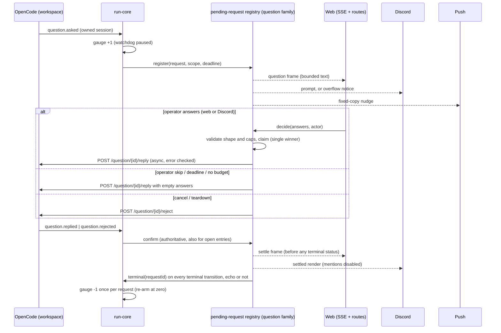

# feat: Bridge agent questions to gateway operators

## Overview

When an agent in a gateway run calls OpenCode's `question` tool, operators see the question on the web surface and in Discord, answer or skip it, and the agent continues. Questions become a second request family in a generalized approval registry, settle exactly once, pause the inactivity watchdog while pending, and ship in operator contract `1.9.0` together with the paired dashboard release.

## Problem Frame

OpenCode emits `question.asked` when an agent calls the `question` tool, then blocks the tool call until the request is replied to or rejected. The gateway forwards `permission.asked` to operators but has no handling for `question.asked`; the event falls through to a debug log, the inactivity watchdog stays armed, and the run fails with `inactivity-timeout` after five minutes (#1736). A run waiting for input looks identical to a stalled run, and the operator learns about it only from the eventual `run_failed` push.

The `question` tool is enabled in gateway workspaces (OpenCode enables it for its default `cli` client, and the gateway's merged config does not deny it), and models call it whenever a task mentions confirmation. Upstream's own non-interactive CLI and GitHub handler deny the tool because they have no human; the gateway does have one, so it should answer rather than deny.

## Requirements Trace

- R1. A `question.asked` from the root session or an owned background child reaches operators; a question from a session the run does not own is ignored.
- R2. An authorized operator can answer with one of the question's options, several options when the question allows multiple, or free text when the question allows a custom answer, or skip the question.
- R3. Each request settles exactly once across web answers, Discord answers, skips, the deadline, cancellation, teardown, and OpenCode-originated settlement. OpenCode's `question.replied` / `question.rejected` echo is authoritative.
- R4. While any approval or question is pending, the inactivity watchdog is paused; it re-arms only when no human-wait item remains, including after settlements that produce no echo.
- R5. Every question carries a bounded human-wait deadline. On expiry the gateway skips the question, the agent sees it as unanswered and continues, and the run does not fail. A question asked with too little run budget left for a deadline is skipped immediately.
- R6. Operator contract `1.9.0` adds the question frame, pending-question DTO, answer/skip request types, and the `waiting_for_question` status.
- R7. Operators see pending questions on SSE (with reconnect reconciliation), in Discord, and through a repo-neutral push nudge.
- R8. A web operator with write permission on the run's repository can answer a question for any run, including a Discord-launched run. Discord answers only its own thread's questions.
- R9. A request that cannot be rendered within Discord's component limits posts a Discord notice that points to the web surface instead of a partial or truncated prompt.
- R10. Approval behavior is unchanged: decisions, cascade on reject, deadlines, routes, frames, and Discord buttons work as today.
- R11. Question and answer strings are untrusted plain text on every surface. Logs, errors, audit events, and push payloads carry identifiers and reason codes, never raw question or answer text.
- R12. Free-text answers are capped at 4,000 characters each and question routes at a 64 KiB request body, enforced before any call to OpenCode.
- R13. Accepted and gate-rejected question decisions emit audit events like approval decisions do.

## Scope Boundaries

- No durable pending state. A gateway or workspace restart loses pending questions, as it does pending approvals.
- No per-question partial settlement. OpenCode v1.18.34 accepts one reply carrying answers for every question in the request, so a request settles as a whole.
- No change to approval channel binding. Only questions gain cross-surface answering.
- The push nudge never carries question text, options, repo, or prompt.

### External Dependency: Paired Dashboard Release

Dashboard consumption of contract `1.9.0` (question frame, answer and skip UI, `waiting_for_question` label) is planned in `fro-bot/dashboard`. It is a release gate for this plan, not deferred work: the gateway release carrying `1.9.0` deploys only together with the dashboard release that pins `1.9.0`. That plan must render every question and answer string as inert text (no HTML or Markdown interpretation) and test it with injection payloads.

### Deferred to Separate Tasks

- Action-side handling of `question.asked` in CI runs, where no human can answer: separate issue in `fro-bot/agent`.
- Extracting a fully generic pending-request store beyond the two families this plan needs.

## Context & Research

### Relevant Code and Patterns

- `packages/gateway/src/approvals/registry.ts` (`createApprovalRegistry`): entry lifecycle `open → claimed → confirmed`, single-winner `handleDecision`, scope binding, registry-owned deadline (`settleByDeadline`), authoritative `confirmReply` including the open-entry branch for OpenCode-originated settlement, `disposeRun`, `describePendingForScope`, reject cascade.
- `packages/gateway/src/approvals/coordinator.ts` (`createPermissionCoordinator`): defensive parsing of `permission.*` payloads, owned-session tracking (`addOwnedSession` / `isOwned`), duplicate-ask chaining.
- `packages/gateway/src/execute/run-core.ts` (`runOpenCodeCore`): `isOwnedSession` gating, `permission.asked` → `clearInactivity()`, `permission.replied` → `markActivity()`, background-child adoption, root-idle drain.
- `packages/gateway/src/execute/run.ts`: `computeApprovalDeadlineMs(remainingBudgetMs)`, transport wiring, `confirmReply` on `permission.replied`.
- `packages/gateway/src/approvals/discord-transport.ts` (`createDiscordApprovalOnPending`), `packages/gateway/src/discord/approvals.ts` (custom-id codec, embeds), interaction handling in `packages/gateway/src/program.ts`.
- `packages/gateway/src/web/operator/web-approval.ts`, `pending-approvals-route.ts`, `decision-route.ts`, `cancel.ts`.
- `packages/gateway/src/web/sse/manager.ts` (`observeApproval`, terminal replay), `projection.ts` (`waiting_for_approval` overlay, `scopeIdFor`), `run-stream-route.ts`.
- `packages/gateway/src/web/operator-push/dispatcher.ts` (`dispatchApprovalPending`), `payload-builder.ts`.
- `packages/gateway/src/operator-contract/` (`version.ts`, `approval-frame.ts`, `run-status.ts`).
- Upstream (pinned v1.18.34, `.slim/clonedeps/repos/anomalyco__opencode/packages/opencode/`): `src/question/index.ts` (in-memory pending map, rejection on shutdown, no timeout), `src/tool/question.ts` (reply output, `RejectedError` "The user dismissed this question"), `src/server/.../groups/question.ts` (`GET /question`, `POST /question/{id}/reply` with `{answers: string[][]}`, `POST /question/{id}/reject`). The installed SDK exposes `question.list/reply/reject`.

### Institutional Learnings

- `docs/solutions/integration-issues/permission-ask-dropped-by-ownership-filter-2026-09-19.md`: a blocking request needs a reply path keyed to the request, not a membership filter that can drop it; never await the reply inside the stream loop; check `response.error` explicitly because the SDK reports failures in a field; warn-log any skipped blocking request. It names this gap as deliberately left for an ownership-safe answer path.
- `docs/solutions/best-practices/extract-timer-primitive-keep-policy-per-surface-2026-07-13.md`: watchdog policy lives in the caller; extend the caller policy, not the timer primitive.
- `docs/solutions/best-practices/gateway-control-surface-spine-2026-06-15.md`: one fail-closed settlement gate for every transport; a transport's send must not reject inside the pending hook.
- `docs/solutions/best-practices/sse-output-streaming-terminal-drain-2026-06-21.md` and `authenticated-sse-run-observation-2026-06-20.md`: enqueue settle frames before terminal status, bounded replay, out-of-order guard, GET reconciliation endpoint, no-oracle denials.
- `docs/solutions/best-practices/dependency-gated-route-registration-guard-2026-06-25.md`: new routes go through `buildOperatorServerInputs`, `EXPECTED_OPERATOR_ROUTES`, and a dep-omission regression.
- `docs/plans/2026-07-03-001-feat-operator-run-cancellation-plan.md`: cancellation rejects pending items through the same gate; classify by probing the owning signal, never the `AbortSignal.any` reason.
- `docs/plans/2026-07-08-002-feat-operator-push-gateway-plan.md`: push is a fail-soft, non-authoritative transport with fixed-copy payloads and no contract bump.

## Prior-Art Survey

```json
{
  "schema_version": 2,
  "verdict": "extend",
  "scope": "packages/gateway",
  "freshness": {
    "vcs_reference": "main@a53a45de9151388853ea8cef5f9cbc6443d27f8b"
  },
  "budget": {
    "max_search_passes": 3,
    "max_candidate_inspections": 10,
    "exhausted": false
  },
  "candidates": [
    {
      "path_or_symbol": "packages/gateway/src/approvals/registry.ts:createApprovalRegistry",
      "description": "Program-scoped approval entry lifecycle: open/claimed/confirmed states, scope-bound single-winner decision intake, registry-owned deadline, authoritative confirmReply, disposeRun fail-closed settlement, pending DTO projection.",
      "disposition": "extend"
    },
    {
      "path_or_symbol": "packages/gateway/src/approvals/coordinator.ts:createPermissionCoordinator",
      "description": "Per-run permission coordinator: parses permission.asked/replied payloads, tracks owned session IDs, forwards pending/replied/dispose callbacks into the registry and transports.",
      "disposition": "extend"
    },
    {
      "path_or_symbol": "packages/gateway/src/execute/run-core.ts:runOpenCodeCore",
      "description": "OpenCode event stream consumer: owned-session routing, background-child adoption, permission forwarding, inactivity timer pause and re-arm, root-idle drain.",
      "disposition": "extend"
    },
    {
      "path_or_symbol": "packages/gateway/src/approvals/discord-transport.ts:createDiscordApprovalOnPending",
      "description": "Discord approval transport: register-before-send, approval embed and buttons, terminal delivery failure handling, settled rendering.",
      "disposition": "extend"
    },
    {
      "path_or_symbol": "packages/gateway/src/web/operator/web-approval.ts:createWebApprovalOnPending",
      "description": "Web approval transport: register-before-fan-out, approval SSE open frame, settle frame via registry render.",
      "disposition": "extend"
    },
    {
      "path_or_symbol": "packages/gateway/src/web/operator/decision-route.ts:buildDecisionRoute",
      "description": "Authenticated approval decision route: browser guard, run index lookup, denylist-before-write-authz, server-built operator actor, registry.handleDecision.",
      "disposition": "extend"
    },
    {
      "path_or_symbol": "packages/gateway/src/web/operator/pending-approvals-route.ts:buildPendingApprovalsRoute",
      "description": "Reconnect listing of open approval requests with denylist-before-authz, read-level authz, bounded response.",
      "disposition": "extend"
    },
    {
      "path_or_symbol": "packages/gateway/src/web/sse/manager.ts:createRunObservationManager",
      "description": "Run frame fan-out: status, output, and approval frames, non-coalescing approval delivery, terminal replay cache.",
      "disposition": "extend"
    },
    {
      "path_or_symbol": "packages/gateway/src/web/sse/projection.ts:projectRunObservation",
      "description": "Operator status projection with run-scope derivation and the waiting_for_approval overlay.",
      "disposition": "extend"
    },
    {
      "path_or_symbol": "packages/gateway/src/web/operator-push/dispatcher.ts:createPushDispatcher",
      "description": "Fail-soft push broadcast for approval-pending and run-failed nudges with dedupe and repo-neutral payloads.",
      "disposition": "extend"
    }
  ]
}
```

## Key Technical Decisions

- **Generalize the approval registry into one gate with two request families.** Settlement is the security-critical boundary; one claim machine, one scope check, one deadline owner, and one dispose path avoid two gates drifting. The core owns the lifecycle; each family supplies its decision vocabulary, validation, reply/reject calls, cascade policy, and render. Approvals keep their cascade; questions have none.
- **Characterize approvals before generalizing.** The existing registry, coordinator, and approval-flow tests are the regression net; the refactor lands with every approval test passing unchanged before any question family code.
- **Human-wait gauge replaces the boolean pause.** The run-core watchdog counts outstanding approvals and questions and re-arms only at zero. The current single pause lets the first settlement re-arm the watchdog while a second item still waits. The gate notifies run-core of every terminal transition (echo, deadline, skip, cancellation, teardown, and fail-closed POST failure) through one callback keyed by request id, and the gauge release is idempotent per request id, so a settlement with no echo cannot leave the watchdog paused or drain blocked.
- **Skip is an empty reply; reject is reserved for cancel and teardown.** Upstream treats `Question.RejectedError` as a blocked tool call that ends the agent's turn (`src/session/processor.ts` sets `blocked` from `shouldBreak`), so reject cannot satisfy "continue without an answer". Operator skip and deadline expiry reply with one empty answer per question, which the tool reports as "Unanswered" and the agent continues. Cancellation and teardown reject, because ending the turn is the intent there.
- **Question effects are injected from a v2 client.** The gateway's OpenCode handle is the v1 client, and question reply and reject exist only on the v2 SDK. `replyQuestion` and `rejectQuestion` closures are built at the same construction site as the permission reply, from a v2 client sharing the base URL, bearer, and run directory, and check `response.error` explicitly. The gate and run-core never see SDK versions.
- **`custom` defaults to allowed.** Upstream enables a custom answer unless `custom` is explicitly false, so the gateway normalizes it to `custom !== false` and emits normalized booleans in operator DTOs and frames.
- **Untrusted text, no raw text in logs.** Question header, text, options, and free-text answers are untrusted plain text. They appear only in operator frames, DTOs, and Discord renders. Logs, errors, audit events, and push carry request id, run id, family, scope, actor id, and reason codes only.
- **Whole-request settlement.** A request with several questions is one pending item; operators submit answers for every question in one decision, matching upstream's single `answers: string[][]` reply.
- **Answer validation in the gate.** The question family validates each decision against the request's shape (known option labels, `multiple`, `custom`, per-question arity) before any POST. Discord and web both pass through it.
- **Mandatory deadline, auto-skip when there is no time.** Every question registers with a deadline derived like `computeApprovalDeadlineMs` from the remaining run budget. When the remaining budget is below that helper's floor, the question is skipped immediately through the gate with a logged reason code. Expiry skips the question; it never fails the run.
- **Free-text and body caps.** Each free-text answer is capped at 4,000 characters (Discord's modal input limit, so both surfaces accept the same maximum) and question routes at a 64 KiB request body. Oversized input gets a no-oracle validation error before any call to OpenCode.
- **OpenCode-originated settlement is authoritative.** A `question.rejected` or `question.replied` echo on an `open` entry settles it without a gateway POST, so shutdown-finalizer rejection never double-settles.
- **`waiting_for_question` status; approval takes precedence.** A running run with a pending approval shows `waiting_for_approval`; otherwise a pending question shows `waiting_for_question`. Approvals gate a tool, so they are the more urgent signal.
- **Cross-surface answering for questions only.** The question family's scope policy accepts a web operator actor for any run whose repository the operator can write, after the server-side run lookup and denylist check. Discord actors stay bound to their thread. Approval scope binding is unchanged.
- **Discord overflow falls back to web.** A request exceeding select (25 options), button (5×5), or modal (5 inputs) limits posts a notice linking the web operator surface rather than a partial prompt.
- **Question text is shown, bounded, and never pushed.** SSE and Discord render question, header, and option text length-capped with control characters stripped at the frame-build site; Discord renders with mentions disabled. Push stays fixed-copy.
- **Reply calls run off the stream loop.** Answer, skip, and reject POSTs are dispatched asynchronously with explicit `response.error` checks, so a slow reply never blocks event consumption.
- **MINOR contract bump to `1.9.0`.** The question frame and status are SSE-observable, so the exact-match drift gate requires the bump and a paired dashboard deploy. The push trigger alone would not need it.

## Open Questions

### Resolved During Planning

- Registry shape: generalize into one gate with families (user decision).
- Waiting status: `waiting_for_question`, approval precedence (user decision).
- Deadline outcome: skip and continue (user decision), implemented as an empty reply because reject ends the turn upstream.
- Operator actions: answer and skip; reject only for cancellation and teardown (user decision).
- Late questions: auto-skip when the remaining budget is below the deadline floor (user decision).
- SDK seam: injected question effects from a v2 client (user decision).
- Free-text caps: 4,000 characters per answer, 64 KiB body (user decision).
- Answer forms: options, multi-select, and free text where allowed (user decision).
- Discord overflow: web fallback with a Discord notice (user decision).
- Cross-surface answering: web may answer any run's question; Discord only its own (user decision).
- Duplicate `question.asked` for an open id: idempotent no-op that keeps the existing entry and any partial UI state, unlike the approval supersede path.
- Gateway restart: parity with approvals; documented, not solved.

### Deferred to Implementation

- Exact module boundaries of the generalized core (one module with family adapters vs. a core module plus family modules), settled once the characterization tests pin current behavior.
- Whether `PermissionCoordinator` is renamed or a small owned-session tracker is split out for shared use; decided by how much call-site churn each option causes.
- Discord free-text interaction shape for multi-question requests within the 5-input modal limit; requests that cannot fit take the web fallback.
- Whether the drain-complete check reads the gauge directly or the registry's pending count for the run.

## High-Level Technical Design

> _This illustrates the intended approach and is directional guidance for review, not implementation specification. The implementing agent should treat it as context, not code to reproduce._



## Implementation Units

### Phase A: Gate and lifecycle

- [ ] **Unit 1: Human-wait gauge in run-core**

**Goal:** Replace the boolean inactivity pause with a count of outstanding human-wait items, still driven only by approvals in this unit.

**Requirements:** R4, R10

**Dependencies:** None

**Files:**

- Modify: `packages/gateway/src/execute/run-core.ts`
- Test: `packages/gateway/src/execute/run-core.test.ts`

**Approach:**

- The policy stays in run-core; `createInactivityTimer` is untouched.
- `permission.asked` increments, `permission.replied` decrements; the watchdog re-arms with a fresh reset only when the count reaches zero. Duplicate or unmatched echoes never drive the count negative.

**Execution note:** Start with failing tests for two concurrent approvals.

**Patterns to follow:**

- Existing pause/reset seams and inactivity tests in `run-core.test.ts`.

**Test scenarios:**

- Happy path: one approval asked then replied → watchdog paused, then re-armed with a fresh window.
- Edge case: two approvals asked, first replied → watchdog stays paused; second replied → re-armed.
- Edge case: replied event for an unknown request → count unchanged, no re-arm while another item is pending.
- Integration: inactivity timeout fires during a single pending approval → no timeout (existing behavior preserved).

**Verification:**

- Every existing run-core inactivity test passes unchanged; the two-item scenarios pass.

- [ ] **Unit 2: Generalize the registry into a two-family gate**

**Goal:** Extract the approval registry's lifecycle into a core that serves an approval family and a question family, with approval behavior unchanged.

**Requirements:** R3, R5, R8, R10

**Dependencies:** Unit 1

**Files:**

- Modify: `packages/gateway/src/approvals/registry.ts`
- Create: question-family module under `packages/gateway/src/approvals/` (name settled during implementation)
- Modify: `packages/gateway/src/approvals/index.ts` (exports, if present)
- Test: `packages/gateway/src/approvals/registry.test.ts`
- Test: `packages/gateway/src/approvals/approval-flow.integration.test.ts`
- Test: new question-family registry tests under `packages/gateway/src/approvals/`

**Approach:**

- The core owns: entry map keyed by request id, `open → claimed → confirmed`, single-winner claim, scope check through a family-supplied policy, deadline timer and the claimed-vs-deadline handshake, authoritative confirm including the open-entry branch, `disposeRun`, `hasPendingForScope` and `describePendingForScope` per family.
- The approval family keeps `once/always/reject`, the reject cascade, the supersede-on-re-register behavior, and its render.
- The question family: decision is answer (per-question string arrays) or skip; validation against the request shape (normalized `custom !== false`) and the 4,000-character free-text cap; skip and deadline reply with empty answers, dispose and cancellation reject; reply and reject go through injected `replyQuestion` / `rejectQuestion` effects; no cascade; duplicate register for an open id is a no-op; deadline is required; scope policy accepts Discord actors only for their thread and web operator actors for any run (authorization is enforced by the web route before the gate).
- The core emits one terminal notification per request id on every terminal transition, including fail-closed POST failures and dispose, whether or not an echo follows.

**Execution note:** Characterization first. Every approval registry and approval-flow test passes before question-family code is added.

**Patterns to follow:**

- `createApprovalRegistry` closure-factory style; `toOperatorDecisionState` mapping.

**Test scenarios:**

- Happy path: question registered, valid single-option answer → claimed, reply POST once, echo confirms, entry deleted.
- Happy path: multi-select answer on a `multiple` question; free-text answer on a question with `custom` omitted (allowed by default) and with `custom: true`.
- Happy path: operator skip → reply POST with one empty answer per question, never reject.
- Error path: free text on a `custom: false` question, or free text over 4,000 characters → validation error, no POST.
- Edge case: answer for a three-question request with only two answers → rejected by validation, entry stays open.
- Error path: unknown option label, free text when `custom` is false, multiple values when `multiple` is not true → validation error, no POST.
- Edge case: duplicate register for an open id → no-op, existing entry and deadline unchanged.
- Edge case: two answers race → one winner, the other reports already claimed.
- Edge case: answer claimed, then deadline fires → answer wins; if the reply POST then fails, the entry fail-closes with an empty-answer skip.
- Edge case: deadline fires on an open entry → empty-answer reply POST once, entry deleted on echo, terminal notification emitted once.
- Error path: reply POST reports `response.error` → claim released to open (or fail-closed if the deadline already passed, with a terminal notification and no echo required).
- Edge case: echo arrives after a fail-closed terminal notification → no second notification.
- Integration: OpenCode `question.rejected` on an open entry → settles without any gateway POST.
- Integration: `disposeRun` with an approval and a question pending → approval fail-closes as today, question rejects, both emit terminal notifications, approval cascade unaffected.
- Edge case: Discord actor answering another thread's question → scope mismatch; web operator actor on a Discord-scoped question → accepted by the gate.
- Edge case: question registered without a deadline → refused by the family.
- Regression: approval supersede, cascade-on-reject, and deadline tests pass unchanged.

**Verification:**

- Approval suites pass unchanged; question-family suite covers every scenario above.

- [ ] **Unit 3: Question event ingestion and lifecycle in the run**

**Goal:** Route owned `question.*` events into the gate, count them in the human-wait gauge, and keep drain and teardown question-aware.

**Requirements:** R1, R3, R4, R5, R11

**Dependencies:** Unit 2

**Files:**

- Modify: `packages/gateway/src/execute/run-core.ts`
- Modify: `packages/gateway/src/execute/run.ts`
- Modify: `packages/gateway/src/approvals/coordinator.ts` (or a split owned-session tracker)
- Modify: `packages/gateway/src/execute/launch-types.ts`
- Test: `packages/gateway/src/execute/run-core.test.ts`
- Test: `packages/gateway/src/execute/run.approvals.test.ts` (or a sibling `run.questions.test.ts`)

**Approach:**

- Defensive parsers for `question.asked`, `question.replied`, `question.rejected` mirror the permission parsers; malformed payloads are warn-logged with reason codes only, never raw text, and ignored.
- `isOwnedSession` gates all three; an owned question increments the gauge and registers with a deadline from the remaining run budget, or is skipped immediately when the budget is below the deadline floor; echoes confirm through the gate; the gauge decrements on the gate's terminal notification, once per request id.
- `run.ts` builds the injected `replyQuestion` / `rejectQuestion` effects from a v2 client with the run's base URL, bearer, and canonical directory, next to the permission reply wiring.
- An unowned or malformed question is warn-logged with ids and reason codes.
- Root-idle drain does not complete while the gauge is non-zero; run teardown disposes pending questions before the session is released.

**Patterns to follow:**

- `permission.asked` / `permission.replied` branches and `computeApprovalDeadlineMs` wiring.

**Test scenarios:**

- Happy path: root question asked → registered, watchdog paused; replied echo → confirmed, watchdog re-armed.
- Happy path: adopted child question → registered with the run's scope.
- Edge case: question from a foreign session → ignored with a warning, watchdog unaffected.
- Edge case: approval and question pending together → watchdog re-arms only after both settle.
- Edge case: root idle while a child's question is pending → run stays in drain; settles after the question does.
- Error path: malformed `question.asked` → warning, no registration, no crash.
- Edge case: question asked with remaining budget below the deadline floor → skipped immediately with an empty-answer reply, no human wait, gauge returns to zero.
- Error path: deadline skip POST fails with no echo → terminal notification still releases the gauge; watchdog re-arms and drain can complete.
- Error path: question effects report `response.error` → handled in the gate, never thrown into the stream loop.
- Integration: run cancelled with a question pending → question rejected through the gate, run reaches `CANCELLED`.
- Integration: question never answered → skipped at deadline, the agent's tool result reads "Unanswered", and the run continues and completes.
- Security: malformed or unowned question containing secret-shaped text → the warning log carries no question text.

**Verification:**

- The #1736 reproduction (question asked, no further events) no longer reaches `inactivity-timeout`; it is skipped at the deadline and the run completes.

### Phase B: Contract and web surface

- [ ] **Unit 4: Operator contract 1.9.0, projection, and SSE**

**Goal:** Publish the question frame, pending DTO, answer/skip types, and `waiting_for_question`, and deliver them over SSE.

**Requirements:** R6, R7, R11

**Dependencies:** Unit 2

**Files:**

- Modify: `packages/gateway/src/operator-contract/version.ts`
- Create: question frame and DTO module(s) in `packages/gateway/src/operator-contract/`
- Modify: `packages/gateway/src/operator-contract/run-status.ts`
- Modify: `packages/gateway/src/operator-contract/index.ts`
- Modify: `packages/gateway/src/web/sse/manager.ts`
- Modify: `packages/gateway/src/web/sse/projection.ts`
- Modify: `packages/gateway/src/web/sse/run-stream-route.ts`
- Create: `packages/gateway/src/web/operator/web-question.ts`
- Test: matching `*.test.ts` for each modified SSE module and the contract module

**Approach:**

- The question frame carries request id, run id, per-question header, text, options, and normalized `multiple` / `custom` booleans, with text bounded and control-character-stripped at build time; a settle frame clears it.
- Contract docs state that every question and answer string is untrusted plain text that consumers must render inertly.
- The projection overlays `waiting_for_approval` first, then `waiting_for_question`.
- Settle frames enqueue before terminal status; question frames are non-coalescing and replay-bounded like approval frames.
- `OPERATOR_CONTRACT_VERSION` becomes `1.9.0`.

**Patterns to follow:**

- `approval-frame.ts`, `observeApproval`, `boundApprovalDetail`-style bounding, the exhaustive frame writer.

**Test scenarios:**

- Happy path: pending question → `question` frame on the run stream with bounded fields; settle → settle frame.
- Edge case: question text over the cap or with control characters → truncated and stripped.
- Edge case: upstream question with `custom` omitted → frame carries `custom: true`; explicit `false` → `false`.
- Edge case: question text containing `` and backticks → carried verbatim as a string field, never pre-rendered.
- Edge case: approval and question both pending → status `waiting_for_approval`; approval settles → `waiting_for_question`.
- Edge case: run completes in the same flush as a question settle → settle frame precedes terminal status.
- Integration: reconnect mid-question → replay delivers the open frame; a settled question does not reappear.
- Contract: version is `1.9.0`; the new status value round-trips through the operator status validator.

**Verification:**

- `check-types` passes with the exhaustive frame writer covering the new frame; SSE tests pass.

- [ ] **Unit 5: Web question routes, cancellation, and push**

**Goal:** Let web operators list, answer, and skip questions for any run they can write, include questions in cancellation, and nudge by push.

**Requirements:** R2, R3, R7, R8, R11, R12, R13

**Dependencies:** Units 3 and 4

**Files:**

- Create: pending-questions and question-decision routes in `packages/gateway/src/web/operator/`
- Modify: `packages/gateway/src/web/operator/cancel.ts`
- Modify: `packages/gateway/src/web/server.ts` and the shared `buildOperatorServerInputs` wiring
- Modify: the `EXPECTED_OPERATOR_ROUTES` constant and route-inventory smoke
- Modify: `packages/gateway/src/web/operator-push/dispatcher.ts`, `payload-builder.ts`
- Test: route tests, cancel tests, push dispatcher and payload tests, dep-omission regression

**Approach:**

- Listing requires read authz; answer and skip require write authz on the run's repository. Order: browser guard, 64 KiB body limit, session, server-side run lookup, denylist, authz, body validation, gate.
- Denials are no-oracle; the actor is built server-side.
- Accepted and gate-rejected decisions emit audit events with actor id, run id, request id, family, and outcome or reason, mirroring the approval decision route; no question or answer text.
- Cancellation enumerates both families and settles through the gate.
- The push trigger fires on question registration with fixed copy, deduped per run.

**Patterns to follow:**

- `pending-approvals-route.ts`, `decision-route.ts`, `dispatchApprovalPending`, the dependency-gated registration guard.

**Test scenarios:**

- Happy path: write-authorized operator answers a web-run question → 200, single POST to OpenCode.
- Happy path: same operator answers a Discord-run question → accepted.
- Error path: read-only operator → no-oracle denial; denylisted repo → same denial before any authz call.
- Error path: invalid answer shape, or free text over 4,000 characters → validation error, entry stays open.
- Error path: request body over 64 KiB → rejected before session or run lookup.
- Happy path: operator skip → empty-answer reply, settle frame, audit event with outcome `skipped`.
- Security: audit events and logs for accepted and rejected decisions contain no question or answer text.
- Edge case: duplicate submission → idempotent already-settled response.
- Integration: cancel with a pending question → question rejected, cancellation response unchanged in shape.
- Integration: push payload for a question contains only fixed copy; no subscriber → silent no-op.
- Regression: removing the question dependency at the construction site fails the route-inventory test.

**Verification:**

- Route inventory includes the new routes in the built image smoke; all route and push tests pass.

### Phase C: Discord and docs

- [ ] **Unit 6: Discord question transport**

**Goal:** Render questions in the run's Discord thread within component limits, accept answers through the gate, and fall back to a web notice when a request does not fit.

**Requirements:** R2, R7, R9, R11, R12, R13

**Dependencies:** Units 3 and 5 (the overflow notice points to the web answer surface)

**Files:**

- Create: Discord question transport alongside `packages/gateway/src/approvals/discord-transport.ts`
- Create: question components and custom-id codec alongside `packages/gateway/src/discord/approvals.ts`
- Modify: `packages/gateway/src/program.ts` (interaction routing)
- Test: matching `*.test.ts` for the transport and codec; `program` interaction tests

**Approach:**

- Register before send. Options render as buttons or a select menu, plus a Skip button; free text uses a modal with a 4,000-character input limit; custom ids encode request id plus indices, never labels, within the 100-character limit.
- A request exceeding select, button, or modal limits posts a notice pointing to the web operator surface; the entry stays answerable from the web and is skipped at the deadline otherwise.
- Discord decisions emit the same audit events as web decisions.
- Interactions check `userIsAuthorized`, then decide through the gate with a Discord actor.
- Every render uses `allowedMentions` with no parsing and treats answers and question text as inert text.
- A terminal Discord delivery failure does not settle the question; web answering and the deadline remain. Delivery-failure logs carry ids and Discord error codes only.

**Patterns to follow:**

- `createDiscordApprovalOnPending`, approval custom-id codec, `SAFE_MENTIONS`.

**Test scenarios:**

- Happy path: single-select question → buttons; click → gate decision, settled render.
- Happy path: multi-select → select menu with multiple values; free text → modal submission.
- Edge case: 30 options, or a request needing more than 5 action rows or modal inputs → web-fallback notice, no partial prompt.
- Edge case: custom id at the length boundary → round-trips; oversized id refused by the codec.
- Error path: unauthorized user clicks → refused, entry stays open.
- Happy path: Skip button → empty-answer reply through the gate.
- Error path: thread deleted → delivery failure logged without question text, entry remains answerable from web, deadline still skips.
- Security: answer text containing `@everyone` and role mentions renders without pinging anyone.

**Verification:**

- Transport and codec tests pass; no Discord render path omits disabled mentions.

- [ ] **Unit 7: Documentation**

**Goal:** Describe questions where approvals are documented today.

**Requirements:** R6, R8, R9

**Dependencies:** Units 4–6

**Files:**

- Modify: `ARCHITECTURE.md` (gateway mention-loop flow, codemap, contract version)
- Modify: `packages/gateway/AGENTS.md` (agent questions section beside tool approvals, restart limitation, deadline)
- Modify: `docs/wiki/Operator Web Control Surface.md` (routes, answering questions, SSE frames, contract version, push)
- Modify: `deploy/README.md` (question tool behavior in gateway workspaces)

**Approach:**

- Current facts only; note the paired-deploy requirement for `1.9.0`.

**Test expectation:** none -- documentation only; `bun run lint` covers markdown links.

**Verification:**

- Docs name the routes, frames, status, deadline behavior, and cross-surface rule exactly as implemented.

## System-Wide Impact

- **Interaction graph:** run-core event loop, the generalized registry, web routes and SSE manager, Discord interactions in `program.ts`, cancellation, push dispatcher, startup wiring.
- **Error propagation:** reply/reject failures stay inside the gate (claim released or fail-closed); transport failures never settle a question; the deadline is the backstop for every failure.
- **State lifecycle risks:** the gauge is released by the gate's per-request terminal notification, so it cannot go negative, double-release, or leak on teardown or echo-less settlement; drain waits for pending questions; dispose clears both families.
- **API surface parity:** web and Discord answer through the same gate; approvals keep their scope rule while questions gain web cross-surface answering.
- **Integration coverage:** the #1736 reproduction end to end; approval-plus-question concurrency; cancel and deadline races.
- **Unchanged invariants:** approval decisions, cascade, routes, frames, Discord buttons, and the `waiting_for_approval` status behave as before; redaction-before-query ordering on every new route.

## Risks & Dependencies

| Risk | Mitigation |
| --- | --- |
| Generalizing the registry regresses live approvals | Characterization tests first; approval suites must pass unchanged before question code lands; ce:review with adversarial and reliability lenses |
| Contract skew breaks every operator stream | Release with `1.9.0` deploys only paired with the dashboard release that pins `1.9.0`; tracked on `fro-bot/.github#3512` |
| Question text carries secrets to operators | Text is bounded and shown only to authorized operators over authenticated channels; push, logs, errors, and audit events never carry it |
| Model-controlled text executes in the operator's browser | Contract marks every question and answer string as untrusted plain text; the paired dashboard plan renders inertly and tests injection payloads before release |
| Discord mention abuse through answers or question text | Disabled mentions on every render, pinned by test |
| Workspace restart while a question is pending (gateway keeps running) | No echo arrives; the gateway's deadline still fires, the skip POST fails closed, and the terminal notification releases the gauge, or run-level failure handling disposes the entry |
| Gateway restart while a question is pending | Accepted: the pending entry and its timer are lost with the run, as for approvals (see Scope Boundaries) |

## Documentation / Operational Notes

- Deploy order: dashboard release pinning `1.9.0` and gateway release carrying this plan go out in one window with paired rollback, as for the `1.8.0` cutover.
- Live verification on `fro-bot/.github#3512`: a question-producing run surfaces in the dashboard and Discord, an answer reaches the agent, and an unanswered question is skipped at the deadline without failing the run.

## Sources & References

- Related issues: #1736, `fro-bot/.github#3512`
- Related plans: `docs/plans/2026-06-22-002-feat-web-tool-approval-plan.md`, `docs/plans/2026-07-03-001-feat-operator-run-cancellation-plan.md`, `docs/plans/2026-07-08-002-feat-operator-push-gateway-plan.md`
- Upstream: `anomalyco/opencode` v1.18.34 question service, tool, and HTTP group
